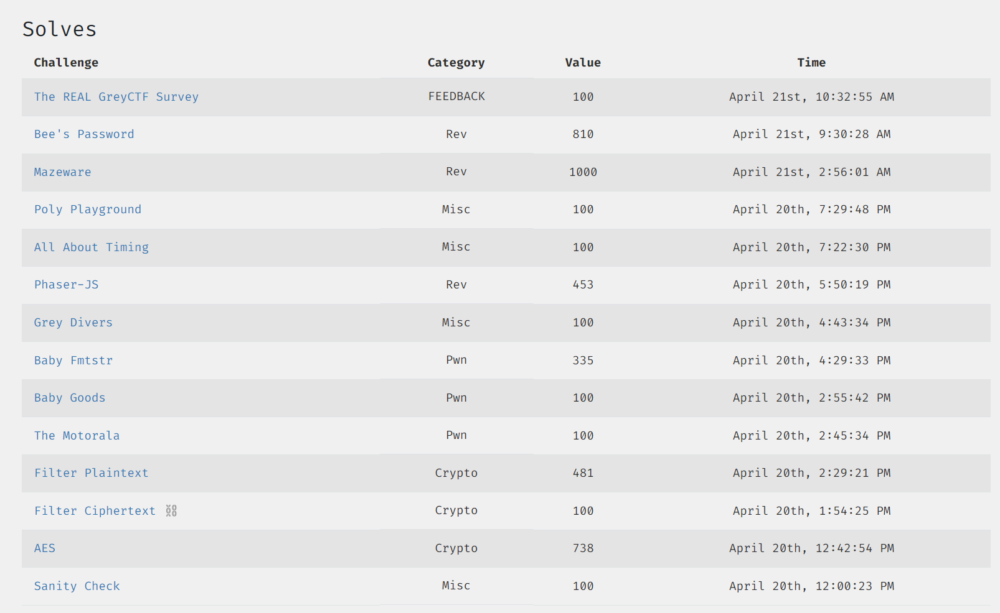

# GREYCTF 2024 Qualifier Writeups
> Played as `Warri` under Team `Youtiaos`. We scored `4th` on the International Leaderboard, `1st` in the Local Category with `10621` points.
> I managed to score `4617` points, and solved the following challenges, blooding two of them (`AES` and `Mazeware` respectively)

Aside from these, I will be providing writeups for all of the Cryptography challenges that I was not able to solve, with help from those from other teams who did! Credits go to `4yn`, `Genni`, `Maple` as well as challenge creator `mechFrog88`.

Without loss of generality, this repo contains writeups for the following challenges. Brief descriptions of each of them will be provided in this README, but the actual writeups can be found in their individual `.md` files.

---
### Pwn
#### Baby Goods (130 Solves, 100 Pts)
standard buffer overflow ret2win
#### The Motorala (84 Solves, 100 Pts)
standard buffer overflow ret2win with stack misalignment
#### Baby Fmtstr (44 Solves, 335 Pts)
payload crafting using...`c/cpp strftime()`?!

---
### Crypto
#### Filter Ciphertext (82 Solves, 100 Pts)
Using a secret python trick to trick an AES decryption oracle
#### Filter Plaintext (39 Solves, 481 Pts)
Where we actually go into the aforementioned oracle to exploit a vulnerability
#### AES (28 Solves, 738 Pts, 🩸)
My first blood in this ctf! Exploiting poorly implemented AES encryption.

---
### Rev
#### Phaser-JS (40 Solves, 453 Pts)
does online obfuscated JS make for a good rev?
*EXPECT WRITEUP SOON*
#### Bee's Password (24 Solves, 810 Pts)
speeding up slow python code!
*EXPECT WRITEUP SOON*
#### Mazeware (2 Solves, 1000 Pts, 🩸)
fun challenge reminiscient of flareon, 5 hours spent and each second was worth it :)
*EXPECT WRITEUP SOON*

---
### Misc
#### Sanity Check (325 Solves, 100 Pts)
a challenge so important it warrants its own file and writeup.md
#### Grey Divers (155 Solves, 100 Pts)
hell divers 2 is a great game and you should go buy it
#### All About Timing (165 Solves, 100 Pts)
time.time() syncing shenanigans
#### Poly Playground (120 Solves, 100 Pts)
Sagemath polynomial creation go brr
#### The REAL GreyCTF Survey (113 Solves 100 Pts)
Do survey get flag, no unfortunately this challenge was not important enough to warrant its own file and writeup.md :(

---
## Crypto Challs - Unsolved 
Apart for writeups for the challenges that I had solved, this repo also includes writeups to ALL cryptography challenges in the CTF, including these 4 that I wasn't able to solve unfortunately ;-;
### PRG (11 Solves, 964 Pts)
Linear transformation and an introduction to matrix rank and linear algebra!
### IPFE (4 Solves, 997 Pts)
Did you know that RSA LSB Oracle applies to some cases of discrete log?
### Coding (3 Solves, 999 Pts)
McEliece but you get to choose the error correction algorithm
### Curve (1 Solve, 1000 Pts)
Using tate-pairings to solve Decisional Diffie Hellman
*UPSOLVED! EXPECT WRITEUP SOON*
