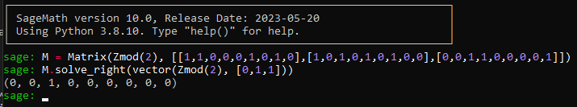

### PRG (11 Solves, 964 Pts)

This writeup will be slightly long as a shorter version is already available by fellow player `wyan` (https://greysome.github.io/2024/04/24/grey-ctf-quals-2024.html) and instead delves a bit more into linear algebra theory for a more in-depth explanation into the challenge!

`param.py`
```py
A = [
    [0,1,1,1,0,0,0,1,0,1,1,1,0,1,0,1,1,1,1,0,0,0,0,0,0,1,0,0,0,0,1,1,0,1,1,0,1,1,0,1,1,0,1,0,0,0,1,0,0,1,1,1,0,0,1,0,0,1,0,1,0,1,1,0],
    [1,1,1,1,1,1,0,1,0,0,1,0,1,0,0,1,1,0,0,0,0,0,0,1,1,1,0,1,1,1,1,1,1,0,1,0,1,0,0,0,1,0,0,0,1,0,0,0,1,0,1,1,1,0,0,0,1,0,0,0,1,1,0,1],
    [0,1,0,1,1,1,0,1,0,0,1,0,0,1,0,1,0,1,0,0,1,0,1,1,0,0,0,1,1,0,0,1,1,1,1,1,0,1,0,0,1,1,0,0,1,1,0,1,0,1,1,1,0,1,1,0,0,0,0,0,1,1,0,0],
    [1,0,1,1,0,1,1,1,0,1,0,0,0,0,0,1,0,0,0,0,0,1,1,1,0,0,0,1,1,0,1,1,1,0,1,1,0,1,0,1,0,0,0,0,0,1,0,0,0,1,1,0,1,1,0,0,1,0,1,0,1,1,1,1],
    [0,0,0,1,1,0,1,1,1,1,1,1,1,1,0,0,1,0,1,0,0,0,1,1,0,0,0,1,1,1,1,0,1,1,1,0,1,1,0,1,1,1,0,1,1,1,1,1,1,1,0,0,1,1,1,1,1,1,0,1,1,0,0,1],
    [0,1,0,1,0,0,1,1,1,0,1,1,1,1,1,1,0,0,0,1,0,0,0,0,1,1,1,1,0,0,1,0,0,0,1,1,0,0,1,1,1,0,1,0,1,1,1,1,0,1,0,1,1,1,1,1,0,1,1,1,1,1,0,0],
    [0,0,1,0,0,0,1,0,0,0,0,1,0,0,1,0,1,0,0,0,1,0,1,0,1,0,1,0,0,0,1,0,0,1,1,1,1,0,0,1,0,0,0,1,0,1,0,1,1,0,1,1,0,0,0,0,0,0,1,0,1,1,0,0],
    [1,1,1,0,0,0,1,1,0,1,1,0,0,0,1,0,1,0,0,0,0,1,0,1,1,1,1,0,1,1,1,1,0,1,0,1,0,0,1,1,1,0,1,0,1,1,1,0,1,0,1,0,0,1,1,1,0,1,0,1,1,1,1,1],
    [1,1,1,1,1,1,0,1,1,1,0,0,0,0,1,1,0,0,1,1,1,0,0,0,1,1,0,0,1,1,1,1,1,0,1,0,0,0,0,0,1,1,1,1,0,0,1,1,1,1,1,0,1,1,1,1,1,1,0,1,0,1,1,1],
    [1,1,0,0,0,0,0,1,1,1,1,0,0,0,0,0,1,0,1,0,1,1,1,0,0,0,1,1,0,1,1,0,1,1,1,1,0,0,1,0,1,1,0,0,1,1,0,0,0,0,1,0,0,0,0,0,0,0,0,0,1,0,1,0],
    [1,1,0,1,0,0,1,1,1,0,1,1,0,1,1,0,0,1,1,1,1,1,0,0,0,0,0,1,1,0,0,0,0,1,0,0,1,1,0,0,0,0,0,1,0,1,0,0,0,1,1,0,1,1,1,0,0,0,1,0,0,0,0,1],
    [0,0,1,0,0,0,1,1,0,1,1,1,0,1,1,1,1,0,1,1,0,0,1,1,1,0,0,0,1,0,0,1,1,1,0,0,0,1,1,1,1,0,0,0,1,0,1,1,0,1,1,0,0,1,1,0,1,1,0,0,1,0,0,1],
    [0,1,1,1,0,0,0,0,0,1,0,0,0,0,1,0,1,0,0,0,1,0,1,0,0,1,0,1,0,0,1,1,1,1,1,1,1,0,0,1,1,1,0,0,0,1,1,1,1,0,0,0,1,1,1,0,1,0,0,0,0,1,1,1],
    [1,0,0,1,0,0,0,0,0,0,0,0,0,0,0,0,0,0,0,0,1,0,1,0,0,0,0,1,0,0,0,0,0,0,1,1,0,1,1,1,0,0,0,1,0,0,0,0,0,0,1,1,1,0,1,0,1,1,0,1,0,1,1,1],
    [1,1,1,0,1,1,1,0,1,0,1,1,0,0,0,0,1,1,0,0,0,0,1,0,0,1,0,1,0,1,1,0,0,0,1,1,0,0,1,0,0,0,1,0,0,1,0,0,1,0,1,0,0,1,0,0,1,0,0,1,0,1,1,1],
    [0,1,0,0,0,0,1,1,0,1,0,1,1,1,0,1,0,0,1,1,0,0,1,1,0,0,1,0,1,0,1,1,1,1,0,0,0,1,0,0,0,1,0,0,0,0,0,0,1,1,0,0,1,0,0,1,0,0,0,0,1,0,1,0],
    [1,0,0,1,0,1,1,1,1,1,1,1,0,0,0,0,1,0,1,0,1,1,1,1,1,1,1,1,0,1,1,1,0,0,1,1,0,1,0,0,1,0,0,1,1,1,1,0,1,1,1,1,0,1,0,1,0,0,1,1,0,1,1,0],
    [0,0,1,1,0,1,0,1,0,1,1,1,1,0,1,0,0,0,1,0,1,0,0,0,1,0,1,1,0,0,0,1,1,1,1,1,0,0,0,1,0,0,1,0,1,0,1,1,1,1,1,0,0,1,1,1,0,1,0,1,1,1,0,0],
    [1,0,0,1,1,0,1,1,0,0,0,1,0,0,1,1,0,1,1,0,1,1,0,1,1,0,0,0,0,1,1,1,0,1,0,1,1,0,0,0,1,1,1,0,1,1,1,0,0,1,0,1,0,0,0,0,0,0,0,0,0,0,1,0],
    [0,0,0,0,0,0,0,0,0,0,0,1,1,0,0,0,0,0,1,1,1,1,1,0,0,0,1,1,1,1,1,0,0,1,1,1,1,1,0,0,1,0,1,0,0,1,0,0,1,1,0,0,0,1,0,0,1,1,1,0,1,0,1,0],
    [0,0,1,0,1,0,0,1,0,1,0,1,0,0,1,1,0,1,1,1,0,0,0,1,0,0,0,0,1,1,1,0,1,1,1,0,1,1,1,0,1,0,0,0,1,0,1,0,0,1,0,1,0,1,1,1,1,0,0,0,1,1,0,0],
    [1,0,0,1,1,0,1,1,0,0,0,1,1,1,0,1,0,1,1,1,1,0,0,0,0,0,0,0,1,0,0,1,0,0,0,1,0,1,0,1,0,1,0,0,0,0,0,1,1,0,1,1,1,1,0,1,1,0,0,1,1,0,1,0],
    [0,0,0,1,1,1,0,1,1,1,0,1,0,1,0,1,1,1,0,1,0,0,1,1,0,1,1,1,0,1,1,0,1,1,0,0,0,0,0,0,0,1,0,0,1,0,1,0,0,0,0,1,0,0,1,1,0,0,0,1,0,0,0,0],
    [0,1,0,1,0,1,1,1,0,1,0,1,1,0,0,0,0,0,0,0,1,1,1,1,0,0,1,1,0,1,1,1,1,0,0,1,1,0,0,0,0,0,1,0,1,0,0,0,0,0,0,1,0,0,0,0,0,0,1,0,1,0,1,0],
    [1,0,0,1,1,1,0,1,0,0,1,1,1,0,0,1,1,1,1,1,1,1,0,1,1,0,0,0,0,0,0,1,1,0,1,1,0,1,1,1,0,0,0,0,1,0,1,1,1,0,1,1,1,1,0,1,0,1,1,0,1,0,0,1],
    [0,1,0,0,0,1,1,1,1,0,1,1,0,0,1,1,1,0,0,1,0,1,0,1,0,1,1,0,1,0,1,1,0,1,0,1,1,1,1,1,0,1,1,0,0,0,0,1,0,1,0,0,0,0,1,0,0,1,0,1,0,1,0,0],
    [0,0,1,0,0,1,1,1,0,0,0,0,0,0,0,1,1,1,0,1,1,1,0,1,0,0,1,1,1,1,1,1,0,0,0,1,1,0,1,0,1,0,1,1,0,0,0,0,0,0,1,1,0,0,0,0,1,1,1,1,0,1,0,1],
    [1,1,0,0,1,0,0,1,1,0,0,0,0,0,1,0,1,1,0,1,0,1,1,0,0,0,1,1,1,0,1,1,0,1,0,1,0,1,1,0,1,0,0,0,0,1,1,0,1,1,1,0,1,0,1,0,1,0,0,0,0,0,0,0],
    [0,0,0,1,0,0,1,0,1,0,0,1,1,0,1,1,1,0,0,1,1,0,1,1,1,0,1,0,1,1,0,1,1,0,1,0,0,1,0,1,1,0,0,0,0,1,1,1,0,0,1,0,0,0,1,0,0,0,1,0,1,0,1,0],
    [0,1,1,0,1,1,1,1,1,1,0,1,0,1,1,0,0,1,1,0,0,0,0,1,0,1,0,1,0,1,0,0,1,0,1,0,1,0,1,1,0,1,0,1,0,1,0,0,1,1,0,0,0,1,0,0,1,1,0,0,0,0,0,0],
    [1,0,1,0,1,0,0,1,0,1,1,1,0,1,1,0,1,0,1,1,0,1,0,0,0,0,0,0,1,1,0,1,0,1,1,1,0,1,0,0,1,0,0,1,0,0,1,1,1,0,0,1,0,0,0,0,1,1,0,1,1,1,0,1],
    [0,0,1,1,0,0,1,0,1,1,0,0,1,0,1,1,1,0,1,1,1,1,0,0,0,1,1,1,0,0,0,0,1,0,1,1,0,0,0,0,0,0,0,1,0,1,0,1,0,1,1,1,1,1,0,1,0,1,1,0,1,0,0,1],
    [1,1,1,1,0,0,0,0,0,1,0,0,1,1,0,1,1,0,1,0,0,0,0,1,1,1,1,0,1,1,0,0,1,1,0,1,1,1,0,0,1,1,1,0,1,1,1,1,1,1,0,0,1,0,1,1,0,0,1,1,1,1,0,0],
    [1,0,1,0,1,1,1,1,0,1,0,0,1,0,0,1,1,0,1,0,0,1,1,1,1,1,0,0,0,1,0,0,0,0,1,1,1,0,0,1,1,1,0,1,0,0,1,0,0,1,0,0,1,0,0,0,1,0,1,0,1,0,1,1],
    [1,1,0,1,0,1,0,1,0,0,1,1,1,1,1,0,0,0,1,0,1,1,0,1,1,0,0,0,0,1,0,1,1,1,0,0,1,1,1,0,0,0,1,1,1,0,1,0,0,1,0,0,0,0,1,0,1,0,1,1,0,0,0,1],
    [0,1,1,0,0,0,1,1,1,0,1,1,1,0,1,0,0,0,0,1,0,0,1,0,0,1,0,1,1,1,0,0,1,1,0,0,1,0,0,1,0,0,0,1,0,1,1,0,0,0,1,0,0,0,0,0,1,0,0,0,1,0,1,1],
    [0,0,0,1,1,1,1,0,0,0,0,1,1,1,1,1,1,1,1,1,0,1,0,0,0,1,0,1,1,0,0,1,1,1,1,1,0,0,1,1,1,0,1,0,1,1,1,1,1,1,0,1,1,0,1,1,1,1,1,0,1,0,1,1],
    [0,1,1,0,0,1,0,1,1,0,1,0,1,1,0,1,0,0,0,1,0,0,0,1,1,1,1,1,1,0,0,1,1,1,1,1,0,1,0,0,1,1,1,1,0,0,1,0,0,1,0,0,0,0,0,1,0,1,1,1,0,1,0,1],
    [1,1,0,0,0,1,0,1,0,0,0,1,1,0,1,0,1,1,1,1,0,0,0,0,1,0,1,1,1,0,0,0,0,0,0,0,0,0,1,1,1,1,0,0,0,0,0,1,1,0,1,1,0,1,0,0,0,1,1,1,1,1,0,0],
    [1,0,1,1,1,1,1,1,0,0,1,0,0,0,1,1,1,0,1,1,0,1,0,1,0,1,0,0,0,0,1,1,0,0,1,1,0,1,0,1,0,0,0,1,1,1,0,0,0,0,0,0,1,0,1,1,0,1,1,1,1,0,0,0],
    [1,0,1,0,0,0,0,0,0,0,0,0,1,1,0,0,0,0,0,0,1,0,0,1,1,1,1,1,0,0,0,1,1,0,1,1,1,1,1,1,1,0,0,0,0,0,0,0,0,0,0,0,0,1,0,1,1,1,1,0,1,1,1,0],
    [1,0,0,1,1,0,1,1,1,1,0,1,1,0,1,1,0,1,0,1,1,1,1,0,1,1,1,0,0,1,0,0,0,1,0,0,1,0,1,0,0,1,1,1,0,1,0,0,0,0,1,1,1,0,1,1,0,0,0,0,0,1,0,1],
    [1,1,0,1,0,0,1,0,0,0,1,0,1,1,1,1,0,0,0,1,1,0,1,0,0,1,0,0,1,0,0,1,0,0,0,1,0,0,1,1,1,0,1,1,1,1,0,0,0,0,0,0,1,0,0,1,0,1,1,1,0,0,0,0],
    [1,1,1,1,1,0,1,1,1,0,0,0,1,0,1,0,0,1,0,0,0,0,1,0,1,0,1,0,0,0,0,1,1,1,0,0,0,1,0,1,0,1,1,1,0,1,0,1,1,0,1,0,0,1,1,1,1,1,1,0,0,0,1,1],
    [0,0,1,0,1,1,0,0,1,0,1,1,0,0,1,0,0,0,1,0,1,0,0,0,0,1,1,0,1,1,0,1,0,1,0,0,1,0,0,1,1,1,0,0,1,1,0,1,1,1,1,0,0,1,1,0,0,1,0,1,0,0,0,1],
    [0,0,0,0,1,0,1,0,0,0,0,1,0,1,1,1,0,0,0,0,0,1,1,1,0,1,0,1,0,0,0,1,0,1,1,0,1,1,1,1,1,1,0,1,0,1,1,1,1,0,1,0,0,0,1,1,1,1,0,1,1,1,1,1],
    [1,0,1,0,0,0,1,0,0,0,1,0,1,1,0,1,0,0,0,0,0,1,0,0,0,1,1,0,1,1,1,1,0,0,0,0,0,1,1,1,1,1,1,0,0,0,1,0,0,1,0,1,0,1,0,0,1,0,1,1,0,0,0,0],
    [0,1,0,1,0,0,0,0,0,1,1,0,0,1,1,1,0,1,0,1,1,1,0,1,1,0,1,0,0,1,0,1,1,0,0,1,1,0,0,1,0,0,0,1,1,0,0,1,0,0,0,0,0,0,0,1,0,1,1,1,1,0,1,0],
    [1,0,0,1,1,1,1,1,1,1,1,1,1,0,1,1,0,0,1,1,1,1,1,1,0,1,1,0,0,0,1,0,0,1,0,1,0,0,0,0,1,0,1,1,1,1,0,1,1,1,0,0,0,1,0,1,1,1,1,1,0,0,1,1],
    [0,0,1,0,1,1,0,1,0,1,1,1,1,0,0,0,0,1,0,0,0,1,0,0,1,1,1,1,0,0,1,1,0,0,1,1,0,0,0,0,0,1,1,0,1,0,0,1,1,0,0,0,0,0,1,1,0,1,1,1,0,1,0,0],
    [1,1,0,1,1,1,0,1,0,1,0,1,1,1,1,0,0,1,0,0,0,0,1,1,1,1,1,0,0,0,0,0,0,0,0,0,1,1,1,1,0,1,1,1,0,1,1,0,0,1,1,0,0,0,1,0,0,1,1,0,0,1,0,0],
    [0,1,0,0,0,1,1,0,1,0,0,1,0,1,0,1,1,1,1,1,0,1,0,1,0,1,0,0,1,1,1,0,1,0,0,0,1,0,0,1,1,1,0,1,1,1,1,0,1,1,0,0,1,0,0,1,1,0,1,0,1,0,1,1],
    [0,1,0,1,1,1,1,0,0,1,0,0,1,0,1,0,0,0,0,0,0,1,1,0,0,0,0,1,1,1,0,0,1,1,1,1,1,1,1,1,0,1,1,0,1,1,1,1,0,0,0,1,1,0,0,0,0,0,0,0,1,1,1,1],
    [1,1,1,1,0,0,1,0,0,1,0,1,1,1,0,1,1,1,0,0,0,1,0,1,0,1,0,1,1,0,0,1,1,0,0,1,1,0,1,0,0,0,0,1,1,0,1,0,0,1,1,0,1,0,1,0,0,1,1,0,0,0,0,0],
    [0,1,0,1,0,0,1,1,0,0,0,0,0,0,1,1,1,1,1,0,0,0,1,1,0,0,1,1,1,1,0,0,1,0,1,0,0,0,1,0,1,0,0,1,1,0,0,1,1,1,1,0,1,1,0,1,1,0,1,0,1,1,1,0],
    [1,1,1,0,1,1,0,0,0,0,0,0,0,0,1,1,0,0,1,0,0,0,1,1,0,1,0,1,0,0,0,0,1,1,1,1,0,1,1,0,1,1,1,0,1,0,1,1,0,1,1,0,1,0,0,0,0,1,0,1,1,0,1,1],
    [0,1,0,0,1,1,1,0,1,0,1,1,0,1,0,0,1,1,0,0,0,0,0,0,0,0,1,0,1,0,0,1,0,1,0,1,1,1,1,1,0,1,0,0,1,1,0,0,1,1,1,0,0,0,0,1,0,1,1,0,1,1,0,1],
    [0,1,1,1,0,0,0,1,0,1,1,1,0,0,1,1,0,0,0,0,0,1,0,1,1,0,0,0,1,1,1,1,1,0,0,0,0,1,1,0,1,0,1,1,1,1,0,1,0,1,1,0,1,0,0,1,0,0,1,0,0,0,1,0],
    [0,0,0,0,0,0,0,0,1,0,0,1,1,1,0,1,1,1,1,1,1,1,0,0,1,0,0,1,1,0,1,0,0,0,0,0,0,1,1,0,0,0,1,0,1,0,1,0,0,1,1,1,1,0,1,1,1,1,0,1,1,0,1,0],
    [1,1,0,1,0,1,0,1,0,0,1,0,0,1,0,1,1,1,1,1,0,0,0,1,0,1,1,0,1,0,1,0,1,0,0,1,1,1,1,1,1,1,0,1,0,1,0,0,1,0,1,1,1,0,0,1,0,0,0,0,0,0,0,1],
    [1,0,0,0,1,0,0,1,1,1,0,1,1,0,0,0,1,0,0,1,0,1,1,0,0,1,0,1,0,1,0,0,1,0,0,0,1,0,0,1,0,1,1,1,1,1,0,0,1,0,0,0,0,1,0,0,0,0,1,0,1,0,0,1],
    [1,0,0,1,0,0,0,1,1,1,1,0,0,1,0,1,0,1,1,1,1,0,1,1,0,1,0,1,0,1,0,1,1,1,1,1,0,1,1,1,1,0,1,0,0,0,1,0,1,1,0,1,0,1,0,0,0,1,1,1,0,1,0,0],
    [1,1,1,1,1,1,1,1,0,1,1,1,1,0,0,1,0,1,1,1,0,0,0,0,1,1,1,0,1,1,0,0,1,0,1,1,1,1,1,0,0,1,0,1,0,0,1,0,1,0,0,0,1,1,0,1,1,0,1,1,1,1,0,1],
    [0,1,1,0,1,1,0,1,0,1,1,1,0,0,1,0,0,0,1,1,0,0,0,1,1,0,1,0,1,1,1,1,0,1,0,0,1,0,0,1,0,1,0,1,0,1,1,1,0,0,1,1,1,1,1,0,1,1,0,1,0,1,1,0]
]
```

`server.py`
```py
from secrets import token_bytes, randbits
from param import A 
import numpy as np

FLAG = 'REDACTED'

A = np.array(A)

def print_art():
    print(r"""
            />_________________________________
    [########[]_________________________________>
            \>
    """)
    
def bytes_to_bits(s):
    return list(map(int, ''.join(format(x, '08b') for x in s)))

def bits_to_bytes(b):
    return bytes(int(''.join(map(str, b[i:i+8])), 2) for i in range(0, len(b), 8))

def prg(length):
    x = token_bytes(8); r = token_bytes(8); k = token_bytes(8)
    x = np.array(bytes_to_bits(x)); r = np.array(bytes_to_bits(r)); k = np.array(bytes_to_bits(k))
    output = []
    for i in range(length * 8):
        output.append(sum(x) % 2)
        if (i % 3 == 0): x = (A @ x + r) % 2
        if (i % 3 == 1): x = (A @ x + k) % 2
        if (i % 3 == 2): x = (A @ x + r + k) % 2
    output = output
    return bits_to_bytes(output).hex()
    
def true_random(length):
    return token_bytes(length).hex()

def main():
    try:
        print_art()
        print("I try to create my own PRG")
        print("This should be secure...")
        print("If you can win my security game for 100 times, then I will give you the flag")
        for i in range(100):
            print(f"Game {i}")
            print("Output: ", end="")
            game = randbits(1)
            if (game): print(prg(16))
            else: print(true_random(16))
            guess = int(input("What's your guess? (0/1): "))
            if guess != game:
                print("You lose")
                return
        print(f"Congrats! Here is your flag: {FLAG}")
    except Exception as e:
        return

if __name__ == "__main__":
    main()
```

We are given a 64 by 64 matrix array `A` in `param.py`, and a `server.py` to interact with. It appears that there's two different "random" generators, `prg()` and `true_random()`. Over a 100 rounds, the server sends either `prg()`  generated output or a `true_random()` generated output, and we are to deduce correctly as to which one had generated the output.

Initially I'd thought of determining whether or not the output could come from `prg()`, but I wound up assuming that this would generate false positives of `true_random()` outputs that could have disguised themselves as `prg()`. Instead I went with checking heuristic differences across `prg()` and `true_random()` outputs, which were futile when it came to solving the challenge. In hindsight, I was right - `true_random()` CAN generate false positives that could appear in `prg()`, but it is very, very rare for it to happen!

But first, what exactly are these two functions?

`true_random()` is relatively simple. Its a wrapper for `secrets.token_bytes()` which we can assume generates a completely random string. So `true_random(16)` essentially generates a random `2^128 bit` value.

If we were to visualise `true_random()` as a function, `true_random()` could be viewed as a domain of 1 value that points to `2^128` possible outputs in the codomain.

Now onto `prg()`. We notice that `prg()` first gets 3 random 64-bit values `x`, `r`, `k`, which are expressed as length 64 column vectors. It then uses the matrix `A` and performs a series of operations, and at the end of each iteration (out of 8*length), adds a bit corresponding to whether or not the sum of the result vector `x` is even or odd. 

#### Linear Systems, Matrices and prg()
---

Let us set `x`, `r`, `k` as tuples of 64 unique bit variables that either take a `1` or `0`, `{x0, x1, ..., x63}`, `{r0, r1, ..., r63}`, `{k0, k1, ..., k63}`.

Let us first try and express the first value in `output`. Evidently its `x0 + x1 + ... x63`, since the `r` values and `k` values aren't involved in it yet.

Without loss of generality, let us view the first iteration. `x = (A @ x + r) % 2`. `@` in question is used by `numpy` as matrix multiplication. 

If we let `A = `
```
A0_0, A0_1, A0_2, ...., A0_63
A1_0, A1_1, A1_2, ...., A1_63
....
A63_0, A63_1, A63_2, ..., A63_63
```
We can then express the next value in `output` as a column vector containing the following (per Matrix Multiplication)
```
A0_0 x0 + A0_1 x1 + ... + A0_63 x63 + r_0
A1_0 x0 + A1_1 x1 + ... + A1_63 x63 + r_1
...
```
And interestingly, when we add them up to determine whether the output is even or odd (so as to determine the next bit), since everything is done modulo 2, there is bound to be some of the unknowns cancelling out as their coefficients add up to 0.

For example, while `x0 + x1 + ... + x63` are the variables responsible for the 0th bit, only `x4 + x7 + x9 + x10 + x11 + x12 + x13 + x15 + x17 + x18 + x22 + x23 + x27 + x28 + x31 + x32 + x33 + x34 + x36 + x38 + x39 + x40 + x45 + x46 + x48 + x49 + x50 + x51 + x52 + x53 + x54 + x55 + x56 + x59 + x61 + x63 + r0 + ... + r63` would be responsible for the 1th bit.

We can iterate over each output bit and thus obtain a series of equations responsible for each bit in `output`

Now this is where some linear algebra knowledge comes in. Let us assume that we want to check if a given `output` string could even be produced by `prg()`. That is, whether or not there exist some combination `(x, r, k)` such that `prg(16) == output`. There might be false positives for `true_random()` outputs that intersect with the set of `prg()` outputs, but it helps with eliminating outputs that `prg()` cannot provide.

Whenever `prg()` is called, we have a bunch of unknowns that are either 1 or 0. `{xi}, {ri}, {ki}`. Notice how our equations operate on each bit and consist of these values?

We can express it in the form of a matrix! Suppose we deal with a smaller variation where `x0 + x1 + r2 + k1` affects bit 0, `x0 + x2 + r1 + k0` bit 1, and `x2 + r0 + k2` bit 2. We'll assume output only has 3 bits.

Then we can express each equation as,
```py
1 * x0 + 1 * x1 + 0 * x2 + 0 * r0 + 0 * r1 + 1 * r2 + 0 * k0 + 1 * k1 + 0 * k2
1 * x0 + 0 * x1 + 1 * x2 + 0 * r0 + 1 * r1 + 0 * r2 + 1 * k0 + 0 * k1 + 0 * k2
0 * x0 + 0 * x1 + 1 * x2 + 1 * r0 + 0 * r1 + 0 * r2 + 0 * k0 + 0 * k1 + 1 * k2
```

And notice how if we have our unknown column vector `{x0, x1, x2, r0, r1, r2, k0, k1, k2}`, given some output say, `{0,1,1}`, we can express the above equations in the form of a `9 by 3` matrix, 

`M = `
```py
1 1 0 0 0 1 0 1 0
1 0 1 0 1 0 1 0 0
0 0 1 1 0 0 0 0 1
```

Then we have `M * x == {0,1,1}`, where `x` is some solution vector that has a right set of `{x0, x1, x2, r0, r1, r2, k0, k1, k2}` that would satisfy the 3 equations!

Now we only have to check whether or not this `x` exists. In linear algebra we can alter the matrix and convert the linear system into `row echelon` form via `gaussian elimination` and then solve for each variable from the bottom row up, but we can also use tools such as `sagemath`'s `.solve_right()`to check if a solution exists.



In this case, setting `x2 = 1, x0, x1, r0, r1, r2, k0, k1, k2 = 0` works. Of course there's probably more than 1 possible set of `(x,r,k)` that leads to this, but it doesn't matter for we've proven that the output `{0,1,1}` could be produced by our simpler `prg()`.

#### The Naive Method
---

Now, we apply this and try out a naive algorithm as follows:
1. Pre-initialise the linear system matrix `M` involving `{x0, ..., x63, r0, ..., r63, k0, ..., k63}` where each matrix row corresponds to the output of the corresponding `prg()` output bit
2. For each round from the server, take the output and check if `M.solve_right(output_vector)` works. Skip to Step 5. after all 100 rounds
3. If it works, then that means this output could have come from `prg()`. We then guess that it came from `prg()`. Go back to step 2.
4. Else, we input that it has to have come from `true_random()`. Go back to step 2.
5. If we did not encounter any false positives due to `true_random()` outputting something that could have come from `prg()`, then we should get the flag!

`sol.py`
```py
from sage.all import GF, Matrix, vector, PolynomialRing, Ideal
from secrets import token_bytes, randbits
from param import A
import numpy as np
from tqdm import trange

Anp = np.array(A)

def bytes_to_bits(s):
    return list(map(int, ''.join(format(x, '08b') for x in s)))
def bits_to_bytes(b):
    return bytes(int(''.join(map(str, b[i:i+8])), 2) for i in range(0, len(b), 8))

GF2_192 = PolynomialRing(GF(2), 64*3, 'x')
vars = GF2_192.gens() # basically 192 0/1 variables

x_vec = vector(GF2_192, vars[:64])
r_vec = vector(GF2_192, vars[64:128])
k_vec = vector(GF2_192, vars[128:])
Asage = Matrix(GF(2), A)

print("Pre generating eqns...")
eqns = []
for i in trange(128):
    eqn = 0
    for j in range(64):
        eqn += x_vec[j]
    eqns.append(eqn)
    if i % 3 == 0: x_vec = Asage * x_vec + r_vec
    elif i % 3 == 1: x_vec = Asage * x_vec + k_vec
    else: x_vec = Asage * x_vec + (r_vec + k_vec)

# Converting eqns into matrix representation
prg_matrix = []
for i in trange(128):
    prg_row = []
    for j in range(64*3):
        fstr = f"x{j} +"
        eqstr = str(eqns[i]) + " +"
        prg_row.append(int(fstr in eqstr))
    prg_matrix.append(prg_row)
prg_matrix = Matrix(GF(2), prg_matrix)

# see Matrix Rank and Probabilities section
print(f"prg_matrix rank: {prg_matrix.rank()}") # 63

# Interact with server
from pwn import remote
r = remote("challs.nusgreyhats.org", int(35101))
for round in range(100):
    r.recvuntil(b'Output: ')
    test_str = r.recvline().rstrip().decode()
    print(f'test_{round+1}: {test_str}')
    test_bits = bytes_to_bits(bytes.fromhex(test_str))
    try:
        sol_i = prg_matrix.solve_right(vector([int(i) for i in test_bits]))
        r.sendline(b'1')
    except:
        r.sendline(b'0')
r.interactive()
```
```sh
...
test_96: bb8d020943490d9f8391cd38800fe59a
test_97: 71df7681c02c824d120b562dda5fbac9
test_98: 973fc881ecd28d8eb51abd2205d05bdf
test_99: 2df18892b4da98a715a03a5586ee3383
test_100: 61316d77b4f83ce0dbd5d0feb32e9811
[*] Switching to interactive mode
What's your guess? (0/1): Congrats! Here is your flag: grey{Not_so_easy_to_construct_a_secure_PRG_LaQSqprzmTjBZs8ygMkGuw}
[*] Got EOF while reading in interactive
^C[*] Interrupted
[*] Closed connection to challs.nusgreyhats.org port 35101
```
We run this and...we get the flag? But why? Shouldn't there at least occur some false positive `true_random()` output that happens to also be generated by `prg()`? Well, there would be...if there were way, way, WAY more rounds and we happen to be severely unlucky.

#### Matrix Rank and Probabilities
---

The key lies in `M.rank()`, which computes the rank of our linear transformation matrix. When we do this we find that it computes to `63`. In linear algebra, the rank of the matrix is the dimension of the vector space generated by its columns or its rows. What this generally implies, is that if a single value in a row/column has `N` possible values, the set of `M * x` for all possible vectors of `x` will have length `N^r`, where `r` is the rank of `M`.

Therefore, `prg()` would only map to `2^63` possible outputs.

Now consider the probability that `true_random()` produces an output within the set of `prg()`'s outputs. It would be `2^63 / 2^128 = 2.7105054e-20`. The probability is so small that even if `true_random()` were called 100 times, the probability of running into a false positive is about `0.0000000000000000027105054312137610813`. That is why we can more or less differentiate `prg()` from `true_random()` by simply checking whether or not the output could be formed from `prg()`

#### Alternate Solution - Inconsistency, Ideals and Groebner Basis
---

This section extends to an alternate method to solve `prg`, and seeks to explain challenge creator `mechfrog88`'s solution.

While `matrix.solve_right()` gets the job done, we had to use a `try-except` clause as if it fails to find a solution, it raises an error. There exists a much cleaner way to go about it.

Since we already have our `eqns` which match every `output` bit to a bunch of `(x,r,k)` variables, given any output that is either `prg()` or `true_random()`, we can check if the set of `eqn_i - output_bit_i` is consistent. A linear system of `{x0, x1, ..., xi}` unknowns is considered to be consistent if there at least exists some `{a0, a1, ..., ai}` that satisfies all of the equations in the system. If no solution exists, (i.e. `matrix.solve_right()` returning an error), then the linear system is inconsistent.

This is where `Ideals` and `groebner_basis` comes in. There is a lot of discrete mathematics, ring theory and a bunch of definitions and abstract concepts behind both of these so I'll try and explain the bits relevant to the challenge itself.

In `prg()`, we derive 128 equations that match the 192 unknown variables to each of the 128 bits of `output`. These equations themselves are elements of a polynomial ring `PR = GF(2)[x0, x1, ..., x191]`, which contains all possible polynomials of the form `a0 * x0 + a1 * x1 + ... + a191 * x191`, where `a0, a1, .., a191` are elements of `GF(2)`. `GF(2)` is the Galois Field of 2 and only contains the values `0` and `1`, which makes sense considering we are only dealing with 1s and 0s due to the modulo 2 in `prg()`.

An ideal `I` of a ring is a special subset of the ring's elements that fulfill certain properties of the ring. Among these properties are that of closure and absorption, but in the context of the solution, we wrap an Ideal around these equations as a "subset" of our polynomial ring `PR`.

The `groebner basis` of an ideal `I` is a set of elements `G` that generates an ideal equal to `I`, alongside a bunch of other characteristics that I'll skip for now. That said, these characteristics are often helpful in that they allow simple algorithmic solutions for many fundamental problems. In the case of solving the linear system, the basis is generally one that is much more...convenient, manner of speaking, and makes the problem easier to resolve. A rough idea would be that the set `G` tends to be... "nice", in contrast to its input ideal `I`.

You can think of `groebner basis` as a tool to "shift" the current problem set into a new set with the same solution, but often in an easier context. Normally when our linear system is consistent, `groebner basis` would just return a list represernting our new set of elements `G`, which would be the equations in `I` but rephrased in a supposedly "nice" way.

But when our linear system is inconsistent, i.e. no set `{x0, x1, ..., x192}` satisfies all of our equations in `I`, (in the case of `PRG`, this means that the output could not have been generated by `prg()`), the `groebner basis` would be `[1]`. This can be attributed to a concept called `Hilbert's Nullstellensatz`, with an immediate corollary whereby

```
The ideal I ⊆ K[x0, x1, ..., xi]contains 1 if and only if the polynomials in I do not have any common zeros in Kn.  (where K is a field, such as GF(2))
```

We can leverage this to differentiate between whether an output vector can or cannot have been generated from `prg()` by checking for whether such a solution is inconsistent, giving us the same results as if we had converted the equations into a matrix and ran `.solve_right()` with a `try-except` clause.

For a proof of concept,
```py
def generate_ideal(outstr):
    global eqns
    outeqns = []
    for ptr,val in enumerate(outstr):
        outeqns.append(eqns[ptr] - val)
    return Ideal(outeqns)

for _ in range(5):
    y0 = bytes_to_bits(bytes.fromhex(prg(16)))
    y1 = bytes_to_bits(bytes.fromhex(true_random(16)))

    ideal0 = generate_ideal(y0)
    ideal1 = generate_ideal(y1)
    print(ideal0.groebner_basis()) # bunch of polynomials
    print(ideal1.groebner_basis()) # just 1
```