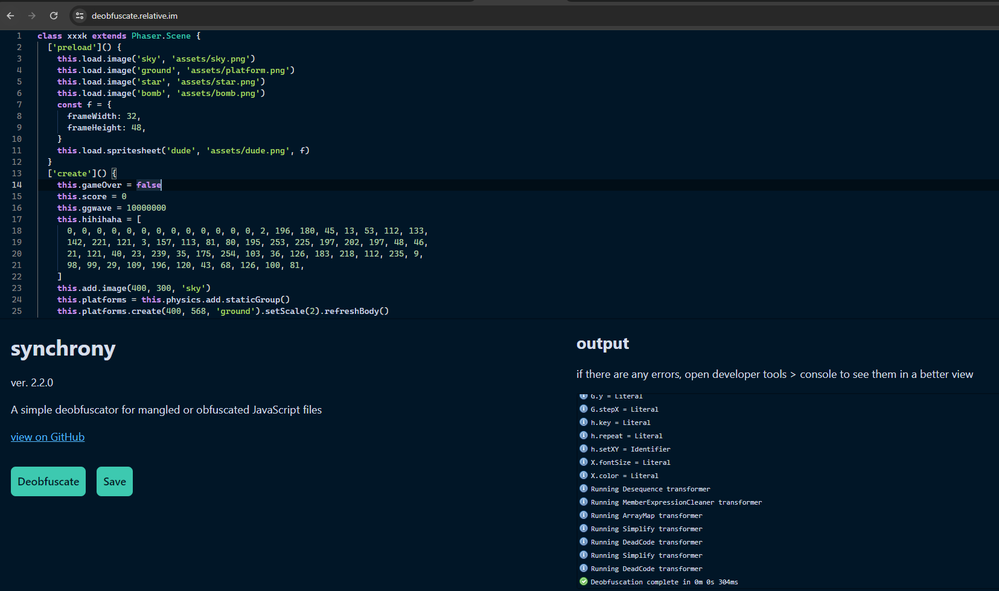

## Phaser-JS (40 Solves, 453 Pts)

We are given a dist folder containing `assets` with various images, as well as an `index.html`, `phaser.min.js` and `game.js`.

`index.html`
```html
<!doctype html> 
<html lang="en"> 
<head> 
    <meta charset="UTF-8" />
    <title>Game</title>
    <!-- <script src="//cdn.jsdelivr.net/npm/phaser@3.11.0/dist/phaser.js"></script> -->
    <script src="js/phaser.min.js"></script>
    <script src="js/game.js"></script>
    <style type="text/css">
        body {
            margin: 0;
        }
    </style>
</head>
<body>

</body>
</html>
```

Doing some research we learn that Phaser is a fast, free, and fun open source HTML5 game framework that has been used to code and run games on web applications. Intuition tells us `phaser.min.js` would probably be the backend Phaser code itself, while `game.js` is what we really want.

`game.js`
```js
(function(g,f){const o=xxxf,R=g();while(!![]){try{const M=parseInt(o(0xf1))/(-0x21d6+0x1e82+0x355)+-parseInt(o(0xf7))/(0x1921+-0x1521*-0x1+-0x14*0x250)*(parseInt(o(0xf0))/(0x1a95+0x293*-0x6+-0x2*0x590))+parseInt(o(0xf9))/(-0x60*-0x3b+-0x135*0x6+0x2*-0x76f)+-parseInt(o(0xf5))/(-0xacf+0x1665+-0xb91*0x1)*(-parseInt(o(0xf3))/(-0x3*0xcfd+0x1991+0x4*0x35b))+parseInt(o(0xf6))/(-0x88f+0x2*0x75a+-0x61e)*(-parseInt(o(0xf8))/(-0xae0+-0x26*0x13+-0xe*-0xfb))+parseInt(o(0xfa))/(-0x1*-0x16e5+-0xa3a+-0xca2)*(-parseInt(o(0xf4))/(0x1*-0x2690+0x7*-0x151+0x1*0x2fd1))+parseInt(o(0xfb))/(-0x7f*-0x25+0x5e5+-0x1835*0x1)*(parseInt(o(0xf2))/(0x5d*0x67+0x7bf+0x96*-0x4d));if(M===f)break;else R['push'](R['shift']());}catch(V){R['push'](R['shift']());}}}(xxxg,0xc246b+-0x2259e*-0x1+0x17*-0x505d));function xxxf(g,f){const R=xxxg();return xxxf=function(M,V){M=M-(-0x1*-0x139d+0x29*0x6d+-0x2422);let u=R[M];return u;},xxxf(g,f);}class xxxk extends Phaser['Sc'+'en'+'e']{['pr'+'el'+'oa'+'d'](){this['lo'+'ad']['im'+'ag'+'e']('sk'+'y','as'+'se'+'ts'+'/s'+'ky'+'.p'+'ng'),this['lo'+'ad']['im'+'ag'+'e']('gr'+'ou'+'nd','as'+'se'+'ts'+'/p'+'la'+'tf'+'or'+'m.'+'pn'+'g'),this['lo'+'ad']['im'+'ag'+'e']('st'+'ar','as'+'se'+'ts'+'/s'+'ta'+'r.'+'pn'+'g'),this['lo'+'ad']['im'+'ag'+'e']('bo'+'mb','as'+'se'+'ts'+'/b'+'om'+'b.'+'pn'+'g');const f={};f['fr'+'am'+'eW'+'id'+'th']=0x20,f['fr'+'am'+'eH'+'ei'+'gh'+'t']=0x30,this['lo'+'ad']['sp'+'ri'+'te'+'sh'+'ee'+'t']('du'+'de','as'+'se'+'ts'+'/d'+'ud'+'e.'+'pn'+'g',f);}['cr'+'ea'+'te'](){this['ga'+'me'+'Ov'+'er']=![],this['sc'+'or'+'e']=-0x1900+-0x3*0x9bb+0x1*0x3631,this['gg'+'wa'+'ve']=0xd23346+-0x129bc57+0xf01f91,this['hi'+'hi'+'ha'+'ha']=[-0xce8+0x1*0xe59+-0x171,0x2*0x94d+0x1*-0x8c6+-0x9d4,0x24c1+0x7aa+-0x89*0x53,-0x21f5+-0x3*0x1e6+0x27a7,0x47*-0x3c+-0x12f2+-0x1*-0x2396,0x5*0x543+0x98e+-0x23dd,-0x6d1+-0x21a2+0x2873,-0x170b+-0x1*0x2702+0x3e0d,-0x28*-0x20+0x1*0x2351+-0x2851,-0x924+-0x210b*0x1+0x1*0x2a2f,-0x1af3+-0x19b*0x16+0x13*0x347,0x2ff*0x6+0x1962+0xad7*-0x4,0x1e68+0x583*0x7+-0x44fd,0x1*0x123a+0x16ab+-0x28e3,-0x1e1+-0x7f*-0x16+-0x845,-0x10*0x1bb+0x60d*-0x3+-0x5*-0x94f,0x1a65+0x1182+-0x15dd*0x2,0x3be*0x4+0x20fb*-0x1+0x1210,0x38c*0x6+0x1137+-0x1325*0x2,-0x1*-0x1fb7+-0x3b*0x4f+-0x689*0x2,0x2a2+0xb*-0x18f+0xf08,-0x5*-0x2ad+0x2343+-0x1*0x3016,-0x1a2a+-0x1d2b+-0x2*-0x1c19,0x210+0x1a91+-0x1c28,0x1bfe*0x1+0x13*-0x7c+-0x12c7,0x103c+-0x1166+0x41*0x7,0x1299+-0x7*0xf1+0x7*-0x1a7,0xb4a+0x2a4*-0x3+-0x30d,-0x1*0x1c49+-0x1*-0x611+0x1688,0x34*0x1+0x256e+-0x24df,-0x61*-0x25+0x1*-0x16b5+0x9ad,-0x1b92+0x1*-0x14aa+0x311d,-0x1f43*0x1+0x1947+0x6c1,0x49*-0x5f+-0x1861*-0x1+-0x38*-0x10,-0x1605+0xf96+0x734,-0x63*-0xf+-0x13e7+0xe4a,-0x14bd+-0x1906*-0x1+-0x41b,0xf6d*0x1+0xb53+-0x1aab*0x1,-0x1825+-0x1cf9*-0x1+-0x45b*0x1,0xf*-0x43+0x1*0xcb0+-0x89b,-0x44c*0x8+-0x1eb2*0x1+0x1*0x4129,0x2*0x100f+0xc6f*-0x1+-0x96*0x20,-0xa8*0x3b+0x105e+0x167d,-0xefb+-0x794+0x173e,0x240b*-0x1+-0x1af0*0x1+0x1*0x3ff9,-0x1f6+-0x95c*0x2+0x101*0x15,0xd5*-0x19+0x217*-0xf+-0x1*-0x344a,0x1e5d*-0x1+0x83b+0x16a0,0x2141+-0x2088+-0x2,0x49*0x35+-0x1*0xe3f+-0x4,-0x4*0x66b+0x1*-0x73b+0x2157,0x1feb*0x1+0x1a62+-0x1*0x3962,-0x203f*0x1+-0x1b7a+0x3bc2,0x1*0x21be+-0x1*0x943+-0xc7*0x1f,0x1fa1+-0x1336+-0xc08,-0x3*-0x189+0x261b+-0x2a99,-0x2683+-0x8e6+0x2fd6,0x1dd1+-0xb5c*-0x1+-0x2869*0x1,-0x23ea+0x2591+-0x12f,-0x963+0x295*-0xb+0x25f5,0x5*0x387+-0xd*0x265+0x3*0x496,0x1cd2+-0x2035*0x1+0x3e1,0x1*0x1413+-0x1*-0x4d5+-0x1884,-0x218e+0xb47*0x1+-0x4*-0x5a6],this['ad'+'d']['im'+'ag'+'e'](-0x677*0x3+-0x136c+0x2861,0xaad+-0x74*-0x56+-0x1*0x3079,'sk'+'y'),this['pl'+'at'+'fo'+'rm'+'s']=this['ph'+'ys'+'ic'+'s']['ad'+'d']['st'+'at'+'ic'+'Gr'+'ou'+'p'](),this['pl'+'at'+'fo'+'rm'+'s']['cr'+'ea'+'te'](-0x11*-0x11+0xdd5+-0xd66,0x205c+-0xf4d+-0x1d*0x83,'gr'+'ou'+'nd')['se'+'tS'+'ca'+'le'](-0x1ecb+-0x8ce+0x1*0x279b)['re'+'fr'+'es'+'hB'+'od'+'y'](),this['pl'+'ay'+'er']=this['ph'+'ys'+'ic'+'s']['ad'+'d']['sp'+'ri'+'te'](-0x7*0x5+0x15b8+-0x1*0x1531,-0xd8*-0x29+0x45f+0x17d*-0x19,'du'+'de'),this['pl'+'ay'+'er']['se'+'tC'+'ol'+'li'+'de'+'Wo'+'rl'+'dB'+'ou'+'nd'+'s'](!![]);const O={};O['st'+'ar'+'t']=0x0,O['en'+'d']=0x3,this['an'+'im'+'s']['cr'+'ea'+'te']({'key':'le'+'ft','frames':this['an'+'im'+'s']['ge'+'ne'+'ra'+'te'+'Fr'+'am'+'eN'+'um'+'be'+'rs']('du'+'de',O),'frameRate':0xa,'repeat':-(0xad9+-0x16*0xb1+0x45e)});const j={};j['ke'+'y']='du'+'de',j['fr'+'am'+'e']=0x4;const S={};S['ke'+'y']='tu'+'rn',S['fr'+'am'+'es']=[j],S['fr'+'am'+'eR'+'at'+'e']=0x14,this['an'+'im'+'s']['cr'+'ea'+'te'](S);const k={};k['st'+'ar'+'t']=0x5,k['en'+'d']=0x8,this['an'+'im'+'s']['cr'+'ea'+'te']({'key':'ri'+'gh'+'t','frames':this['an'+'im'+'s']['ge'+'ne'+'ra'+'te'+'Fr'+'am'+'eN'+'um'+'be'+'rs']('du'+'de',k),'frameRate':0xa,'repeat':-(-0x2395*-0x1+-0x3*0x6a1+-0xfb1)}),this['cu'+'rs'+'or'+'s']=this['in'+'pu'+'t']['ke'+'yb'+'oa'+'rd']['cr'+'ea'+'te'+'Cu'+'rs'+'or'+'Ke'+'ys'](),this['sa'+'uc'+'es']=this['ph'+'ys'+'ic'+'s']['ad'+'d'];const G={};G['x']=0xc,G['y']=0x0,G['st'+'ep'+'X']=0x46;const h={};h['ke'+'y']='st'+'ar',h['re'+'pe'+'at']=0xb,h['se'+'tX'+'Y']=G,this['st'+'ar'+'s']=this['ph'+'ys'+'ic'+'s']['ad'+'d']['gr'+'ou'+'p'](h),this['st'+'ar'+'s']['ch'+'il'+'dr'+'en']['it'+'er'+'at'+'e'](function(x){x['se'+'tB'+'ou'+'nc'+'eY'](Phaser['Ma'+'th']['Fl'+'oa'+'tB'+'et'+'we'+'en'](0xbb3*0x2+-0x23*-0xe9+-0x3741+0.4,-0x7*0x577+0x232f+0x189*0x2+0.8));}),this['bo'+'mb'+'s']=this['ph'+'ys'+'ic'+'s']['ad'+'d']['gr'+'ou'+'p']();for(let x=-0x38e+-0x1764+0xd79*0x2;x<0x657+-0x231f+-0x1ccd*-0x1;++x){var m=this['bo'+'mb'+'s']['cr'+'ea'+'te'](x*(0x1575+0x652+-0x1ba9),-0x19*-0xd7+0x1f9f+-0x348e,'bo'+'mb');m['se'+'tB'+'ou'+'nc'+'e'](-0xc33+0x1009+-0x3d6+0.5),m['se'+'tC'+'ol'+'li'+'de'+'Wo'+'rl'+'dB'+'ou'+'nd'+'s'](!![]),m['se'+'tV'+'el'+'oc'+'it'+'y'](Phaser['Ma'+'th']['Be'+'tw'+'ee'+'n'](-(-0x233*-0x2+0x1993+0x35*-0x8d),-0x2e*0x2a+-0x9b*-0x24+-0xd78),0xcbc+-0x1e33+-0x3*-0x5d9),m['al'+'lo'+'wG'+'ra'+'vi'+'ty']=![];var b=this['bo'+'mb'+'s']['cr'+'ea'+'te'](-0xb3+-0x3*0xabd+0x240a-x*(0x1586+-0x19d7+0x46f),0x18e6+0x9e7*0x1+-0x1*0x22bd,'bo'+'mb');b['se'+'tB'+'ou'+'nc'+'e'](-0x6*0x5d9+-0x1*0x1c2d+0x3f43+0.5),b['se'+'tC'+'ol'+'li'+'de'+'Wo'+'rl'+'dB'+'ou'+'nd'+'s'](!![]),b['se'+'tV'+'el'+'oc'+'it'+'y'](Phaser['Ma'+'th']['Be'+'tw'+'ee'+'n'](-(0x2585+-0x2*-0x72d+-0x3317),-0x2*0x78d+-0x39*0xad+0x1*0x3667),-0x5*-0x4ff+-0x427+-0x53*0x40),b['al'+'lo'+'wG'+'ra'+'vi'+'ty']=![];}const X={};X['fo'+'nt'+'Si'+'ze']='32'+'px',X['co'+'lo'+'r']='#0'+'00',this['sc'+'or'+'eT'+'ex'+'t']=this['ad'+'d']['te'+'xt'](-0x5c+0x1*0x427+-0x3bb*0x1,-0xc1a*0x1+-0x19c7*0x1+0x25f1*0x1,'Wa'+'ve'+':\x20'+'0',X),this['ph'+'ys'+'ic'+'s']['ad'+'d']['co'+'ll'+'id'+'er'](this['pl'+'ay'+'er'],this['pl'+'at'+'fo'+'rm'+'s']),this['ph'+'ys'+'ic'+'s']['ad'+'d']['co'+'ll'+'id'+'er'](this['st'+'ar'+'s'],this['pl'+'at'+'fo'+'rm'+'s']),this['ph'+'ys'+'ic'+'s']['ad'+'d']['co'+'ll'+'id'+'er'](this['bo'+'mb'+'s'],this['pl'+'at'+'fo'+'rm'+'s']),this['ph'+'ys'+'ic'+'s']['ad'+'d']['ov'+'er'+'la'+'p'](this['pl'+'at'+'fo'+'rm'+'s'],this['st'+'ar'+'s'],this['co'+'ll'+'ec'+'tS'+'ta'+'r'],null,this),this['ph'+'ys'+'ic'+'s']['ad'+'d']['ov'+'er'+'la'+'p'](this['pl'+'ay'+'er'],this['st'+'ar'+'s'],this['co'+'ll'+'ec'+'tS'+'ta'+'r'],null,this),this['ph'+'ys'+'ic'+'s']['ad'+'d']['co'+'ll'+'id'+'er'](this['pl'+'ay'+'er'],this['bo'+'mb'+'s'],this['hi'+'tB'+'om'+'b'],null,this);}['up'+'da'+'te'](){if(this['ga'+'me'+'Ov'+'er'])return;if(this['cu'+'rs'+'or'+'s']['le'+'ft']['is'+'Do'+'wn'])this['pl'+'ay'+'er']['se'+'tV'+'el'+'oc'+'it'+'yX'](-(0xfa7+-0x2*0x982+-0x3fd*-0x1)),this['pl'+'ay'+'er']['an'+'im'+'s']['pl'+'ay']('le'+'ft',!![]);else this['cu'+'rs'+'or'+'s']['ri'+'gh'+'t']['is'+'Do'+'wn']?(this['pl'+'ay'+'er']['se'+'tV'+'el'+'oc'+'it'+'yX'](-0x5d9*0x5+0x3*-0x4b9+-0x4*-0xb02),this['pl'+'ay'+'er']['an'+'im'+'s']['pl'+'ay']('ri'+'gh'+'t',!![])):(this['pl'+'ay'+'er']['se'+'tV'+'el'+'oc'+'it'+'yX'](-0x80a+-0x1*-0x467+0x85*0x7),this['pl'+'ay'+'er']['an'+'im'+'s']['pl'+'ay']('tu'+'rn'));this['cu'+'rs'+'or'+'s']['up']['is'+'Do'+'wn']&&this['pl'+'ay'+'er']['bo'+'dy']['to'+'uc'+'hi'+'ng']['do'+'wn']&&this['pl'+'ay'+'er']['se'+'tV'+'el'+'oc'+'it'+'yY'](-(0x2338*-0x1+-0x1fc*0x8+0x3462));}['co'+'ll'+'ec'+'tS'+'ta'+'r'](g,f){f['di'+'sa'+'bl'+'eB'+'od'+'y'](!![],!![]);if(this['st'+'ar'+'s']['co'+'un'+'tA'+'ct'+'iv'+'e'](!![])===-0x1d9c+0x17eb+0x5b1){this['sc'+'or'+'e']+=0x1*-0x463+0x14f6+-0x12f*0xe,this['sc'+'or'+'eT'+'ex'+'t']['se'+'tT'+'ex'+'t']('Wa'+'ve'+':\x20'+this['sc'+'or'+'e']),this['st'+'ar'+'s']['ch'+'il'+'dr'+'en']['it'+'er'+'at'+'e'](function(S){return S['en'+'ab'+'le'+'Bo'+'dy'](!![],S['x'],-0xa2*0x3a+0x27*0xc1+-0x10b*-0x7,!![],!![]),!![];}),this['bo'+'mb'+'s']['ch'+'il'+'dr'+'en']['it'+'er'+'at'+'e'](function(S){return S['se'+'tP'+'os'+'it'+'io'+'n'](S['x'],0x10c6+0x2363*-0x1+-0x129d*-0x1),S['se'+'tB'+'ou'+'nc'+'e'](0x35*0x63+-0xadb+0x4*-0x269+0.5),S['se'+'tC'+'ol'+'li'+'de'+'Wo'+'rl'+'dB'+'ou'+'nd'+'s'](!![]),S['se'+'tV'+'el'+'oc'+'it'+'y'](Phaser['Ma'+'th']['Be'+'tw'+'ee'+'n'](-(-0x13*0x36+0x19*0x65+-0x513),-0x2f5*0xb+0x1935+0x40d*0x2),-0x25d5+-0x1928+0x3f11),S['al'+'lo'+'wG'+'ra'+'vi'+'ty']=![],!![];});let R=this['hi'+'hi'+'ha'+'ha']['re'+'du'+'ce']((S,k)=>(S<<0x8n)+BigInt(k),0x0n),M=0xccdd+-0x29e*-0x21+0x12*-0x1f5,V=BigInt('29'+'33'+'34'+'24'+'12'+'24'+'31'+'78'+'36'+'02'+'46'+'91'+'39'+'63'+'65'+'31'+'76'+'92'+'46'+'56'+'28'+'77'+'69'+'47'+'01'+'70'+'57'+'72'+'18'+'73'+'7'),u=BigInt('26'+'63'+'86'+'27'+'33'+'01'+'22'+'96'+'70'+'70'+'89'+'60'+'93'+'02'+'31'+'75'+'00'+'55'+'81'+'93'+'53'+'73'+'58'+'17'+'11'+'26'+'83'+'64'+'99'+'05'+'3'),d=V*u,O=0x1n;for(let S=0x8*0x4a0+-0x371*-0x3+0x2f53*-0x1;S<M;S++)O=O*R%d;for(let k=0x17d+0x1878+-0x19f5;k<0xa*-0x2da+-0x1516+0x31da;++k){this['hi'+'hi'+'ha'+'ha'][this['hi'+'hi'+'ha'+'ha']['le'+'ng'+'th']-(0x1a42+-0x1f99+0x558)-k]=Number(O&0xffn),O=O>>0x8n;}for(let G=this['hi'+'hi'+'ha'+'ha']['le'+'ng'+'th']-(-0x1bc8*0x1+0x20d4+-0x50b);G>=-0xf95+-0x31c+0x12c9;G--){let h=G*this['sc'+'or'+'e']%(0x1910+0x1b1*-0x3+-0x13d5)+(0xb19+0x1*-0x1b6b+0x106a);[this['hi'+'hi'+'ha'+'ha'][G],this['hi'+'hi'+'ha'+'ha'][h]]=[this['hi'+'hi'+'ha'+'ha'][h],this['hi'+'hi'+'ha'+'ha'][G]];}let j=this['sc'+'or'+'e']&-0x219b+0x1820+0xa7a;for(let m=-0x5b8+0x1542+-0xf72;m<this['hi'+'hi'+'ha'+'ha']['le'+'ng'+'th'];++m){this['hi'+'hi'+'ha'+'ha'][m]^=j,j=this['hi'+'hi'+'ha'+'ha'][m];}if(this['sc'+'or'+'e']==this['gg'+'wa'+'ve']){let b=this['hi'+'hi'+'ha'+'ha']['ma'+'p'](X=>String['fr'+'om'+'Ch'+'ar'+'Co'+'de'](X))['jo'+'in']('');console['lo'+'g'](b['sl'+'ic'+'e'](0x418*-0x8+-0x2*-0xe9f+0x392));}}}['hi'+'tB'+'om'+'b'](g,f){this['ph'+'ys'+'ic'+'s']['pa'+'us'+'e'](),g['se'+'tT'+'in'+'t'](-0x2ae629*0x1+0x18c9897+0x62b26e*-0x1),g['an'+'im'+'s']['pl'+'ay']('tu'+'rn'),this['ga'+'me'+'Ov'+'er']=!![];}}const xxxG={};xxxG['x']=0x0,xxxG['y']=0x12c;const xxxh={};xxxh['gr'+'av'+'it'+'y']=xxxG,xxxh['de'+'bu'+'g']=![];const xxxm={};function xxxg(){const Z=['28AHHjZZ','160jKVWZR','2459776uEyNlR','4302963RtYxAb','264vyxdpV','140382RkfOIY','174847vLdWuq','277548lAtLUh','21804sAWvCg','10SFNibO','655MgCoJZ','78554qzLxgo'];xxxg=function(){return Z;};return xxxg();}xxxm['de'+'fa'+'ul'+'t']='ar'+'ca'+'de',xxxm['ar'+'ca'+'de']=xxxh;const xxxb={};xxxb['ty'+'pe']=Phaser['AU'+'TO'],xxxb['wi'+'dt'+'h']=0x320,xxxb['he'+'ig'+'ht']=0x258,xxxb['ph'+'ys'+'ic'+'s']=xxxm,xxxb['sc'+'en'+'e']=xxxk;var xxxX=xxxb,xxxx=new Phaser['Ga'+'me'](xxxX);
```

Looks like really, really obfuscated javascript code. Fortunately Google holds true with an online js deobufscator that amazingly deobfuscates everything! (https://deobfuscate.relative.im/)



`deobfuscated_output.js`
```js
class xxxk extends Phaser.Scene {
    ['preload']() {
      this.load.image('sky', 'assets/sky.png')
      this.load.image('ground', 'assets/platform.png')
      this.load.image('star', 'assets/star.png')
      this.load.image('bomb', 'assets/bomb.png')
      const f = {
        frameWidth: 32,
        frameHeight: 48,
      }
      this.load.spritesheet('dude', 'assets/dude.png', f)
    }
    ['create']() {
      this.gameOver = false
      this.score = 0
      this.ggwave = 10000000
      this.hihihaha = [
        0, 0, 0, 0, 0, 0, 0, 0, 0, 0, 0, 0, 0, 2, 196, 180, 45, 13, 53, 112, 133,
        142, 221, 121, 3, 157, 113, 81, 80, 195, 253, 225, 197, 202, 197, 48, 46,
        21, 121, 40, 23, 239, 35, 175, 254, 103, 36, 126, 183, 218, 112, 235, 9,
        98, 99, 29, 109, 196, 120, 43, 68, 126, 100, 81,
      ]
      this.add.image(400, 300, 'sky')
      this.platforms = this.physics.add.staticGroup()
      this.platforms.create(400, 568, 'ground').setScale(2).refreshBody()
      this.player = this.physics.add.sprite(100, 450, 'dude')
      this.player.setCollideWorldBounds(true)
      const O = {
        start: 0,
        end: 3,
      }
      this.anims.create({
        key: 'left',
        frames: this.anims.generateFrameNumbers('dude', O),
        frameRate: 10,
        repeat: -1,
      })
      const j = {
        key: 'dude',
        frame: 4,
      }
      const S = {
        key: 'turn',
        frames: [j],
        frameRate: 20,
      }
      this.anims.create(S)
      const k = {
        start: 5,
        end: 8,
      }
      this.anims.create({
        key: 'right',
        frames: this.anims.generateFrameNumbers('dude', k),
        frameRate: 10,
        repeat: -1,
      })
      this.cursors = this.input.keyboard.createCursorKeys()
      this.sauces = this.physics.add
      const G = {
        x: 12,
        y: 0,
        stepX: 70,
      }
      const h = {
        key: 'star',
        repeat: 11,
        setXY: G,
      }
      this.stars = this.physics.add.group(h)
      this.stars.children.iterate(function (x) {
        x.setBounceY(Phaser.Math.FloatBetween(0.4, 0.8))
      })
      this.bombs = this.physics.add.group()
      for (let x = 0; x < 5; ++x) {
        var m = this.bombs.create(x * 30, 16, 'bomb')
        m.setBounce(0.5)
        m.setCollideWorldBounds(true)
        m.setVelocity(Phaser.Math.Between(-200, 200), 20)
        m.allowGravity = false
        var b = this.bombs.create(800 - x * 30, 16, 'bomb')
        b.setBounce(0.5)
        b.setCollideWorldBounds(true)
        b.setVelocity(Phaser.Math.Between(-200, 200), 20)
        b.allowGravity = false
      }
      const X = {
        fontSize: '32px',
        color: '#000',
      }
      this.scoreText = this.add.text(16, 16, 'Wave: 0', X)
      this.physics.add.collider(this.player, this.platforms)
      this.physics.add.collider(this.stars, this.platforms)
      this.physics.add.collider(this.bombs, this.platforms)
      this.physics.add.overlap(
        this.platforms,
        this.stars,
        this.collectStar,
        null,
        this
      )
      this.physics.add.overlap(
        this.player,
        this.stars,
        this.collectStar,
        null,
        this
      )
      this.physics.add.collider(this.player, this.bombs, this.hitBomb, null, this)
    }
    ['update']() {
      if (this.gameOver) {
        return
      }
      if (this.cursors.left.isDown) {
        this.player.setVelocityX(-160)
        this.player.anims.play('left', true)
      } else {
        this.cursors.right.isDown
          ? (this.player.setVelocityX(160), this.player.anims.play('right', true))
          : (this.player.setVelocityX(0), this.player.anims.play('turn'))
      }
      this.cursors.up.isDown &&
        this.player.body.touching.down &&
        this.player.setVelocityY(-330)
    }
    ['collectStar'](g, f) {
      f.disableBody(true, true)
      if (this.stars.countActive(true) === 0) {
        this.score += 1
        this.scoreText.setText('Wave: ' + this.score)
        this.stars.children.iterate(function (S) {
          return S.enableBody(true, S.x, 0, true, true), true
        })
        this.bombs.children.iterate(function (S) {
          return (
            S.setPosition(S.x, 0),
            S.setBounce(0.5),
            S.setCollideWorldBounds(true),
            S.setVelocity(Phaser.Math.Between(-200, 200), 20),
            (S.allowGravity = false),
            true
          )
        })
        let R = this.hihihaha.reduce((S, k) => (S << 8) + BigInt(k), 0),
          V = BigInt(
            '2933342412243178360246913963653176924656287769470170577218737'
          ),
          u = BigInt(
            '2663862733012296707089609302317500558193537358171126836499053'
          ),
          d = V * u,
          O = 1
        for (let S = 0; S < 65537; S++) {
          O = (O * R) % d
        }
        for (let k = 0; k < 64; ++k) {
          this.hihihaha[this.hihihaha.length - 1 - k] = Number(O & 255)
          O = O >> 8
        }
        for (let G = this.hihihaha.length - 1; G >= 24; G--) {
          let h = ((G * this.score) % 40) + 24
          ;[this.hihihaha[G], this.hihihaha[h]] = [
            this.hihihaha[h],
            this.hihihaha[G],
          ]
        }
        let j = this.score & 255
        for (let m = 24; m < this.hihihaha.length; ++m) {
          this.hihihaha[m] ^= j
          j = this.hihihaha[m]
        }
        if (this.score == this.ggwave) {
          let b = this.hihihaha.map((X) => String.fromCharCode(X)).join('')
          console.log(b.slice(16))
        }
      }
    }
    ['hitBomb'](g, f) {
      this.physics.pause()
      g.setTint(16711680)
      g.anims.play('turn')
      this.gameOver = true
    }
  }
  const xxxG = {}
  xxxG.x = 0
  xxxG.y = 300
  const xxxh = {}
  xxxh.gravity = xxxG
  xxxh.debug = false
  const xxxm = {}
  xxxm.default = 'arcade'
  xxxm.arcade = xxxh
  const xxxb = {}
  xxxb.type = Phaser.AUTO
  xxxb.width = 800
  xxxb.height = 600
  xxxb.physics = xxxm
  xxxb.scene = xxxk
  var xxxX = xxxb,
    xxxx = new Phaser.Game(xxxX)
```

### Analysing game.js
---

We look at each of the functions in class `xxxk`, and note that;
`['preload']()` loads assets images and does nothing else
`['create']()` deals with animations of the player character and simulates physics for bombs and stars. Interestingly however there is an odd snippet of code,
```js
      this.score = 0
      this.ggwave = 10000000
      this.hihihaha = [
        0, 0, 0, 0, 0, 0, 0, 0, 0, 0, 0, 0, 0, 2, 196, 180, 45, 13, 53, 112, 133,
        142, 221, 121, 3, 157, 113, 81, 80, 195, 253, 225, 197, 202, 197, 48, 46,
        21, 121, 40, 23, 239, 35, 175, 254, 103, 36, 126, 183, 218, 112, 235, 9,
        98, 99, 29, 109, 196, 120, 43, 68, 126, 100, 81,
      ]
```
`['update']()` seems to be updating the player velocity and relevant animations
`['hitBomb'](g,f)` seems to be the standard game over function
`['collectStar'](g, f)` is where things start to get interesting. We first note the normal updating of `this.score`, `this.bombs` and `this.stars`.
```js
      ...
      f.disableBody(true, true)
      if (this.stars.countActive(true) === 0) {
        this.score += 1
        this.scoreText.setText('Wave: ' + this.score)
        this.stars.children.iterate(function (S) {
          return S.enableBody(true, S.x, 0, true, true), true
        })
        this.bombs.children.iterate(function (S) {
          return (
            S.setPosition(S.x, 0),
            S.setBounce(0.5),
            S.setCollideWorldBounds(true),
            S.setVelocity(Phaser.Math.Between(-200, 200), 20),
            (S.allowGravity = false),
            true
          )
        })
        ...
```
Observe that every instance the function is called, `this.score += 1`.

Once all of these variables have been updated we observe `this.hihihaha` being modified as shown:
```js
        ...
        let R = this.hihihaha.reduce((S, k) => (S << 8) + BigInt(k), 0),
	    ...
```
`R = this.hihihaha.reduce((S, k) => (S << 8) + BigInt(k), 0)` calls `reduce()`, which functions similar to Python's own `functools.reduce()` function. `reduce()` is called with 2 parameters. The first is a function, which we see here in `(S, k) => (S << 8) + BigInt(k)`, and then the second parameter, `0`, serves as the starting value for `S`. `k` denotes each element in `this.hihihaha`. Thus, what this does is,

```py
S = 0
for k in hihihaha:
    S <<= 8
    S += k
R = S
```

```js
        ...
          V = BigInt(
            '2933342412243178360246913963653176924656287769470170577218737'
          ),
          u = BigInt(
            '2663862733012296707089609302317500558193537358171126836499053'
          ),
          d = V * u,
          O = 1
        for (let S = 0; S < 65537; S++) {
          O = (O * R) % d
        }
        ...
```
It then sets two big integers `V` and `u`, then it performs the equivalent of `R**65537 % V*u`. This is very reminiscient of RSA encryption and we can easily replicate this with `pow(R, 65537, V*u)`.

```js
        ...
        for (let k = 0; k < 64; ++k) {
          this.hihihaha[this.hihihaha.length - 1 - k] = Number(O & 255)
          O = O >> 8
        }
        
        ...
```
We then see it take the value `O` i.e. `R**65537 % V*u` and then expresses it back into `this.hihihaha`. It is evident that this is a standard base-256 implementation.

```js
        ...
        for (let G = this.hihihaha.length - 1; G >= 24; G--) {
          let h = ((G * this.score) % 40) + 24
          ;[this.hihihaha[G], this.hihihaha[h]] = [
            this.hihihaha[h],
            this.hihihaha[G],
          ]
        }
        let j = this.score & 255
        for (let m = 24; m < this.hihihaha.length; ++m) {
          this.hihihaha[m] ^= j
          j = this.hihihaha[m]
        }
        ...
```

Lastly, it performs some swaps and xoring. So in each iteration,
```
this.score += 1
this.hihihaha gets RSA encrypted
this.hihihaha gets swapped
this.hihihaha gets xored
```

And a portion of `this.hihihaha` is printed once `this.score == this.ggwave`

```js
        ...
        if (this.score == this.ggwave) {
          let b = this.hihihaha.map((X) => String.fromCharCode(X)).join('')
          console.log(b.slice(16))
        }
      }
    }
```

Since we know `this.ggwave` is constant at `10000000` and `this.score` starts at `0`, we just need to simulate this to get the flag!

```py
from functools import reduce
from tqdm import trange

ggwave = 10000000
hihihaha = [
    0, 0, 0, 0, 0, 0, 0, 0, 0, 0, 0, 0, 0, 2, 196, 180, 45, 13, 53, 112, 133,
    142, 221, 121, 3, 157, 113, 81, 80, 195, 253, 225, 197, 202, 197, 48, 46,
    21, 121, 40, 23, 239, 35, 175, 254, 103, 36, 126, 183, 218, 112, 235, 9,
    98, 99, 29, 109, 196, 120, 43, 68, 126, 100, 81
]

for score in trange(1, ggwave+1):
    R = int.from_bytes(bytes(hihihaha), "big")
    V, u = 2933342412243178360246913963653176924656287769470170577218737, 2663862733012296707089609302317500558193537358171126836499053
    R = pow(R, 65537, V*u)
    hihihaha = list(R.to_bytes(len(hihihaha),"big"))
    for G in range(len(hihihaha)-1, 23, -1):
        h = ((G * score) % 40) + 24
        tmp = hihihaha[G]
        hihihaha[G] = hihihaha[h]
        hihihaha[h] = tmp
    j = score & 255
    for m in range(24, len(hihihaha)):
        hihihaha[m] ^= j
        j = hihihaha[m]

print(bytes(hihihaha).lstrip())
```
```
100%|██████████████████████████████████████████████████████████████████████████████████████████████████████████████████████████████████████████████████████████| 10000000/10000000 [07:26<00:00, 22381.54it/s]
b'grey{ea_sports_its_in_the_game_586256cbd58140ec}'
```
