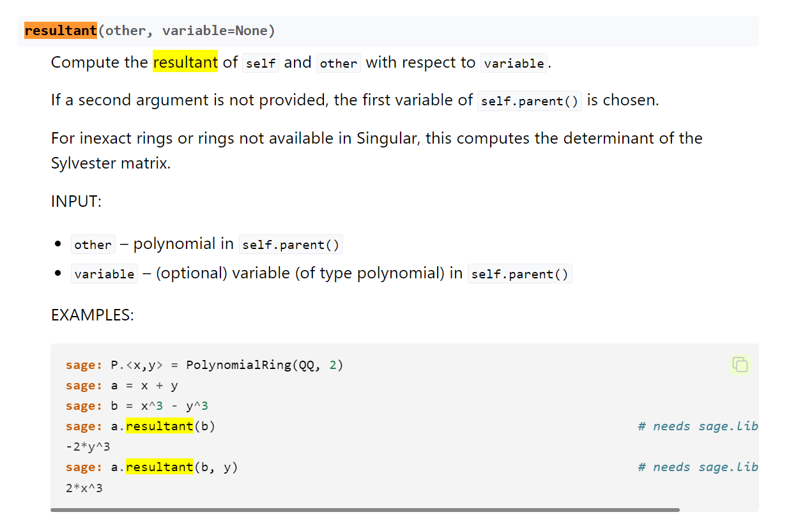

## Introduction

hi hi am Crypto CTF hobbist Warri

Recently I participated with my team Youtiaos in NUS Greyhats Welcome CTF 2023. 

We'd previously participated in 2023 GreyCTF Quals and Finals, and much like the past two events the Welcome CTF was quite engaging and fun. While I wasn't able to solve most of the Crypto challs at the time, after communicating with the challenge creators I've come up with the following writeups for all eight crypto challs.

This set of writeups include my own explanations and reasoning as to why the solves script work, as they are, as well as me dumping what I know of the encryption algorithms featured in the ctfs, primarily `RSA`, `DLP`, `XOR`, and `Linear Transformations` (on Mersenne-Twister). I try to explain it as best as I can, namely gearing for nubs like me who often struggle when reading author solve scripts due to appearances of weird syntaxes such as say, sage's `quotient_ring()`, `resultant()`, `small_roots()` or perhaps scripts that feel like an RE nightmare on its own which we are usually left with after a typical CTF.

## RSA Challs

### RSA-0 | 89 Solves 50 Points
---

#### chall.py
```py
from Crypto.Util.number import getPrime, bytes_to_long

FLAG = b'REDACTED'

p = getPrime(1024)
q = getPrime(1024)
N = p * q
e = 0x10001

m = bytes_to_long(FLAG)
c = pow(m, e, N)

print(f'c = {c}')
print(f'N = {N}')
print(f'p = {p}')

# c = ...
# N = ...
# p = ...
```

Evidently what we have here is standard RSA encryption. Given that we have one of the factors, we can complete the factorisation of n, enabling us to attain the order of n. This allows us to obtain a private key value d which would be the inverse of the public key e.

RSA Cryptography works by converting your message into a very large number, then performing e number of multiplications of itself onto said number, modulo it by a large number n, then output the encrypted result.

What one generally needs to know is that in the cyclic multiplicative group of Integers Modulo some value n, with a generator m, we have a sequence of `m, m**2 % n, m**3 % n` etc. This cycle does return back to `m` at some point, and the number of times that we need to multiply m by itself to get there is the order + 1. (The order is actually defined as the number of times you need to multiply m by itself to get 1, modulo n). The security in RSA comes from making it hard to compute the order, but with the prime factorisation of n we can do:

`order = (p-1)*(q-1)` whereby `p*q == n`. This is also the result of applying the euler_phi totient function on n, which computes the order of this multiplicative group as well.

From there, we find the modular multiplicative inverse of `e` modulo n. Letting this value be `d`, this means that we find d such that `e*d == 1 mod order(n)`. 

With this private key, given `c = m**e % n`, we have `c**d == (m**e)**d == m**ed mod n == m**(k*order(n) + 1) == m**((order(n))*k) * m mod n` where k is some positive non-zero integer.

Since we've established that the order is such that `m**order(n) == 1 mod n`, we have `1**k * m mod n == m`

And so we have our solve script (i.e. standard RSA decryption)

#### solve.py
```py
from Crypto.Util.number import long_to_bytes

c = 4953032786967695172867746734535736079394492629602997339937492536588870691711986761068264007330882164392379507566471358534367765212486515498477609692492911155794283957262806698099786347094158445145170272211735686373893103636701694078305223070255435694331868985217654529297523802803590925672631170974389903981382990420544549983820761601249866397812326812610801849185904577659135865231550382751298707081100460185455711631943830891955142829018150765638711570949799431761037124409794916415449358686605453139165302215817990962930172443187260276254923440306988071118282041585190410317783133379966160841350726595250460775910
N = 11052066728696584478173981422690934727330190793168299198052867320274026447841993970605723466693761160829620136414879721712829623869643444374519514000750617448158117024814600788220593228828959483716001856243940202140944664148436551675864046041578260049777013478819290369064647288351718954552136332329682752868851740459175906526315306668446899441322091498432444869668162455787655862796220319987420441021049615662183046206347457741254759796376818396309462269807308324577458538550348792145189261384362210189808341660028210961095419046778335823101189833780354843059884835792177540367715682849889111490004095808710040472619
p = 116425759392699888294847997537971717113216143488367405704625594087025604242904070048081650359417393094175312627188048152671036012912290926342003535891931719342443510501306306058531798298071225935871730138080360474492700290821852718100178190349149094830491644459446647257240183962386247376075386619158754717083
q = N // p
e = 0x10001
order = (p-1)*(q-1)
d = pow(e,-1,order)
m = pow(c,d,N)
print(long_to_bytes(m))
# b'greyhats{HelloWorld_from_RSA_jHZpVMPf8CnwWf8s}'
```
### RSA-1 | 5 Solves 498 Points
---

#### chall.py
```py
from Crypto.Util.number import getPrime, bytes_to_long

PP = getPrime(2048)
FLAG = b'greyhats{REDACTED}'

def f(x, y): 
    return (31 * x**3 * y + 50 * y**2 + 89 * x - 1000) % PP

def g(x, y):
    return (97 * y**5 * x**2 + 71 * x**2 + 27 * x + 31 * y + 3131) % PP

p = getPrime(1024)
q = getPrime(1024)

N = p * q
e = 0x10001

m = bytes_to_long(FLAG)
c = pow(m, e, N)

print(f'c = {c}')
print(f'PP = {PP}')
print(f'f(p, q) = {f(p, q)}')
print(f'g(p, q) = {g(p, q)}')

# c = 845383077442730894956745850475894173050402963378356553406655873101668024718019472074595894224176795441342981424513835305792477122471836494793564049800849091101408745740165957877085710018389836613202772378608360535349154778479446872966696616428976492170784666712723177953998199081074229192588936217416824922266371143673285335049756338598900768015542422109942481081855692828250390287533122097800259816968653352229687611032719705968695189278234011284173784539648272386094679396109821646995557344429543367255947040914513635664397454319131990457985098109804067946310649988270433369208200701227863071945824985701722262392
# PP = 18315367552236495632510490638893058316957201738827950951686026458789228918293089041604988139042491896824617883326602982174539446096748993950930581908611291651024032227914288481314258077124644658976051852519822767204451664075945144680024754858400371484670172049322276834606284488186849036384241560795083546611005925885696013773207393906015393482047548058198267188313079042912749897330852304286041214929219291870834187137281364886569979853491584474412612895588332279713656192803030694608505122499949367161709005592862244532800821659745656450039800551125599731750314320235053555743440041858411948023922621819529837740079
# f(p, q) = 13094292314035700827550338568566573299411860981221087086674400336714171410656016804688151816408886733600404321503970713221017487755650183286996324243017913118930980936821886547171100597662095625682781239986746699472618656322951904935526801163555483480492207464486386843974058505648622080149203123734372919667040784511214362004096485127389704869149685839012439567859607666031615125527570141039205884653130911198115020407965076220645042645769697647086318250855930532693584138245298945893213880015610244914085118324214888188921648965392016042456249791426095416625645895132546609521961973850058520758315264046941914003858
# g(p, q) = 12493388005104947846345761605901983701911640380767459876865507900036887846231651787508085061134373870486489098941753636434137742885112950085168605402923916290193561069305458311847356833086237992864756818149163955479733604742139878108033796902707265245443059082446946379992118332238777958678557920163914630997846946737358978664611933623420195734020730073675708035645085397498745025254232817858127029600735958626682678891488994283659273271363445466298583992641311235722191647370633145657687506055407995726558381270295009288256382798170766047492243623673953392791677131101200420043086159387102476379230947135066350917095
```

And now we take one big leap further into Modular Arithmetics. We are given two polynomials containing our two unknown prime factors of n. Such a polynomial is also known as a bivariate polynomial, since, yknow, two variables. Univariates, on the other hand, only consist of one, eg. f(x) = x+2.

Observe f(x,y). Notice that if you treat x as some number, you essentially have a quadratic polynomial involving y. Now one way that we can approach this is, given f(x,y) - f(p,q) == 0 when x=p, y=q, we can use the quadratic formula to derive y in the form of some other function of x.

From there, we can substitute it into g(x,y) - g(p,q) such that we now have some univariate polynomial g_x(x) mod PP. We can then factor this, deduce the roots to this polynomial to obtain possible values of x modulo PP. In this case x is one of the prime factors which is less than PP, enabling us to deduce N's prime factorisation and thus decrypt the RSA encrypted flag.

Now one way to do this and obtain some polynomial K(x) mod PP is through sagemath, notably its `resultant()` function. What `resultant()` does is given a polynomial `f0(x,y)`, another `f1(x,y)` and a specific variable say, `y`, `f0.resultant(f1, y)` returns a polynomial that one can achieve should it be that the `y` variable is shared between the two functions.

Sagemath in essence finds a way to express `y` in terms of `x` (or if there's more variables, in terms of these variables too), then plugs it into another function and attempts to simplify the polynomial.

In technical terms resultant has a different, more deeper meaning, but as a crypto nub i wont go too much into this and instead go with my current layman understanding of what it does in practice.

For example, consider the following sage example found in https://doc.sagemath.org/html/en/reference/polynomial_rings/sage/rings/polynomial/multi_polynomial_element.html:



In here, we have `a(x,y) = x + y`, `b(x,y) = x^3 - y^3`

If we compute this by hand, we see that we can substitute `y = -x`, then place it in `b()` to get `x^3 - (-x)^3 = 2x^3`.

And we see this is in fact the output of `a.resultant(b, y)`.

This brings us to the sage solve script. Thanks to mechfrog88 (the chall creator) for providing the solve script, I was struggling to get `resultant()` to work due to an issue to be mentioned later on.

#### solve.sage
```py
c = 845383077442730894956745850475894173050402963378356553406655873101668024718019472074595894224176795441342981424513835305792477122471836494793564049800849091101408745740165957877085710018389836613202772378608360535349154778479446872966696616428976492170784666712723177953998199081074229192588936217416824922266371143673285335049756338598900768015542422109942481081855692828250390287533122097800259816968653352229687611032719705968695189278234011284173784539648272386094679396109821646995557344429543367255947040914513635664397454319131990457985098109804067946310649988270433369208200701227863071945824985701722262392
PP = 18315367552236495632510490638893058316957201738827950951686026458789228918293089041604988139042491896824617883326602982174539446096748993950930581908611291651024032227914288481314258077124644658976051852519822767204451664075945144680024754858400371484670172049322276834606284488186849036384241560795083546611005925885696013773207393906015393482047548058198267188313079042912749897330852304286041214929219291870834187137281364886569979853491584474412612895588332279713656192803030694608505122499949367161709005592862244532800821659745656450039800551125599731750314320235053555743440041858411948023922621819529837740079
ff = 13094292314035700827550338568566573299411860981221087086674400336714171410656016804688151816408886733600404321503970713221017487755650183286996324243017913118930980936821886547171100597662095625682781239986746699472618656322951904935526801163555483480492207464486386843974058505648622080149203123734372919667040784511214362004096485127389704869149685839012439567859607666031615125527570141039205884653130911198115020407965076220645042645769697647086318250855930532693584138245298945893213880015610244914085118324214888188921648965392016042456249791426095416625645895132546609521961973850058520758315264046941914003858
gg = 12493388005104947846345761605901983701911640380767459876865507900036887846231651787508085061134373870486489098941753636434137742885112950085168605402923916290193561069305458311847356833086237992864756818149163955479733604742139878108033796902707265245443059082446946379992118332238777958678557920163914630997846946737358978664611933623420195734020730073675708035645085397498745025254232817858127029600735958626682678891488994283659273271363445466298583992641311235722191647370633145657687506055407995726558381270295009288256382798170766047492243623673953392791677131101200420043086159387102476379230947135066350917095

e = 0x10001

F.<x,y> = PolynomialRing(ZZ)
f = (31 * x**3 * y + 50 * y**2 + 89 * x - 1000) - ff
g = (97 * y**5 * x**2 + 71 * x**2 + 27 * x + 31 * y + 3131) - gg

xs_only = f.resultant(g, y)
xs_only = xs_only.change_ring(Zmod(PP)).univariate_polynomial()

ys_only = f.resultant(g, x)
ys_only = ys_only.change_ring(Zmod(PP)).univariate_polynomial()

xs = xs_only.roots()
ys = ys_only.roots()

from Crypto.Util.number import long_to_bytes

for x in xs:
        for y in ys:
                p = int(x[0])
                q = int(y[0])
                N = p*q
                m = pow(c, pow(e, -1, (p-1)*(q-1)), N)
                print(long_to_bytes(m))
```

Lots of...strange terminologies here. Let's go through them one by one.
Before we can define our polynomials in sage, we first need to initialise them. This is where `F.<x,y> = PolynomialRing(ZZ)` comes in. `ZZ` refers to the field of integers, and we are basically telling sagemath,

> Any mention of x,y are basically unknown variables set in the field of integers. Also they'll be polynomials which can be bivariate (have both x,y in them)

Notice that we use `ZZ` to define them, despite the challenge code obviously dealing with them in integers modulo `PP`, i.e. `Zmod(PP)`. I'm not sure why exactly this works, but I've found that when running `resultant()` with the two functions in Zmod(PP) or GF(PP), we encounter an error:

```
TypeError: Singular error:
   ? not implemented
   ? error occurred in or before STDIN line 23: `def sage11=resultant(sage8,sage9,sage10);`
```

Chances are it could be that sagemath does not know how to deal with resultants when dealing with them under a modular arithmetic scenario, but we can always deal with the modulo PP aspect after anyway. 

(A quick foray into the Cryptohacks discord server reveals there is a similar issue but on a completely different context, where the use of `resultant()` generated the same error. The author suggests that it could be due to sagemath's Singular exhibiting funny behaviour when dealing with large values)

Anyways, with the resultants obtained, we now have polynomial functions that only consist of x (p) and y (q). We call `change_ring(Zmod(PP))` to tell sage to view these functions no longer as integers but as integers modulo PP, and then call `univariate_polynomial()` to tell sage to treat them as singly-variable ones.

Note that instead of `Zmod(PP)`, `GF(PP)` can be used which deals with PP in the finite fields. Testing shows that the time taken doesnt differ by much (~10 seconds more for Zmod)

Calling `.roots()` right after churns out possible values of x and y such that xs_only(x) == 0 modulo PP, and ys_only(y) == 0 modulo PP. Notice that we've defined the original functions f(x,y), g(x,y) in the solve script such that at x = p, y = q, these new functions would be 0 modulo PP.

Thus, we just need to brute force for all possible x and ys till we find a (p,q) prime factor pairing that produces a valid plaintext output.

Eventually we find one of them to be the flag,
`greyhats{solving_equations_in_field_is_not_hard_qZCRZdsw79Yy3dde}`

The solve script itself does take some time to run, it toom about 160 seconds on my WSL Ubuntu from start to finish.
### RSA-2 | 4 Solves 499 Points
---

#### chall.py
```py
from Crypto.Util.number import bytes_to_long
from secrets import randbits

FLAG = b'greyhats{REDACTED}'

p = randbits(1024)
q = randbits(1024)
N = p * q
e = 0x10001

m = bytes_to_long(FLAG)
c = pow(m, e, N)

print(f'c = {c}')
print(f'N = {N}')
print(f'l = {len(FLAG)}')

# c = 9141779787876217885893245581785342661162555266453461051068530650252221166636753917526448649474894200888812989665074004419870594104933907348185670534113403516493549767090644738165146480042743664488756962047250548471078556661966371339922083765348133426510512817067449094644604679392211977694731638185838369075217265152007459144719806421555177795957823399955812727792866556337701407623447387484461041207947538135564318594967603051753205921079459570510178653628808968822989036057150576524149233553862123103000796135069360807269363142292225808665947586846587298653198919813527886111550213773428411495566056845310181757285
# N = 17024517151500852563752251872398859684519095315960257225238488395844074099586346111404994313809980870030798741245661189951082279664829634601545086068603019999926596939658339551613228261966995296199397320176066555174004496112604162254830317558950055642812361751105889404097361472602893222598442726530429531348676805026629819357319584695573672999928653170697562280634643632467517958125939309701800367050214592014062222324570516208801131221049723744107608447552939396733847669228959695621965674012654639697910044425914978458052259467240128271033410376458900032286136249265934367426337198473758730241235345521508982382280
# l = 34
```

We have another standard RSA..wait no, that's weird. Usually RSA's N modulus is of form p*q with primes p and q, but instead we have two random numbers multiplied together!

If we use Alpertron to do some factorising of N we get the following incomplete prime factorisation:

2^3 × 5 × 269 × 353 × 4243 × 24247 × 1 924543 × 16 744603 995961 × 98 234797 292003 × 346 338676 705159 × 39 736346 656242 769133 573171 492494 621749 787156 766813 133643 954770 152970 209280 303726 194648 538340 664572 255054 452951 958524 535064 941988 423785 417535 892775 022007 100167 444845 506117 530388 581320 010588 873890 263810 113860 068954 128203 727651 272323 928678 081453 464007 852340 244663 679939 376370 791623 756440 026091 168763 441518 913817 500358 855744 004614 776692 122260 523208 917851 425433 514238 860285 852488 377204 232893 828920 063501 057857 289879 927593 847269 983014 887947 310592 610496 971047 369933 367036 286182 864601 261301 289008 422902 767140 910550 080869 528626 186543 500997 263648 206943 273068 733911

Now I would like to state the following proposition:

```
Given a factor p mod n, a generator/plaintext message m, public key e and ciphertext c, and letting ord(x) denote the order of the multiplicative subgroup of generator m modulo x,

Much like how pow(c, pow(e, -1, ord(n)), n) == m mod n,

pow(c, pow(e, -1, ord(p)), p) == m mod p
```
(there's probably 4 special cases that i missed out on whereby this proposition would not hold, but let's ignore those for now)

First off, we know that `pow(c, pow(e, -1, ord(n)), n) == m mod n` is true. We've gone through it back in `RSA-0`. Notably, how since `c = m**e % n`,

`c**(pow(e,-1, ord(n))) == m**(k*ord(n)) * m (mod n) == m mod n`.

By similar logic, we see that `c**pow(e,-1,ord(p)) == m**(k(ord(p) + 1)) mod p == m mod p.`

But wait, shouldn't that require `c = m**e mod p` to be true? Well, we can take the previous c we had, modulo it by p, and we in fact get `m**e mod p`.

Proof that `( m**e mod n ) mod p == m ** e mod p` will be left as an exercise to the reader.
(Hint: p is a factor of n)

Anyhow, we can apply this proposition and deduce `m mod 2^3 × 5 × 269 × 353 × 4243 × 24247 × 1 924543 × 16 744603 995961 × 98 234797 292003 × 346 338676 705159`. Normally if the flag m is smaller than this large value, then we can convert it to bytes and be happy.

Unfortunately, 256^34 (the established length of the flag) is greater. Then again, 256^25 isn't, and that is all we need.

Notice that the flag starts with `greyhats{`, then has a bunch of unknown values, then ends with `}`. The prefix is 9 bytes long, and if we were to remove it we only have 25 bytes of unknown value!

Knowing that the actual flag itself, or rather `m` as it is, is of the form `greyhats{` + ...., we can rephrase this as `bytes_to_long(b'greyhats{') * 256**25 + ....`

Thus, we just need to subtract `bytes_to_long(b'greyhats{') * 256**25` from `m mod whatever_this_value_is` to obtain the unknown bytes which is smaller than `whatever_this_value_is`.

#### solve.py
```py
from Crypto.Util.number import bytes_to_long, long_to_bytes
from math import prod

c = 9141779787876217885893245581785342661162555266453461051068530650252221166636753917526448649474894200888812989665074004419870594104933907348185670534113403516493549767090644738165146480042743664488756962047250548471078556661966371339922083765348133426510512817067449094644604679392211977694731638185838369075217265152007459144719806421555177795957823399955812727792866556337701407623447387484461041207947538135564318594967603051753205921079459570510178653628808968822989036057150576524149233553862123103000796135069360807269363142292225808665947586846587298653198919813527886111550213773428411495566056845310181757285
N = 17024517151500852563752251872398859684519095315960257225238488395844074099586346111404994313809980870030798741245661189951082279664829634601545086068603019999926596939658339551613228261966995296199397320176066555174004496112604162254830317558950055642812361751105889404097361472602893222598442726530429531348676805026629819357319584695573672999928653170697562280634643632467517958125939309701800367050214592014062222324570516208801131221049723744107608447552939396733847669228959695621965674012654639697910044425914978458052259467240128271033410376458900032286136249265934367426337198473758730241235345521508982382280
l = 34

n = 2**3 * 5 * 269 * 353 * 4243 * 24247 * 1924543 * 16744603995961 * 98234797292003 * 346338676705159           # alpertron W moment
factors = [5, 269, 353, 4243, 24247, 1924543, 16744603995961, 98234797292003, 346338676705159]
ordn = prod(i-1 for i in factors) * 4       # 4 being ord(2**3). See the euler_phi function on how the eular totient is computed given a number's prime factorisation

m = pow(c, pow(0x10001, -1, ordn), n)
m -= bytes_to_long(b'greyhats{') * 256**25
m %= n
print(b'greyhats{' + long_to_bytes(m))
# b'greyhats{too_short_for_rsa_3Sae6E}'
```
### RSA-3 | 0 Solves 500 Points
---

#### chall.py
```py
from Crypto.Util.number import getPrime, bytes_to_long
from secrets import randbits

FLAG = b'REDACTED'

def f(x,y,pp): return (17 * x**2 + 27 * y**2) % pp

def g(x,y,pp): return (31 * x + 71 * y + 107 * x * y) % pp

def h(x,y,pp): return (x**2 + y**2 + x + y + x * y) % pp

def l(x,y,pp): return (11 * x**2 + 51 * x * y + 13 * y) % pp


p = getPrime(512)
q = getPrime(512)
N = p * q
e = 0x10001

m = bytes_to_long(FLAG)
c = pow(m, e, N)

k = randbits(512)

s = [getPrime(750) for _ in range(4)]

print(f'c = {c}')
print(f'N = {N}')
print(f's = {s}')
print(f'f(p,k,s_0) = {f(p,k,s[0])}')
print(f'g(p,k,s_1) = {g(p,k,s[1])}')
print(f'h(p,k,s_2) = {h(p,k,s[2])}')
print(f'l(p,k,s_3) = {l(p,k,s[3])}')

# c = 70882700158285084497635919093929071752467677881856729775757529456934863853295282404385474523956264249017514220612279758964352416619258369523102359071406416911207126061452769957316397050977884399144368197815534658557879890133636915280133706802335089891880238596266920465809098066599720551473096231847978797092
# N = 138517255214119994790609622354282348739966155100732276677992244162257216490161931530454933533283661099399510534626320390144222006221947703540006227896080001429951326584154966837738564657076410834377917156808075533290671847941245054113754385636450792545690189202517668183504541702525905146859313032149480892861
# s = [4758515396635159444505044421424959570593223286583652224392272932793922059831642020040151636828980147966727812313028197408077818356413649460088760754279751172131046144568605834320200630913444827104163940667473391127249936080493, 5292931297426296965606684617062237411526621095943171577847947300868798398382124864921932026236466344620024036624309744113771315270027497269122721426275859673972901123842479633802622069864382702281063051261896029906458751233327, 4530107721319235948266534193028578087934516441915752160369691006744434478691531253130223628034019380708142555802008107270401249900874177123091355255665253951172839005384997426740139070445176977668964571025701980452160019851971, 3262552888094259469183785092536608893114649755835254965599397923543078985315737151513149595755816596970904525728788113099699023171066050654469566099025146182076425689779847798457307717325722164577853425516023208218570874699911]
# f(p,k,s_0) = 4311166391430115243591378775908280256757921744719200708839062619617055843668611960783067111319513519104154288312883661928063335785085675823549644509795474263850412675308539605509849308364294315940948750495977186957267555391674
# g(p,k,s_1) = 3137247880096747914600753210230603868580642037922703148460800329859115318225153400078765700169660560649434930660078749864643505518175382047139411521294391178346585754367780785854476410041695352177502519723771329086874549122836
# h(p,k,s_2) = 2838152196033945595649153876688593973785999408540762211934075878370779266265375907825851137091863689216137000077646220879767570068828797399347714564631166448590659584416821630554314860742959485029648836470850398255810131208461
# l(p,k,s_3) = 1895029368946328810987014190090526467314434255188097876852526222523948408161996353973268762662954555219142022104749268835730455678609266570065307750283306621171283864426059619749600671049354876301554530144856673559961352963291
```

Credits to the challenge creator mechfrog88 for providing the solve script.
In this problem we are given two unknown `512` bit primes p and q, as well 4 different equations involving these primes modulo different prime mods.

We cannot apply `resultant()` from before much like RSA-1, as the 4 polynomials have different moduli applied to them. For example, consider

```
x^2 + 2x + 1 == 0 modulo 2
x-5 == 0 modulo 8
```

In these two equations we can't apply say, resultant of one on the other because the resultant we could get with x, (for instance in the first one) would be x=1, when this is only x = 1 modulo 2, whereas its quite evident from the second that x has to be 5 modulo 8. To use the result that x = 1 modulo 2 is correct, but includes various values of x that would wrong out the second equation. In RSA-1, the two polynomial had the same modulus, enabling us to resultant and obtain `p`, `q` modulo `PP`.

So if we cannot use `resultant()`, what can we do? There is a commonly known concept known as `Coppersmith's Attack`, which generally uses an algorithm applied in sagemath's `small_root()` function but basically solves for unknown values in RSA. Given a polynomial modulo `n`, small_roots() attempts to find variables that are possible roots of a factor of the modulus `n`, assuming that said variable is small. It generally works when you know that for say f(x), you know that x is a root with some upper bound `B` and that `B^(highest degree of x)` is small enough compared to the greater moduli.

Instances of which `small_root()` is used, as well as an example of `Coppersmith's Attack`, would be in say, knowing the `MSB` (Most Significant Bytes) of a prime `p` in RSA. You can express a polynomial in the form of say,

```py
F.<x> = PolynomialRing(Zmod(n))
f = <MSBs> * 256**k + x     # where k is the length of unknown bytes (x)
print(f.small_roots())
```

`f.small_roots()` would then attempt to find a relatively small x such that this polynomial is 0 modulo some factor of n. It doesn't need to know the factor, nor n's factorisation.

Sagemath's small_roots(), last I checked, does not fully support bivariate polynomials and only supports univariate polynomials. There is however a known github repo https://github.com/defund/coppersmith that provides code for `small_roots()`, but applied on bivariate, trivariate and potentially n-variate polynomials using `small_roots()`.

So we have this Coppersmith Algorithmn that we could use on a polynomial with p,q as its roots. But we need the polynomial's modulus to be a lot greater than the `512-bit` roots. One way to do so is to use the `Chinese Remainder Theorem (CRT)`, which given a bunch of remainders and a bunch of moduli, returns a larger expression that when modulo-ed with each moduli gives said remainders. This larger expression will also be modulo-ed with the lowest common multiple of all the moduli as well.

Thus, if we could apply `CRT` on the four polynomials, since each of them is modulo-ed a `750-bit` prime, as each of these moduli are coprime to each other their lowest common multiplier would be their product, which would be a `3000-bit` number. At that point, `512-bit` p,q could be considered relatively small enough for `Coppersmith` and `small_roots()` to work.
 
Provided we get the root, we then apply standard RSA decryption to decrypt the flag.

#### solve.sage
```py
c = 70882700158285084497635919093929071752467677881856729775757529456934863853295282404385474523956264249017514220612279758964352416619258369523102359071406416911207126061452769957316397050977884399144368197815534658557879890133636915280133706802335089891880238596266920465809098066599720551473096231847978797092
N = 138517255214119994790609622354282348739966155100732276677992244162257216490161931530454933533283661099399510534626320390144222006221947703540006227896080001429951326584154966837738564657076410834377917156808075533290671847941245054113754385636450792545690189202517668183504541702525905146859313032149480892861
s = [4758515396635159444505044421424959570593223286583652224392272932793922059831642020040151636828980147966727812313028197408077818356413649460088760754279751172131046144568605834320200630913444827104163940667473391127249936080493, 5292931297426296965606684617062237411526621095943171577847947300868798398382124864921932026236466344620024036624309744113771315270027497269122721426275859673972901123842479633802622069864382702281063051261896029906458751233327, 4530107721319235948266534193028578087934516441915752160369691006744434478691531253130223628034019380708142555802008107270401249900874177123091355255665253951172839005384997426740139070445176977668964571025701980452160019851971, 3262552888094259469183785092536608893114649755835254965599397923543078985315737151513149595755816596970904525728788113099699023171066050654469566099025146182076425689779847798457307717325722164577853425516023208218570874699911]
ff = 4311166391430115243591378775908280256757921744719200708839062619617055843668611960783067111319513519104154288312883661928063335785085675823549644509795474263850412675308539605509849308364294315940948750495977186957267555391674
gg = 3137247880096747914600753210230603868580642037922703148460800329859115318225153400078765700169660560649434930660078749864643505518175382047139411521294391178346585754367780785854476410041695352177502519723771329086874549122836
hh = 2838152196033945595649153876688593973785999408540762211934075878370779266265375907825851137091863689216137000077646220879767570068828797399347714564631166448590659584416821630554314860742959485029648836470850398255810131208461
ll = 1895029368946328810987014190090526467314434255188097876852526222523948408161996353973268762662954555219142022104749268835730455678609266570065307750283306621171283864426059619749600671049354876301554530144856673559961352963291

from Crypto.Util.number import inverse, long_to_bytes
from math import prod

F.<x,y> = PolynomialRing(ZZ)

f = (17 * x**2 + 27 * y**2) - ff
g = (31 * x + 71 * y + 107 * x * y) - gg
h = (x**2 + y**2 + x + y + x * y) - hh
l = (11 * x**2 + 51 * x * y + 13 * y) - ll

func = crt([f,g,h,l], s)
func = func.change_ring(Zmod(prod(s)))

import itertools

def small_roots(f, bounds, m=1, d=None):
    if not d:
        d = f.degree()

    R = f.base_ring()
    N = R.cardinality()

    #f /= f.coefficients().pop(0)
    f = f.change_ring(ZZ)

    G = Sequence([], f.parent())
    for i in range(m+1):
        base = N^(m-i) * f^i
        for shifts in itertools.product(range(d), repeat=f.nvariables()):
            g = base * prod(map(power, f.variables(), shifts))
            G.append(g)

    B, monomials = G.coefficient_matrix()
    monomials = vector(monomials)

    factors = [monomial(*bounds) for monomial in monomials]
    for i, factor in enumerate(factors):
        B.rescale_col(i, factor)

    B = B.dense_matrix().LLL()

    B = B.change_ring(QQ)
    for i, factor in enumerate(factors):
        B.rescale_col(i, 1/factor)

    H = Sequence([], f.parent().change_ring(QQ))
    for h in filter(None, B*monomials):
        H.append(h)
        I = H.ideal()
        if I.dimension() == -1:
            H.pop()
        elif I.dimension() == 0:
            roots = []
            for root in I.variety(ring=ZZ):
                root = tuple(R(root[var]) for var in f.variables())
                roots.append(root)
            return roots

    return []

r = small_roots(func, [2^513, 2^513], m=4, d=5)
print(r)
for p, k in r:
    p = int(p)
    print(long_to_bytes(int(pow(c, pow(0x10001, -1, (p-1)*(N//p - 1)), N))))
```

Notice that when we initialise our polynomials, we made it such that with inputs `(p,k)`, they are `0 mod s`. This is so that when we perform `CRT` to obtain a larger polynomial, the same inputs `(p,k)` would be 0 for all of the moduli.

This is important, as it ensures that `(p,k)` would be a valid root to the larger polynomial that we obtain, so that `small_roots()` might deliver us `(p,k)` as a possible root. Note that `small_roots()` returns a list of tuples with each tuple being the possible root (i.e. possible values of `(p,k)`).

We also use `change_ring(Zmod(prod(s)))` to inform Sage that we would like to now treat the new formed polynomial as modulo `prod(s)`, instead of the default datatype that sagemath assigns to the `CRT`-ed output, so that we can use it as direct input into Defund's `small_roots()` without issue.

Notice that we are able to modify two input params in Defund's `small_roots()` function, m and d. Details about them can be found on Defund's github repo, but the general rule of thumb is higher m and d ==> higher chance of finding the desired root, but also longer time taken to find the root.

MechFrog88's solution uses m=5 and d=5, which on my end took about 280 seconds.

Running m=4 and d=5 works as well, taking about 120 seconds instead.

m=4, d=4, as well as m=5, d=4 fails to obtain the desired roots.

One might also notice that a line from the original algorithmn has been commented out, being `#f /= f.coefficients().pop(0)`. As far as I am aware this is a bandaid fix to move past a "No Multipicative Inverse Exists" error over one of the coefficients in the `CRT`-ed function. This is because originally the code is supposed to divide the polynomial by the coefficient of the highest degree, so that the polynomial would be monic which would lead to better bounds for the attack. (In fact, sage's built-in `small_roots()` demands for the input function to be monic by default) Unfortunately said coefficient does not have a modular multiplicative inverse mod `prod(s)`, and so we are forced to parse it in as a non-monic polynomial instead. Regardless as we can see, `small_roots()` still works despite it not being monic.

## DLP Challs

### DLP-1 | 18 Solves 464 Points
---

#### chall.py
```py
#!/usr/local/bin/python

from secrets import randbits
from hashlib import shake_256

FLAG = b'REDACTED'

def encryptFlag(s):
    key = shake_256(str(s).encode()).digest(len(FLAG))
    return bytes([i ^ j for i, j in zip(key, FLAG)])

print("Let's perform Diffie–Hellman Key exchange!")
p = int(input("Send me your modulus: "))
g = int(input("Send me your base: "))

secret = randbits(1024)
A = pow(g, secret, p)
print(f"My public output: {A}")
print(f"c: {encryptFlag(secret).hex()}")
```

The Discrete Logarithm Problem, coined DLP for short, relies on the idea that, given a multiplicative subgroup in the Integers Modulo some number `N` with generator `g`, that, for some number `G = g**k % N`, it is hard to determine `k` given `g`, `G`, and `N`.

DLP is most commonly seen in the Diffie-Hellman Key exchange, where two individuals agree on a common generator `g` and modulus `N`. They then get their own private keys `kA` and `kB`, then on a public channel send `A = g**kA % N` and `B = g**kB % N`, these values being their public key. Through the use of arithmetic exponentiation rules (which will be left as an exercise to the reader), they perform their own operation on the opposing user's public keys to arrive at some value `S`, which is often a shared key to be used in subsequent encryption. (Cryptohacks has a whole module on it as well)

For an outsider to eavesdrop on the conversation, in order to recover `S` they need to either deduce `kA` or `kB`, which is where the DLP comes in, making it hard for them to do so and hence, ensure the key exchange goes smoothly.

In this scenario we are able to set our Diffie-Hellman exchange parameters `N` (p in the code) and generator `g`. We are provided with `A` and need to find `kA`, which is used in a hash algorithm to encrypt the flag. It is important to note that `kA` (secret), is 1024 bits long, so we need a large enough `N` such that `ord(N).bit_length() >= 1024`, as whatever `kA` we derive will always be modulo the order.

A commonly known method of breaking Diffie-Hellman and overcoming the DLP is through a method known as Pohlig-Hellman. The method involves knowing the prime factorisation of `ord(N)`, and provided that the prime factorisation doesnt involve large numbers, it does not take long for one to recover any private key `k` given `G`, `g` and `N`.

On google one can find algorithms to use on Python, but Sagemath handles this automatically with the use of its `discrete_log()` function.

A suitable `N` can easily be found by providing say, `7**512`. The order, or rather the euler-phi totient of this, is simply `(7-1) * 7**511`, with prime factorisation `2 * 3 * 7**511`. We choose some random generator `g = 2`, solve the discrete log to obtain `secret` / `k`, to then decrypt the flag.

#### solve.sage
```py
from hashlib import shake_256
from pwn import *

p = 7**512
r = remote('34.87.186.254', int(20002)) # sagemath likes putting integers under its own datatype Integer, which messes up with pwn's remote()
r.sendlineafter(b'Send me your modulus: ', str(p).encode())
r.sendlineafter(b'Send me your base: ', b'2')
r.recvuntil(b'My public output: ')

A = int(r.recvline().rstrip())
c = bytes.fromhex(r.recvline().rstrip().split(b' ')[1].decode())
r.close()

secret = discrete_log(Zmod(p)(A), Zmod(p)(2))
# Set the p, g values in the appropriate ring, in this case we are looking at integers modulo p

key = shake_256(str(secret).encode()).digest(len(c)) 
# note len(c) is the same as flag length

print( bytes([i^^j for i,j in zip(key, c)]) )                   
# sage treats ^ as **, we have to use ^^ to get it to perform bitwise xor

# b'greyhats{modulus_must_be_checked_in_dlp_y632SktsY2vXTMaP}'
```
### DLP-2 | 13 Solves 482 Points
---

#### chall.py
```py
#!/usr/local/bin/python

from Crypto.Util.number import isPrime
from secrets import randbits
from hashlib import shake_256

FLAG = b'REDACTED'

def checkModulus(p):
    if not isPrime(p):
        print("Your modulus is not prime!")
        exit(0)

def encryptFlag(s):
    key = shake_256(str(s).encode()).digest(len(FLAG))
    return bytes([i ^ j for i, j in zip(key, FLAG)])

print("Let's perform Diffie–Hellman Key exchange!")
p = int(input("Send me your modulus: "))
g = int(input("Send me your base: "))

checkModulus(p)

secret = randbits(1024)
A = pow(g, secret, p)
print(f"My public output: {A}")
print(f"c: {encryptFlag(secret).hex()}")
```

Well well well...our plans of reusing Pohlig-Hellman have been fooled with them checking the modulus to ensure that it's prime! ...or have they?

The euler totient function of a prime number `p`, i.e. the order of it in any multiplicative subgroup modulo said prime with any generator `g`, is always `p-1`. Usually for a random prime `p-1` would have large factors that would make it difficult to factorise.

But that does not stop us from generating such a prime. In fact, it does not take long to find a prime whereby `p-1` is easily factorisable. We can generate such a prime with what one would term a smooth order.

(In number theory, an n-smooth (or n-friable) number is an integer whose prime factors are all less than or equal to n)

We just keep multiplying a number with low prime numbers till its bit length is greater than that of secret, then check if said number + 1 is prime. A fun fact is that because this number has so many low prime factors, it + 1 would prevent it from being divisible by said primes, making it slightly more likely for it to be prime.

#### solve.sage
```py
from Crypto.Util.number import isPrime
from hashlib import shake_256
from random import choice
from pwn import *

def decryptFlag(s, c):
    key = shake_256(str(s).encode()).digest(len(c))
    return bytes([i ^^ j for i, j in zip(key, c)])

primes = [2, 3, 5, 7, 11, 13, 17, 19, 23, 29, 31, 37, 41, 43, 47, 53, 59, 61, 67, 71, 73, 79, 83, 89, 97, 101, 103, 107, 109, 113, 127, 131, 137, 139, 149, 151, 157, 163, 167, 173, 179, 181, 191, 193, 197, 199, 211, 223, 227, 229, 233, 239, 241, 251, 257, 263, 269, 271, 277, 281, 283, 293]
cnt = 1
while True:
    n = 1
    while n.bit_length() < 1026:
        n *= choice(primes)
    n += 1
    if isPrime(n):
        print(f"Took {cnt} tries.")             # usually < 300
        break
    cnt += 1

r = remote('34.87.186.254', int(20001))
r.sendlineafter(b"Send me your modulus: ", str(n).encode())
r.sendlineafter(b"Send me your base: ", b"2")
r.recvuntil(b': ')
A = int(r.recvline().rstrip())
c = bytes.fromhex(r.recvline().rstrip().split(b" ")[1].decode())
r.close()

s = discrete_log(Zmod(n)(A), Zmod(n)(2))
assert pow(2, s, n) == A
print(decryptFlag(int(s), c))                   # havent isolated the issue yet but this prints the flag about half of the time for some reason

# b'greyhats{safe_prime_number_should_be_use_for_dlp_yuDmuQhX3yqVrUsd}'
```

## XOR Challs

### Multi-XOR | 13 Solves 482 Points
---

#### chall.py
```py
import os 

def xor(var, key):
    return bytes(a ^ b for a, b in zip(var, key))

f = open("plaintext.txt")
content = f.read()
lines = content.split("\n")
f.close()

key = os.urandom(87)
f = open("chall.txt", 'w')

for l in lines:
    ct = xor(l.encode(), key)
    ct = ct.hex()
    f.write(ct)
    f.write("\n")
```

The plaintexts themselves follow a specific alphabet. We first check each plaintext position and determine valid xor keys in that position (as the xor keys are reused), then slowly piece together the plaintext.

#### solve.py
```py
alphabet = b"0123456789abcdefghijklmnopqrstuvwxyzABCDEFGHIJKLMNOPQRSTUVWXYZ{}_ .,:"

lines = [bytes.fromhex(i) for i in open("chall.txt","r").read().split("\n")[:-1]]
key_vals = []

for i in range(88):
    key_vals.append(list(range(256)))
    for line in lines:
        if i >= len(line):
            continue
        for kval in range(256):
            if kval in key_vals[i] and kval ^ line[i] not in alphabet:
                key_vals[i].remove(kval)

def getPtxts():
    dptxt = []
    for line in lines:
        s = ""
        for i in range(len(line)):
            items = [chr(j^line[i]) for j in key_vals[i]]
            if len(items) == 1:
                s += f"{items[0]}"
            else:
                s += f"[{''.join(items)}]"
        dptxt.append(s)
    return dptxt

# from getPtxts(), we slowly piece and deduce the original key...I found this on the seocnd last line

pt = b"When you look up at night, you can see stars twinkling in the dark sky"
for i,j in enumerate(pt):
    key_vals[i] = [j ^ lines[-2][i]]

d = getPtxts()
print(d[-1])
# The flag: greyhats{n3V3R_Us3_0n3_t1m3_P4D_m0r3_7h4n_0nc3}
```
### XOR with fixed length key | 1 Solve 500 Points

#### chall.py
```py
import os, random, hashlib
from itertools import cycle

pt   = [i%230 for i in os.urandom(500000)]
klen = random.randint(1000,10000)
key  = random.getrandbits(klen*8).to_bytes(klen, 'big')

open('ct', 'wb').write(bytes(c^i for c,i in zip(pt, cycle(key))))

flag = "greyhats{%s}"%hashlib.sha256(key).hexdigest()
print(flag)
```

Felt to be the hardest chall of them all yet the most rewarding to resolve after the CTF, especially after a very long and lengthy conversation with challenge creator Jules about linear transformations, information theory and about trying to understand the solve script.

Logically the first step would be to deduce the value of `klen`. This is quite feasible to do, as we can do something akin to this, somewhat shoddy poorly written code:
```py
def getLength():

    def testIndex(klen, ptr):
        kval = list(range(256))
        for i in range(ptr, len(ct), klen):
            for j in kval:
                if j ^ ct[i] >= 230:
                    kval.remove(j)
                if not kval:
                    return False
        return True
    
    for klen in range(1000, 10000):
        if testIndex(klen, 0) and testIndex(klen, 1) and testIndex(klen, 2) and testIndex(klen, 3) and testIndex(klen, 4):
            return klen         
            # there is in fact only one unique solution to this

getLength()
```
But basically the idea is given `klen`, we take advantage of the fact that the ptxt < 230 for all byte characters, and then at any `klen` reference possible values that the key at a specific index of `klen` could have based on the ciphertext, eliminating values that causes the plaintext to be >= 230. Eventually after checking for 5 different indexes we find the only possible `klen`, being `7347`.

That said this code takes quite a while on its own, especially with all the for loops and all. One could instead perform a bunch of bitwise & operations and use functional lang instead, using `functools` and `lambdas` to speed things up by directly calling upon the C built-in code that Python runs from. This takes much shorter time in contrast to the loops and python code that Python needs to sieve through, such as the following:

```py
def andAll(l):                              # l is to be a list of sets for & operation to work. This doesnt work on list of (Tuples or Lists) iirc
    return reduce(lambda x,y: x&y, l)

ct = open('ct', 'rb').read()
c2k = [set([i^k for i in range(230)]) for k in range(256)]
# contains matching of ciphertext to possible key values

# obtain flag length
def getLength():
    for klen in range(1000, 10000):
        for i in range(5):          # sufficient to only generate one unique answer
            k = andAll([c2k[j] for j in ct[i::klen]])
            if not k:
                break
        if k:
            return klen
```

With `klen`, we can also, for a given index `i` in the `key` array of length `klen`, observe that whatever this `key[i]` is, for every corresponding ciphertext value that is encrypted by it, the plaintext must be `< 230` as mentioned in the source code. Such can be achieved with:

```py
kpos = [andAll([c2k[j] for j in ct[i::klen]]) for i in range(klen)]
```

But even then, looking at `kpos[]` one would realise that each index has between 2 to even 32 and above possible characters. The combined permutations to look for would be infeasible across all `klen=7347` bytes.

A quick research reveals of a vulnerability in python's `random` module. The module relies on a `Mersenne-Twister` pseudo-rng algorithm that given a state of `624 32-bit` integers, generates a new number that is used in all `random.getrand...` calls. In fact there is a tool called `RandCrack` which does this for you, by feeding it 624 32-bit integers generated from previous `random` calls, which it then uses to predict the next number, using the same `Mersenne-Twister` algo. The problem with this is that it requires 624*4 bytes of the original key bytearray, permutation of which is still big such that it is infeasible.

This is where the use of `linear transformation` comes in. One might notice from `random`'s source code or `RandCrack`'s source code that when generating the next number from the 624 32-bit state array, only left shift, right shift, and xor operations are called internally on each of the 32-bits. Moreso, the individual `624*32` bits used in the `Mersenne-Twister`'s state, manner of speaking, act 'independent' of one another and only affect the next number generated.

Suppose we have `T()` as the transformation algorithm which produces any random output from a provided `Mersenne-Twister` state of `624*32` bits, and have two unknown 624*16 bit values `a` and `b` used in the `Mersenne-Twister` state array, of which we know that the state is `a ^ b`

For visualisation, imagine

`a = 0000000000000000000000000....00bde2312fba98643...8724783212`
`b = ddcafe5628dbec40178acb312....ff000000000000000...0000000000`

Due to the 'independent' nature of each bit, we have `T(a^b) = T(a) ^ T(b)`.

In laymann terms, the random output generated from the `Mersenne-Twister` of a `xor` combined state values (visualise concatenating all the `624*32` bits together) is the same as the `xor` of the output from just one of them and the other, provided that the `xor` of both is the combined state value.

If we were to let `^` denote the `+` operation of this ring that we have and let some scalar multiplication `*` be defined as `^` times the scalar value, one might also see that `T(k*a) == k*T(a)` as well. Proof can be left as an exercise to the reader.

In the context of this challenge, we can let this transformation `T` be a function that, given a domain of `GF(2)**(624*32)` (i.e. the bit combination of the state array), generates the `key` array of length `klen` bytes, with the codomain being `GF(2)**(klen*8)`.

Which, provided my knowledge of linear algebra and discrete mathematics is true, should justify the `Mersenne-Twister` transformation to be linear. Meaning we are able to determine how each bit in the `624*32` state array affects each bit in the `key` array, and from there be able to express any bit value `key[i]` in `key[klen*8]` as a bunch of `state_array[x]`s xored together.

We can obtain this pattern by first converting this `linear transformation` into a `transformation matrix`, and then use it to determine which `state_array[]` values affect any `key[i]` bit from the `random.getrandbits(klen*8)` call in chall.py.

In a more layman way of explaining this, we are basically, step by step, from a 0-initialised array of `624*32` state bits, set one of them to a `1`, observe which bits in the `key` array are flipped to `1` as a result, document the mapping, then set said bit back to `0` and flip another bit to `1`, then observe and document, etc. until we fully track down and record how every bit in the `624*32` bit long `Mersenne-Twister` state array affects the `key` bytearray as precisely as possible. Jules' solve script was able to do so using a 2D `numpy` array, which I've replicated in here as well.

In fact, assuming my results are correct, in this Transformation T, letting `b{i}` denote the ith bit of the `624*32` bit long state array and `k{i}` for the key array, we have:

```py
from functools import reduce

k0 = reduce(lambda x,y: x^y, [b672, b689, b697, b700, b7936, b7953, b7961, b7964, b9793, b9810, b9818, b9821, b11648, b11650, b11667, b11675, b11678, b13360, b13368, b13371, b13375, b15200, b15217, b15225, b15228, b18912, b18914, b18931, b18939, b18942])
k1 = reduce(lambda x,y: x^y, [b671, b672, b688, b699, b7935, b7936, b7952, b7963, b9760, b9793, b9809, b9820, b11616, b11617, b11650, b11666, b11677, b13359, b13370, b13374, b15199, b15200, b15216, b15227, b18880, b18881, b18914, b18930, b18941])
...
```

Knowing how each bit from the `Mersenne-Twister` state array affects each bit in the `key` array is vital, as now we can plug these as constraints into `z3`, a python module used to solve for unknowns provided certain constraints and boundaries on them. `z3` in question performs extremely well on `boolean equations`, which works super well with what we have here.

We first define our unknowns:
```py
sol = z3.Solver()
kz3 = [z3.BitVec(f'k{i}', 8) for i in range(klen)]           # [k0, k1, k2, ...., k{klen}], each of them being a single byte hence 8 bits
bz3  = [z3.BitVec(f'b{i}', 1) for i in range(624*32)]        # [b0, b1, b2, ...., b{624*32}], each 1 bit long
```

then add in the constraints that we've found thus far, being:
- 1. `key[i]` (as a byte array) can only be one of a few values that we've discovered using xor with fixed key length on the ciphertext
- 2. Each `k[i]` (as a bit array) comes from the xor chain of specific unknown variables in `b[x0], b[x1], b[x2]` etc., and each of these `b[x0]` may also be used in determining other `k[j]`s.

Fortunately with this despite having `624*32 + 7347*8` unknown bits to solve, z3 is able to deduce the set of `b[0], b[1], ..., b[624*32]` and recover the state `random` was before `key = getrandbits(klen*8)` was called.

We can then reproduce the same key with the same function call, and then use it to decrypt the flag.

#### solve.py
```py
import random, z3, hashlib
import numpy as np
from time import time
from functools import reduce

# functional lang p strong, actually so much faster than using loops in python since one's built in C and the other's built in python on top of C
def andAll(l):                              # l is to be a list of sets for & operation to work. This doesnt work on list of (Tuples or Lists) iirc
    return reduce(lambda x,y: x&y, l)

def xorAll(l):
    return reduce(lambda x,y: x^y, l)

ct = open('ct', 'rb').read()
c2k = [set([i^k for i in range(230)]) for k in range(256)]
# contains matching of ciphertext to possible key values

# obtain flag length
def getLength():
    for klen in range(1000, 10000):
        for i in range(5):          
            # sufficient to only generate one unique answer
            k = andAll([c2k[j] for j in ct[i::klen]])
            if not k:
                break
        if k:
            return klen

klen = getLength()  # 7347
kpos = [andAll([c2k[j] for j in ct[i::klen]]) for i in range(klen)]

# obtain linear transformation matrix
# remember, T(MT_STATE) ==> KEY where T is the transformation function
# MT_STATE is essentially GF(2)**(624*32) or rather (624*32) dimensions with each dimension only having a 0 or a 1
# KEY is GF(2)**(klen*8)

# Letting the matrix be A, we have T(MT_STATE) ==> KEY and A*[MT_STATE] ==> KEY.
# In the case of the latter, MT_STATE would be a columnn vector of length 624*32, and KEY a column vector of length klen*8 
# So the linear transformation matrix would consist of 624*32 COLUMNS and klen*8 ROWS

# Getting klen*8 output from mt_state is possible whereas we've no clue how to do the inverse of that, so the matrix we get
# is kinda transposed over the linear transformation matrix that we were originally looking for.

s0, stateVector, s2  = random.getstate()    
num = stateVector[-1]            
# random.getstate returns the format of: (num0, (<stateVector of 624 32 bit nums>, num1), None)
# There is some odd behaviour with num1 especially, i've found that on vscode its always 624, whereas on python's command line it changes from time to time..?
# I wonder if this value does in fact alter the resultant flag here...

curr = time()
print("Beginning transformation matrix initialisation...")
prng = []
fstr = f"0{klen*8}b"
for i in range(624*32):
    print(f"Observing transformation caused solely by {i+1} bit (out of {624*32})", end="\r")
    stateString = ['0'] * 624*32
    stateString[i] = '1'
    stateString = ''.join(stateString)
    stateVector = [int(stateString[j:j+32][::-1],2) for j in range(0,624*32,32)] + [num]        
    # [::-1] as we need to swap the 'endianness'
    # we want our state vectors to be [1,0,......], [2,0,.....], [4,0,....] ..... [2^32,0,....], [0,1,......]
    
    random.setstate([s0, tuple(stateVector), s2])
    r = random.getrandbits(klen*8)
    prng.append([int(j) for j in format(r, fstr)])
prng = np.array(prng, dtype=bool)
print("Transformation matrix completed!                                  ")        
print(f"Time taken: {time() - curr} seconds")     
# aligning with \r of the previous print statement up above.
# Now, we can, with the matrix prng, if we transpose it, we effectively have A*mt19937state == key. Keep this in mind for later.

# Define z3 constants
sol = z3.Solver()
kz3 = [z3.BitVec(f'k{i}', 8) for i in range(klen)]           # [k0, k1, k2, ...., k{klen}], each of them being a single byte hence 8 bits
bz3  = [z3.BitVec(f'b{i}', 1) for i in range(624*32)]        # [b0, b1, b2, ...., b{624*32}], each 1 bit long

# z3 is a constraint solver. So lets dump all the constraints we know into the machine

# 1st set of constraints: Possible key values at each index in the klen-long key.
for k_var,k_vals in zip(kz3, kpos):
    sol.add(reduce(z3.Or, [k_var == k for k in k_vals]))
    # for example, k0 is of the form:
    # k0 == 128 OR k0 == 129 OR k0 == 132 OR k0 == 133 OR k0 == 134 OR k0 == 135
    # or in z3 terms, 
    # Or(Or(Or(Or(Or(k0 == 128, k0 == 129), k0 == 132), k0 == 133), k0 == 134), k0 == 135)

# 2nd set of constraints: Formulate how each bit in the key is determined by which bits in the MT_STATE array

# Recall the prng from before?
# We have 624*32 rows representing the effect of each bit (shld it be one or zero) of the mt19937 array
# And klen*8 columns representing which bit of the original mt19937 array will impact whether said bit of key is flipped to a 1 or 0.

# Looking through RandCrack's implementation of mt, we see that everything is xor-based (apart from bit shifting)
# Which implies that this transformation is linear.
# To determine whether the ith bit of key is a 1 or 0, we grab those bits, check their corresponding value in the prng's ith column, then
# xor all the 0s and 1s together to deduce if its a 1 or 0

# anything xor 0 is always anything so we ignore the 0s, and instead go for the 1s / "True" areas instead. i.e. those bits of the mt array
# which corresponds to 0 doesnt affect the ith bit of key regardless of whether they are flipped or not.

# So, we first add the constraint of which b{} unknown is relevant in determining the ith bit of key, we do:
# bz3[x] for x in np.where(prng[:,8*i+j])[0]
# All you need to know is that:
# A[:,x] on a 2D numpy array A returns a numpy array that is just the xth column of A.
# np.where(condition affecting a 1d array) returns a tuple containing a single element, 
# that element being an np array of indexes in said 1d array where the condition is true.

for i,k_var in enumerate(kz3):
    r8 = [xorAll([bz3[x] for x in np.where(prng[:,8*i+j])[0]]) for j in range(8)]
    sol.add(k_var == reduce(z3.Concat, r8))
    # np.where(prng[:,8*i+j]) ==> returns indexes in the (8*i+j)th column of prng such that the value in it is True
    # to visualise the condition part, imagine that its doing `for i in prng[:,8*i+j]: if (i):`
    # [0] bit narrows down into the np array containing the indexes, which we then transfer to the corresponding bz3 variables.

    # we then call xorAll() to xor the variables to form the xor equation to be used as a constraint for k.
    # 8*i+j is present to formulate each of the 8 bits in k_var (as k_var represents one byte)
    # z3.Concat is called to concatenate the bits together, much like string concatenation

print("Encoded Constraints!")

# Get z3 solution, z3 magic go brrr
curr = time()
assert sol.check() == z3.sat
print("Recovered internal state!")
print(f"Time taken: {time() - curr} seconds.")

# Deduce MT_STATE before key is generated, and set random to that state
b_vars = [sol.model()[i] for i in bz3]
b_vars = [0 if i==None else i.as_long() for i in b_vars]
solved_state = (s0, (*[reduce(lambda x,y: (x<<1)+y, b_vars[i*32:i*32+32][::-1]) for i in range(624)], num), s2) 
#[::-1] is to swap the 'endianess' back to integer
# alternatively this can be removed as well, so long as the [::-1] used in the matrix formation previously is removed alongside it.
random.setstate(solved_state)

# and finally, obtain key and flag
key = random.getrandbits(klen*8).to_bytes(klen, 'big')
flag = "greyhats{%s}"%hashlib.sha256(key).hexdigest()
print("Flag:", flag)
"""
Beginning transformation matrix initialisation...
Transformation matrix completed!
Time taken: 147.86211276054382 seconds
Encoded Constraints!
Recovered internal state!
Time taken: 36.17067003250122 seconds.
Flag: greyhats{9db96ca272e09ca76491d8c2eebf1ea10b8940440c5833146b72c0db361e6236}
"""
```

As to how and why z3 is able to provide a solution, Jules provided me with a crude estimation of how the constraints used are able to reduce the number of unknown bits needed to determine as follows:


## Conclusion

ok we finally done now Cryptos were fun bye.
