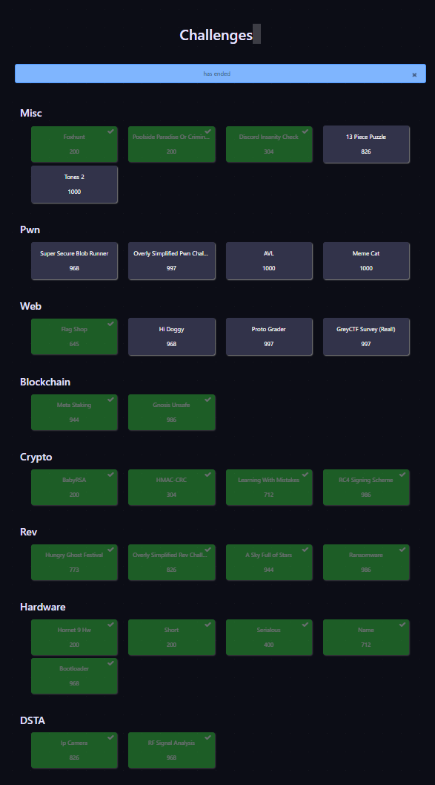
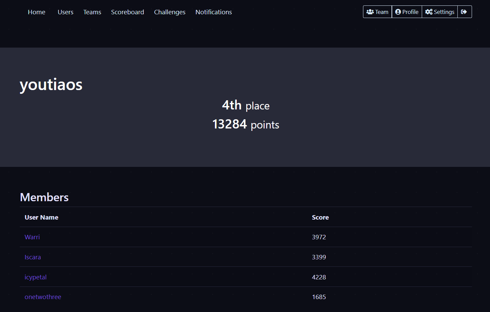

# GREYCTF 2024 Finals Writeups
Having passed top 20 in the local category during qualifiers, we made it into finals! Over a 24 hour period we competed against some of Singapore's best CTF teams, and we managed to come out quite well!

As is custom in every one of my writeup repos, I played as `Warri` under Team `Youtiaos`. We scored `4th` on the Leaderboard with `13284` points, having solved the following challenges:

I managed to score `4958` points (one of the challenges' flag was submitted by my teammate `Iscara`) and solved the following challenges, blooding four of them!

This repo contains writeups for the challenges that I was able to solve. A brief descriptions of each of them will be provided in this README, but the actual writeups can be found in their individual `.md` files.

---
### Crypto
#### BabyRSA - 18 Solves, 200 Pts
Interesting RSA Challenge
#### HMAC-CRC - 15 Solves, 304 Pts, 🩸
Spoofing CTR and CRC!
#### Learning With Mistakes - 10 Solves, 712 Pts, 🩸
Learning With Errors? Sounds interesting.
#### RC4 Signing Scheme - 3 Solves, 986 Pts, 🩸
Is a signing oracle really secure for RC4?

---
### Rev
#### Overly Simplified Rev Challenge - 8 Solves, 826 Pts
no movs, no functions, no stack, ???
#### A Sky Full of Stars - 5 Solves, 944 Pts
'Cause you're a sky, 'cause you're a sky full of stars
I'm gonna give you my heart...
#### Ransomware - 3 Solves, 986 Pts, 🩸
RE...Pwn...Forensics all in one??