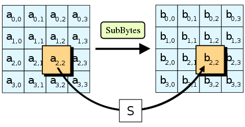
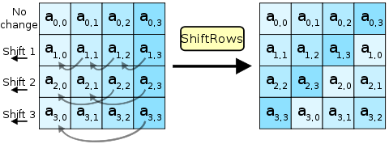
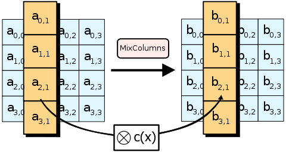

### AES (28 Solves, 738 Pts, 🩸)
The first challenge I'd tried and also my first blood in this CTF!
The challenge provides us with two files, an `aes.py` which is modified from https://github.com/boppreh/aes/blob/master/aes.py, as well as `server.py` which uses `aes.py` to perform "AES" encryption.

`aes.py`
```py
# Adapted from https://github.com/boppreh/aes/blob/master/aes.py

s_box = (
    0x63, 0x7C, 0x77, 0x7B, 0xF2, 0x6B, 0x6F, 0xC5, 0x30, 0x01, 0x67, 0x2B, 0xFE, 0xD7, 0xAB, 0x76,
    0xCA, 0x82, 0xC9, 0x7D, 0xFA, 0x59, 0x47, 0xF0, 0xAD, 0xD4, 0xA2, 0xAF, 0x9C, 0xA4, 0x72, 0xC0,
    0xB7, 0xFD, 0x93, 0x26, 0x36, 0x3F, 0xF7, 0xCC, 0x34, 0xA5, 0xE5, 0xF1, 0x71, 0xD8, 0x31, 0x15,
    0x04, 0xC7, 0x23, 0xC3, 0x18, 0x96, 0x05, 0x9A, 0x07, 0x12, 0x80, 0xE2, 0xEB, 0x27, 0xB2, 0x75,
    0x09, 0x83, 0x2C, 0x1A, 0x1B, 0x6E, 0x5A, 0xA0, 0x52, 0x3B, 0xD6, 0xB3, 0x29, 0xE3, 0x2F, 0x84,
    0x53, 0xD1, 0x00, 0xED, 0x20, 0xFC, 0xB1, 0x5B, 0x6A, 0xCB, 0xBE, 0x39, 0x4A, 0x4C, 0x58, 0xCF,
    0xD0, 0xEF, 0xAA, 0xFB, 0x43, 0x4D, 0x33, 0x85, 0x45, 0xF9, 0x02, 0x7F, 0x50, 0x3C, 0x9F, 0xA8,
    0x51, 0xA3, 0x40, 0x8F, 0x92, 0x9D, 0x38, 0xF5, 0xBC, 0xB6, 0xDA, 0x21, 0x10, 0xFF, 0xF3, 0xD2,
    0xCD, 0x0C, 0x13, 0xEC, 0x5F, 0x97, 0x44, 0x17, 0xC4, 0xA7, 0x7E, 0x3D, 0x64, 0x5D, 0x19, 0x73,
    0x60, 0x81, 0x4F, 0xDC, 0x22, 0x2A, 0x90, 0x88, 0x46, 0xEE, 0xB8, 0x14, 0xDE, 0x5E, 0x0B, 0xDB,
    0xE0, 0x32, 0x3A, 0x0A, 0x49, 0x06, 0x24, 0x5C, 0xC2, 0xD3, 0xAC, 0x62, 0x91, 0x95, 0xE4, 0x79,
    0xE7, 0xC8, 0x37, 0x6D, 0x8D, 0xD5, 0x4E, 0xA9, 0x6C, 0x56, 0xF4, 0xEA, 0x65, 0x7A, 0xAE, 0x08,
    0xBA, 0x78, 0x25, 0x2E, 0x1C, 0xA6, 0xB4, 0xC6, 0xE8, 0xDD, 0x74, 0x1F, 0x4B, 0xBD, 0x8B, 0x8A,
    0x70, 0x3E, 0xB5, 0x66, 0x48, 0x03, 0xF6, 0x0E, 0x61, 0x35, 0x57, 0xB9, 0x86, 0xC1, 0x1D, 0x9E,
    0xE1, 0xF8, 0x98, 0x11, 0x69, 0xD9, 0x8E, 0x94, 0x9B, 0x1E, 0x87, 0xE9, 0xCE, 0x55, 0x28, 0xDF,
    0x8C, 0xA1, 0x89, 0x0D, 0xBF, 0xE6, 0x42, 0x68, 0x41, 0x99, 0x2D, 0x0F, 0xB0, 0x54, 0xBB, 0x16,
)

def sub_bytes(s):
    for i in range(4):
        for j in range(4):
            s[i][j] = s_box[s[i][j]]

def shift_rows(s):
    s[0][1], s[1][1], s[2][1], s[3][1] = s[1][1], s[2][1], s[3][1], s[0][1]
    s[0][2], s[1][2], s[2][2], s[3][2] = s[2][2], s[3][2], s[0][2], s[1][2]
    s[0][3], s[1][3], s[2][3], s[3][3] = s[3][3], s[0][3], s[1][3], s[2][3]

def add_round_key(s, k):
    for i in range(4):
        for j in range(4):
            s[i][j] ^= k[i][j]

def mix_single_column(a):
    a[0], a[1], a[2], a[3] = a[1], a[2], a[3], a[0]

def mix_columns(s):
    for i in range(4):
        mix_single_column(s[i])

r_con = (
    0x00, 0x01, 0x02, 0x04, 0x08, 0x10, 0x20, 0x40,
    0x80, 0x1B, 0x36, 0x6C, 0xD8, 0xAB, 0x4D, 0x9A,
    0x2F, 0x5E, 0xBC, 0x63, 0xC6, 0x97, 0x35, 0x6A,
    0xD4, 0xB3, 0x7D, 0xFA, 0xEF, 0xC5, 0x91, 0x39,
)

def bytes2matrix(text):
    return [list(text[i:i+4]) for i in range(0, len(text), 4)]

def matrix2bytes(matrix):
    return bytes(sum(matrix, []))

def xor_bytes(a, b):
    return bytes(i^j for i, j in zip(a, b))

def pad(plaintext):
    padding_len = 16 - (len(plaintext) % 16)
    padding = bytes([padding_len] * padding_len)
    return plaintext + padding

class AES:
    def __init__(self, master_key) -> None:
        assert len(master_key) == 16
        self.n_rounds = 10
        self._key_matrices = self._expand_key(master_key)

    def _expand_key(self, master_key):
        key_columns = bytes2matrix(master_key)
        iteration_size = len(master_key) // 4
        i = 1

        while len(key_columns) < (self.n_rounds + 1) * 4:
            word = list(key_columns[-1])
            if len(key_columns) % iteration_size == 0:
                word.append(word.pop(0))
                word = [s_box[b] for b in word]
                word[0] ^= r_con[i]
                i += 1
            word = xor_bytes(word, key_columns[-iteration_size])
            key_columns.append(word)

        return [key_columns[4*i : 4*(i+1)] for i in range(len(key_columns) // 4)]

    def encrypt_block(self, plaintext):
        assert len(plaintext) == 16

        plain_state = bytes2matrix(plaintext)

        add_round_key(plain_state, self._key_matrices[0])

        for i in range(1, self.n_rounds):
            sub_bytes(plain_state)
            shift_rows(plain_state)
            mix_columns(plain_state)
            add_round_key(plain_state, self._key_matrices[i])

        sub_bytes(plain_state)
        shift_rows(plain_state)
        add_round_key(plain_state, self._key_matrices[-1])

        return matrix2bytes(plain_state)
    
    def encrypt(self, plaintext):
        plaintext = pad(plaintext)
        ciphertext = b''
        for i in range(0, len(plaintext), 16):
            ciphertext += self.encrypt_block(plaintext[i : i + 16])
        return ciphertext
```
`server.py`
```py
from secrets import token_bytes
from aes import AES

FLAG = 'REDACTED'
password = token_bytes(16)
key = token_bytes(16)

AES = AES(key)
m = bytes.fromhex(input("m: "))
if (len(m) > 4096): exit(0)
print("c:", AES.encrypt(m).hex())
print("c_p:", AES.encrypt(password).hex())
check = input("password: ")
if check == password.hex():
    print('flag:', FLAG)
```

The steps to obtain the flag seem pretty simple. We are allowed to enter up to `4096` bytes of some message, to which the server performs `AES.encrypt()` and returns the value to us. It then expects us to be able to decrypt an encrypted `password` 16 byte string, and upon doing so outputs the flag.

Normally `AES` is secure and just getting a 4096-byte plaintext-ciphertext pair is hardly helpful in enabling us to break it, so something fishy must be going on here.

We run a quick difference checker on the provided `aes.py` and the github code that it was supposedly sourced from and find the key difference, `mix_single_column()`

```py
def mix_single_column(a):
    a[0], a[1], a[2], a[3] = a[1], a[2], a[3], a[0]

def mix_columns(s):
    for i in range(4):
        mix_single_column(s[i])
```

which is a lot different than the standard,
```py
# learned from https://web.archive.org/web/20100626212235/http://cs.ucsb.edu/~koc/cs178/projects/JT/aes.c
xtime = lambda a: (((a << 1) ^ 0x1B) & 0xFF) if (a & 0x80) else (a << 1)

def mix_single_column(a):
    # see Sec 4.1.2 in The Design of Rijndael
    t = a[0] ^ a[1] ^ a[2] ^ a[3]
    u = a[0]
    a[0] ^= t ^ xtime(a[0] ^ a[1])
    a[1] ^= t ^ xtime(a[1] ^ a[2])
    a[2] ^= t ^ xtime(a[2] ^ a[3])
    a[3] ^= t ^ xtime(a[3] ^ u)


def mix_columns(s):
    for i in range(4):
        mix_single_column(s[i])
```

So the vulnerability has to originate from here! But how do we figure this out? Well as unfortunate as it might be for newcomers, this challenge involves understanding of the internals of the AES encryption algorithm and how each part makes it secure.

### AES, internally

Notably, AES consists of four unique steps that are then used multiple times to encrypt every message block

- `add_round_key()` - The secret key parameter of AES is being used here, where round keys generated by said key are xored with the input message block. Notice that in here, each round key byte will only affect its corresponding message byte
- `sub_bytes()` - Each message byte in the plaintext is substituted by a lookup `sbox` table where every message byte `i` is replaced by `sbox[i]`. Every message byte will only affect its own byte value, and does not affect other bytes in the 16-byte message block. This is an important step as a proper `sbox` such as the one provided in standard AES ensures that the cipher is non-linear


- `shift_rows()` - Consider viewing the 16-byte message block as a 4-byte by 4-byte matrix; `shift_rows()` essentially horizontally shifts each row of the matrix. This is done so that from a matrix point of view, the 16 byte message block would not become 4 4-byte message blocks independent of one another; In theory, with `mix_columns()` having every byte in one column affect all 4 bytes in the column, `shift_rows()` ensures that the same byte will ultimately affect all of the other columns as well, resulting in 1 byte affecting all 16 bytes of the ciphertext


- `mix_columns()` - Once again viewing the block as a matrix, `mix_columns()` takes the column, and multiplies the column vector with a fixed polynomial. This transformation, by right, ensures that every byte in the column will impact and alter the entire column once this function has been called.


You may have started to notice how in each of this functions I've mentioned how much a single byte of the plaintext would affect the ciphertext. This is because `AES` security relies on the property of `diffusion`. (it also relies on a property that is `confusion`, and i'll leave research of this to the reader)

Diffusion essentially means changing a bit, or a byte of the plaintext, would affect a LOT of bits (or bytes, respectively) of the ciphertext. `add_round_keys()` and `sub_bytes()` does not contribute to this diffusion factor, as we notice that in both of these functions, changing the `ith` message byte would only change the `ith` ciphertext byte.

On the other hand, `shift_rows()` and `mix_columns()` ensure AES' diffusion property. Both of these go hand in hand to make sure that every `ith` message byte would affect ALL bytes of the ciphertext to some degree, and thus leads to AES' overall security. 

### The vulnerability!

We see `mix_columns()` done right as per the original github source code, but looking at the one provided in `aes.py`, we see that it only shifts the column! Coupled with shift rows, even though at each round in AES, every byte is shifted on its row, it would only then be shifted on its column - this does NOT contribute to diffusion at all! Ultimately what we have is a disguised "byte-mover" that moves the `ith` message byte's impact to another byte! There is no diffusion, as with `mix_columns()` a fixed polynomial multiplication ensures that all the bytes in the column would affect each other.

And so the vulnerability becomes apparent - every `ith` message block byte will only affect some `jth` resultant ciphertext byte. We can easily verify this by computing `AES(message_0)` and `AES(message_1)` for two 16-byte blocks `message_0` and `message_1`, whilst only changing a single byte between the two. The resultant ciphertexts would have 15 of its bytes unchanged and only one byte altered.

We can obtain these `i->j` pairings by performing `AES()` on different messages by changing each of the 16 byte, and observing where the pattern differs. Notice that since `add_round_keys()` is the only AES function that involves the secret key parameter and only has the `ith` message byte affect its corresponding ciphertext byte, regardless of the `key`, the `i->j` pairing would not be affected.

```py
from secrets import token_bytes
from Crypto.Util.number import long_to_bytes, bytes_to_long
from Crypto.Util.strxor import strxor
from aes import AES

key = token_bytes(16)
AES = AES(key)
pad = lambda x: b'\x00'*(16-len(x)) + x

ct = AES.encrypt(b'\x00'*16)[:16]

displace = []
for i in range(16):
    payload = [0xff if i == j else 0x00 for j in range(16)]
    payload = bytes(payload)
    out = format(bytes_to_long(strxor(AES.encrypt(payload)[:16], ct)),"0128b")
    displace.append((out.index("1"))// 8)
print(displace)
# [7, 12, 5, 14, 11, 0, 9, 2, 15, 4, 13, 6, 3, 8, 1, 10]
```

As we can see, the `0th` message byte would affect the `7th` ciphertext byte, the `1st` messgae byte the `12th` and so on. By figuring out how all possible 256 byte values affect its displaced byte value, we can then generate a lookup table allowing us to reverse decrypt virtually any other ciphertext encrypted by the server, provided the same key is used.

So, in the given 4096-byte message that we can send for the server to encrypt, we send a payload of just `\x00`*16, then `\x01`*16, then `\x02`*16, ..., `\xff`*16. Then, we generate a lookup table recording the data, and from it given any encrypted ciphertext, identify the correct byte value of the `ith` message block that would result in the `displace[i]th` ciphertext byte, and thus recover the password from its encrypted version. We then submit the decrypted password and obtain the flag!

`sol.py`
```py
from secrets import token_bytes
from aes import AES

key = token_bytes(16)
AES = AES(key)

from Crypto.Util.number import long_to_bytes, bytes_to_long
from Crypto.Util.strxor import strxor

pad = lambda x: b'\x00'*(16-len(x)) + x
ct = AES.encrypt(b'\x00'*16)[:16] # remove the 16 bytes of padding

displace = []
for i in range(16):
    payload = [0xff if i == j else 0x00 for j in range(16)]
    payload = bytes(payload)
    out = format(bytes_to_long(strxor(AES.encrypt(payload)[:16], ct)),"0128b")
    displace.append((out.index("1"))// 8)
print(displace)

from pwn import *

pload = b''
for i in range(256):
    pload += pad(bytes([i]*16))

r = remote('challs.nusgreyhats.org', 35100)
r.sendline(pload.hex().encode())
r.recvuntil(b'c: ')
res = bytes.fromhex(r.recvline().rstrip().decode())[:-16]
r.recvuntil(b'c_p: ')
pw_enc = bytes.fromhex(r.recvline().rstrip().decode())[:-16]
pw_enc_x = strxor(pw_enc, res[:16]) # xor with AES(b'\x00' * 16)

lookup = {}
for i in range(256):
    rr = strxor(res[16*i:16*i+16], res[:16]) 
    # strxor with NULL so we can consistently see how each byte is affected
    lookup[i] = rr

pw = ['']*16
for ptr, val in enumerate(pw_enc_x):
    lu_index = displace.index(ptr)
    if not val: # b'\x00'
        pw[lu_index] = 0
        continue
    lu_data = bytes([lookup[i][ptr] for i in range(256)])
    pw[lu_index] = lu_data.index(val)
pw = bytes(pw)
print(f'recovered pw: {pw}')

r.recvuntil(b'password: ')
r.sendline(pw.hex().encode())
flag = r.recvline().rstrip()
print(flag)
r.close()

"""
[7, 12, 5, 14, 11, 0, 9, 2, 15, 4, 13, 6, 3, 8, 1, 10]
[x] Opening connection to challs.nusgreyhats.org on port 35100
[x] Opening connection to challs.nusgreyhats.org on port 35100: Trying 35.198.239.93
[+] Opening connection to challs.nusgreyhats.org on port 35100: Done
recovered pw: b'J\xd9L%\xdc\x00"\xd2\xb5\xdb\xb8\xb4\xc2\xabH\xe2'
b'flag: grey{mix_column_is_important_in_AES_ExB3Hf9q9I3m}'
[*] Closed connection to challs.nusgreyhats.org port 35100
"""
```
