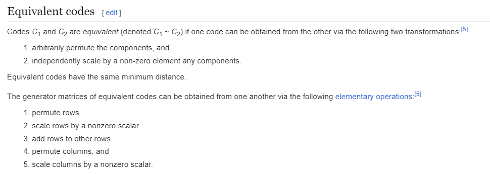

## Coding (3 Solves, 999 Pts)

`server.py`
```py
from secrets import randbelow
from numpy.linalg import matrix_rank
import numpy as np

FLAG = 'REDACTED'
n = 100
k = int(n * 2) # 200
threshold = 0.05
M = []

def matrix_to_bits(G):
    return "".join([str(x) for x in G.flatten()])

def bits_to_matrix(s):
    assert len(s) == n * k
    return np.array([[int(s[i * k + j]) for j in range(k)] for i in range(n)]) % 2

def setupMatrix(G):
    assert G.shape == (n, k)
    global M
    perm = np.array([i for i in range(k)])
    np.random.shuffle(perm)
    PermMatrix = []
    for i in range(k):
        row = [0 for _ in range(k)]
        row[perm[i]] = 1
        PermMatrix.append(row)
    PermMatrix = np.array(PermMatrix) # elementary row matrix where its just shuffled identity
    while True:
        S = np.array([[randbelow(2) for _ in range(n)] for i in range(n)])        
        if matrix_rank(S) == n:
            break
    M = (S @ G @ PermMatrix) % 2

def initialize():
    G = np.array([[randbelow(2) for _ in range(k)] for i in range(n)])
    setupMatrix(G)

def encrypt(m):
    original = (m @ M) % 2
    noise = [0 for _ in range(k)]
    for i in range(k):
        if randbelow(1000) < threshold * 1000: # < 50
            noise[i] = 1
            print(f'Error at bit {i}')
    noise = np.array(noise)
    ciphertext = (original + noise) % 2
    return ciphertext

initialize()
print("M:", matrix_to_bits(M))

while True:
    '''
    0. Exit
    1. Set Matrix
    2. Encrypt (You can do this yourself honestly)
    3. Challenge
    '''
    option = int(input("Option: "))
    if (option == 0):
        exit(0)
    elif (option == 1):
        G = bits_to_matrix(input("G: ").strip()) % 2
        setupMatrix(G)
        print("M:", matrix_to_bits(M))
    elif (option == 2):
        m = np.array([randbelow(2) for _ in range(n)])
        print("m:", matrix_to_bits(m))
        print("c:", matrix_to_bits(encrypt(m)))
    elif (option == 3):
        count = 0
        for _ in range(200):
            print("Attempt:", _)
            challenge = np.array([randbelow(2) for _ in range(n)])
            check_arr = []
            print("c:", matrix_to_bits(encrypt(challenge)))
            for i in range(20):
                check = input("challenge: ").strip()
                check_arr.append(check)
            if matrix_to_bits(challenge) in check_arr:
                count += 1
                print("Correct!")
            else:
                print("Incorrect!")
        print(f"You got {count} out of 200")
        if (count >= 120):
            print("flag:", FLAG)
        else:
            print("Failed")
        exit(0)
    else:
        print("Invalid option")
```

### The McEliece Cryptosystem
---

Looking at `setupMatrix()` we clearly notice that this is based off of the McEliece Cryptosystem, a post quantum cryptographic protocol that uses error-correction among linear code to encrypt data.

Here's a quick rundown on what McEliece does (thanks Wikipedia),


Let's deal with some of the more...odd terms and phrases in here. A `linear code` is an error-correcting code for which any linear combination of codewords is also a codeword. I'm not quite sure what exactly IS a linear code, but there's algorithms available that perform error correction, i.e. given some data that's encoded with said algorithm in mind, attempts to find errors and correct them.

These algorithms, such as `Low Density Parity-Check Codes`, `Hamming Codes`, `Reed-Solomon Codes` etc. can have information on how data can be encoded with them in the form of `generator matrices` `G`, which we see in the `Key Generation` segment above. This plays a key role in that the main idea behind McEliece is to add a bunch of errors to the ciphertext, thus only one who knows `G` or the algorithm that it is based off `A` can detect, remove the errors and successfully decode the message.

This is followed with two other matrices, a `non-singular` matrix `S` and a `permutation` matrix `P`. `non-singular` means that `S` has an inverse to it, which is required for decryption. `S` leverages matrix multiplication as a way to confuse the generator matrix `G` and prevent one from easily recovering it.

`P` takes the form of an identity matrix but its rows (or columns) shuffled, and essentially swaps the columns of `S*G`. It also further confuses `G` and hampers attempts to recover it, but it does so to a lesser extent for the decryption. You can derive this nature of `P` by doing standard matrix multiplication and observing any matrix `M` and its `M*P` product.

An interesting property of `generating matrices` is as follows: (https://en.wikipedia.org/wiki/Generator_matrix)



Because `S` is `non-singular`, linear algebra theory indicates that we can express `S` as a sequence of elementary row operations of type I, II and III, which correspond to the first 3 elementary operations stated. Thus `S*G` would be an equivalent code to `G`. Also, as `P` is just a bunch of type I elementary row operations, `SGP` would be equivalent to that of `G`.

This enables `SGP` to act as a generating matrix of its own for error correction algorithms to apply, whilst maintaining certain diffusion/confusion properties.

Being able to use error correction algorithm is where encryption lies in, where a random error vector is added onto the message `m*(SGP)`, with `m` as the message vector. In order to decrypt it, one needs to first remove `P` by computing its inverse (`P` is made up of elementary row matrices and is thus non-singular), apply the error correction algorithm using the parity matrix constructed from `G`, thus recovering `m*S` from `m*(SG) + z*P` where `z` is the error vector. Multiplying `m*S` by the inverse of `S` is the final step to recover `m`. Since removing the error applies on `z*P`, in order to ensure the weight of each error in `z` is the same, `P` is merely a shuffled identity matrix instead of that in `S`, since to obtain `S` from `P` one will have to produce multiple elementary row operations similar to type III, which would potentially make some noise/errors affect the resulting data more than other.

Among known attacks for McElice are `structural attacks`, where being able to recover the linear code structure or the efficient error decoding algorithm could enable one to break the system.

Which...looking at `server.py`, we are able to freely replace `G` with any valid matrix that we can come up with! It seems that all we need is to write a custom `G` such that we can successfully decrypt the encrypted ciphertext about 60% of the time.

My upsolve took inspiration from creator `mechfrog88`'s solution, which was to use `Low Density Parity Check (LDPC)` as the error correction algorithm for `G`. The next section will attempt to cover it in further detail.

### Low-Density Pairty-Check Codes
---

(see https://en.wikipedia.org/wiki/Low-density_parity-check_code)

Low-Density Parity-Check code is a linear error correcting code that uses iterative belief propagation techniques to decode error codes in linear time relative to the block length. This is done via a sparse Tanner graph. I'll be using the example provided from wikipedia and expand further upon it.

Consider the following bipartite graph:


The `equal` signs can be ignored here, and our primary focus is the `+` operators at the bottom. What matters here is that a data is considered to be valid if and only if, all inputs going to each `+` operator adds up to `0`, modulo 2. In this case, the left `+` is `1+0+1+0`, middle `1+0+1`, and right `1+0+1` which are all `0`s, indicating that the input codeword above is valid. The inherent idea is that with multiple of these `+` operators that takes in various input bits, it would be less probable for errors to the original codeword to produce another correct codeword.

In this example, this configuration that takes in 6 bits and we can express this in a `parity-check matrix` by having the ith row indicate which bits are being fed into the ith `+`, as follow:

```
1 1 1 1 0 0
0 0 1 1 0 1
1 0 0 1 1 0
```

After which a bunch of elementary row operations can be done to it to obtain an equivalent `parity check matrix` and `generator matrix` that maintains the same error correction, as we see under the "Equivalent Codes" section above. My research implies that the `generator matrix` needs to be of a certain form `[I | P]` where `I` is an identity matrix, thus we'll have to make said row operations to "change" the matrix accordingly. Note that a `generator matrix` has a specific `parity check matrix` pair, thus we can modify the current one to one whose `generator` pair satisfies such a form.

Allegedly, (and I don't quite have a way to prove this), because there are `3` unique `+`s, and each bit only takes two values (1 or 0), our Tanner graph would have exactly `2^3 = 8` unique codewords that satisfy all 3 `+` properties, where each codeword is of length `6` bits. In the context of the challenge, since the server side expects a generator matrix `G` of `100` rows of `200` variables, it is implied that the Tanner graph that we would generate must involve `200` unique bits, and `100` unique `+` combinations whose parities should add up to `0`. By the alleged assumption, our Tanner graph would have `2^100` possible codeword values, where given any vector `v` of 100 0/1s, `v * G` where `G` is our `generator matrix` should give a unique codeword.

We see this in the server side encryption, in `encrypt()`

```py
def encrypt(m):
    original = (m @ M) % 2

    noise = [0 for _ in range(k)]
    for i in range(k):
        if randbelow(1000) < threshold * 1000: # < 50
            noise[i] = 1
            print(f'Error at bit {i}')

    noise = np.array(noise)

    ciphertext = (original + noise) % 2
    return ciphertext
```

where `(m @ M) % 2` produces a valid distinct codeword. Notice that while `M` is our McEliece `SGP`, because `S` and `P` are all elementary row operations, `SGP` is equivalent to `G` and our generator matrix, and so it presumably retains the codeword properties to that of `G`.

Then we notice that `encrypt()` adds a noise vector that would flip some bits in the derived codeword, producing an output vector that when parsed into our `+` checkers in the original tanner graph, gives errors. The probability that the errors result in a completely valid codeword would most likely be around `2^100 / 2^200`, but this mainly stems from my own intuition and might be inaccurate.

This is where `LDPC`'s error detection and correction comes in. Because some of the `+` checkers are not satisfied, `LDPC` uses a soft decision type message-passing algorithm, such as a `sum-product` algorithm.

This algorithm first calculates the probability of each bit being `1` or `0` based on the probabilities of its neighboring bits and the parity-check `+` equations. Then, in many passes through the `200` bits it iteratively updates the probabilities of each bit until it converges to a solution where all parity-check equations are satisfied. If the majority of the messages received by a bit node are different from its received value, the bit node flips its current value (`1` to `0` or vice versa). This process is repeated until all parity-check equations are satisfied, indicating that a valid codeword has been found.

I don't have a complete understanding of what goes on internally, but this is what I've found to be a descriptor of what the `LDPC` does with error detection and correction.

Presumably, with enough iterations it should find a set of bit probabilities where all of the `+` equations are satisfied, and returns it. There will definitely exist some room of error where the final codeword is different from our original codeword, but with regards to the ctf challenge we'll assume that the chance of it returning the correct `m @ M` value is more than enough to pass.

Provided we obtain the correct `m @ M` value, since `server.py` provides us `M`, we can then compute `M.solve_left(m @ M)` to recover our original `m` value!

### A First Attempt at LDPC
---

Lets code a sample decoder and test to see how reliable it is!

A quick google search reveals an existing python library implementing the LDPC algorithm, https://pypi.org/project/ldpc/. Fortunately it comes with documentation which we use for our test code.

Firstly, we need to generate our own Tanner graph. I figured that each `+` feeder should first cumulatively cover ALL `200` bits, while also sharing similar bits with each other. This mainly came from my analysis of how `LDPC` works on bit erasure (which doesn't quite fit the context of the challenge) and how it seems intuitive that having multiple `+` parity checkers involving the same bit probably increases the odds of the error correction finding the right value for it.

```py
from sage.all import GF, Matrix, vector, LinearCode, ZZ
from ldpc import bp_decoder, code_util
from random import shuffle, choice
from tqdm import trange
import numpy as np

n = 100
k = 200
threshold = 0.05

def smart_shuffle(k, x):
    global touched, untouched, Tset
    """
    Given an array of length k all zeroes
    and x indexes to choose, smartly chooses indexes that aren't chosen yet
    else, randomly picks x values to be 1, making sure its not in the existing set
    touched - indexes already represented / chosen
    untouched - indexes not yet represented / chosen
    Tset - set of all tt values used thus far
    """
    if not untouched:
        tt = [1] * x + [0] * (k-x)
        while str(tt) in Tset:
            shuffle(tt)
        return tt

    tt = [0] * k
    if not touched:
        for _ in range(x):
            val = choice(untouched)
            tt[val] = 1
            touched.append(val)
            untouched.remove(val)
        return tt

    for _ in range(x//2):
        if not untouched:
            val = choice(touched)
        else:
            val = choice(untouched)
            untouched.remove(val)
        tt[val] = 1
        touched.append(val)
    for _ in range(x-(x//2)):
        val = choice(touched)
        tt[val] = 1
    return tt

# generate tanner graph
num_nodes = 6
# every check or row in the tanner graph involves 6 bits adding up to 0 mod 2
# Testing 5 and 7 seem to give more inaccurate results here

T = []
untouched = list(range(k))
touched = []
Tset = set()
for _ in range(n):
    Trow = smart_shuffle(k,num_nodes)
    Tset.add(str(Trow))
    T.append(Trow)
T = np.array(T)
```
This code segment essentially produces a Tanner graph for `LDPC` to work on. We use the `ldpc.code_util` to get our generator matrix `G`,
```py
# convert tanner graph to a generator matrix for ldpe
G = code_util.construct_generator_matrix(T)
```

And then test it out with a random generated `SGP` and simulate it against a bunch of results as shown. We use sagemath's `LinearCode()` object to obtain our `parity_check_matrix()` to use in our `ldpc.bp_decoder`
```py
from secrets import randbelow
def setupMatrix(G): # taken roughly from server.py
    assert G.shape == (n, k)
    perm = np.array([i for i in range(k)])
    np.random.shuffle(perm)
    PermMatrix = []
    for i in range(k):
        row = [0 for _ in range(k)]
        row[perm[i]] = 1
        PermMatrix.append(row)
    PermMatrix = np.array(PermMatrix)
    while True:
        S = np.array([[randbelow(2) for _ in range(n)] for i in range(n)])
        if np.linalg.matrix_rank(S) == n:
            break
    M = (S @ G @ PermMatrix) % 2
    return M

M = setupMatrix(G) # our SGP
Msage = Matrix(GF(2), M)
linearCodeM = LinearCode(Msage)
parityMatrix = linearCodeM.parity_check_matrix()
```

We then initialise our error correction algorithm with `ldpc.bp_decoder` and test run it with say, 50 tests.
```py
# Initialise our error correction algorithm
bpd = bp_decoder(
    parityMatrix.numpy(dtype=int),
    error_rate=threshold,
    max_iter = 10000,
    bp_method = "ps" # ps (product_sum), ms (min_sum), msl (min_sum_log)
                     # all of these seem to have similar results
)

print("Interacting 50 times...")
NTRIES = 50
d = {}

for _ in range(NTRIES):

    # simulate server challenge round
    challenge = np.array([randbelow(2) for _ in range(n)])
    original = (challenge @ M) % 2
    assert vector(GF(2), challenge) * Msage == vector(GF(2), original)

    noise = [0 for _ in range(k)]
    for i in range(k):
        if randbelow(1000) < threshold * 1000:
            noise[i] = 1
    noise = np.array(noise)
    ctxt = (original + noise) % 2

    error_corrected = bpd.decode(ctxt)
    score = sum(i!=j for i,j in zip(original, error_corrected))
    if score in d: d[score] += 1
    else: d[score] = 1

    # attempt to decrypt ciphertext challenge
    if score <= 3:
        try:
            ans = Msage.solve_left(vector(GF(2), error_corrected))
            ans_score = sum(i!=j for i,j in zip(ans, challenge))
            print(f"Round {_}, score {score}, ans score {ans_score}" )
        except Exception: # solve_left() gave no solutions
            print(f"Round {_}, score {score}, failed" )

for score_min in range(0,5):
    print(score_min, sum(d[i] for i in range(score_min+1)))
    # prints number of values with score <= score_min
```

```
Interacting 50 times...
Round 0, score 2, failed.
Round 10, score 1, failed.
Round 17, score 3, failed.
Round 22, score 1, failed.
Round 26, score 3, failed.
Round 29, score 0, ans score 0
Round 42, score 3, failed.
0 1
1 3
2 4
3 7
```
Well, this is not so good. Our ldpc seems to fail to correct the errors that we need.

### Improving Our Error Correction
---

Upon doing a bit more research, I found that error correction codes such as `LDPC` work better on sparser graphs, as sparse graphs are what Tanner graphs are also based upon. A graph is sparser when there are generally more `0`s in the graph than other elements, and not only does this increase the accuracy of `LDPC`, but it also makes the algorithm run much faster.

`parityMatrix` was the matrix fed into the `ldpc.bp_decoder()`. In order to made it more sparse, the matrix row vectors would have to be smaller in magnitude. Reducing the size of the basis of the matrix led me to use the renowned `LLL` lattice reduction algorithm which outputs a much shorter, reduced basis.

```py
nzeroes = lambda M : sum(j==0 for i in M for j in i) # number of zeroes / how sparse the matrix is
print(nzeroes(parityMatrix)) # around 16.4k
parityMatrix = parityMatrix.change_ring(ZZ).LLL().change_ring(GF(2))
print(nzeroes(parityMatrix)) # around 18.4k
```
`'sage.matrix.matrix_mod2_dense.Matrix_mod2_dense' object has no attribute 'LLL'` is triggered when we try to call `.LLL()` on `parityMatrix` right away, so we change it to integers / `ZZ` before changing it back to `GF(2)` once we obtain the reduced matrix.

```
16531
18427
Interacting 50 times...
Round 0, score 0, ans score 52
Round 1, score 0, ans score 0
Round 3, score 0, ans score 52
Round 4, score 1, failed.
Round 5, score 0, ans score 0
Round 6, score 0, ans score 52
Round 7, score 0, ans score 0
Round 8, score 0, ans score 0
Round 10, score 0, ans score 52
Round 13, score 0, ans score 0
Round 14, score 0, ans score 52
Round 15, score 0, ans score 0
Round 16, score 1, failed.
Round 18, score 0, ans score 52
Round 19, score 0, ans score 0
Round 21, score 1, failed.
Round 22, score 2, failed.
Round 24, score 0, ans score 0
Round 25, score 0, ans score 0
Round 29, score 0, ans score 0
Round 30, score 0, ans score 52
Round 31, score 0, ans score 0
Round 33, score 3, ans score 43
Round 35, score 0, ans score 52
Round 36, score 0, ans score 52
Round 37, score 0, ans score 0
Round 38, score 0, ans score 0
Round 42, score 0, ans score 52
Round 44, score 0, ans score 52
Round 45, score 0, ans score 52
Round 46, score 0, ans score 0
Round 47, score 0, ans score 52
Round 49, score 0, ans score 0
0 28
1 31
2 32
3 33
4 33
```

As we can see, our `parityMatrix` has 2000 more zeroes, and `ldpc` runs a lot more faster. Moreover, we get more accurate `ldpc.bp_decode()` outputs, allowing us to reach the `120/200` accuracy so long as we can afford to deal with one or two errors!

Accounting for our errors is also relatively simple. Our current solve script essentially does the following:

```
Given:
S*G*P
m * (S*G*P) + z (where z is an error value)

Does error correction directly onto m*(S*G*P) (we can do this because we control G and thus know the error correction algorithm), which in theory recovers m*(S*G*P), despite there being 1-2 possible errors.
```

Since `S*G*P` can be considered as a generator matrix, `m*(S*G*P)` should evaluate into one of the many codewords. Suppose our `bp_decoder()` output is some `x = m*(S*G*P) + r` for some error vector `r` of little weight. (weight in this case refers to the number of wrong elements that differentiate `x` from `m*(S*G*P)`).

The `parityMatrix` or parity-check matrix obeys a property where `parityMatrix * c` for some vector `c` is `{0,0,...,0}` if `c` is a valid codeword. We know that `m*(S*G*P)` would be a valid codeword thus,

```
parityMatrix * x == parityMatrix * (m*(S*G*P)) + parityMatrix * r
                 == {0,0,....,0} + parityMatrix * r
                 == parityMatrix * r
```

So, if we were to accomodate for possible one or two errors left from our `bp_decoder()` algorithm, given output `x`, we perform `parityMatrix * x` and see if it matches any known error vectors `r`. We can pre-initialise some lookup table that takes all possible `r` vectors of weight `1` and `2`, computes `parityMatrix * r` and stores them as such:

```py
lookup = {}

# weight 0
error = vector(GF(2), [0]*k)
key = tuple(list(parityMatrix * error))
lookup[key] = [error]

# weights 1 and 2
from tqdm import trange
for i in trange(k-1):
    for j in range(i,k):
        error = vector(GF(2), [i==h or j==h for h in range(k)])
        key = tuple(list(parityMatrix * error))
        if key in lookup: lookup[key].append(error)
        else: lookup[key] = [error]
```
Note we use `tuple(list(sage_matrix))` as `tuples` are hashable, a property which python dictionaries require for their keys.

Then, since the lookup matches each `parityMatrix*r` to its `r` vector, we can determine from a given `bp_decoder()` output how far away it is from the original `m*(S*G*P)`, and thus recover `m*(S*G*P)` consistently even if there were `1` or `2` errors from the output!

We introduce this lookup and obtain output as follows:
```py
for _ in range(NTRIES):
    ...
    # convert error_corrected from numpy to sagemath vector!
    # on hindsight i should've just done everything in numpy, but i laze to change code soz
    error_key = tuple(list(parityMatrix * vector(GF(2), error_corrected)))
    if error_key not in lookup: # error is too much / far
        print(f"Round {_}, error score too high")
        continue

    for error_vector in lookup[error_key]: 
        # interestingly, lookup[error_key] can contain multiple possible error_vectors. Looking back at server.py it appears thats why we can enter 20 possible attempts for each challenge.
        try:
            ans = Msage.solve_left(vector(GF(2), error_corrected + error_vector))
            ans_score = sum(i!=j for i,j in zip(ans, challenge))
            print(f"Round {_}, score {score}, ans score {ans_score}" )
            if ans_score == 0:
                right_guesses += 1
                break
        except Exception: # solve_left() gave no solutions
            print(f"Round {_}, score {score}, failed.")

print(f"Right guesses: {right_guesses}")
```
```s
...
Round 44, score 0, ans score 51
Round 44, score 0, ans score 50
Round 44, score 0, ans score 46
Round 44, score 0, ans score 50
Round 44, score 0, ans score 53
Round 44, score 0, ans score 56
Round 44, score 0, ans score 61
Round 44, score 0, ans score 51
Round 45, score 2, ans score 56
Round 45, score 2, ans score 48
Round 45, score 2, ans score 51
Round 45, score 2, ans score 61
Round 46, score 0, ans score 51
Round 46, score 0, ans score 50
Round 46, score 0, ans score 46
Round 46, score 0, ans score 50
Round 46, score 0, ans score 53
Round 46, score 0, ans score 56
Round 46, score 0, ans score 61
Round 46, score 0, ans score 51
Round 47, score 5, ans score 51
Round 47, score 5, ans score 50
Round 47, score 5, ans score 52
Round 47, score 5, ans score 46
Round 47, score 5, ans score 45
Round 47, score 5, ans score 56
Round 47, score 5, ans score 49
Round 47, score 5, ans score 49
Round 48, error score too high
Round 49, score 2, ans score 43
Round 49, score 2, ans score 43
Round 49, score 2, ans score 52
Round 49, score 2, ans score 44
Round 49, score 2, ans score 0
Right guesses: 15
0 17
1 26
2 29
3 31
4 31
```

There's much more rounds being printed where we attempt to obtain `m` from our `m*(S*G*P)`s, and we notice how we were able to, in the case of `Round 49`, obtain the right vector `m` with `ans score 0` despite our `bp_decoder()` being wrong by 2 errors; The `parityMatrix` lookup is working!

Yet, there are still cases where even though `bp_decoder()` gives an output without any errors from `m*(S*G*P)`, we still never obtain the right `m` from `m*(S*G*P)`!

Consider finding `m` from `m*M`, where `M` is some matrix. Observe that when `M` has a lower matrix rank than its minimum dimension (i'd recommend checking out my writeup for `crypto_prg` which attempts to explain what a `rank` of a matrix is), there wind up being about `2^(dimension-rank)` possible solutions for `m`. In this challenge, what we are looking for is cases where `m*M` will always imply a single unique `m` output that we can acquire! Naturally, this is where we need our `M` to be full ranked.

Thus, way way back in `setupMatrix()`, we modify our test code to continuously output `S*G*P` until it finds one that is of rank 100. That way, any corrected `m*(S*G*P)` output will always have a single distinct `m` solution vector!

```py
while True:
    M = setupMatrix(G) # our SGP
    Msage = Matrix(GF(2), M)
    if Msage.rank() == n:
        break
```
```
...
Round 46, score 17, ans score 51
Round 46, score 17, ans score 48
Round 47, score 0, ans score 0
Round 48, error score too high
Round 49, score 1, ans score 47
Round 49, score 1, ans score 0
Right guesses: 31
0 15
1 28
2 31
3 33
4 34
```
And as we can see, we recover `m` in the same number of cases whose `bp_decoder()` output gives errors up to 2! We can easily consistently reach the `120/200` solve rate now. All we have to do is the format our code to connect to the server and solve!

### Solve Script
---
```py
from sage.all import GF, Matrix, vector, LinearCode, ZZ
from ldpc import bp_decoder, code_util
from random import shuffle, choice
import numpy as np

def matrix_to_bits(G):
    return "".join([str(x) for x in G.flatten()])

def bits_to_matrix(s):
    assert len(s) == n*k
    return np.array([[int(s[i * k + j]) for j in range(k)] for i in range(n)]) % 2

n = 100
k = 200
threshold = 0.05

def smart_shuffle(k, x):
    global touched, untouched, Tset
    if not untouched:
        tt = [1] * x + [0] * (k-x)
        while str(tt) in Tset:
            shuffle(tt)
        return tt
    tt = [0] * k
    if not touched:
        for _ in range(x):
            val = choice(untouched)
            tt[val] = 1
            touched.append(val)
            untouched.remove(val)
        return tt
    for _ in range(x//2):
        if not untouched:
            val = choice(touched)
        else:
            val = choice(untouched)
            untouched.remove(val)
        tt[val] = 1
        touched.append(val)
    for _ in range(x-(x//2)):
        val = choice(touched)
        tt[val] = 1
    return tt

num_nodes = 6
T = []
untouched = list(range(k))
touched = []
Tset = set()
for _ in range(n):
    Trow = smart_shuffle(k,num_nodes)
    Tset.add(str(Trow))
    T.append(Trow)
T = np.array(T)
G = code_util.construct_generator_matrix(T)

from pwn import remote

while True:
    r = remote('challs.nusgreyhats.org', 35103,level='debug')
    r.sendline(b'1')
    r.recvuntil(b'G: ')
    r.sendline(matrix_to_bits(G).encode())
    r.recvuntil(b'M: ')
    M = bits_to_matrix(r.recvline().rstrip().decode())
    Msage = Matrix(GF(2), M)
    Mrank = Msage.rank()
    if Mrank == min(Msage.dimensions()):
        break
    else:
        r.close()

linearCodeM = LinearCode(Msage)
parityMatrix = linearCodeM.parity_check_matrix()
parityMatrix = parityMatrix.change_ring(ZZ).LLL().change_ring(GF(2))

# Initialise our error correction algorithm
bpd = bp_decoder(
    parityMatrix.numpy(dtype=int),
    error_rate=threshold,
    max_iter = 10000,
    bp_method = "ps"
)

print("Pregenerating lookup...")

lookup = {}

# weight 0
error = vector(GF(2), [0]*k)
key = tuple(list(parityMatrix * error))
lookup[key] = [error]

# weights 1 and 2
from tqdm import trange
for i in trange(k-1):
    for j in range(i,k):
        error = vector(GF(2), [i==h or j==h for h in range(k)])
        key = tuple(list(parityMatrix * error))
        if key in lookup: lookup[key].append(error)
        else: lookup[key] = [error]

print("Interacting 200 times...")
NTRIES = 200
NGUESSES = 20

r.sendline(b'3')
for _ in trange(NTRIES):
    r.recvuntil(b'c:')
    ctxt = np.array([int(i) for i in r.recvline().rstrip().decode()])
    error_corrected = bpd.decode(ctxt)
    response = b""
    res_lines = 0
    key = tuple(list(parityMatrix * vector(GF(2), error_corrected)))
    if key in lookup:
        for error_vector in lookup[key][:NGUESSES]:
            try:
                ans = Msage.solve_left(vector(GF(2), error_corrected) + error_vector)
                response += matrix_to_bits(ans.numpy(dtype=int)).encode() + b'\n'
                res_lines += 1
            except Exception:
                pass
    while res_lines < 20:
        response += matrix_to_bits(error_corrected).encode() + b'\n'
        res_lines += 1
    r.sendline(response[:-1]) # skip the last '\n'
r.interactive()
```

```
[x] Opening connection to challs.nusgreyhats.org on port 35103
[x] Opening connection to challs.nusgreyhats.org on port 35103: Trying 35.198.239.93
[+] Opening connection to challs.nusgreyhats.org on port 35103: Done
rank 99
[*] Closed connection to challs.nusgreyhats.org port 35103
[x] Opening connection to challs.nusgreyhats.org on port 35103
[x] Opening connection to challs.nusgreyhats.org on port 35103: Trying 35.198.239.93
[+] Opening connection to challs.nusgreyhats.org on port 35103: Done
rank 100
Pregenerating lookup...
100%|█████████████████████████████████████████████████████████████████████████████████| 199/199 [00:13<00:00, 14.84it/s]
Interacting 200 times...
100%|█████████████████████████████████████████████████████████████████████████████████| 200/200 [00:28<00:00,  7.04it/s]
[*] Switching to interactive mode
challenge: challenge: challenge: challenge: challenge: challenge: challenge: challenge: challenge: challenge: challenge: challenge: challenge: challenge: challenge: challenge: challenge: challenge: challenge: challenge: Incorrect!
You got 127 out of 200
flag: grey{what_linear_code_did_you_use?_zcUQenJEv4wXNRYxB5pPkH}
[*] Got EOF while reading in interactive
^C[*] Interrupted
[*] Closed connection to challs.nusgreyhats.org port 35103
```

Solved!