## Mazeware (2 Solves, 1000 Pts, 🩸)

In Reverse Engineering there's generally two ways of analysis; Static analysis, where one just analyses source code, and Dynamic analysis, where with the help of tools one can run a program to some defined point. Dynamic analysis in particular is super helpful as we get to see what a program or executable does in each and every step of the analysis. This writeup covers my solution to `Mazeware` and how I was able to achieve this through `IDA` and a bunch of breakpoint debugging.

This writeup is broken up into 3 sections.

- [A Cursory Glance](#a-cursory-glance), where we generally make sense of the executable and note anything out of the ordinary
- [The Hidden Path](#the-hidden-path), where we spot a strange lead from our notes
- [Shifting Walls](#shifting-walls), as we pursue said lead and learn of this maze's self-changing property
- [Tunnel's End](#tunnels-end), where we eventually find the metaphorical light / flag at the end of this ever-changing labyrinth!

## A Cursory Glance

Let's start by playing around with it. Launching it on a Linux VM we notice a Banner;

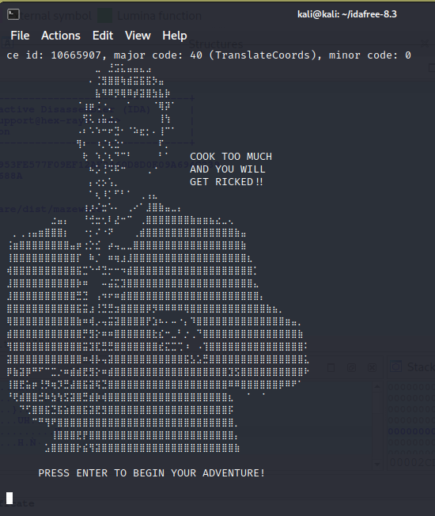

Followed by our first maze! It appears we can use `WASD` to navigate our character, a `^`, through a maze of `#`s and `' '`s until we reach a destination `F`!

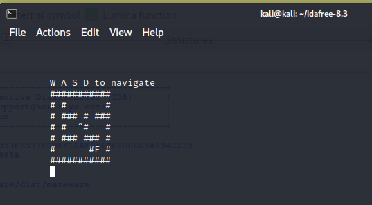

The second maze is no different either.

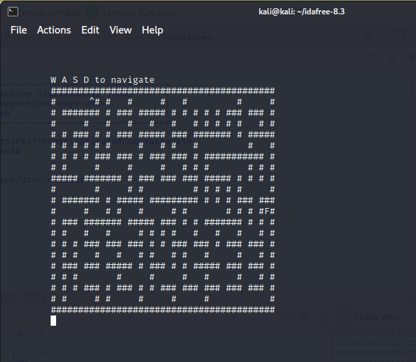

And then the third....huh. We're left with an impossible maze. Let's start by analysing the executable.

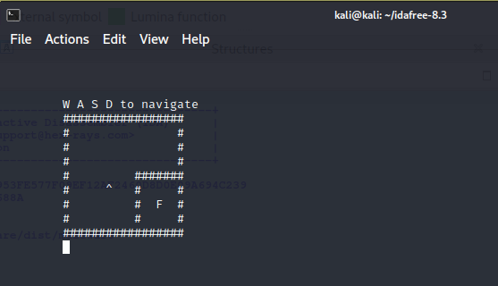

### main
---
Opening up the executable we see that on the surface level its a maze simulator. `main()` loads `offset_4041C0` that we later see is used in `_printf()` to print a standard intro banner of sorts.

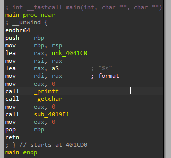

`sub_4019E1()` is then called after one `_getchar()`.

### sub_4019E1 / maze_main
---
```cpp
void maze_main()
{
  unsigned __int8 x_coord; // [rsp+5h] [rbp-Bh]
  unsigned __int8 y_coord; // [rsp+6h] [rbp-Ah]
  unsigned __int8 input_char; // [rsp+7h] [rbp-9h]
  unsigned __int8 v3; // [rsp+7h] [rbp-9h]
  char v4; // [rsp+7h] [rbp-9h]
  int nrounds; // [rsp+8h] [rbp-8h]

  for ( nrounds = 0; nrounds <= 2; nrounds = 4 )
  {
    do
    {
      x_coord = (unsigned __int16)sub_401704((__int16 *)mazeData[nrounds]) >> 8;
      y_coord = sub_401704((__int16 *)mazeData[nrounds]) & 0xF;
      sub_4017CD(mazeData[nrounds], x_coord, y_coord);
      do
      {
        input_char = getchar();
        if ( input_char > '`' )
          input_char -= 32;
        if ( input_char > '@' )
        {
          v3 = input_char - 'A';
          if ( v3 )
          {
            if ( v3 / 3u - v3 % 3u == 1 )
            {
              if ( sub_40173D((unsigned __int8 *)mazeData[nrounds], x_coord + 1, y_coord) )// D
                ++x_coord;
            }
            else
            {
              v4 = v3 - 18;
              if ( v4 )                         // W
              {
                if ( v4 == 4 && sub_40173D((unsigned __int8 *)mazeData[nrounds], x_coord, y_coord - 1) )
                  --y_coord;
              }
              else if ( sub_40173D((unsigned __int8 *)mazeData[nrounds], x_coord, y_coord + 1) )// S
              {
                ++y_coord;
              }
            }
          }
          else if ( sub_40173D((unsigned __int8 *)mazeData[nrounds], x_coord - 1, y_coord) )
          {
            --x_coord;                          // A
          }
        }
      }
      while ( !(unsigned int)sub_4017CD(mazeData[nrounds], x_coord, y_coord) );
      printf("\n\tNext level? Enter to continue...");
      getchar();
      getchar();
      ++nrounds;
    }
    while ( nrounds != 3 );
    sub_40147C();
  }
}
```

We observe a while loop that goes up to 3, as well as a `do-while` within that repeatedly gets user input. Quick intuition reveals that the user input keys most relevant to this are `WASD`, which is followed by a `sub_40173D()` call and then modifying a variable by `+-1`. It becomes super apparent that the variables are x and y coordinates, with `sub_4017CD()` checking for a collision and `sub_401704()` loading the x and y starting coordinates for a given maze. Its very much implied that we can solve each maze, which brings us to the next level and increments `nrounds` by 1. Once `nrounds == 3`, `sub_40147C()` is called.

There is something peculiar with this, however. Notice that `mazeData[nrounds]` is used to determine which maze is being printed. Looking into the global `mazeData` variable we observe

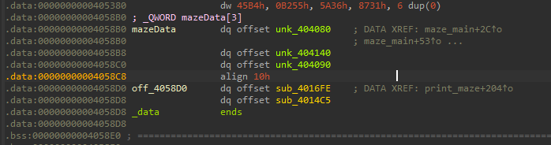

Which is odd, considering there's 2 more entries below. Yet `nrounds` would only reach `3`, and the highest that we'd go is `mazeData[2]`!

We'll note this anomaly at the back of our mind and move on.

```
Anomaly 1: Additional data entries beneath mazeData, addresses 0x4058D0 and 0x4058D8 containing values 0x4016FE and 0x4014C5
```

We also see `sub_4017CD()` being called before and within each iteration of the `do-while`. We'll delve into this later. But first, let's see what our reward is at the end...

### sub_40147C / win_func

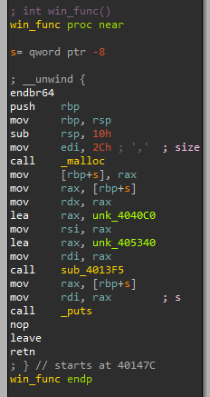

`sub_40147C()` seems relatively simple, calling `sub_40143F5()` which writes something into `s` that it then calls `puts()` on, printing it onto stdout.

`sub_4013F5()` is a bit more complicated, but IDA's decompiled pseudocode gives us all that we need.

```cpp
__int64 __fastcall sub_4013F5(__int64 key_array, __int64 ciphertext_array, __int64 output_array)
{
  char keystream_out[264]; // [rsp+20h] [rbp-110h] BYREF
  unsigned __int64 v6; // [rsp+128h] [rbp-8h]

  v6 = __readfsqword(0x28u);
  sub_40122E((const char *)key_array, (__int64)keystream_out);
  sub_4012FB((__int64)keystream_out, (const char *)ciphertext_array, output_array);
  return 0LL;
}

__int64 __fastcall sub_40122E(const char *key_array, char *keystream_buffer)
{
  int v3; // [rsp+10h] [rbp-10h]
  int i; // [rsp+14h] [rbp-Ch]
  int j; // [rsp+18h] [rbp-8h]
  int v6; // [rsp+1Ch] [rbp-4h]

  v6 = strlen(key_array);
  LOBYTE(v3) = 0;
  for ( i = 0; i <= 255; ++i )
    keystream_buffer[i] = i;
  for ( j = 0; j <= 255; ++j )
  {
    v3 = (unsigned __int8)(keystream_buffer[j] + v3 + key_array[j % v6]);
    sub_4011F6(&keystream_buffer[j], &keystream_buffer[v3]);
  }
  return 0LL;
}

__int64 __fastcall sub_4012FB(char *keystream_buffer, const char *ciphertext_array, char *output_array)
{
  int i; // [rsp+24h] [rbp-1Ch]
  int j; // [rsp+28h] [rbp-18h]
  size_t ptr; // [rsp+30h] [rbp-10h]
  size_t ciphertext_length; // [rsp+38h] [rbp-8h]

  LOBYTE(i) = 0;
  LOBYTE(j) = 0;
  ptr = 0LL;
  ciphertext_length = strlen(ciphertext_array);
  while ( ptr < ciphertext_length )
  {
    i = (unsigned __int8)(i + 1);
    j = (unsigned __int8)(keystream_buffer[i] + j);
    sub_4011F6(&keystream_buffer[i], &keystream_buffer[j]);
    output_array[ptr] = keystream_buffer[(unsigned __int8)(keystream_buffer[i] + keystream_buffer[j])] ^ ciphertext_array[ptr];
    ++ptr;
  }
  return 0LL;
}
```

`sub_4013F5()` is very reminsicient of a popular decryption algorithm, `RC4`. It takes in a `key[]` array, ciphertext `ct[]` array, then from the key runs a key scheduling algorithm which we see in `sub_40122E()`. Then, in the actual decryption function `sub_4012FB()` it generates a keystream which it uses to xor with the ciphertext to obtain some `pt[]` array.

Let's try and run this right away to see what we get! We quickly simulate this with python, get `unk_4040C0` as our ciphertext and `unk_405340` as our key.

We notice an interesting anomaly as we head to `unk_405340` however. As we can see,
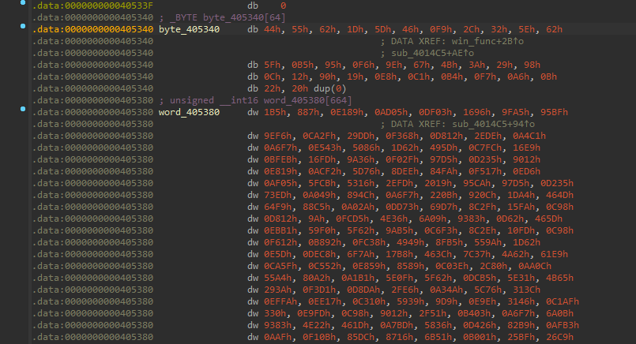

There exists an entire 664-length word buffer in `word_405380`! This doesnt seem related to what we have found at all, but for time being let us leave this in the back of our mind.

```
Anomaly 2: Strange unused massive buffer right after the 64-byte key array, address 0x405380
```

```py
from Crypto.Cipher import ARC4

key = bytes.fromhex("4455621D5D46F92C325E625FB595F69E674B3A29980C129019E8C1B4F7A60B22")
ct = bytes.fromhex("8BF24A8B9EEB29E637F0B3F4B9BE1F1753E32F4B4E6706CF06CA84E1BB0B383EC58CC9A8721D3CBBBE26B8")

cipher = ARC4.new(key=key)
print(cipher.decrypt(ct)) # b'https://www.youtube.com/watch?v=dQw4w9WgXcQ'
```

...hm. Something's off here. This decrypts to the Youtube link to Rick Astley's hit song Never Gonna Give You Up! It's clearly not the flag.

Seeing that there's so much more left in the binary to dissect, it is more likely that at some point some modification is made, be it to either the key or the ciphertext. Going back to `maze_main()`, `sub_4017CD()` has yet to be reversed. Let's take a look at it and proceed from there.

## The Hidden Path

Taking a glance at `sub_4017CD()`...

### sub_4017CD / print_maze
```cpp
__int64 __fastcall print_maze(char *mazeData, int x_coord, int y_coord)
{
  int v5; // [rsp+4h] [rbp-3Ch]
  int v6; // [rsp+14h] [rbp-2Ch]
  int i; // [rsp+18h] [rbp-28h]
  int v8; // [rsp+1Ch] [rbp-24h]
  unsigned int v9; // [rsp+20h] [rbp-20h]
  int j; // [rsp+24h] [rbp-1Ch]
  int v11; // [rsp+30h] [rbp-10h]
  int v12; // [rsp+38h] [rbp-8h]

  v5 = x_coord;
  puts("\x1B[H\x1B[2J\n\n");
  puts("\tW A S D to navigate");
  if ( x_coord == -1 && y_coord == -1 )
  {
    y_coord = mazeData[1];
    v5 = mazeData[3];
  }
  v11 = mazeData[4];
  v6 = 0;
  for ( i = 0; i < v11; ++i )
    v6 += mazeData[5];
  v12 = v11 * *mazeData + mazeData[2];
  v8 = 0;
  v9 = 0;
  putchar(9);
  for ( j = 0; j < v6; ++j )
  {
    if ( v8 == v11 * y_coord + v5 )
    {
      if ( v8 == v12 )  v9 = 1;
      putchar('^');
    }
    else if ( v8 == v12 ) putchar('F');
    else if ( (((int)(unsigned __int8)mazeData[v8 / 8 + 6] >> (7 - v8 % 8)) & 1) != 0 ) putchar('#');
    else putchar(' ');
    if ( !(++v8 % v11) ) printf("\n\t");
  }
  return v9;
}
```

This function seems pretty simple as well. Given a maze data object, it reads it in a custom manner and then prints the maze accordingly. `^` is our player character, `F` the destination, while `#` and `' '` serve as walls and passages respectively. `\n\t`, or rather newlines, are printed when necessary to move to the next row.

This explains what we've observed when running the binary pretty well, with this function only existing to print the maze.

By this point it would seem that everything has been analysed already. All of the functions that `main()` would call, bar those that I've deemed simple enough to omit from this writeup, have been done.

### Breakthrough..?
---

What are we still missing? Clueless as to what's going on, we quickly reference our anomalies.

```
Anomaly 1: Additional data entries beneath mazeData, addresses 0x4058D0 and 0x4058D8 containing values 0x4016FE and 0x4014C5
Anomaly 2: Strange unused massive buffer right after the 64-byte key array, address 0x405380
```

Let's start with Anomaly 1. We head to the address `0x4058D0` and use IDA's xref utility to determine if the binary calls this at any point in time;
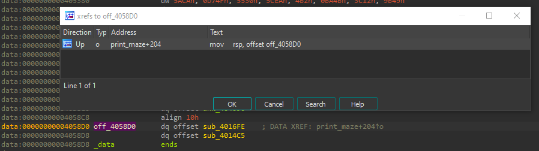

Wait...`print_maze`?! But we've just looked at it from the pseudocode. We look through the disassembly this time and spy a suspicious return call:
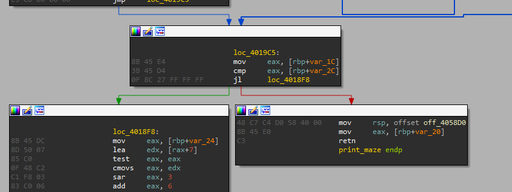

where we see 
```
mov rsp, off_4058D0
mov eax, [rbp+var_20]
retn
```
being called. The `rsp` is a stack register that is usually used to indicate where one is on the stack, and is used to tell our computer / CPU where in the binary to move it to after a `retn` or similar instruction is hit, i.e. reaching the end of the current function. 

More importantly, it also controls the `return address`, or rather the next place where the CPU will look for instructions to resume execution. Normally when you call a function `a()` in say,

```cpp
int b() {
    return 1
    }
int a() {
    return b() + 99
    }
```

Right at the end of `b()`, at the `ret` instruction the `rsp` would by default point to somewhere in `a()`, at the instruction after a `call b()` assembly instruction is made. Normally in assembly the `rsp` value is either offsetted by some integer value to bring it back, but in here we see that it is deliberately set to `off_4058D0`!

It also seems that because of how little it contributes with the rest of the code, perhaps that is why IDA's decompiler would miss out on it when generating its pseudocode output. Hence why we've missed out on this earlier.

Going back to the assembly, we see that when `ret` is called, `rsp` containing `0x4058D0` would point to `sub_4016FE`. This particular function is secretly being called after `print_maze()`!

### sub_4016FE / jump_rax
---
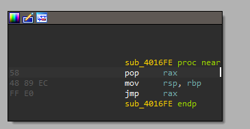

Unfortunately it seems we arrive on a dead end. `jump_rax()` basically pops the top value of the stack and places it in `rax`. It then does some movement of the `rsp` and `rbp` registers, before calling `jmp` to `rax`, meaning it begins executing its remaining instructions from the value contained in `rax` onwards.

Without access to the stack, statically we might not be able to see where it goes, unless we do a bunch more backtracking. Thus, we just allow the binary to run up to a certain point, then follow it through instruction by instruction!

We set a breakpoint right here back in `print_maze()`,
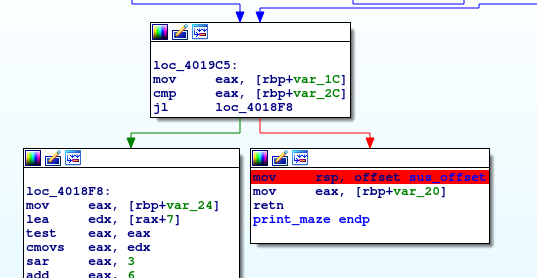

then run the executable on IDA. EVentually it halts at our breakpoint and we begin stepping over each instruction, into `jump_rax()` where see the new value of `rax` after `pop rax`;

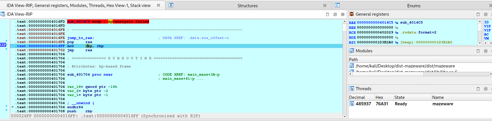

`sub_4014C5()`, the second entry in the two data entries we've found beneath `mazeData`! This resolves our first Anomaly as we see them being used.

### sub_4014C5() / secret_func

We first attempt to view this in decompiled pseudocode, and find it rather unhelpful
```cpp
// write access to const memory has been detected, the output may be wrong!
void sub_4014C5()
{
  void (*v0)(); // rbx
  _BYTE *v1; // rdi
  bool v2; // zf
  _BYTE *v3; // rsi
  __int64 v4; // rcx
  _QWORD *v5; // rbx
  __int64 i; // r9
  _QWORD *v7; // r10
  __int64 v8; // r8
  char *v9; // rdi
  __int64 v10; // rcx
  __int64 v11; // r9
  void *v12; // r10
  void (*v13)(); // rax
  __int64 (__fastcall *v14)(char *, int, int); // rax
  __int64 j; // rcx
  _QWORD v16[3]; // [rsp+0h] [rbp-28h]
  void (*v17)(); // [rsp+18h] [rbp-10h]

  v0 = (void (*)())((unsigned __int64)&printf & 0xFFFFFFFFFFFFF000LL);
  do
  {
    v0 = (void (*)())((char *)v0 + 4096);
    v1 = (char *)v0 - 1;
    v3 = (char *)v0 - 513;
    v2 = v0 == (void (*)())513;
    v4 = 512LL;
    do
    {
      if ( !v4 )
        break;
      v2 = *v3-- == *v1--;
      --v4;
    }
    while ( v2 );
  }
  while ( !v2 );
  __asm { syscall; LINUX - }
  v17 = v0;
  v5 = (_QWORD *)((char *)v0 - 4096);
  while ( 1 )
  {
    for ( i = 10LL; ; --i )
    {
      if ( !i )
      {
        v7 = v5 - 18;
        v8 = 0LL;
        v9 = (char *)&word_405380[1] + word_405380[0];
        v10 = -(__int64)word_405380[0];
        v11 = 0LL;
        while ( 1 )
        {
          *((_BYTE *)v7 + v8++) = byte_405340[v11] ^ v9[v10++];
          if ( ++v11 == 32 )
            v11 = 0LL;
          if ( !v10 )
          {
            *(_QWORD *)((char *)v7 + 78) = &getchar;
            __asm { syscall; LINUX - }
            v12 = (char *)v7 + 41;
            off_404040 = v12;
            __asm { syscall; LINUX - sys_mprotect }
            v13 = sub_4014C5;
            v17 = sub_4014C5;
            do
              v13 = (void (*)())((char *)v13 + 1);
            while ( *(_DWORD *)v13 != -98693133 );
            v16[2] = (char *)v13 - (char *)sub_4014C5;
            v14 = print_maze;
            do
              v14 = (__int64 (__fastcall *)(char *, int, int))((char *)v14 + 1);
            while ( (*(_DWORD *)v14 ^ 0xDEADBEEF) != 491649892 );
            v16[1] = 15LL;
            v16[0] = 0x52C89480A000000LL;
            for ( j = 0LL; ; ++j )
            {
              *((_BYTE *)v14 + j) ^= *((_BYTE *)v16 + j);
              if ( j == 9 )
                break;
            }
            *(_QWORD *)((char *)v14 - 7) = 0x8B90909090909090LL;
            *(_BYTE *)v17 = 0;
            __asm { retn }
          }
        }
      }
      v5 += 2;
      if ( *v5 )
        break;
    }
  }
}
```

Not only are we told that our output might be wrong, but there's a bunch of odd `__asm {}` calls scattered throughout. IDA is having problems fully visualising the code, thus we stick back to our trusted disassembler view and interpret the assembly, instruction by instruction.

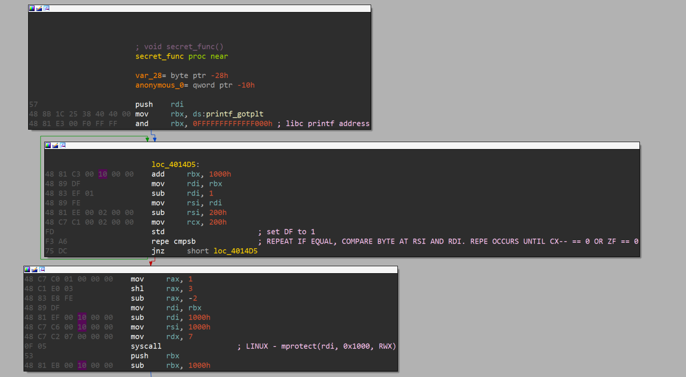

The first few instructions seem complex at first but digestable. We notice `rbx` is set to `printf`'s address in the `got.plt` section. The `got.plt` section contains links to addresses where certain functions can be found in a libc, which in this case would be the provided libc's `printf` function address. `rbx &= 0xffff...ff000`. This places us in a slightly different spot from where the `printf` originally was.

Following which, we see that `rbx` goes from its current value, to `+0x1000`, `+0x2000`, ... in some loop. At each iteration, we observe `rdi = rbx - 1`, `rsi = rdi - 0x200` and `rcx = 0x200`.

`std` is called which sets the Directional Flag `DF` to 1.

Then `repe cmpsb` is called. Let's start with `repe`, which stands for `repeat if equal`. This repeats the instruction while `rcx != 0` and the Zero
Flag `ZF = 1` 

`cmpsb` compares byte at address `DS:(E)SI` with byte at address `ES:(E)DI` and sets the status flags `(CF, OF, SF, ZF, AF, and PF)` accordingly to the result of the comparison. If the bytes aren't the same, `ZF = 0`, which would break the `repe` loop. The instruction would then end, causing `jnz` to trigger and thus bringing us back to the start.

In order for `ZF = 1` at the end, `RSI` and `RDI` must contain the same byte at all times, as `RSI` and `RDI` decrement (due to `DF` = 1) for a total of `rcx` times. This way, `repe` exits with `ZF = 1`.

And it just so happens that at that point in our libc, the data from address `rsi` to address `rdi` contain nothing but `0`s. Interestingly, not all the `0x1000` bytes are NULL, but this will be handled later.

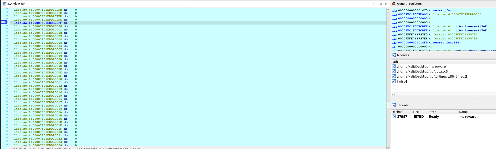

This allows us to have a completely free address space in the libc to work with. From an exploiter's point of view, if we can write our own shellcode in here, we can then run it in the binary.

And we notice it in the third box! Notice that when `syscall` is called, `rax = (1 << 3 ) - (-2) = 10`, `rdi = rbx - 0x1000`, `rsi = 0x1000` and `rdx = 7`. Looking at the syscall table (see [Syscall Table](https://chromium.googlesource.com/chromiumos/docs/+/master/constants/syscalls.md)), we find that this does:

`mprotect(rdi, 0x1000, 7)`

which sets the permissions for `0x1000` bytes starting from `rdi` to be `Read, Write, Execute`!

We move on to the next portion; While it is a bit complex, we can statically analyse and reduce this to;

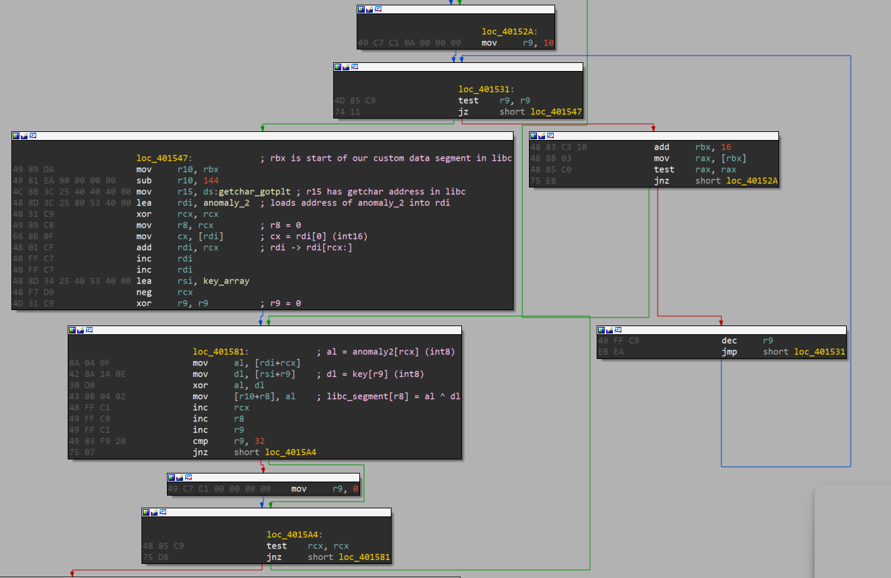

```py
rbx = ...

# Loop on the right side which goes first
while True:
  r9 = 10
  while r9:
    rbx += 16
    if rbx[0] != 0:
      break
    r9 -= 1

# loc_401547 onwards
r15 = get_char_libc_addr
rdi = anomaly_2_buffer
libc_segment_start = rbx
sz_offset = (__int16) rdi[0] # i.e. first two bytes of anomaly_2_buffer[]
anomaly2_start = rdi[sz_offset+2:]
for i in range(sz_offset):
  libc_segment_start[i] = anomaly2_start[i] ^ key_array[i % 32]
```

The first loop increments rbx / start of our mprotect() region till it reaches a bunch of NULLs; This handles the fact that the start of our mprotect() region isnt all NULLs, and moves past it.

The next segment simply takes the unknown buffer we found as Anomaly2, as well as the key array, then computes some offset from Anomaly2. It then xors the data from Anomaly2 with the key array and writes it into our mprotect() region, up till size equal to the first 2 bytes of Anomaly2.

Clearly we see that the code decrypts and writes data into this blank libc area.

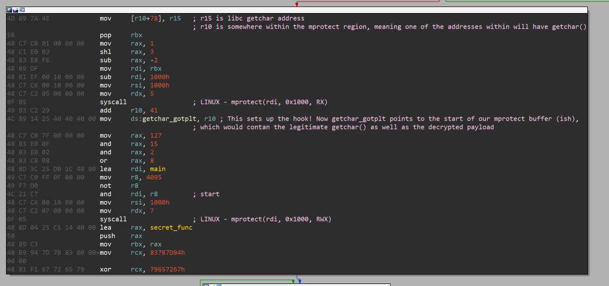

The next block shows `mprotect()` finally used to set the perms from `RWX` to just `RX`, preventing it from being writable. At the same time, `r15`, which had the `get_char` address in `libc`, is written into the `mprotect` region before it got reset to `RX`. Then we see `getchar@got.plt` changed to `r10`, or the start of our decrypted payload.

For the non pwners and revvers, the `got.plt` section is a table in a binary that contains maps. Normally when compiling a binary, it would be a pain for one to always code in the backend code for common functions like `strlen()`, `getchar()` etc. Plus, having to add such code for every binary gives each one so much more unnecessary space in our file system. 

This is where the `libc` comes in, where a libc file would contain these functions. During runtime, the `libc` will communicate with our binary and tell it where `strlen()`, `getchar()` etc. can be found within it. Our binary would then follow accordingly and update the `got.plt` table containing the `libc` addresses with the corresponding functions.

That way, our binary doesn't have to store instructions on how to execute these basic common functions, and can rely on some other file to get instructions from! This is super useful utility wise, since now instead of having to copy and paste code for `strlen()` in every binary we compile, we just need a single instance of it in a `libc` for our binaries to refer to.

In a similar vein, the same works for the `getchar` entry of the `got.plt` table. When our code wants to call `getchar()`, it looks for it in `got.plt` which would by right point to the libc's location of `getchar`.

However, due to the assembvly code above, when our binary calls `getchar()`, `got.plt` points towards the malicious payload instead! You might wonder why the program seems to still be able to accept `getchar()` as if it were called normally. Chances are at some point, the malicious payload would call the proper `getchar()`, and then reflect the results to the user. The former is illustrated in the `mov [r10+78], r15` instruction. 

In cybersecurity this type of thing is called function hooking. Attached is a picture I've found online that illustrates how hooking works in general ([source](https://www.unknowncheats.me/forum/programming-beginners/128255-make-your-own-dll-hack-3-function-hooking-easier-than-ever.html))

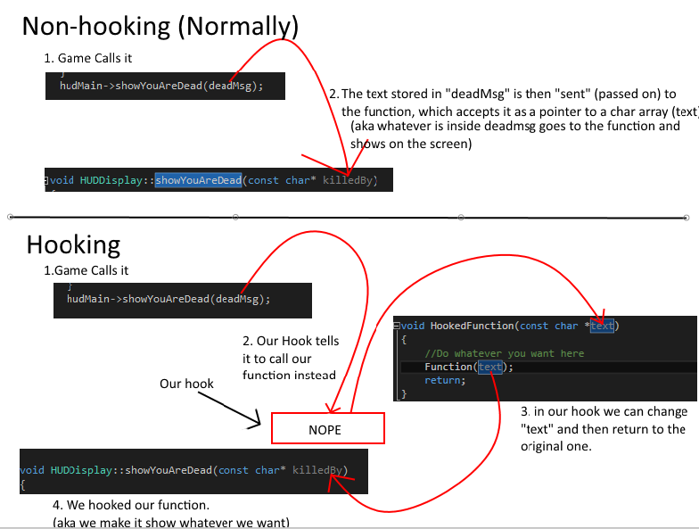

Nonetheless, we can breakpoint right where `mov ds:getchar_gotplt, r10` is called as shown above, and then look into `r10` to see the hooked `getchar()` function that was decrypted from Anomaly 2!

As for the remainder of `secret_func()`, another set of syscalls and loops are done, mainly to erase the Anomaly1 evidence in `print_maze()` by changing the instructions in there to `0x90` or `nop` bytes. I'll leave this as an exercise to the reader.

Once this ends, `print_maze()` from before prints the first maze without an issue, and we go back to standard execution flow! The only issue is that now, `getchar()` has been hooked for unknown purposes.

Before we move on, let's double check on the 2 anomalies we've found;

```
Anomaly 1: Additional data entries beneath mazeData, addresses 0x4058D0 and 0x4058D8 containing values 0x4016FE and 0x4014C5
Anomaly 2: Strange unused massive buffer right after the 64-byte key array, address 0x405380
```

It appears we've found how both of these have been used in hooking the `getchar` entry of the `got.plt` table! Nice! Both of these have been covered here, so chances are we no longer have much leads to pursue with these two...although there is the issue that a good chunk of `Anomaly2`'s buffer was not used in `secret_func()`...we'll keep this in mind later.

With this sorted, it's time for us to take a look at the `getchar` hook and see what is really going on here. It would appear much like how we are dealing with a self-modifying binary, this too is rather akin to a self-modifying maze..

## Shifting Walls

```
From this point onwards, the attached .i64 file would not help as much, as in order to get to here one must have ran the binary to some degree.

It is recommended for you to follow the steps in The Hidden Path, then save a snapshot on (presumably) a VM that you've run the binary on to save your progress!
```

Knowing that `getchar()` has been hooked, the next reasonable step aside from investigating the hooked code would be to see where else in the program's natural execution flow would `getchar()` be called. Surprisingly enough, there's only 3 other instances where it's called, and all can be found in `maze_main()`!

```cpp
for ( nrounds = 0; nrounds <= 2; nrounds = 4 )
  {
    do
    {
      x_coord = (unsigned __int16)get_starting_coordinates((__int16 *)mazeData[nrounds]) >> 8;
      y_coord = get_starting_coordinates((__int16 *)mazeData[nrounds]) & 0xF;
      print_maze((char *)mazeData[nrounds], x_coord, y_coord);
      do
      {
        v2 = getchar();
        if ( v2 > '`' )
          v2 -= 32;
        if ( v2 > '@' )
        {
          input_char = v2 - 'A';
          if ( input_char )
          ...
```
The first is right after the maze is printed, where the user input is acquired.

```cpp
          ...
          }
          else if ( check_boundaries((unsigned __int8 *)mazeData[nrounds], x_coord - 1, y_coord) )
          {
            --x_coord;                          // A
          }
        }
      }
      while ( !(unsigned int)print_maze((char *)mazeData[nrounds], x_coord, y_coord) );
      printf("\n\tNext level? Enter to continue...");
      getchar();
      getchar();
      ++nrounds;
    }
```
And the other two are after finishing a maze, where it takes in two characters before loading a new maze.

With that in mind, let's begin analysing our hooked `getchar()`.

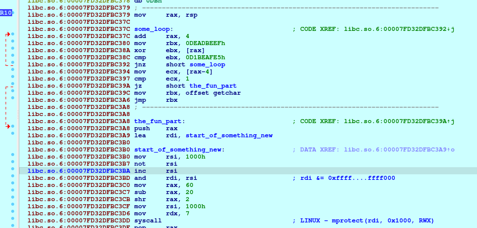

We start off with `mov rax, rsp`, assigning `rax` to contain the value of `rsp`. As far as Intel Assembly is concerned, suppose we have a series of instructions like say,

```
0x1336: mov rdx, 7
0x133D: call func
0x1341: mov rbx, rax
(note the addresses may be very, very inaccurate of what such a set of instructions could look like)
```
for example, notice that every instruction consists of an address. Addresses store the location of an instruction, so that if we ever need to move to a new instruction, we can give an address and the program would know where to go accordingly. You might realise this is how `jmp`, `jz`, `jnz` operands as well as how function calling operates.

When a new function is called, `call func` would cause the `rip` register, which always contain the address of the current instruction, to move to the start of `func`. But then how does the program know where to return to once `func` is done? This is where the `rsp` comes in! The `rsp` would store the location of the next instruction after `call func`, slightly indirectly. In the example above, when `func` is called, `rsp` would contain a pointer to the stack that has the next instruction's location, `0x1341`.

Thus, in our case, the initial `mov rax, rsp`, would simply load the next instruction after a `call getchar()` instruction.

Thus, in the first instance our hooked `getchar` is called, `rsp` would point to the location on the stack with the value `0x401A7C`, right after the next `call _getchar` as shown:

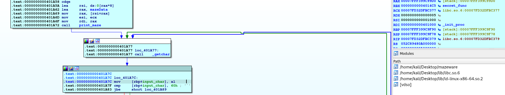
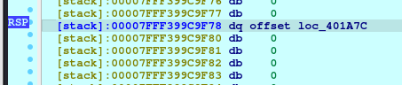

Returning to our hooked function, we see `rax` consistently
added by `4`, as it moves down the stack until it contains `0x0f13110a` (`0xdeadbeef ^ 0xd1beafe5`). Upon meeting the condition, if the previous group of 4 instruction bytes is `1`, something happens as we see in `the_fun_part`. Otherwise, it just jumps to where `getchar()` is normally stored in the libc. Note that this does not jump to `getchar()` on the `got.plt` section which would otherwise lead to an endless recursion call on the hooked function. Rather, it calls the location of `getchar()` in the libc directly. The program is able to figure out the exact address where it is loaded in precisely because of that `mov [r10+78], r15` instruction way back in `secret_func`

We set a breakpoint at `mov ecx, [rax-4]` so as to monitor how this value to be stored in `ecx` changes with each `getchar()` input, and play with the maze a little.

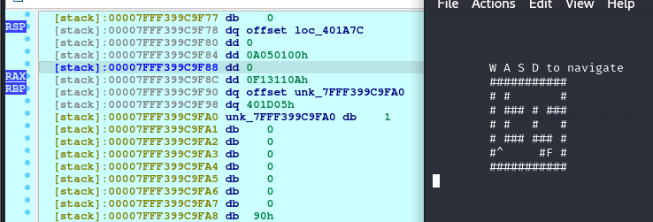

Interestingly however, no matter how often we play with the maze, the value in the stack is always `0`.

Then the magic happens. The exact instant we solve the first maze, and press Enter to continue and load the second maze,

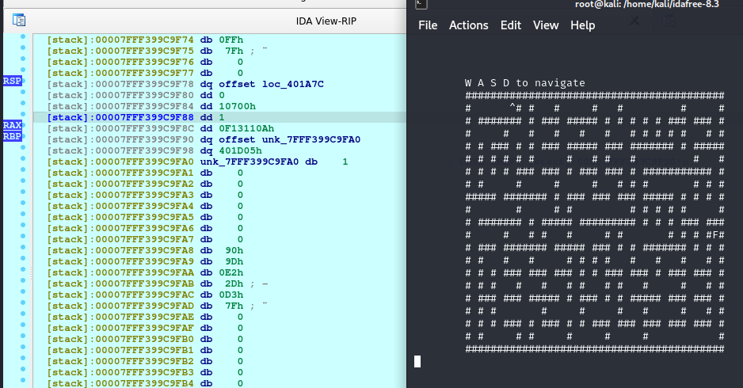

It now contains `1`! This passes the check and we finally get to `the_fun_part`.

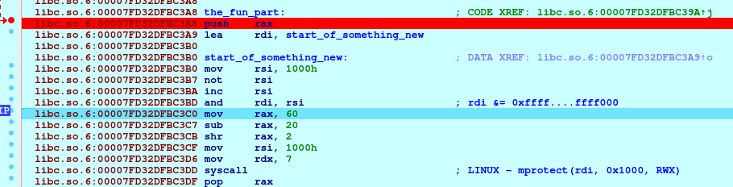

A few things happen here.

`push rax` pushes the value in `rax`, `0x0f13110a`, onto the stack. This is done as `rax` would later be modified for a `syscall`, and as we see it merely temporarily stores the value and writes it back into `rax` with the `pop rax` instruction after the `syscall`.

We then see `rdi`, containing the address of `start_of_something_new`, get bitwise-and with `0xffff...ff000` which sets `rdi` all the way back to the start of the original `mprotect` buffer first set in `secret_func`.

A `syscall mprotect` is then made, making the same, original `0x1000` buffer writable again. Something fishy is going on here...

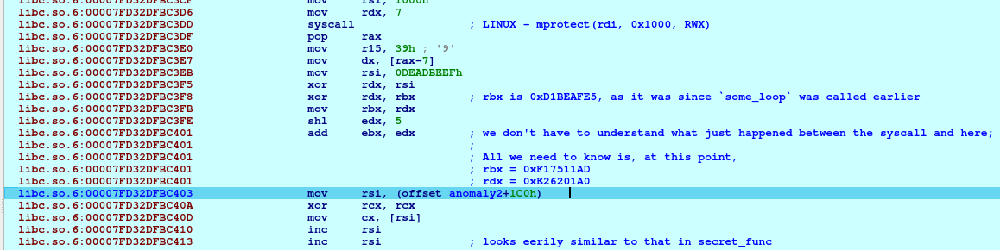

The next instructions after the syscall are a bit odd as they do some xoring and getting some data from the stack, but we mainly notice the reappearance of our `Anomaly2[]` buffer from before as it is loaded into `rsi`. We aslo notice the first two bytes of the `Anomaly2[0x1C0:]` buffer being loaded into `rcx`, possibly containing another offset or size-related data much like in `secret_func`. In this case, `rcx` contains `0x362`. `inc rsi` is called twice naturally, to move past the 2 bytes in `Anomaly2[0x1C0:]` that had been used to dictate the presumably length of input buffer to decrypt and write into.

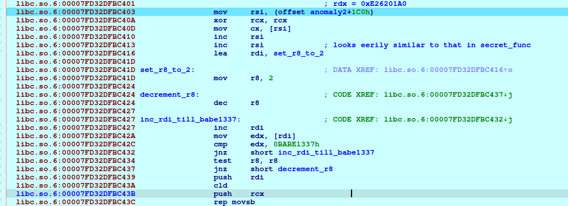

The next series of instructions loads the address of the `set_r8_to_2` instruction block into `rdi`, as we see in `lea rdi, set_r8_to_2`, thus `rdi` now contains, in this case, `0x00007FD32DFBC41D`.

Then `decrement_r8` and `inc_rd_till_babe1337` occur, whereby `rdi`, or rather the address where `set_r8_to_2` was located in, is incremented until its 4 bytes contain `0xbabe1337`. This is done TWICE (observe when `dec r8` is called, and what `test r8 r8` does here). 

But what does this mean?

Well, much like how recipes in a cookbook require words, so to do our program instructions require bytes! In fact, when we set IDA to display our instructions with assembly bytecode attached, we get something like this:

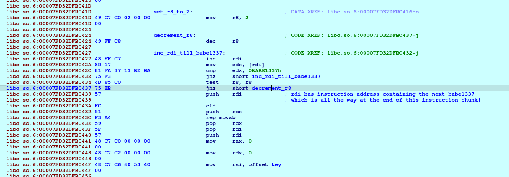

Where `48 FF C7` represents `inc rdi`, for example in `0x00007FD32DFBC427`. `0x00007FD32DFBC42A` which is 3 bytes after would contain `8B 17`, representing `mov edx, [rdi]`.

We can somewhat understand why it looks for `babe1337` twice. Naturally the instruction `cmp edx, 0BABE1337h` would have contained the exact bytes, and presumably the binary intends to go further. We scroll down through the instructions and their assembly opcodes and find the next instance in which `0BABE1337h` appears.

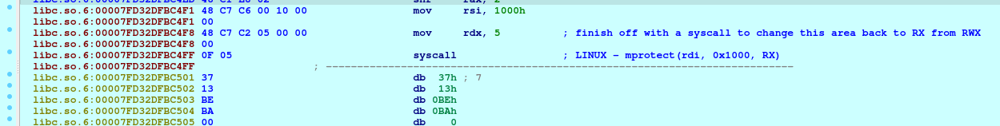

All the way at the very end! By this point, `rdi` would have incremented through the entirety of this function block, which we shall keep in mind for later.

We see `push rdi` called, pushing the final location of the end of hooked `getchar()` onto the stack. More specifically, at this point `rdi` would contain `0x00007FD32DFBC501`.

`cld` sets the Directional Flag / `DF` to 0. `push rcx` is done as `rcx` would be modified by the next instruction, so we can later restore its previous value via `pop rcx` right after `rep movsb`.

`rep` stands for `repeat while equal`, and `movsb` moves a byte from address `rsi` into address `rdi`. Thus, a byte from `Anomaly2[]` (represented by `rsi`) is appended to the end of the function block in hooked `getchar()` (represented by `rdi`). This is repeated until `rcx == 0` (i.e. `0x362` times), and every iteration increments `rsi` and `rdi` by 1. 

Because `DF = 0`, the two registers are incremented during the `rep movsb` instruction call, whereas back in `secret_func`, `DF = 1` causes the two to decrement during the `repe cmpsb` call.

And so, as `rep movsb` ends, we see `0x362` bytes from `Anomaly2[]` get copied over into the end of hooked `getchar()`, as shown:
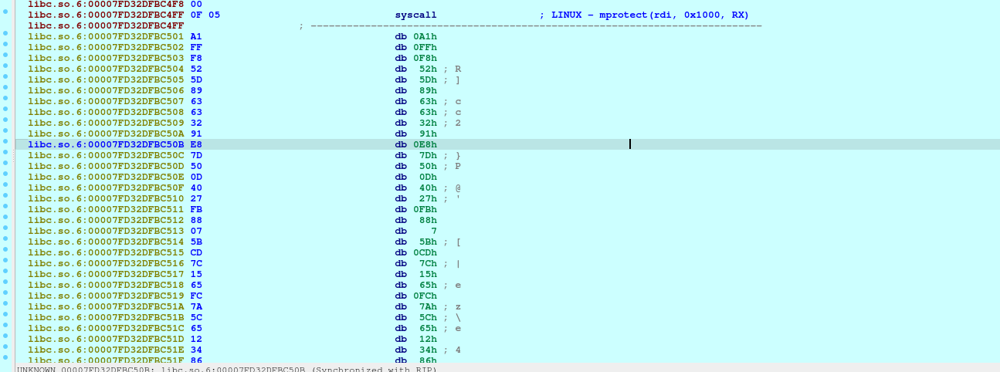

We move on to the next series of instructions;

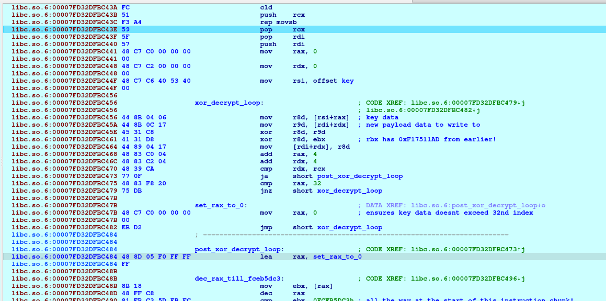

`xor_decrypt_loop` reuses the `key[]` array from before to xor the new payload data written from `0x00007FD32DFBC501`, as well as to further xor with `rbx`, which we had previously determined to contain `0xF17511AD` from before.

`set_rax_to_0` ensures that `key[]` never goes past its `32nd` value, and once the xor decryption is done, `post_xor_decrypt_loop` is the next set of instructions to be carried out as evinced in `ja short post_xor_decrypt_loop`, which jumps only when `rdx > rcx`. We've already determined `rcx` as the size of data written over from `Anomaly2[]`, and we observe `rdx` being used as an index that goes from 0 onwards.

In fact, once all of this is done, we see the second payload data decrypted to form what seems to be a legible function, as shown:

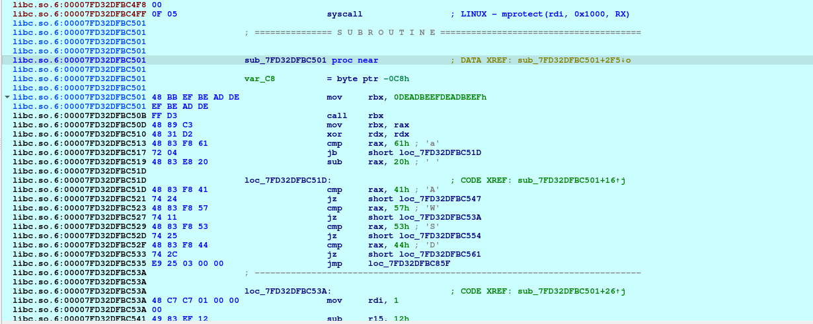

As for the remaining part of hooked `getchar()`, it's a bit confusing, but I'll try my best to explain here.

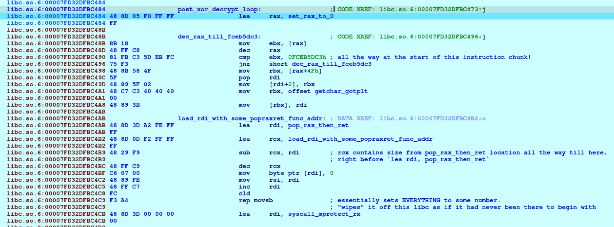

`lea rax, set_rax_to_0` and the first half of `dec_rax_till_fceb5dc3` does something similar to the `babe1337` that we'd observed prior, which stores the start of our hooked block into `rax`. We can verify it by following the bytecodes as `rax` is decremented slowly, or by referencing the final [commented instructions](#hooked-getchar-commented-assembly) that I've pulled from the binary at the end of this section.

We also see another rehook to our `getchar@got.plt` entry, with `pop rdi` taking the value from the top of our stack (which occurs way back in `0x00007FD32DFBC440` in `push rdi` before the `key[]` array is mentioned) and writing that into the `got.plt` section. This time, instead of being hooked to where we are, it's hooked to the decrypted `Anomaly2[]` buffer that we'd just wrote into.

`load_rdi_with_some_popraxret_func_addr`, as confusing as it is, does some manipulation to the `rdi` and `rsi` registers such that they both point the end of `dec_rax_till_fceb5dc3` and the start of the whole initial hooked `getchar()` instruction block. Feel free to reference the [commented instructions](#hooked-getchar-commented-assembly) below to get a better idea of what's going on.

`cld` and `rep movsb` then wipes all of the instructions from `rsi` to `rdi`, rendering them `0`s as we see here:

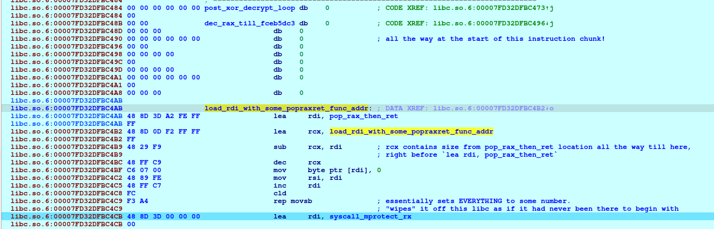

Finally, another `syscall-mprotect` is made to change the input buffer from `RWX` back to `RX`.

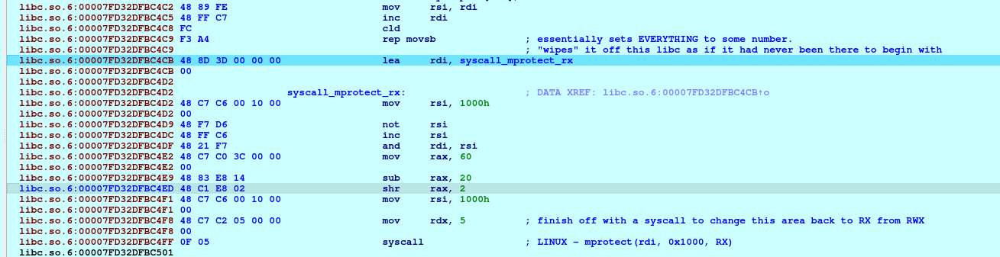

In summary, our hooked `getchar()` does the following:
```
1. Call getchar() as normal till user finishes the first maze
2. Calls mprotect to prepare libc buffer for further modification
3. Reads data from Anomaly2[]
4. Xor decrypts with Key[], another constant variable and appends to the end of the initial hook function
5. Rehook getchar@got.plt to the decrypted function
6. Wipe previous data of the initial hook
7. Call a final mprotect to reset the libc buffer back to RX from RWX
```

In [Tunnel's End](#tunnels-end), we will analyse the new hooked function and observe how this finally leads us to the flag.

### Hooked getchar() Commented Assembly

For reference, here are my final commented results from analysing the first hooked `getchar()`.
```
libc.so.6:00007FD32DFBC350 C3                retn            db 0C3h                 ; CODE XREF: pop_rax_then_ret-2↓j
libc.so.6:00007FD32DFBC351                   ; ---------------------------------------------------------------------------
libc.so.6:00007FD32DFBC351                   ; START OF FUNCTION CHUNK FOR pop_rax_then_ret
libc.so.6:00007FD32DFBC351
libc.so.6:00007FD32DFBC351                   pop_rbp_jmp_retn:                       ; CODE XREF: pop_rax_then_ret+1↓j
libc.so.6:00007FD32DFBC351 5D                                pop     rbp
libc.so.6:00007FD32DFBC352 EB FC                             jmp     short near ptr retn
libc.so.6:00007FD32DFBC352                   ; END OF FUNCTION CHUNK FOR pop_rax_then_ret
libc.so.6:00007FD32DFBC354
libc.so.6:00007FD32DFBC354                   ; =============== S U B R O U T I N E =======================================
libc.so.6:00007FD32DFBC354
libc.so.6:00007FD32DFBC354
libc.so.6:00007FD32DFBC354                   pop_rax_then_ret proc near              ; CODE XREF: sub_7FD32DFBC359+1E↓j
libc.so.6:00007FD32DFBC354                                                           ; DATA XREF: libc.so.6:load_rdi_with_some_popraxret_func_addr↓o
libc.so.6:00007FD32DFBC354
libc.so.6:00007FD32DFBC354                   ; FUNCTION CHUNK AT libc.so.6:00007FD32DFBC351 SIZE 00000003 BYTES
libc.so.6:00007FD32DFBC354
libc.so.6:00007FD32DFBC354 58                                pop     rax
libc.so.6:00007FD32DFBC355 EB FA                             jmp     short pop_rbp_jmp_retn
libc.so.6:00007FD32DFBC355                   pop_rax_then_ret endp ; sp-analysis failed
libc.so.6:00007FD32DFBC355
libc.so.6:00007FD32DFBC357                   ; ---------------------------------------------------------------------------
libc.so.6:00007FD32DFBC357 F3 A4                             rep movsb
libc.so.6:00007FD32DFBC359
libc.so.6:00007FD32DFBC359                   ; =============== S U B R O U T I N E =======================================
libc.so.6:00007FD32DFBC359
libc.so.6:00007FD32DFBC359
libc.so.6:00007FD32DFBC359                   sub_7FD32DFBC359 proc near
libc.so.6:00007FD32DFBC359 48 C7 C0 0A 00 00                 mov     rax, 0Ah
libc.so.6:00007FD32DFBC359 00
libc.so.6:00007FD32DFBC360 48 81 E7 00 F0 FF                 and     rdi, 0FFF000h   ; start
libc.so.6:00007FD32DFBC360 00
libc.so.6:00007FD32DFBC367 48 C7 C6 00 10 00                 mov     rsi, 1000h      ; len
libc.so.6:00007FD32DFBC367 00
libc.so.6:00007FD32DFBC36E 48 C7 C2 05 00 00                 mov     rdx, 5          ; prot
libc.so.6:00007FD32DFBC36E 00
libc.so.6:00007FD32DFBC375 0F 05                             syscall                 ; LINUX - sys_mprotect
libc.so.6:00007FD32DFBC377 EB DB                             jmp     short pop_rax_then_ret
libc.so.6:00007FD32DFBC377                   sub_7FD32DFBC359 endp
libc.so.6:00007FD32DFBC377
libc.so.6:00007FD32DFBC379                   ; ---------------------------------------------------------------------------
libc.so.6:00007FD32DFBC379
libc.so.6:00007FD32DFBC379                   hooked_getchar:
libc.so.6:00007FD32DFBC379 48 89 E0                          mov     rax, rsp
libc.so.6:00007FD32DFBC37C
libc.so.6:00007FD32DFBC37C                   some_loop:                              ; CODE XREF: libc.so.6:00007FD32DFBC392↓j
libc.so.6:00007FD32DFBC37C 48 83 C0 04                       add     rax, 4
libc.so.6:00007FD32DFBC380 48 BB EF BE AD DE                 mov     rbx, 0DEADBEEFh
libc.so.6:00007FD32DFBC380 00 00 00 00
libc.so.6:00007FD32DFBC38A 33 18                             xor     ebx, [rax]
libc.so.6:00007FD32DFBC38C 81 FB E5 AF BE D1                 cmp     ebx, 0D1BEAFE5h
libc.so.6:00007FD32DFBC392 75 E8                             jnz     short some_loop
libc.so.6:00007FD32DFBC394 8B 48 FC                          mov     ecx, [rax-4]
libc.so.6:00007FD32DFBC397 83 F9 01                          cmp     ecx, 1
libc.so.6:00007FD32DFBC39A 74 0C                             jz      short the_fun_part
libc.so.6:00007FD32DFBC39C 48 BB E0 7A E8 2D                 mov     rbx, offset getchar
libc.so.6:00007FD32DFBC39C D3 7F 00 00
libc.so.6:00007FD32DFBC3A6 FF E3                             jmp     rbx
libc.so.6:00007FD32DFBC3A8                   ; ---------------------------------------------------------------------------
libc.so.6:00007FD32DFBC3A8
libc.so.6:00007FD32DFBC3A8                   the_fun_part:                           ; CODE XREF: libc.so.6:00007FD32DFBC39A↑j
libc.so.6:00007FD32DFBC3A8 50                                push    rax
libc.so.6:00007FD32DFBC3A9 48 8D 3D 00 00 00                 lea     rdi, start_of_something_new
libc.so.6:00007FD32DFBC3A9 00
libc.so.6:00007FD32DFBC3B0
libc.so.6:00007FD32DFBC3B0                   start_of_something_new:                 ; DATA XREF: libc.so.6:00007FD32DFBC3A9↑o
libc.so.6:00007FD32DFBC3B0 48 C7 C6 00 10 00                 mov     rsi, 1000h
libc.so.6:00007FD32DFBC3B0 00
libc.so.6:00007FD32DFBC3B7 48 F7 D6                          not     rsi
libc.so.6:00007FD32DFBC3BA 48 FF C6                          inc     rsi
libc.so.6:00007FD32DFBC3BD 48 21 F7                          and     rdi, rsi        ; rdi &= 0xffff....ffff000
libc.so.6:00007FD32DFBC3C0 48 C7 C0 3C 00 00                 mov     rax, 60
libc.so.6:00007FD32DFBC3C0 00
libc.so.6:00007FD32DFBC3C7 48 83 E8 14                       sub     rax, 20
libc.so.6:00007FD32DFBC3CB 48 C1 E8 02                       shr     rax, 2
libc.so.6:00007FD32DFBC3CF 48 C7 C6 00 10 00                 mov     rsi, 1000h
libc.so.6:00007FD32DFBC3CF 00
libc.so.6:00007FD32DFBC3D6 48 C7 C2 07 00 00                 mov     rdx, 7
libc.so.6:00007FD32DFBC3D6 00
libc.so.6:00007FD32DFBC3DD 0F 05                             syscall                 ; LINUX - mprotect(rdi, 0x1000, RWX)
libc.so.6:00007FD32DFBC3DF 58                                pop     rax
libc.so.6:00007FD32DFBC3E0 49 C7 C7 39 00 00                 mov     r15, 39h ; '9'
libc.so.6:00007FD32DFBC3E0 00
libc.so.6:00007FD32DFBC3E7 66 8B 50 F9                       mov     dx, [rax-7]
libc.so.6:00007FD32DFBC3EB 48 BE EF BE AD DE                 mov     rsi, 0DEADBEEFh
libc.so.6:00007FD32DFBC3EB 00 00 00 00
libc.so.6:00007FD32DFBC3F5 48 31 F2                          xor     rdx, rsi
libc.so.6:00007FD32DFBC3F8 48 31 DA                          xor     rdx, rbx        ; rbx is 0xD1BEAFE5, as it was since `some_loop` was called earlier
libc.so.6:00007FD32DFBC3FB 48 89 D3                          mov     rbx, rdx
libc.so.6:00007FD32DFBC3FE C1 E2 05                          shl     edx, 5
libc.so.6:00007FD32DFBC401 01 D3                             add     ebx, edx        ; we don't have to understand what just happened between the syscall and here;
libc.so.6:00007FD32DFBC401                                                           ;
libc.so.6:00007FD32DFBC401                                                           ; All we need to know is, at this point,
libc.so.6:00007FD32DFBC401                                                           ; rbx = 0xF17511AD
libc.so.6:00007FD32DFBC401                                                           ; rdx = 0xE26201A0
libc.so.6:00007FD32DFBC403 48 C7 C6 40 55 40                 mov     rsi, (offset anomaly2+1C0h)
libc.so.6:00007FD32DFBC403 00
libc.so.6:00007FD32DFBC40A 48 31 C9                          xor     rcx, rcx
libc.so.6:00007FD32DFBC40D 66 8B 0E                          mov     cx, [rsi]
libc.so.6:00007FD32DFBC410 48 FF C6                          inc     rsi
libc.so.6:00007FD32DFBC413 48 FF C6                          inc     rsi             ; looks eerily similar to that in secret_func
libc.so.6:00007FD32DFBC416 48 8D 3D 00 00 00                 lea     rdi, set_r8_to_2
libc.so.6:00007FD32DFBC416 00
libc.so.6:00007FD32DFBC41D
libc.so.6:00007FD32DFBC41D                   set_r8_to_2:                            ; DATA XREF: libc.so.6:00007FD32DFBC416↑o
libc.so.6:00007FD32DFBC41D 49 C7 C0 02 00 00                 mov     r8, 2
libc.so.6:00007FD32DFBC41D 00
libc.so.6:00007FD32DFBC424
libc.so.6:00007FD32DFBC424                   decrement_r8:                           ; CODE XREF: libc.so.6:00007FD32DFBC437↓j
libc.so.6:00007FD32DFBC424 49 FF C8                          dec     r8
libc.so.6:00007FD32DFBC427
libc.so.6:00007FD32DFBC427                   inc_rdi_till_babe1337:                  ; CODE XREF: libc.so.6:00007FD32DFBC432↓j
libc.so.6:00007FD32DFBC427 48 FF C7                          inc     rdi
libc.so.6:00007FD32DFBC42A 8B 17                             mov     edx, [rdi]
libc.so.6:00007FD32DFBC42C 81 FA 37 13 BE BA                 cmp     edx, 0BABE1337h
libc.so.6:00007FD32DFBC432 75 F3                             jnz     short inc_rdi_till_babe1337
libc.so.6:00007FD32DFBC434 4D 85 C0                          test    r8, r8
libc.so.6:00007FD32DFBC437 75 EB                             jnz     short decrement_r8
libc.so.6:00007FD32DFBC439 57                                push    rdi             ; rdi has instruction address containing the next babe1337
libc.so.6:00007FD32DFBC439                                                           ; which is all the way at the end of this instruction chunk!
libc.so.6:00007FD32DFBC43A FC                                cld
libc.so.6:00007FD32DFBC43B 51                                push    rcx
libc.so.6:00007FD32DFBC43C F3 A4                             rep movsb
libc.so.6:00007FD32DFBC43E 59                                pop     rcx
libc.so.6:00007FD32DFBC43F 5F                                pop     rdi
libc.so.6:00007FD32DFBC440 57                                push    rdi
libc.so.6:00007FD32DFBC441 48 C7 C0 00 00 00                 mov     rax, 0
libc.so.6:00007FD32DFBC441 00
libc.so.6:00007FD32DFBC448 48 C7 C2 00 00 00                 mov     rdx, 0
libc.so.6:00007FD32DFBC448 00
libc.so.6:00007FD32DFBC44F 48 C7 C6 40 53 40                 mov     rsi, offset key
libc.so.6:00007FD32DFBC44F 00
libc.so.6:00007FD32DFBC456
libc.so.6:00007FD32DFBC456                   xor_decrypt_loop:                       ; CODE XREF: libc.so.6:00007FD32DFBC479↓j
libc.so.6:00007FD32DFBC456                                                           ; libc.so.6:00007FD32DFBC482↓j
libc.so.6:00007FD32DFBC456 44 8B 04 06                       mov     r8d, [rsi+rax]  ; key data
libc.so.6:00007FD32DFBC45A 44 8B 0C 17                       mov     r9d, [rdi+rdx]  ; new payload data to write to
libc.so.6:00007FD32DFBC45E 45 31 C8                          xor     r8d, r9d
libc.so.6:00007FD32DFBC461 41 31 D8                          xor     r8d, ebx        ; rbx has 0xF17511AD from earlier!
libc.so.6:00007FD32DFBC464 44 89 04 17                       mov     [rdi+rdx], r8d
libc.so.6:00007FD32DFBC468 48 83 C0 04                       add     rax, 4
libc.so.6:00007FD32DFBC46C 48 83 C2 04                       add     rdx, 4
libc.so.6:00007FD32DFBC470 48 39 CA                          cmp     rdx, rcx
libc.so.6:00007FD32DFBC473 77 0F                             ja      short post_xor_decrypt_loop
libc.so.6:00007FD32DFBC475 48 83 F8 20                       cmp     rax, 32
libc.so.6:00007FD32DFBC479 75 DB                             jnz     short xor_decrypt_loop
libc.so.6:00007FD32DFBC47B
libc.so.6:00007FD32DFBC47B                   set_rax_to_0:                           ; DATA XREF: libc.so.6:post_xor_decrypt_loop↓o
libc.so.6:00007FD32DFBC47B 48 C7 C0 00 00 00                 mov     rax, 0          ; ensures key data doesnt exceed 32nd index
libc.so.6:00007FD32DFBC47B 00
libc.so.6:00007FD32DFBC482 EB D2                             jmp     short xor_decrypt_loop
libc.so.6:00007FD32DFBC484                   ; ---------------------------------------------------------------------------
libc.so.6:00007FD32DFBC484
libc.so.6:00007FD32DFBC484                   post_xor_decrypt_loop:                  ; CODE XREF: libc.so.6:00007FD32DFBC473↑j
libc.so.6:00007FD32DFBC484 48 8D 05 F0 FF FF                 lea     rax, set_rax_to_0
libc.so.6:00007FD32DFBC484 FF
libc.so.6:00007FD32DFBC48B
libc.so.6:00007FD32DFBC48B                   dec_rax_till_fceb5dc3:                  ; CODE XREF: libc.so.6:00007FD32DFBC496↓j
libc.so.6:00007FD32DFBC48B 8B 18                             mov     ebx, [rax]
libc.so.6:00007FD32DFBC48D 48 FF C8                          dec     rax
libc.so.6:00007FD32DFBC490 81 FB C3 5D EB FC                 cmp     ebx, 0FCEB5DC3h ; all the way at the start of this instruction chunk!
libc.so.6:00007FD32DFBC496 75 F3                             jnz     short dec_rax_till_fceb5dc3
libc.so.6:00007FD32DFBC498 48 8B 58 4F                       mov     rbx, [rax+4Fh]
libc.so.6:00007FD32DFBC49C 5F                                pop     rdi
libc.so.6:00007FD32DFBC49D 48 89 5F 02                       mov     [rdi+2], rbx
libc.so.6:00007FD32DFBC4A1 48 C7 C3 40 40 40                 mov     rbx, offset getchar_gotplt
libc.so.6:00007FD32DFBC4A1 00
libc.so.6:00007FD32DFBC4A8 48 89 3B                          mov     [rbx], rdi
libc.so.6:00007FD32DFBC4AB
libc.so.6:00007FD32DFBC4AB                   load_rdi_with_some_popraxret_func_addr: ; DATA XREF: libc.so.6:00007FD32DFBC4B2↓o
libc.so.6:00007FD32DFBC4AB 48 8D 3D A2 FE FF                 lea     rdi, pop_rax_then_ret
libc.so.6:00007FD32DFBC4AB FF
libc.so.6:00007FD32DFBC4B2 48 8D 0D F2 FF FF                 lea     rcx, load_rdi_with_some_popraxret_func_addr
libc.so.6:00007FD32DFBC4B2 FF
libc.so.6:00007FD32DFBC4B9 48 29 F9                          sub     rcx, rdi        ; rcx contains size from pop_rax_then_ret location all the way till here,
libc.so.6:00007FD32DFBC4B9                                                           ; right before `lea rdi, pop_rax_then_ret`
libc.so.6:00007FD32DFBC4BC 48 FF C9                          dec     rcx
libc.so.6:00007FD32DFBC4BF C6 07 00                          mov     byte ptr [rdi], 0
libc.so.6:00007FD32DFBC4C2 48 89 FE                          mov     rsi, rdi
libc.so.6:00007FD32DFBC4C5 48 FF C7                          inc     rdi
libc.so.6:00007FD32DFBC4C8 FC                                cld
libc.so.6:00007FD32DFBC4C9 F3 A4                             rep movsb               ; essentially sets EVERYTHING to some number.
libc.so.6:00007FD32DFBC4C9                                                           ; "wipes" it off this libc as if it had never been there to begin with
libc.so.6:00007FD32DFBC4CB 48 8D 3D 00 00 00                 lea     rdi, syscall_mprotect_rx
libc.so.6:00007FD32DFBC4CB 00
libc.so.6:00007FD32DFBC4D2
libc.so.6:00007FD32DFBC4D2                   syscall_mprotect_rx:                    ; DATA XREF: libc.so.6:00007FD32DFBC4CB↑o
libc.so.6:00007FD32DFBC4D2 48 C7 C6 00 10 00                 mov     rsi, 1000h
libc.so.6:00007FD32DFBC4D2 00
libc.so.6:00007FD32DFBC4D9 48 F7 D6                          not     rsi
libc.so.6:00007FD32DFBC4DC 48 FF C6                          inc     rsi
libc.so.6:00007FD32DFBC4DF 48 21 F7                          and     rdi, rsi
libc.so.6:00007FD32DFBC4E2 48 C7 C0 3C 00 00                 mov     rax, 60
libc.so.6:00007FD32DFBC4E2 00
libc.so.6:00007FD32DFBC4E9 48 83 E8 14                       sub     rax, 20
libc.so.6:00007FD32DFBC4ED 48 C1 E8 02                       shr     rax, 2
libc.so.6:00007FD32DFBC4F1 48 C7 C6 00 10 00                 mov     rsi, 1000h
libc.so.6:00007FD32DFBC4F1 00
libc.so.6:00007FD32DFBC4F8 48 C7 C2 05 00 00                 mov     rdx, 5          ; finish off with a syscall to change this area back to RX from RWX
libc.so.6:00007FD32DFBC4F8 00
libc.so.6:00007FD32DFBC4FF 0F 05                             syscall                 ; LINUX - mprotect(rdi, 0x1000, RX)
libc.so.6:00007FD32DFBC4FF                   ; ---------------------------------------------------------------------------
libc.so.6:00007FD32DFBC501 37                                db  37h ; 7
libc.so.6:00007FD32DFBC502 13                                db  13h
libc.so.6:00007FD32DFBC503 BE                                db 0BEh
libc.so.6:00007FD32DFBC504 BA                                db 0BAh
libc.so.6:00007FD32DFBC505 00                                db    0
libc.so.6:00007FD32DFBC506 00                                db    0
libc.so.6:00007FD32DFBC507 00                                db    0
```

## Tunnel's End

We finally arrive at the second hooked `getchar()`! We'll refer to this function as `Tunnels_End()` for the remainder of this writeup.

Once again much like `secret_func` the pseudocode output is rather messy so we'll stick with assembly as we'd done with the previous two big functions. This last segment would be slightly shorter than the rest as I would like to not go in depth as I'd done with the previous two, but rather talk about how I was able to solve it with inferences.

As scuffed as it is, this is generally how most of RE is done. Then the gaps are filled during writeup creation. Plus, by this point this writeup should have given you the ability and confidence to handle raw assembly anyway ;D

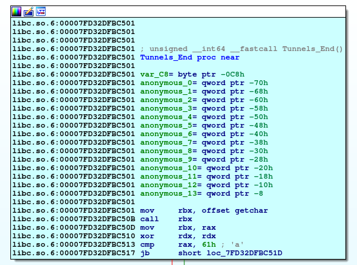

Right off the bat our first question on how exactly and where this new hooked function calls the proper `getchar()` is is answered. Which means the rest of the function is no longer about hooking `getchar()`, and it is where things start to happen.

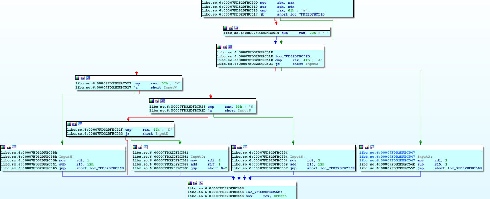

We then see how this `rax` is compared with `WASD`, and all of them are funneled into an instruction chain. There is a stray red arrow at the end of an attempt to check if `rax == 'D'`. The red arrow just leads to a return call, and ends the hook without any problems or changes whatsoever.

An interesting piece of trivia is that the `rax` register is often used to store the return value of functions. Thus, since `getchar()` (the proper libc one) was called in this hook, `rax` would contain the user's input character.

We can easily infer that Interestingly we observe that our 4 possible inputs perform different things to two registers in particular.

```
W -> rdi = 1, r15 -= 0x12
D -> rdi = 4, r15 += 1
S -> rdi = 3, r15 += 0x12
A -> rdi = 2, r15 -= 1
```

We also notice that the first time this hooked function is called, `r15` starts at `0x39`. This will be relevant later on.

Now your inferrence skills might activate and you'd notice a key thing about it that completely divulges what this whole hook is doing. Regardless, we'll move on and see what happens after processing our input character;

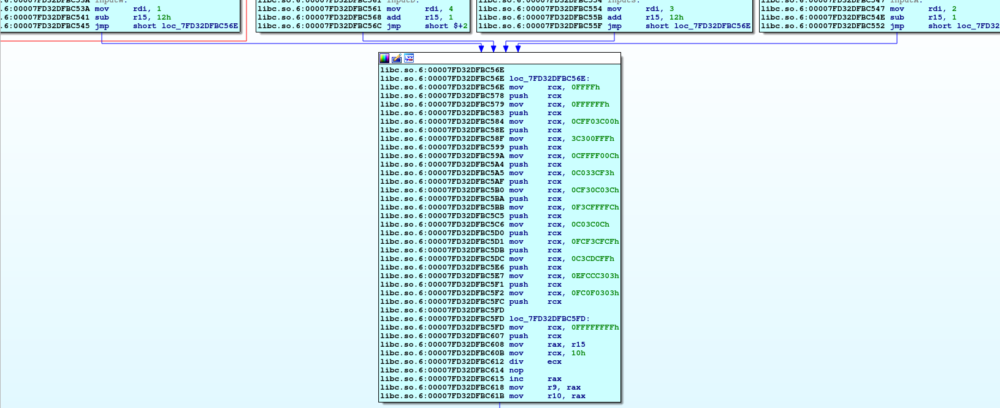

First off, a bunch of items are repeatedly pushed into the stack. Now, if you've caught on by the things that `WDSA` are doing here, this would probably lead you to the [Intended Solution](#intended-solution). Unfortunately, I didn't catch onto that yet, and wound up pulling an accidental solve after further looking through the function.

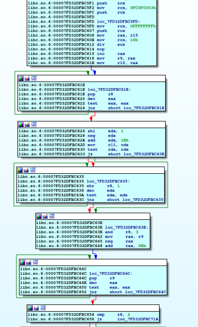

Once this series of strings have been loaded, we observe operations done involving the `r15` and `rdi` registers, which culminate in one of three possible options. `r8 = 0, 1, 2`. `r11` is also an important register that's affected, which comes in later.

This leads to 3 different "endings" in which `Tunnels_End` returns from. A Good Ending, a Bad Ending and a Neutral Ending.

### Good Ending

The "Good Ending" occurs when `r8 = 2`, and it was the first path that caught my attention.
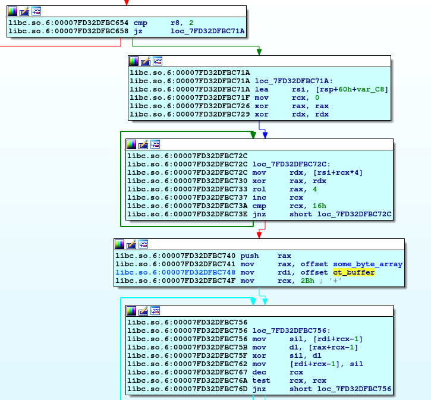

It uses the stack data as shown in `[rsp+60h+var_C8]` and subsequent data in it from the `mov rdx, [rsi+rcx*4]` instruction in the first loop shown to compute some value `rax` that it pushes onto the stack.

It then xors the `ct_buffer[]` -- The same one used in `win_func()` to call `RC4` on -- modifying the buffer data with some byte array. The `rdi` register is used to store the location of this `ct_buffer[]` array.

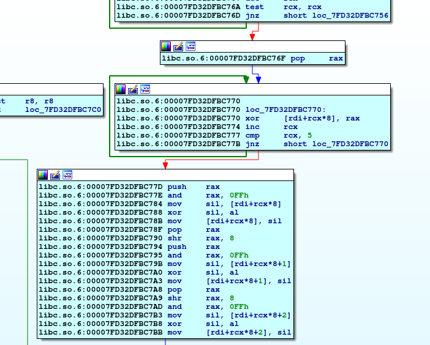
Finally, the `rax` value is popped off the stack to restore the register which seems to be a checksum of the data on the stack. This is followed with more operations done to the registers before it merges with the case where `r8 == 1`, which we'll see in the [Bad Ending](#bad-ending)

### Bad Ending

The "Bad Ending" occurs when `r8 = 1`. Both the Good and Bad Ending paths merge here, but what makes this ending bad is that the `ct_buffer[]` used in `win_func()` was never altered at all.

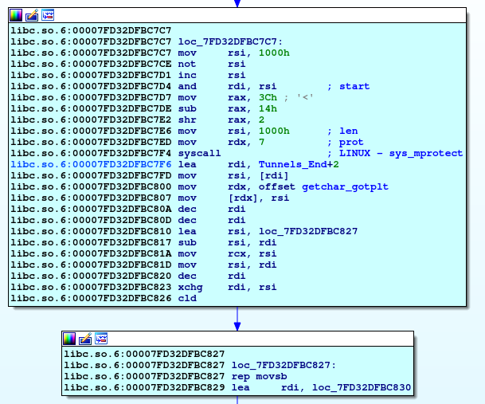

Firstly, another `mprotect()` is called which makes this entire buffer modifiable once more.

```
lea rdi, Tunnels_End+2
mov rsi, [rdi]
mov rdx, offset getchar_gotplt
mov [rdx], rsi
```

These 4 instructions essentially store a pointer with the address of `getchar()` in the libc into `rdi`, then stores the address of said function into `rsi`, which finally overwrites the `getchar` entry in the `got.plt` section back to what it originally was, being its actual location in the libc. This essentially "unhooks" `getchar()` and restores it to what it once was way, way before `secret_func()` had been called.

Lastly, `rdi` and `rsi` are set, and a `cld -> rep movsb` wipes off the entire hooked function. This ends with another `mprotect` syscall to set it back to `RX`, thus ending the hook overall.

### Neutral Ending
The "Neutral Ending" occurs when `r8 = 0`.
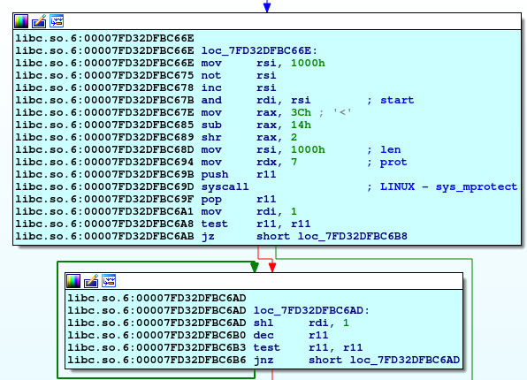

We see an `mprotect` setting the libc buffer to `RWX` again, and this time something happens to the `rdi` register based on the `r11` register.

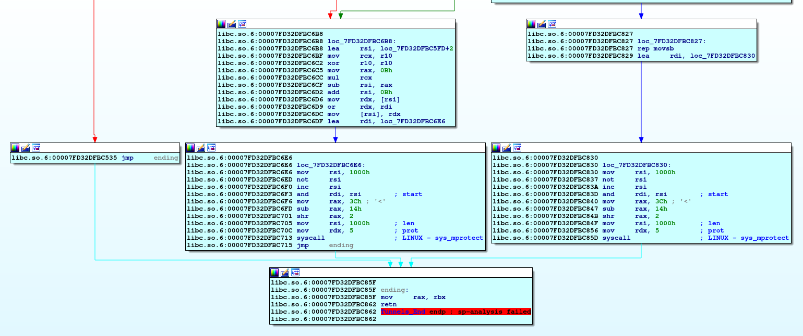

Stuff is modified, but not as drastic as that in the Good and Bad Endings respectively. Another `mprotect` is made to set it back to `RX` and the hooked function ends.

With all of this in mind, I kinda performed a slightly unintended route to obtain the flag. This writeup presents both the Unintended and Intended Solutions.

## Unintended Solution
```
Recommended to at least read Tunnel's End for context here, as well as some familiarity with what the binary has been doing in A Cursory Glance.
```

Not exactly fully aware of what was going on at the time, I thought of expressing this hooked function as some graph traversal problem. The idea was that each `WASD` input by the user causes `r15` to change which impacts `r8`. Ultimately this `r8` value would either be `0`, `1`, or `2`, and we would want to ignore `1`s.

I had also observed from running the binary and with lots of snapshots that getting `r8` to be `0` or `2` usually occurs once in every 4 possible inputs, and that the `r15` register is never touched or modified between every time `Tunnels_End()` is called.

```py
# Load stack data over
s = ['FFFFFFFF', 
     'FC0F0303', 
     'EFCCC303', 
     '0C3CDCFF', 
     'FCF3CFCF', 
     '00C03C0C', 
     'F3CFFFFC', 
     'CF30C03C', 
     '0C033CF3', 
     'CFFFF00C', 
     '3C300FFF', 
     'CFF03C00', 
     '00FFFFFF', 
     '0000FFFF']
s = [int(i,16) for i in s]

# Simulate r15 changes
def test(r15):
    if r15 >= (len(s))*16:
       return False
    rax = r15 // 16 + 1
    rdx = r15 % 16

    r8 = s[rax-1]
    rdx <<= 1
    rdx = 0x1e - rdx
    r8 >>= rdx
    r8 &= 3
    return r8 == 0 or r8 == 2

def dfs(path, moves):
    if 0x21 in path:
        print(moves, max(path))
    for i in "WASD":
        r15 = path[-1]
        if i == "W":
            r15 -= 0x12
        elif i == "D":
            r15 += 1
        elif i == "A":
            r15 -= 1
        else:
            r15 += 0x12
        if test(r15) and r15 not in path:
            dfs(path + [r15], moves + i)

moves = ""
path = [0x39]
dfs(path, moves)
```
I copied the stack data over, then fully reversed and simulatedwhat happens to the r8 register each time. I then ran a Depth-First-Search script arriving at these possible paths. Initially there were a lot more, and I banked on intuition that you probably aren't supposed to go back to where you'd originally come from, and that the `r15` value should always be unique each time.

```
WWAASSSSDDSSAASSDSDDWDDDSDDDSDWDSDWDSDWWWDWWAAASSAAAWWDWWAAASSSAAAWWWWWDWDDSDDWDDSDSSDDDWWAW 213
WWAASSSSDDSSAASSDSDDWDDDSDDDSDWDSDWDDWWDWWAAASSAAAWWDWWAAASSSAAAWWWWWDWDDSDDWDDSDSSDDDWWAW 211
WWAASSSSDDSSAASSDSDDWDDDSDDDSDWDSDDWDWWDWWAAASSAAAWWDWWAAASSSAAAWWWWWDWDDSDDWDDSDSSDDDWWAW 212
WWAASSSSDDSSAASSDSDDWDDDSDDDSDWDSDDDWWWDWWAAASSAAAWWDWWAAASSSAAAWWWWWDWDDSDDWDDSDSSDDDWWAW 213
WWAASSSSDDSSAASSDSDDWDDDSDDDSDWDDSDWDWWDWWAAASSAAAWWDWWAAASSSAAAWWWWWDWDDSDDWDDSDSSDDDWWAW 212
WWAASSSSDDSSAASSDSDDWDDDSDDDSDWDDSDDWWWDWWAAASSAAAWWDWWAAASSSAAAWWWWWDWDDSDDWDDSDSSDDDWWAW 213
WWAASSSSDDSSAASSDSDDWDDDSDDDSDWDDDSDWWWDWWAAASSAAAWWDWWAAASSSAAAWWWWWDWDDSDDWDDSDSSDDDWWAW 213
WWAASSSSDDSSAASSDSDDWDDDSDDDSDWDDDDWWDWWAAASSAAAWWDWWAAASSSAAAWWWWWDWDDSDDWDDSDSSDDDWWAW 209
WWAASSSSDDSSAASSDSDDWDDDSDDDSDDWDSDWDWWDWWAAASSAAAWWDWWAAASSSAAAWWWWWDWDDSDDWDDSDSSDDDWWAW 212
WWAASSSSDDSSAASSDSDDWDDDSDDDSDDWDSDDWWWDWWAAASSAAAWWDWWAAASSSAAAWWWWWDWDDSDDWDDSDSSDDDWWAW 213
WWAASSSSDDSSAASSDSDDWDDDSDDDSDDWDDSDWWWDWWAAASSAAAWWDWWAAASSSAAAWWWWWDWDDSDDWDDSDSSDDDWWAW 213
WWAASSSSDDSSAASSDSDDWDDDSDDDSDDWDDDWWDWWAAASSAAAWWDWWAAASSSAAAWWWWWDWDDSDDWDDSDSSDDDWWAW 210
WWAASSSSDDSSAASSDSDDWDDDSDDDSDDDWDSDWWWDWWAAASSAAAWWDWWAAASSSAAAWWWWWDWDDSDDWDDSDSSDDDWWAW 213
WWAASSSSDDSSAASSDSDDWDDDSDDDSDDDWDDWWDWWAAASSAAAWWDWWAAASSSAAAWWWWWDWDDSDDWDDSDSSDDDWWAW 211
WWAASSSSDDSSAASSDSDDWDDDSDDDSDDDDWDWWDWWAAASSAAAWWDWWAAASSSAAAWWWWWDWDDSDDWDDSDSSDDDWWAW 212
WWAASSSSDDSSAASSDSDDWDDDSDDDSDDDDDWWWDWWAAASSAAAWWDWWAAASSSAAAWWWWWDWDDSDDWDDSDSSDDDWWAW 213
WWAASSSSDDSSAASSDSDDWDDDSDDDDSDWDSDWDWWDWWAAASSAAAWWDWWAAASSSAAAWWWWWDWDDSDDWDDSDSSDDDWWAW 212
WWAASSSSDDSSAASSDSDDWDDDSDDDDSDWDSDDWWWDWWAAASSAAAWWDWWAAASSSAAAWWWWWDWDDSDDWDDSDSSDDDWWAW 213
WWAASSSSDDSSAASSDSDDWDDDSDDDDSDWDDSDWWWDWWAAASSAAAWWDWWAAASSSAAAWWWWWDWDDSDDWDDSDSSDDDWWAW 213
WWAASSSSDDSSAASSDSDDWDDDSDDDDSDWDDDWWDWWAAASSAAAWWDWWAAASSSAAAWWWWWDWDDSDDWDDSDSSDDDWWAW 210
WWAASSSSDDSSAASSDSDDWDDDSDDDDSDDWDSDWWWDWWAAASSAAAWWDWWAAASSSAAAWWWWWDWDDSDDWDDSDSSDDDWWAW 213
WWAASSSSDDSSAASSDSDDWDDDSDDDDSDDWDDWWDWWAAASSAAAWWDWWAAASSSAAAWWWWWDWDDSDDWDDSDSSDDDWWAW 211
WWAASSSSDDSSAASSDSDDWDDDSDDDDSDDDWDWWDWWAAASSAAAWWDWWAAASSSAAAWWWWWDWDDSDDWDDSDSSDDDWWAW 212
WWAASSSSDDSSAASSDSDDWDDDSDDDDSDDDDWWWDWWAAASSAAAWWDWWAAASSSAAAWWWWWDWDDSDDWDDSDSSDDDWWAW 213
WWAASSSSDDSSAASSDSDDWDDDSDDDDDSDWDSDWWWDWWAAASSAAAWWDWWAAASSSAAAWWWWWDWDDSDDWDDSDSSDDDWWAW 213
WWAASSSSDDSSAASSDSDDWDDDSDDDDDSDWDDWWDWWAAASSAAAWWDWWAAASSSAAAWWWWWDWDDSDDWDDSDSSDDDWWAW 211
WWAASSSSDDSSAASSDSDDWDDDSDDDDDSDDWDWWDWWAAASSAAAWWDWWAAASSSAAAWWWWWDWDDSDDWDDSDSSDDDWWAW 212
WWAASSSSDDSSAASSDSDDWDDDSDDDDDSDDDWWWDWWAAASSAAAWWDWWAAASSSAAAWWWWWDWDDSDDWDDSDSSDDDWWAW 213
WWAASSSSDDSSAASSDSDDWDDDSDDDDDDSDWDWWDWWAAASSAAAWWDWWAAASSSAAAWWWWWDWDDSDDWDDSDSSDDDWWAW 212
WWAASSSSDDSSAASSDSDDWDDDSDDDDDDSDDWWWDWWAAASSAAAWWDWWAAASSSAAAWWWWWDWDDSDDWDDSDSSDDDWWAW 213
WWAASSSSDDSSAASSDSDDWDDDSDDDDDDDSDWWWDWWAAASSAAAWWDWWAAASSSAAAWWWWWDWDDSDDWDDSDSSDDDWWAW 213
WWAASSSSDDSSAASSDSDDWDDDSDDDDDDDDWWDWWAAASSAAAWWDWWAAASSSAAAWWWWWDWDDSDDWDDSDSSDDDWWAW 195
```
Testing each path gave an error due to some stack index being out of reach. The only one that worked was the last one with the path having the highest index value of `195`.

Interacting with the second maze (whereupon `Tunnels_End` is the new `getchar()` hook), I entered the series of inputs `WWAASSSSDDSSAASSDSDDWDDDSDDDDDDDDWWDWWAAASSAAAWWDWWAAASSSAAAWWWWWDWDDSDDWDDSDSSDDDWWAW`, which led to my program breakpointing at the `Good Ending` segment!

Once the `ct_buffer[]` had been modified, I'd extracted it and ran my RC4 script, thus getting the flag:

```py
from Crypto.Cipher import ARC4

key = bytes.fromhex("4455621D5D46F92C325E625FB595F69E674B3A29980C129019E8C1B4F7A60B22")
new_ct = bytes.fromhex("84F45B8296B937AD24B4AA85F1BF35134AB57B0B18390C8846F4C3B7B5522D61C4B9DBAD30160AE5D2209400")
cipher = ARC4.new(key=key)
print(cipher.decrypt(new_ct)) # b'grey{h1dd3n_1n_pl41n51gh7_35ffcbede152a94e}\xa3'
```

## Intended Solution
```
Recommended to at least read Tunnel's End for context here, as well as some familiarity with what the binary has been doing in A Cursory Glance.
```

Mazeware, is all about mazes and navigating through them. Consider implementing a maze, maybe as a string for instance. And let's say we wish to implement the basic 2-dimensional maze.

How do we represent the y and x coordinates of an individual? Well, suppose we already know that our maze has some length N. Then it becomes rather trivial. Store our maze in a single string with every consecutive row appended to the next. Set a pointer navigating through this array to represent the player's location. To move left/right, subtract/add the pointer by 1. To move up/down, subtract/add the pointer by N.

```
W -> rdi = 1, r15 -= 0x12
D -> rdi = 4, r15 += 1
S -> rdi = 3, r15 += 0x12
A -> rdi = 2, r15 -= 1
```

Now this seems awfully familiar. Looking back at what the second hooked `getchar` is pushing onto the stack, the `0`s look a lot like paths that snake through walls defined by `F`s and possibly `C`s too.

```py
# Load stack data over
s = ['FFFFFFFF', 
     'FC0F0303', 
     'EFCCC303', 
     '0C3CDCFF', 
     'FCF3CFCF', 
     '00C03C0C', 
     'F3CFFFFC', 
     'CF30C03C', 
     '0C033CF3', 
     'CFFFF00C', 
     '3C300FFF', 
     'CFF03C00', 
     '00FFFFFF', 
     '0000FFFF']
s = ''.join([format(int(i,16), "032b") for i in s])
for i in range(0,len(s),0x12):
    print(s[i:i+0x12])
```
Copying over the stack data and printing it out we obtain;
```
111111111111111111
111111111111111111
110000001111000000
110000001111101111
110011001100001100
000011000011000011
110011011100111111
111111110011110011
110011111100111100
000000110000000011
110000001100111100
111100111111111111
111111001100111100
110000110000000011
110000001100000000
110011110011110011
110011111111111111
110000000011000011
110000110000000011
111111111111001111
111100000011110000
000000000000001111
111111111111111111
110000000000000000
1111111111111111
```
which doesn't look quite right. But then you might notice how a `00` and `11` could represent a path and wall respectively, meaning instead of it being of length `0x12` its of length `0x24`, and thus with a quick change of numbers,

```
111111111111111111111111111111111111
110000001111000000110000001111101111
110011001100001100000011000011000011
110011011100111111111111110011110011
110011111100111100000000110000000011
110000001100111100111100111111111111
111111001100111100110000110000000011
110000001100000000110011110011110011
110011111111111111110000000011000011
110000110000000011111111111111001111
111100000011110000000000000000001111
111111111111111111110000000000000000
1111111111111111
```
Now this looks more like a maze. Chekhov's Anomaly1 and Anomaly2 had came in super handy when we were stuck in our analysis prior, so surely Chekhov's Maze can't be a coincidence. Or it could be an easter egg in the end.

One thing that stuck out was that while `11` represented walls and `00` paths, there also existed `01` and `10`. Guessing that `01` was the player character (also because `0x39`, the initial value of `r15`, would correspond the exact index where `01` is) and that `10` was the destination, we can navigate through this maze, with shortest route being `WWAASSSSDDSSAASSDSDDWDDDSDDDDDDDDWWDWWAAASSAAAWWDWWAAASSSAAAWWWWWDWDDSDDWDDSDSSDDDWWAW`.

In fact, upon reaching the end, we hit the [Good Ending](#good-ending) route in [Tunnels End](#tunnels-end), which alters the `ct_buffer[]` used in `win_func`. We can then copy the new `ct_buffer[]` and run RC4 much like in [Unintended](#unintended-solution) to get the flag, `grey{h1dd3n_1n_pl41n51gh7_35ffcbede152a94e}`