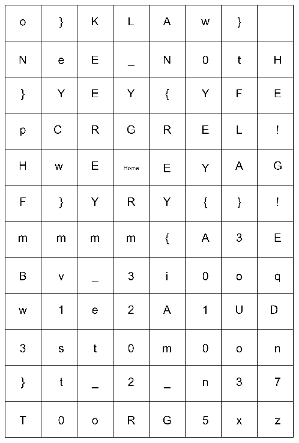

### Grey Divers (155 Solves, 100 Pts)
We are given the description,
```
Grey Cat has recently got into playing Hell Divers 2 before it disappeared and left this note behind:

Eagle 500 Kg Bomb
GL-21 Grenade Launcher
MD-I4 Incendiary Mines
Orbital Gas Strike
Orbital Airburst Strike
Eagle Rearm
Eagle 110MM Rocket Pods
Can you decipher what it is trying to say?
```
as well as an image file, 

Now in the game Hell Divers 2, these words correspond to Strategems that players can summon to aid them. Hilariously in order to summon them you must enter a sequence of `UP` `DOWN` `LEFT` `RIGHT` arrow keys. We use a website to decode the arrow keys, and apply them onto the png to obtain the flag.
