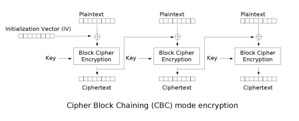
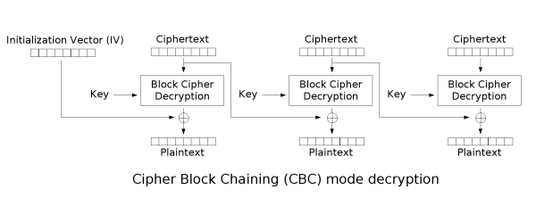
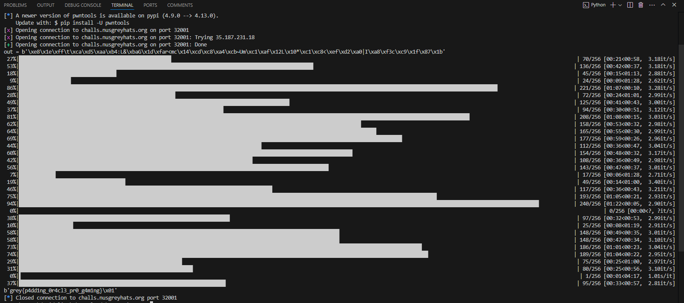

### Intro to AES 2 🩸 | 17 Solves 977 Points

`aes-school-2.py`
```py
from Crypto.Cipher import AES
from Crypto.Util.Padding import pad, unpad
import os

with open("flag.txt", "r") as f:
    flag = f.read()

assert(len(flag) == 31)

key = os.urandom(16)
iv = os.urandom(16)

def encrypt(message):
    cipher = AES.new(key, AES.MODE_CBC, iv)
    padded_message = pad(iv + message, 16)
    ciphertext = cipher.encrypt(padded_message)
    return ciphertext

def decrypt(ciphertext):
    cipher = AES.new(key, AES.MODE_CBC, iv)
    try:
        padded_message = cipher.decrypt(ciphertext)
        message = unpad(padded_message, 16)
        return True
    except:
        return False

menu = """
Enter an option:
[1] Encrypt flag
[2] Decrypt
[3] Exit
> """

def main():

    while True:
        option = input(menu).strip()

        if option == "1":

            print(f"Encrypted flag: {encrypt(flag.encode()).hex()}")
                        
        elif option == "2":

            msg = bytes.fromhex(input("Enter encrypted message (hex): "))
            
            if decrypt(msg):
                print("Message received!")
            else:
                print("Something wrong!")
                
        else:
            exit(0)

if __name__ == "__main__":
    main()
```

We see the same server oracle as in [Intro to AES 1](crypto_intro_to_aes.md) but this time `CBC` is used as the AES encryption mode.

This time however, the server defines a `iv`, `key`, and then given a message to encrypt `msg`, returns `AES_CBC(key, iv, iv+msg)`. It does this on the flag and returns this value to us.

We have access to a decryption oracle whereby it decrypts `msg` directly without `iv+msg`, but it returns `True` or `False` depending on whether the decryption had been successful.

But what exactly is CBC encryption/decryption?

### AES CBC Mode


AES CBC is simply put an extension of AES ECB. A key weakness in AES ECB is that the same 16 bytes will always encrypt/decrypt to the same 16 bytes. AES CBC tries to circumvent this flaw by having results from the previous block affect the current block.

When encrypting a plaintext block, CBC mode first xors it with the output result of the previous ciphertext block; It then runs it through AES ECB and outputs the ciphertext. This "chains" blocks together, hence its name, `Cipher Block Chaining (CBC)`.

In the challenge, `iv+flag` is being encrypted. Thus, if we view the 48-byte output of the encrypted flag (which you get when you ncat to the server), we essentially have our blocks


```
           C0         |         C1       |        C2
           =                    =                 = 
AES_ECB(NULL_byte*16) | AES_ECB(F0 ^ C0) | AES_EBC(F1 ^ C1)
```

where `F0`, `F1` denote our flag in 16 byte blocks.

An interesting thing to note is we can take `C0` as our "iv", manner of speaking, and running CBC decrypt on `C1 | C2` would decrypt into `F0` and `F1`.

But we can't just get the flag, as we only receive a True or False on whether our decryption would succeed. Wouldn't this always be True?

### CBC Padding Oracle Attack!

Not exactly. A key observation here is that `message = unpad(padded_message, 16)` is called in `decrypt()`. `unpad()` takes the last byte value of the padded_message and removes that many bytes off of the message, thus "unpadding" a padded message.

Normally, if your message is say, 15 blocks, 1 block of padding will be needed and thus pycryptodome appends your message with `b'\x01'` before encryption. When decrypting, it'll receive your message + `b'\x01'`. `unpad()` would detect this `b'\x01'` and remove exactly 1 byte from the end, thus returning your message. To prevent `unpad()` from taking off your message, `unpad()` makes sure that the bytes its removing are all the same value; A 12 byte valid padding would be `b'\x0c\x0c..\x0c` 12 times, etc.

Thus, consider if we mess with block `C2`, such that the decrypted output no longer ends on its proper padding block. `unpad()` would return an error, and thus `decrypt()` would return False. `decrypt()` would only return True if the message has been decrypted to contain a valid padding.

Inverting our CBC encryption diagram we get;


Notice how the previous block is used to xor with the output of `AES_ECB_decrypt()` to get the plaintext.

Suppose we want to say, determine the last byte value of our flag. We'll let `F0` and `F1` denote our 16 byte flag blocks, `C0` and `C1` as their encrypted counterparts and set our goal to determine the last value of `F1`. We'll let this value be `x`.

What we can do is change the last byte of `C0`. There's only 256 possibilities for this byte to take, and when we do so there are only 2 possibilities for a successful `unpad()`.

1. The last byte of `AES_ECB_Decrypt(F1)` is xored with an unmodified `C0`, thus returning a valid result. Let the unmodified last byte of `C0` be `y0`.
2. The last byte of `AES_ECB_Decrypt(F1)` is xored with a modified `F0` byte to get `b'\x01'`. `unpad()` here would work as it'll strip just one byte, and not return an error. Suppose in this scenario the last byte of `C0` is `y1`.

We can thus construct an equation,

```
x ^ y0 == AES_ECB_DECRYPT(C1_last_byte) == 0x01 ^ y1
Therefore,
x == 0x01 ^ y0 ^ y1
```

And thus we recover the value of `x`. Now, to get the second last value we aim to produce a valid padding of `\x02\x02` (we can now customise the last byte of a decrypted `C1` to be anything having now known the last byte of `F1`), and thus recover the next character of the flag.

This attack to slowly recover the flag character by character is known as a CBC Padding Oracle Attack.

All we need to do is to implement the attack on the server, and recover the flag.

`solve.py`
```py
from pwn import remote, xor
from tqdm import trange

io = remote('challs.nusgreyhats.org', 32001)
io.recv().decode()

def oracle(iv, ct):
    io.sendline(b"2")
    io.recvuntil(b"encrypted message (hex): ")
    io.sendline((iv.hex() + ct.hex()).encode())
    return b'Message' in io.recvline()

io.sendline(b"1")
io.recvuntil(b"flag: ")
out = bytes.fromhex(io.recvline().rstrip().decode())
print(f'{out = }')
iv, ct = out[:16], out[16:]

def attack_block(padding_oracle, iv, c):
    r = bytes()
    for i in reversed(range(16)):
        s = bytes([16 - i] * (16 - i))
        for b in trange(256):
            iv_ = bytes(i) + xor(s, bytes([b]) + r)
            if padding_oracle(iv_, c):
                r = bytes([b]) + r
                break
    return xor(iv, r)

def attack(padding_oracle, iv, c):
    p = attack_block(padding_oracle, iv, c[0:16])
    for i in range(16, len(c), 16):
        p += attack_block(padding_oracle, c[i - 16:i], c[i:i + 16])
    return p

sol = attack(oracle, iv, ct)
print(sol)
# grey{p4dd1ng_0r4cl3_pr0_g4m1ng}
```
