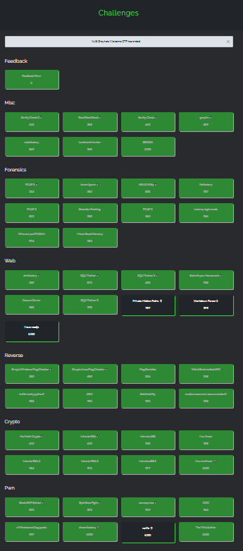

## Introduction

hi hi am Crypto CTF hobbyist Warri

Recently I participated in NUS Greyhats Welcome CTF 2024. A friend `elijah5399`asked if I could play in his team `G04T3DP30PL3`, after which we managed to get `1st` with a total score of `35493` points, myself having acquired `16130`.

Throughout the 48 hours we managed to solve 46 out of the 50 challenges.

Overall the CTF was quite engaging and fun. In addition, as compared to last year I was able to solve all of the crypto challenges! ^_^

This set of writeups will include the challenges I'd solved. In a similar vein to last year I will dump what I know of the encryption algorithms featured in the ctfs, primarily `RSA`, `AES` and some bit of `Linear Algebra`.

Writeups will be provided for the following challenges that I was able to solve;

## Crypto
### [No Math Crypto 🍼 | 89 Solves 50 Points](crypto_no_math_crypto.md)
Modern cryptography uses so much math anyway, right?
### [Intro to RSA 🍼 | 66 Solves 620 Points](crypto_intro_to_rsa.md)
Basic RSA time!
### [Intro to RSA 2 | 21 Solves 964 Points](crypto_intro_to_rsa_2.md)
RSA but harder
### [Intro to RSA 3 | 19 Solves 961 Points](crypto_intro_to_rsa_3.md)
RSA but harder^2
### [Intro to AES 🩸 | 30 Solves 925 Points](crypto_intro_to_aes.md)
A quick introduction to AES and block ciphers! (and sizes)
### [Intro to AES 2 🩸 | 17 Solves 977 Points](crypto_intro_to_aes_2.md)
CBC Padding Oracle
### [I Luv Linear 🩸 | 28 Solves 939 Points](crypto_i_luv_linear.md)
Xoring must be so confusing...
### [I Luv NonLinear 💀 | 4 Solves 1000 Points](crypto_i_luv_nonlinear.md)
Solving for polynomial roots modulo composites!

## Rev
### Simple Windows Flag Checker 🍼 | 84 Solves 380 Points
How does one reverse engineer?
### Flag Roulette | 45 Solves 826 Points
Do we need to get lucky or get cheeky?
### Weird Brainrotted APK | 30 Solves 925 Points
Different OS, same methodology
### Is This Really Python? 🩸 | 14 Solves 985 Points
Python Compiled executables aren't that hard...are they?
### ASM | 12 Solves 990 Points
Assembly enjoyers will enjoy this
### Random Secure or Secure Random 🩸 | 9 Solves 995 Points
Cheesing srand() with rng and staggering

## Pwn
### r/WholesomeCopypasta 🩸 | 7 Solves 997 Points
A very well hidden buffer overflow
### DreamFactory 💀 🩸 | 2 Solves 1000 Points
My first heap challenge!

## Web
### [aimfactory 🍼 | 92 Solves 255 Points](web_aimfactory.md)
Sending HTTP requests with curl
### [SQLi Trainer 🍼 | 70 Solves 572 Points](web_sqli_trainer.md)
SQLi Injection, made easier!
### [SQLi Trainer 2 🍼 | 66 Solves 620 Points](web_sqli_trainer_2.md)
A really huge unintended
