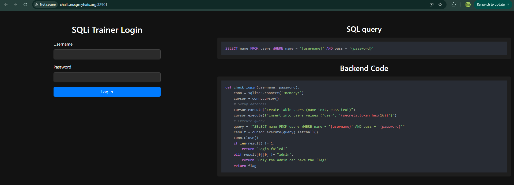
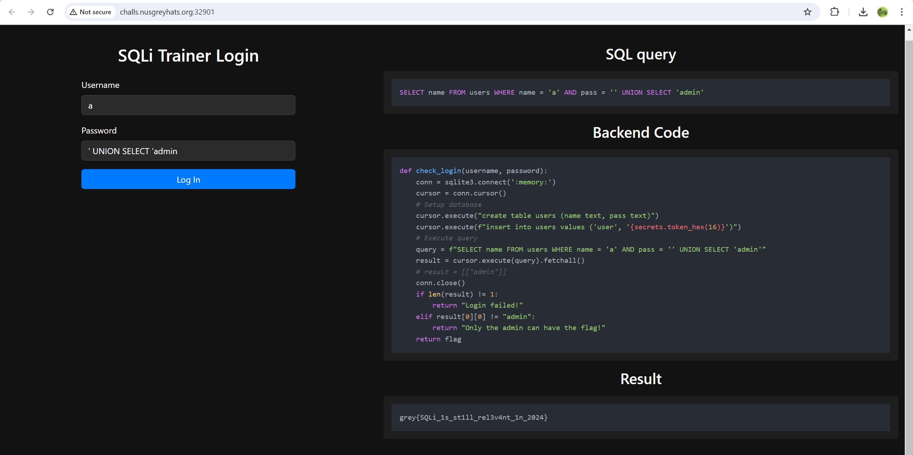

### SQLi Trainer 🍼 | 70 Solves 572 Points
```
SQL is the most common language used to query relational databases.

However, it is easy for programmers to create a situation where user-controlled data is insecurely inserted into a SQL query.

Can you exploit it?

Author: jro
```

Accessing the website shows a very nice login page with additional features showing the SQL query the login page is running as well as what would appear in the Backend Code. This is actually pretty well done for a challenge meant to introduce one to SQL injection, as it shows you everything that is going on!



We look at `check_login()` and observe the following;

```py
def check_login(username, password):
    conn = sqlite3.connect(':memory:')
    cursor = conn.cursor()
    # Setup database
    cursor.execute("create table users (name text, pass text)")
    cursor.execute(f"insert into users values ('user', '{secrets.token_hex(16)}')")
    # Execute query
    query = f"SELECT name FROM users WHERE name = '{username}' AND pass = '{password}'"
    result = cursor.execute(query).fetchall()
    conn.close()
    if len(result) != 1:
        return "Login failed!"
    elif result[0][0] != "admin":
        return "Only the admin can have the flag!"
    return flag
```
We need to find a way for `result[0][0]` to be `admin` to obtain the flag. This `result` comes from executing our SQL query, so we'll have to find a way to get the query to return admin! We also have that `admin` itself doesn't seem to be present in the database either.

SQL itself is a querying language that can be used to query data from a database. Among its commands lie `UNION`, which takes two `SELECT` queries, attempts to merge them together, and returns a result.

Since `SELECT 'admin'` would just output `admin` in SQL, we attach a `UNION` to it when entering the `Password` field so that the result will be added into an otherwise empty result. We mess with the `'`s in the query and submit

`' UNION SELECT 'admin` into the password field.

Now, our query would become

```sql
SELECT name FROM users WHERE name = '' AND pass = '' UNION SELECT 'admin'
```

`SELECT name FROM users WHERE name = '' AND pass = ''` returns nothing, whereas `SELECT 'admin'` returns `admin`. This results in our result to be `[["admin"]]`, thus passing the check and printing the flag.



`grey{SQLi_1s_st1ll_rel3v4nt_1n_2024}`