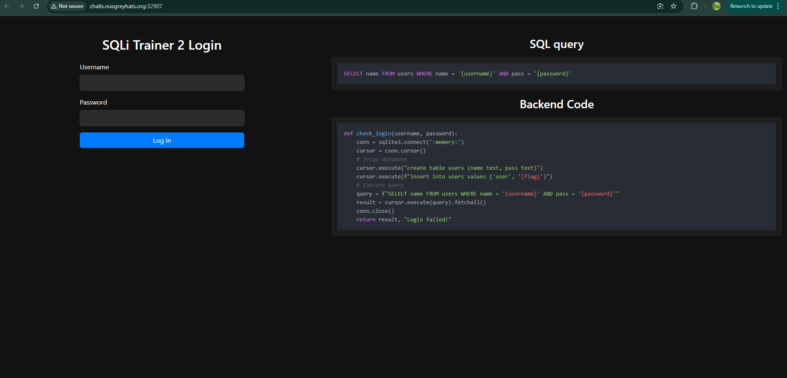
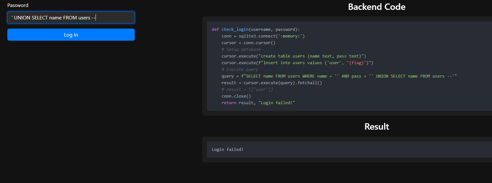
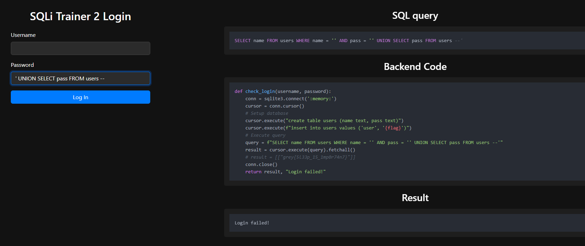

### SQLi Trainer 2 🍼 | 66 Solves 620 Points
```
We disabled the login :)

Author: jro
```

The interface is now different. As the description, mentioned, there's no `Result` section. Well, there is when you enter something, but it always prints `Login failed!`



The backend code is modified as well, and we see that the flag is now in the `pass` column of the `users` table.

```py
def check_login(username, password):
    conn = sqlite3.connect(':memory:')
    cursor = conn.cursor()
    # Setup database
    cursor.execute("create table users (name text, pass text)")
    cursor.execute(f"insert into users values ('user', '{flag}')")
    # Execute query
    query = f"SELECT name FROM users WHERE name = '{username}' AND pass = '{password}'"
    result = cursor.execute(query).fetchall()
    conn.close()
    return result, "Login failed!"
```

Everything looks over until you realise that they kept the `# result = ` line from before. 



What was originally meant to help the user learn how to sqli inject has now backfired on their part, because we can simply replicate the UNION query and copy the result from the code!



`grey{5l33p_15_1mp0r74n7}`

As it turns out this was, in fact, a huge unintended. The creator told me that they'd fix it in a new challenge, `Sqli Trainer 3`. I'll cover the intended solution in there.