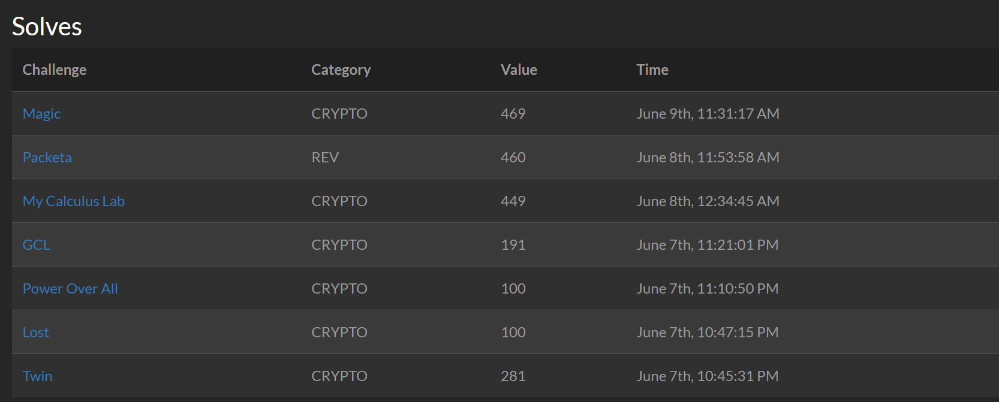

# AKASEC24 Writeups

Played as `Warri` under team `World Wide Flags`. We achieved `3rd` with a total score of `12648` points. I'd managed to almost full clear the crypto category. All in all I've managed to secure `2050` points for my team.

Here are my solved challenges;

Writeups will be provided for all the `Crypto` challenges, as well as the `Rev` challenge `paketa` which I'd managed to solve along the way.

## Crypto
### [Lost (95 Solves, 100 Pts)](crypto_lost.md)
Coppersmith attack...odd that there's so much solves compared to twin, which is so much easier to derive the vulnerability from!
### [Power Over All (100 Pts)](crypto_power_over_all.md)
A Very Brief Intro to Quadratic Residues!
### [GCL (45 Solves, 191 Pts)](crypto_gcl.md)
A non-RSA challenge that involves some bit of linear algebra
### [Twin (38 Solves, 281 Pts)](crypto_twin.md)
GCD and its use in the Franklin-Reiter related message attack on RSA!
### [My Calculus Lab (19 Solves, 449 Pts)](crypto_calculus.md)
Differential Equations?? In Cryptography?? :O
### [Magic (15 Solves, 469 Pts)](crypto_magic.md)
Blackbox Crypto?
### [DODOLOUF (4 Solves, 499 Pts)] (WIP)
Upsolved, thanks teammates!!

## Rev
### [paketa (17 Solves, 461 Pts)] (WIP)
A binary that modifies other binaries