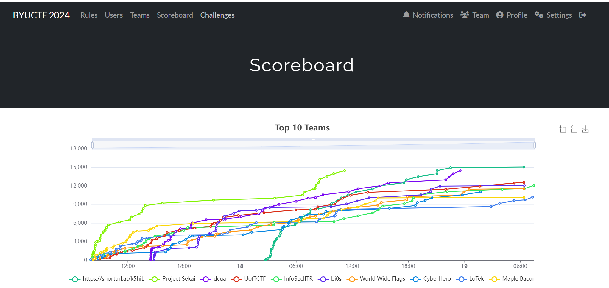
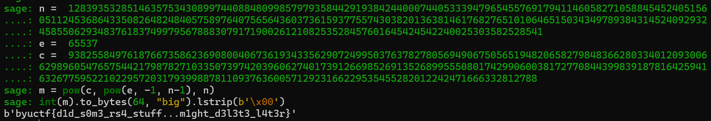
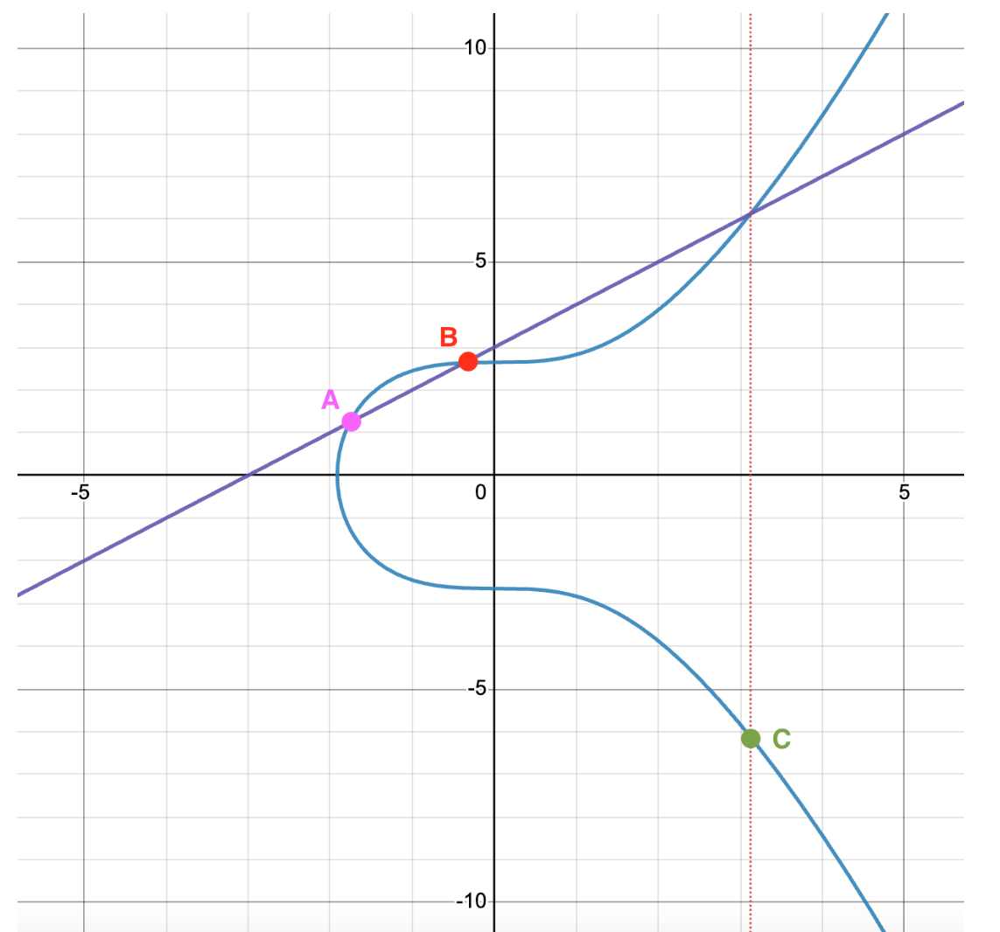
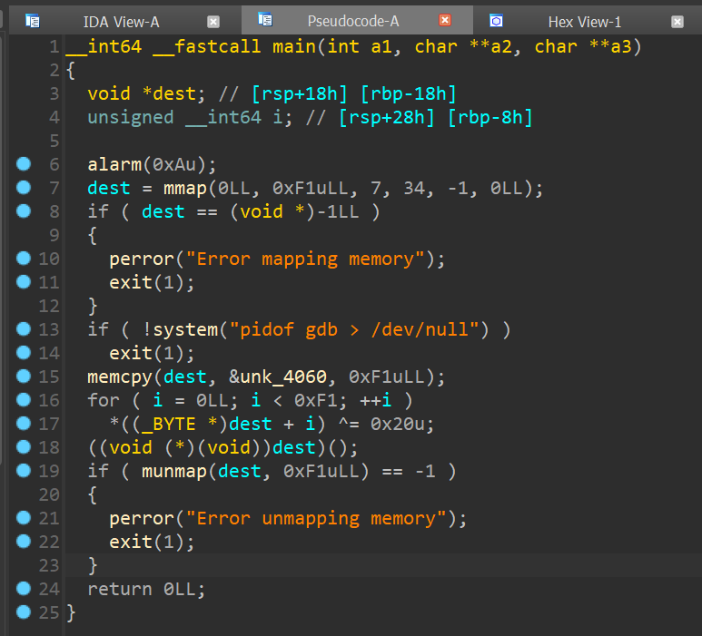
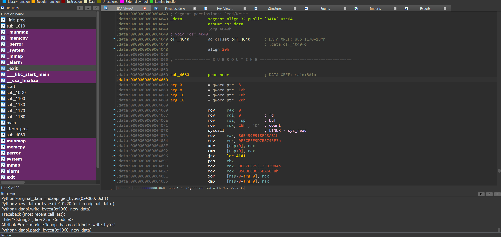

Played as `Warri` under team `World Wide Flags`, scoring `7th`:



Overall the challenges were quite fun, especially for a begineer cryptography player. I'd provide writeups for these challenges which I've solved:

[Crypto](#crypto), full cleared!
- [Are S A](#are-s-a-353-solves-100-pts)
- [Do Math!](#do-math-198-solves-100-pts)
- [Times](#times-154-solves-122-pts)
- [Austen Supremacy](#austen-supremacy-76-solves-400-pts)
- [Give Up](#give-up-54-solves-451-pts)
- [Cookie Cutter](#cookie-cutter-40-solves-447-pts)

[Rev](#rev)
- [Musles](#musles-108-solves-297-pts)


## Crypto

### Are S A (353 Solves, 100 Pts)
```
Found these keys... wonder what they do...

Author: overllama
```

We are given one `cne.txt`
```
n =  128393532851463575343089974408848099857979358442919384244000744053339479654557691794114605827105884545240515605112453686433508264824840575897640756564360373615937755743038201363814617682765101064651503434978938431452409293245855062934837618374997956788830791719002612108253528457601645424542240025303582528541
e =  65537
c =  93825584976187667358623690800406736193433562907249950376378278056949067505651948206582798483662803340120930066298960547657544217987827103350739742039606274017391266985269135268995550801742990600381727708443998391878164259416326775952210229572031793998878110937636005712923166229535455282012242471666332812788
```

It is rather obvious that this is a standard RSA challenge. `c` represents an encrypted message, which in RSA is computed by `pow(m, e, n)`, or m to the power of e modulo n where m is our message.

Normally to decrypt our message we need to compute the euler-totient function of `n`. This is defined as the number of integers less than n that are coprime to n. Once we have this value, `phi`. This has the special property where any integer `x` coprime to `n` satisfies `pow(x, phi, n) == 1`.

From this, we compute `d = pow(e, -1, phi)`, i.e. some value `d` such that `e*d == 1 mod phi`, and so we can perform RSA Decryption. This works because, `c**d % n == m**(ed) % n == m**(1 + k*phi) % n` for some positive integer `k`. Assuming `m` is coprime to `n`, `m**phi == 1 mod n`, so we can reduce `m**(1 + k*phi) % n` into `(m * (m**phi)**k) % n == (m * (1)) % n == m`.

In this scenario, notice that `n` is a prime number. Considering the definition of coprime, we can deduce that the euler-totient function of `n` is simply `n-1`.

We thus compute `m == pow(c, pow(e, -1, (n-1)), n)`. Converting this to bytes gives us the flag, `byuctf{d1d_s0m3_rs4_stuff...m1ght_d3l3t3_l4t3r}`



### Do Math! (198 Solves, 100 Pts)
```
We need to... do math... as cybersecurity people?

Author: overllama
```
`hints.txt`
```
139720796479374556837839656652540122243007626643381344885901610199769037583634859417560062099728477295868135937894154388536029033912020951046531754291314791576993247093854916427453824336759832613456125812748403327889942337175444534747145584776834634064449332853034222211593992834883804382517469285134615410890552305298817475187104100695214559355963632453798058802239812117081224193187059004755477271402390752746056934083349914720924964985477019671678390124249156133520641131604245493150059531952315986192987567065110493172095513743268697649505813042269117318549842022700777738416504972716492827707238521250172037318878143246460022194896022766776466227648684930789197508257683373695856981117703510481288986657838150127977468181944992384721842001507170848236471999364207702040065244954529595083994706530374178265246266208976848057249872581824068627294869707076024048278537255430854746383501311236149901970358224464288450149417182216604149405350753982608481484751293575534659469072597038338901449655999077721897580555611253838587088501901572616461450861745788408043293875298899352407738097625467580303774153287504872955432866806079131615030274791176371691768412142419959913433427391907036538199289877381635262505011128001699263122593284

Hints:
[3866294283908370861488986000247430995139186777220357990541055308702037903707384419423826283009132248692192568975203597042009355399751936100480421867341262040737335017123404203927518302827224118229709057228844492753128565357229482359457659966763272646136725283420820796129854472327550520891881208553820989688970427173391779160328649128965136830927404708686730062768841805259990187621992590852687212330417117067906587029875088101166137216351257406367577019997777742867451002173150225957848519180489818297384281682372264975637602389081091911467851281502569478148563215408599772010672364892477652656268001246468514425572021865614220946751853939700620295254407108799251461268851704487486728227236288824048447378581527785367882502867237075440070362693035674677027413684269498945804901755587247582322297029281275913387627689148848411252531896135606049738961803492931831122200762928595785709487784007811064183007593040168953263448181, 3628649695417460562172315261919165549043709593963503335633087846193794925198669443396537711332099330001416771156961283691343877982787723314413110851552024591560420907598588654415705537840898104729737254424204341334008689904573725591551271495102747863837555230824843453350167486014731395948048241691669379097480994057380944391213218649036555692918223032157752111895389190246951731910248198877398965517057737869448282964672470635140939878517426671416232457280765097915904253546503591339765427448900120467971088152395190903792335861055059645334706190248311102008158633420003128537123361250121418756284262680181162625189089585786519534003360535357373023868605497405375065020663001385969284820872120446799517915866964028007422550130397266344718281802740546407102127616395524152153311890940820982444627108375976777379289854717567836101253091116604854859258279919958749154303673140187091899274959707223049802204929874627255009584321, 9606157182439043598872170578642744168098944919513002317243547092783933349126951101232515925102167428847229467444361689353623296746504025201764596226132219569258571256816498179375058698409595725396407373236481359252082807579175910455629819860184585401808660079698789414010432185309643969322080617826789972798109957, 557390968116917607877829363093351805079737673251666125750855204507413143402951042823589767603012181329596501910433247254505703477712968699181752906601465941540893134510615975805428225313640362942516617107041546995371614895479364609820877616901492313825956284172514668995110591266769649498902747148214078714361551166533172720774906405292701625129746765757548911894868677588736464297617260842519992821649964146119541180510262047270950140275778830315152105356623177230353223220665627777554864341106987045510247473690102764921346736030282675873380368512116665379912859727258422298886737986021254816678486456826454925033239291650047977879536634028717942088022498515363228773843881827937421252602178359071343399447476754491530354384743821399856731847364080918633699509079462675749036708735344238989499995166818428663564724371054125511464923830553161827722791228424768893864021380022160450622251556525653648961057653640220274868294955432391214814287172091578650091455077186852210252878989421136057443331549592837248178676355257735098257090256064693810738952500512964294218575884615185180922564391962479167159265600516644421242874922033475612568848455701469155055417915197274344345456557389536486925426130886732646054713022908914774519923852, 538263264876077354278835844354365458289003736282580004677054552128799960628133201065342466271868332880472151805964559748587163918053898759995342752231465836218320104626514241981994011377537441291270452774317491283444142446329524198946300602994669355591759178978441313629896991014103751735455651944949762938101992757874865050589192612588675706284183796825755239043553260296843847013799071173149845196158533600143774705688501254062922926384860349063522338242622392704689866791927863138061957183884357032233632573654406351976706676481304143492464965841758188617909329042280820646392853320414528204206157140231060421944635609596250051670571066978639680472476220763605210759768914567896565243036517540789222487566763401584304485285323923448947626816957034490642108407129443007111596952122083030335946605937834876687675148654878527407472636832862085737586505525535611551828909946664736386297959830871761246381437499696168474217839502976413890295875917502613911304032843445910831763019415476699634154284015804165067691742346908709579361770440364434068760983291051680957726423921878988431317731871208086347006281329458475664817947601463446296166082328266979445064485183236719033479429938563313816672596875515581938722831214134371743273301812]
```
`domath_safe.py`
```py
from Crypto.Util.number import *

p = getPrime(2048)
q = getPrime(2048)
e = 0x10001
n = p * q
d = pow(e, -1, (p-1)*(q-1))

msg = "byuctf{REDACTED}"
m = bytes_to_long(msg.encode('utf-8'))

c = pow(m, e, n)

print(c)
print()

hints = [p, q, e, n, d]
for _ in range(len(hints)):
    hints[_] = (hints[_] * getPrime(1024)) % n
    if hints[_] == 0: hints[_] = (hints[_] - 1) % n

print("Hints:")
print(hints)
```

A quick run through of the code reveals that `hints.txt` essentially contains;

`c = pow(m, e, n)` for some unknown `m`

and `hints[]` containing:
- `p * r0 % n`
- `q * r1 % n`
- `e * r2 % n`
- `n * r3 % n`
- `d * r4 % n`

for some unknown primes `{r0, r1, r2, r3, r4}`. If these values equate to `0`, it gives the value minus 1 modulo-ed n instead.

We first notice that `n * r3 % n` will always be `0`, thus `hints[3] == n-1`. We increment this value to obtain `n`. We also know that `n` is some composite number with prime factors `p` and `q`. Notice that because `p` and `q` divide `n`, `p * r0 % n` will always be a factor of `p` and similarly `q * r1 % n` will always be a factor of `q`.

Thus, we use `gcd`, or greatest common divisor, to find the highest common factor between `n` and `hints[0]` to obtain `p`, and vice versa for `q`.

With the prime factorisation of `n` known, we derive the Euler-Totient function of `n` to be `(p-1)*(q-1)` (see its definition in [Are SA](#are-s-a-100-pts), proof will be left as an exercise to the reader). Subsequently we compute our `d` value knowing `e = 0x10001` and get our flag without issue;

```py
c = ...
hints = ...

from math import gcd

n = hints[3] + 1
p = gcd(hints[0], n)
q = gcd(hints[1], n)
phi = (p-1)*(q-1)
d = pow(0x10001, -1, phi)
m = pow(c, d, n)
print(m.to_bytes(64, "big").lstrip(b"\x00"))
# b'byuctf{th3_g00d_m4th_1snt_th4t_h4rd}'
```

### Times (154 Solves, 122 Pts)
```
It's just multiplication... right?

Author: overllama
```

`mulsafe.py`
```py
import hashlib
from Crypto.Cipher import AES 
from Crypto.Util.Padding import pad, unpad
from ellipticcurve import * # I'll use my own library for this
from base64 import b64encode
import os
from Crypto.Util.number import getPrime

def encrypt_flag(shared_secret: int, plaintext: str):
    iv = os.urandom(AES.block_size)

    #get AES key from shared secret
    sha1 = hashlib.sha1()
    sha1.update(str(shared_secret).encode('ascii'))
    key = sha1.digest()[:16]

    #encrypt flag
    plaintext = pad(plaintext.encode('ascii'), AES.block_size)
    cipher = AES.new(key, AES.MODE_CBC, iv)
    ciphertext = cipher.encrypt(plaintext)

    return { "ciphertext" : b64encode(ciphertext), "iv" : b64encode(iv) }
    
def main():
    the_curve = EllipticCurve(13, 245, getPrime(128))
    start_point = None
    while start_point is None:
        x = getPrime(64)
        start_point = the_curve.point(x)
    print("Curve: ", the_curve)
    print("Point: ", start_point)
    new_point = start_point * 1337

    flag = "byuctf{REDACTED}"
    print(encrypt_flag(new_point.x, flag))

if __name__ == "__main__":
    main()
```

`times.txt`
```
Curve:  y^2 = x**3 + 13x + 245 % 335135809459196851603485825030548860907
Point:  (14592775108451646097, 237729200841118959448447480561827799984)
{'ciphertext': b'SllGMo5gxalFG9g8j4KO0cIbXeub0CM2VAWzXo3nbIxMqy1Hl4f+dGwhM9sm793NikYA0EjxvFyRMcU2tKj54Q==', 'iv': b'MWkMvRmhFy2vAO9Be9Depw=='}
```

This seems pretty simple. We define an `Elliptic Curve`, which is an equation which in this case is of the form `y^2 == x^3 + 13x + 245`, and we define all values to be modulo some 128-bit prime, which we see in `times.txt` as `mod 335135809459196851603485825030548860907`. This curve will consist of all possible integer values `(x,y)` that satisfies the above equation.

We notice a random `start_point` defined on the curve, which we're told in `times.txt` as well. We need to calculate `start_point * 1337`, whose x cooridnate is used as a secret key for an AES encrypted flag.

Elliptic Curves support scalar multiplication, where a point is multiplied by some integer. In this case, we have `start_point * 1337` which is just `start_point + start_point + start_point + ...` (1337 times).

Point addition for any two coordinates on an elliptic curve works as follows. (Diagram was taken from [here](https://www.rareskills.io/post/elliptic-curve-addition))



Given two points `A` and `B` on the curve, draw a line that cuts through them. By the innate properties of the curve, this line will intersect at some third point. Flip the y-coordinate of the point, and this new point `C` is defined as `A + B`.

When two points `A` and `B` are the same, we define the line drawn as the line tangent to `A` on the curve. One can employ a series of calculus and mathematics to deduce a function to compute curve point addition, or directly invoke Sagemath's Elliptic Curve utility;

```py
sage: p = 335135809459196851603485825030548860907
sage: E = EllipticCurve(GF(p), [13, 245])
sage: G = E.lift_x(14592775108451646097)
sage: P = G * 1337
sage: Px = P[0]
sage: Px
130102914376597655583988556541378621904
```

```py
from base64 import b64decode
from Crypto.Cipher import AES
import hashlib

iv = b64decode(b'MWkMvRmhFy2vAO9Be9Depw==')
key = hashlib.sha1(b"130102914376597655583988556541378621904").digest()[:16]
cipher = AES.new(key, AES.MODE_CBC, iv)
print(cipher.decrypt(b64decode(b'SllGMo5gxalFG9g8j4KO0cIbXeub0CM2VAWzXo3nbIxMqy1Hl4f+dGwhM9sm793NikYA0EjxvFyRMcU2tKj54Q==')))
# b'byuctf{mult1pl1c4t10n_just_g0t_s0_much_m0r3_c0mpl1c4t3d}\x08\x08\x08\x08\x08\x08\x08\x08'
```

### Austen Supremacy (76 Solves, 400 Pts)
Ah, now we move onto the low-skill, just-guess crypto challenges. As much as I generally dislike them, there is some appeal to those who enjoy performing guess-the-cipher challenges.

```
Lydia loves Jane Austen. In fact, her favorite book is Pride and Prejudice. Her and her friends like to talk about the book together, but recently Lydia has started encoding her messages. Unfortunately Lydia's friends don't understand her secret code -- could you help them out and identify the secret message?

Flag format - byuctf{secretmessage}

1.1.1 8.9.8 10.2.11 4.14.28 61.2.4 47.10.3 23.7.37 41.12.4 17.6.10 1.1.21

Author: cybercomet
```

The book in question is `Pride and Prejudice`, and from how we have a sequence of 3 numbers dotted, it seems to be some sort of book cipher, where each number corresponds to a chapter, paragaph, word or even letter.

I noticed that the book itself has about 62 chapters, and guessed it to be `chapter.paragraph.letter`. This does prove effective, and from an online book decoded the secret message to be `ilovedarcy`. Thus getting the flag,

`byuctf{ilovedarcy}`

### Give Up (54 Solves, 451 Pts)
Another guessy crypto chall.
```
Something about running maybe? All I remember is that it was XOveR and OveR again. And I mean OveR and OveR and OveR again like a ton of times.

Author: overllama
```

The contents of the distributed `you.txt` can be found in the link below.

Guess that the xor key (deduced due to the presence of 'XOveR') is the lyrics to Rick Astley's hit song [Never Gonna Give You Up](https://www.youtube.com/watch?v=dQw4w9WgXcQ). (reasons on why you can derive this, possibly: "running" "you" "give (you) up") Dumping it as a xor key along with some guessiness leads us to the flag, `byuctf{n3v3r_g0nn4_r3us3_4_k3y}`.

For reference, see [here](https://gchq.github.io/CyberChef/#recipe=From_Hex('Auto')XOR(%7B'option':'UTF8','string':'byuctf%7Bn3v3r_g0nn4_r3us3_4_k3y%7D'%7D,'Standard',false)&input=MzUxYzUyMTExMTQ2MTUwMTEzMDU0NzAwM2UwOTU3MGIxYzQ3N2YwNjVjNTUxZjVjMjk1MTU1MzI1YzBjNWQwOTE3MWExNDU0MTIxMzBiMTMwNDQ2MWUzYTE0MTAwZjAwNTA3ZjAxNWM1NTE3NWM3ZjdkN2Y0MzU3MTY1ZDJiNTA3ZjIyNTQwMDBlMDI1ZjU2NTAxZDMyMGE1OTFhMDM1MTMxMDYxNDA2NTM0NDM3NTUyYjRiN2E1ZTEwNDIwZDFkMGExYTBkMTIwMDU0NTY1YzE0NTUzZTVmMWI0ZTQzMzAwNzVmMTExZDE0MmIxNDM4MGU0NzU5MDkwYTEwMDY0MzEyMTQxNDAzMTMxNzVkMGI3ZjA4NDQwNjBiNDY3ZjE1NDYwYzc5MzkxNjE0MzUxZTQwMGQ1ZDE1MTgxYjBkMTU0NjBmMGI1ZjFhMTMwYjMwMTIxMDA2MDE0MzdmM2IxNDE4NTM1NTNhNTEzMzAyNWQxZTc3MjUxNjAxMTcxNTQ2MTYwZjU4MTMxMzBiMzAxMjEwMWIwMDUwM2EwMDQwMDExMjVkM2IzZTU1MjU1NjBmMTgxMDU5MTIwYzFhMDgxYTRlNTQxZjQ1MTc3ZjFlNWYxYjRlNDEyZjc4N2QxMDA1NTYyZDE0MzgwNDVkMTcxYzQyMTUxMDE3NTQxZjE0MWIxMzEyNWMwNTMxNmQ3ZTBiMTg1MTJkNTI1NDFhMWQ1ZDNlMTQyZDFlNWQ1OTFjMTAxNjAwMGQxMDQ2MWEwMDU3NTY1NzE3MmMwMjQyMWE0ZTRkMzAwNzM5M2IxNjQ1M2E0NjdmMGM1YzE3MTMwMzU5MTgwMjFmMDM1YjE3NWMwMzEzMTEyZDFlM2EyMDBiNDIzYTAwMTMxMjFjNWQzMTU1N2YxODUyMDA1ZDA1MTYxYTA3MTYxZjFlNjQ3ZDEzNDUxNzJkNDc1NzAxMDA1YTNlNTI0NzEwMWY1ZjdmNTU3ZjA3NWExYzVkMDMxNzExNDMxYzEzMDkxYTEzMGY1YzA3NTU2ZDY3MGI0OTQyM2E1MjU4MWIxYzQ0MzExNDNhMGE1MDExNWQwZDBkMWQwNjA2NDYxZDAxNDE1NjQwMWQ3ZjBiNWYwMDA5M2UwNjFkNDYwNzUzNWIzYTU1MmQxZjE0MGE1ZDAwMWMxMDBkNTQwNzE4MDY1YTE4NTQ1ZTdmMDU0NTFhNGU0ZDMwMDcxNDA3MTYxMzJiNWIzMDRiNDAxMTA0NDIwZDFhNDMwNzA3MDI0ZTVhMDIxMzVhMmMwNjQ5NGUwNzQwNzY3ODdhMWIwMDVhM2I1MTczNGI0NDFjNWQwMDE2MDEwYjU0MGQxNTAxNDQ1NjQ0MWEzZTEzMTcxZDRlNTYzYTE3NWQ1NTE0NWMzNjVhMzg0YjVjMTc1ZDRhMWUxYTBhMWEwMTViMDE1ZDVmMzkyNTNhNDc1YjAwMDE0MzdmMDY1YjEwNTM1NDNlNTkzYTRiNTIxNzE5NDIwZTEwNDQwNjAzNWIwOTVjMTg1ZDEzN2YxNzVjMGYxNzE0MzYwNjM5N2YzMjVkM2IxNDM2MGQxMzAwMTIxNzU5MTQxMDFmNDYxNjBiMTMxZTVjMDU3ZjJlMTcwMzRlNTIzYTE3NWYxYzFkNTQ1NTcwMzAwNTE0MGQ1ZDE2MWMxOTBmNTQwYjFlNGU0YTE5NDY1NTJkMDIxMDFhMDE1YjdmMTA1ZjFjMWQ1NzdmNDAzMDRiNDAxYzE4Njg3MzNiMDYwMjAzMDk0ZTU0MTk1ZDFjM2U0NzU3MDcxODUxN2YwYjVjMDA1MzQ2MmYzZTExMGU0NTFjMGY0MjFlMWEwZDFhMDc1YjAyNTYwMjEzMGIzMDEyMTAwYTAxNDMzMTc4N2QxMDA1NTYyZDE0MzgwNDVkMTcxYzQyMGIwMDBkNTQwNzA5MDE0NjE4NTc1MjNlMDk1NDRlMGE1MTJjMTc0MTAxNTM0YTMwNDE1NTI1NTYwZjE4MTA1OTEyMGMxYTA4MWE0ZTVlMTc1ODE3N2YxZTVmMWI0ZTU3MmQwYjM5M2IxNjQ1M2E0NjdmMGM1YzE3MTMwMzU5MDYwMjBkNDYxYzAxNWMxMjUxMGIzYTZkN2UwYjE4NTEyZDUyNTQxYTFkNWQzZTE0MmIwZTVmMTU1ZDAzNTkxOTBhMTE0NjFhMDA1NzU2NWIwNzJkMTMxMDE3MDE0MTU1Nzg3ZDEwMDU1NjJkMTQzODA0NWQxNzFjNDIxZTFjMTUxMTQ2MDIwMTQ2NTY0NjAyNTUyOTU1MTgwYjQ2N2YxNTVjMWIxZDUyN2Y1ODNhMWYxMzAwMTIxNzU5MTEwYzAzMDg3MTIwNTYwMDU2MDA3ZjAwNWYwMDAwNTU3ZjAwNDYxYjUzNTIyZDViMmEwNTU3NTkxYzBjMWQ1NTA3MTExNTFlMWM0NzU2NGExZDJhNmQ3ZTBiMTg1MTJkNTI1NDFhMWQ1ZDNlMTQzMjBhNTgxYzVkMWIxNjAwNDMxNzE0MDI2NDdkMTM0NTE3MmQ0NzU3MDEwMDVhM2U1MjQwMTQwYTEzMzg1YjMwMGY1MTAwMTg2ODM3MTAxNTExMTQ1YjA5NWMxODVkMTM3ZjEzNTUwMjAyMTQzZTUyNWYxYzE2MTMzZTVhM2I0YjViMGMwZjE2NTkwYzBjMDE2YzcxMzk1NjUxNDUxNzdmMGM1ZTAxMTk1YTdmMTc1MjE2MWIxMzMwNDAzNzBlNDE1OTFiMGQwYjU1MTAxYjQ2MTcwMTVkMTEzOTJiMzAxMjQyNGUwNjUxM2UwMDQ3NTIwMDEzM2Q1MTNhMDUxMzE4MWUwYTEwMWIwNDU4NDYxOTFiNDc1NjRhMWQyYTQwNDIwYjRlNDAzMDFkMTMwNjFiNGE3ZjQwMzA0YjQwMTgwNDQyMTAwMTQzNWMxMjE0NGU0MDE3NGE1MjM2MTMxOTY0Mjc1YTJjMWI1NzEwNWYxMzI4NTE3ZjA5NWMwZDE1NDIxMjFiMGMwMzQ2MGMwNjUyMDIxNDAxN2YwNTU1MGIwMDE0MzgxZDVhMWIxNDEzMzA1YTdmNDM1NDE2MTQwYzFlNTUwYzFhNGY3MTM5NTY1NjU4MWMzMDEwMTAxYTA2NTE3ZjE1NTIxODE2MTMzZTVhM2I0YjQ0MWM1YTEwMWM1NTA0MWIwODE1MGYxMzA2NWYxMzI2NDc1OTFhNjQzZTE2NTI1OTAwMDA0NzdmNDMzZTA1NWQxODVkMTYxYzE5MGY1NDFmMTQxYjEzMWU1YzA1N2YyZTE3MDM0ZTUyM2ExNzVmMWMxZDU0NTU3MzMwMWY0NzE4NWQwZjE4MWUwNjU0MWYxNDFiMTMwMzVkMTYzYTE1NDMxYTBmNWEzYjc4MzkzYjE2NDUzYTQ2N2YwYzVjMTcxMzAzNTkxMjBhMDIwMzViMTc1YzAzMTMwNzJmNmQ3ZTBiMTg1MTJkNTI1NDFhMWQ1ZDNlMTQzMzBlNDc1OTA0MGQwYzU1MDcxYjExMTU2NDdkMTM0NTE3MmQ0NzU3MDEwMDVhM2U1MjQxMDAxZDEzM2U0NjMwMWU1ZDFkNWQwMzE3MTE0MzEwMDMwODBiNDEwMjEzMGIzMDEyM2EyMDBiNDIzYTAwMTMxMjFjNWQzMTU1N2YwNjUyMTIxODQyMDAxYTE2NTQwNTA5MTczOTM4NTYwNDNhMTUxMDA5MDE1YTMxMTMxMzA2MTI0YTdmNTMzMDA0NTcxYjA0MDc3MzNiMDYwMjAzMDk0ZTU0MTk1ZDFjM2U0NzQ0MGIwMjU4N2YxMzEzMTkxYTU2N2Y1NTMxMGYxMzExMDgxMDBkNTUxYTFiMTM3MTY0N2QxMzQ1MTcyZDQ3NTcwMTAwNWEzZTUyNTQxYzA1NTY3ZjRkMzAxZTEzMGMwZDY4MzcxMDE1MTExNDViMDk1YzE4NWQxMzdmMGI1NTFhNGU0ZDMwMDcxMzExMWM0NDMxM2UxMTBlNDUxYzBmNDIxZTFhMGQxYTA3NWIxYzQ2MTgxMzEzMmQwODQ1MDAwYTE0M2UxYzU3NTUxNzU2MmM1MTJkMWYxMzAwMTIxNzczM2IwNjAyMDMwOTRlNTQxOTVkMWMzZTQ3NWQwZjA1NTE3ZjBiNWMwMDUzNTAyZDRkNTUyNTU2MGYxODEwNTkxMjBjMWEwODFhNGU0MDE3NGE1MjM4MDg1ZjBhMGM0ZDNhNzg3ZDEwMDU1NjJkMTQzODA0NWQxNzFjNDIwZDEwMGYxODQ2MWE0ZTVmMWY1NjUyM2UwOTU0NGUwNjQxMmQwNjEzMGMxYzQ2NTUzZTExMGU0NTFjMGY0MjFlMWEwZDFhMDc1YjA5NWEwMDU2NTIyNjA4NDU0ZTFiNDQ1NTNjNTYwMzE2NDE3ZjUzMzAwNTVkMTg1ZDBlMWMwMTQzMGQwOTBlNGU1NzE5NDQxYzU1Mjk1NTE4MGI0NjdmMTU1YzFiMWQ1MjdmNDYyYTA1MTMxODBmMGQwYzFiMDc1NDA3MTUwYTEzMTI1NjAxM2ExNTQ0NGUxNzViMmE3ODdkMTAwNTU2MmQxNDM4MDQ1ZDE3MWM0MjE0MTQwODExNDYwMjAxNDY1NjUwMDAyNjZkN2UwYjE4NTEyZDUyNTQxYTFkNWQzZTE0MmMwYTRhNTkxYTBkMTYxMTAxMGQwMzcxMjA1NjAwNTYwMDdmMDA1ZjAwMDA1NTdmMDY1NjE5MWYxMzNlMTQzMzAyNTY1OTFjMGMxZDU1MGIwMTE0MGY0ZTRhMTk0Ngo)

### Cookie Cutter (40 Solves, 447 Pts)
```
I know there are a bunch of vulnerabilities with JWT, so I wanted to use a different implementation to not leave my site vulnerable. This is my best shot.

https://cookiecutter.chal.cyberjousting.com
```
Hurray, we've returned to actual cryptography :D

`server.py`
```py
from flask import Flask, request, render_template, redirect, make_response
from Crypto import Random
from base64 import b64decode, b64encode
from Crypto.Cipher import AES
from Crypto.Util.Padding import pad, unpad

class ECBOracle:
    def __init__(self):
        self.key = Random.new().read(AES.block_size)

    def encrypt(self, data):
        cipher = AES.new(self.key, AES.MODE_ECB)
        return b64encode(cipher.encrypt(pad(data, AES.block_size))).decode()
    
    def decrypt(self, data):
        cipher = AES.new(self.key, AES.MODE_ECB)
        ciphertext = b64decode(data)
        return unpad(cipher.decrypt(ciphertext), AES.block_size)
    
class Profile:
    email = None
    last_uid = 0
    uid = None
    role = 'user'

    def __init__(self, email : str, uid=None, role=None):
        Profile.last_uid += 1
        if uid:
            self.uid = uid
        else:
            self.uid = Profile.last_uid
        if role:
            self.role = role
        else:
            self.role = 'user'
        self.email = email.replace('&','').replace('=','')

    def __str__(self):
        return f"email={self.email}&uid={self.uid}&role={self.role}"
    
def kvparse(input : str):
    finobj = {}
    key = True
    tempkey = ''
    tempval = ''
    for i in input:
        if i == '&':
            finobj[tempkey] = tempval
            tempkey = ''
            tempval = ''
            key = True
        elif i == '=':
            key = False
        elif key:
            tempkey += i
        else:
            tempval += i
    finobj[tempkey] = tempval
    return finobj

def profile_for(input : str):
    return Profile(input)

def get_user_input(inp : str, oracle : ECBOracle):
    prof = profile_for(inp)
    userinfo = oracle.encrypt(str(prof).encode())
    return userinfo

def decrypt_user_input(inp : bytes, oracle : ECBOracle):
    return Profile(**kvparse(oracle.decrypt(inp).decode()))

###########################################################################
############### The Flask Web Server part #################################
###########################################################################

app = Flask(__name__)

oracle = ECBOracle()

@app.route('/', methods=['GET'])
def login():
    return render_template('login.html')

@app.route("/login", methods=['POST'])
def register():
    user_email = request.form['email']
    cookie = get_user_input(user_email, oracle)
    response = make_response(render_template('home.html'))
    response.set_cookie('cookie', cookie)
    return response

@app.route("/authenticate", methods=['GET'])
def auth():
    cookie = request.cookies.get('cookie')
    user_info = decrypt_user_input(cookie.encode(), oracle)
    print(user_info)
    if user_info.role == 'admin':
        response = make_response(render_template('flag.html'))
        response.set_cookie('cookie', cookie) 
        return response
    else:
        response = make_response(render_template('failed_home.html'))
        response.set_cookie('cookie', cookie)
        print("failed auth")
        return response

@app.errorhandler(Exception)
def handle_error(error):
    print(f"Error: {error}")
    return render_template('login.html')


if __name__ == "__main__":
    app.run(debug=False, host='0.0.0.0', port=1337, threaded=True)
```

A zip file containing my version of the server code, scraped template files from the web application and my solve script can be found in this repository as well.

This challenge consists of two parts. An `AES` algorithm used to encrypt and decrypt some `Profile` object, as well as a `Flask` Web Application which uses the `Profile` object.

The Flask-side of the challenge is pretty straightforward. `/` brins us to `login.html` which requests us to enter some `email` field. This leads into a POST request to `/login` that calls the `AES` side to encrypt the `email` data while also storing a `Profile` object containing, by default;

```py
email=EMAIL_INPUT&uid=UID&role=user
```

It is to be noted that `UID` is some global variable that constantly increments upon every interaction with the server itself (thus globally affects ALL challenge instances), while `EMAIL_INPUT` is our user input which has any `&` and `=` characters removed. The reason why this is done is specifically to prevent us from maliciously inserting in data such as `&role=admin` into our EMAIL_INPUT, which might cause the loaded `Profile` to have role as admin.

Regardless, this `Profile` string provided above is encrypted using `AES.ECB`, and that is stored in the web application cookie.

`/authenticate` takes the cookie value, `AES` decrypts it and checks of the decrypted role is admin. If so, it prints the flag.

Thus, we simply need to spoof a `role=admin` encrypted string, even though we don't know the AES key and can't custom encrypt such a string. But how?

We abuse a simple design of AES in that it is a block cipher. A block cipher essentially splits a plaintext message into blocks of specific sizes and encrypts block by block. Because `AES.ECB` is used, this block cipher will have each of its blocks never impact the resultant blocks bar its own. Put differently, `message_block_0` only affects the data of `ciphertext_block_0` and not any other `ciphertext_block_k`.

Knowing that the AES Block size is 16 bytes, consider the following payload, which I've split into 16-byte blocks:

```
email=AAAAAAAAAA
admin\x0b\x0b\x0b\x0b\x0b\x0b\x0b\x0b\x0b\x0b\x0b
BBBB&uid=1&role=
user\x0d\x0d\x0d\x0d\x0d\x0d\x0d\x0d\x0d\x0d\x0d\x0d
```
We'll refer to the plaintext blocks as `p0, p1, p2, p3` and the corresponding ciphertext blocks as `c0, c1, c2, c3` after the `AES.ECB` encryption. Note that there's 12 `\x0d` bytes added to the end of `user`, and this is due to `Crypto.Util.padding`'s `pad()` function.

Notice that this payload sequence will happen if we input `AAAAAAAAAAadmin\x0b\x0b\x0b\x0b\x0b\x0b\x0b\x0b\x0b\x0b\x0bBBBB` as our `EMAIL_INPUT`.

Now, if we chain `c0 | c2 | c1` together, we get the `AES.ECB` encrypted output of 

`email=AAAAAAAAAA | BBBB&uid=1&role= | admin\x0b\x0b\x0b\x0b\x0b\x0b\x0b\x0b\x0b\x0b\x0b`

The server side AES decryption will return precisely this string, which when unpadded gives us `Profile -> email=AAAAAAAAAABBBB, uid=1, role=admin`.

Thus, `/authenticate` would register us as admin, giving us the flag! There is one small issue however. Because of how the `uid` variable is global, when we run `/login` chances are the server-side `uid` value would be in the hundreds if not thousands. We check for this and find that (when I'd ran it during the CTF), `uid` was in the thousands. A quick modification to our exploit gets us the flag.

This modified solve script is ran after the CTF event is over, in which `uid` was in the hundred thousand. Hence a padding of `b`*15 was used.

```py
import requests
from base64 import b64decode, b64encode

REMOTE = True
user_email = "aaaaaaaaaa" + 'admin\x0b\x0b\x0b\x0b\x0b\x0b\x0b\x0b\x0b\x0b\x0b' + 'b'*15

# Get cookie from email
s = requests.Session()
if REMOTE:
    r = s.post("https://cookiecutter.chal.cyberjousting.com/login", data={'email':user_email})
else:
    r = s.post("http://127.0.0.1:1337/login", data={'email':user_email})
cookie = r.cookies.get_dict()['cookie'].encode()

# Get spoofed cookie
cookie_info = b64decode(cookie)
blks = []
for i in range(0, len(cookie_info), 16):
    blks.append(cookie_info[i:i+16])
pload_cookie = b64encode(blks[0] + blks[3] + blks[1])

# Get flag
s = requests.Session()
if REMOTE:
    r = s.get("https://cookiecutter.chal.cyberjousting.com/authenticate", cookies = {'cookie': pload_cookie.decode()})
else:
    r = s.get("http://127.0.0.1:1337/authenticate", cookies = {'cookie': pload_cookie.decode()})
print(r.text)
# byuctf{d0nt_cut_1t_l1k3_th4t!!}
```

## Rev

### Musles (108 Solves, 297 Pts)
```
Here's another binary to test your rev musles!! Let's see how you do :)

Author: Legoclones
```

Attached binary is in this repository as well!

We open the binary using IDA, and get the following pseudocode for `main()`



This is relatively simple. `main()` loads a buffer array of `0xF1` characters in `unk_4060`, xors each of them with `32`, then calls the decrypted payload as if it were a function.

Normally we would just set a breakpoint right before line 18, then look into `dest` to see what the decrpted function looks like. However, it seems that the creators have messed with the `ELF` file headers, preventing us from running it! Not that it is an issue;

We extract out the `unk_4060` array, xor them with `0x20`, then use `IDA Python` to replace the `unk_4060` array with the new decrypted bytes

```py
original_data = idaapi.get_bytes(0x4060, 0xF1)
new_data = bytes([i ^ 0x20 for i in original_data])
idaapi.patch_bytes(0x4060, new_data)
```

Giving us our decrypted function that we can now look into;


The decompiled pseudocode produces the following, after some modifications:

```cpp
void __fastcall sub_4060()
{
  signed __int64 v10; // rax
  signed __int64 v11; // rax
  signed __int64 v12; // rax
  char v13[40]; // [rsp-28h] [rbp-28h] BYREF

  v10 = sys_read(0, v13, 0x26uLL);
  *(_QWORD *)v13 ^= 0xF3CF3F9D7B8743E3LL;
  if ( *(_QWORD *)v13 == 0x86B459E918F23A81LL )
  {
    *(_QWORD *)&v13[8] ^= 0x850DE8DC56BA66F8LL;
    if ( *(_QWORD *)&v13[8] == 0xEE7EB79E12FD398ALL )
    {
      *(_QWORD *)&v13[16] ^= 0xB718168DA43406CALL;
      if ( *(_QWORD *)&v13[16] == 0xD26A77D2D7586AA3LL && *(_QWORD *)&v13[24] == 0x5F796C6C6165725FLL )
      {
        *(_QWORD *)&v13[32] ^= 0x6990AB8C0BB5uLL;
        if ( *(_QWORD *)&v13[32] == 0x14FCC7E37CC6LL )
        {
          *(_QWORD *)&v13[32] = 0x2174636572726F43LL;
          v11 = sys_write(1u, &v13[32], 8uLL);
        }
      }
    }
  }
  v12 = sys_exit(0);
  JUMPOUT(0x4151LL);
}
```

`sys_read` reads in a `0x26` byte input string, then xors different parts of it with different xor keys. Notice that in the `sys_write()` call, it actually prints `Correct!` as represented by its long value `0x2174636572726F43LL`.

We extract the respective xor keys and obtain the flag as follows;
```py
a = 0xF3CF3F9D7B8743E3 ^ 0x86B459E918F23A81
b = 0x850DE8DC56BA66F8 ^ 0xEE7EB79E12FD398A
c = 0xB718168DA43406CA ^ 0xD26A77D2D7586AA3
d = 0x5F796C6C6165725F
e = 0x6990AB8C0BB5 ^ 0x14FCC7E37CC6

i2b = lambda x: x.to_bytes(8,"little").rstrip(b'\x00')
print(i2b(a) + i2b(b) + i2b(c) + i2b(d) + i2b(e))
# b'byuctf{ur_GDB_skills_are_really_swoll}'
```

