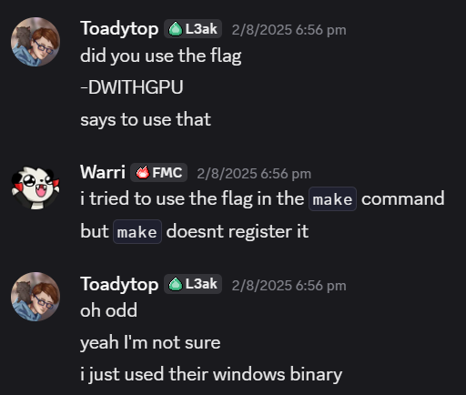

## bullmad (5 Solves, 496 Pts)
```
Register your BPN today!
```

`chall.py`
```py
import os, time, signal
from hashlib import sha256
from ecdsa import SigningKey, SECP256k1
from ecdsa.util import sigencode_string
from random import SystemRandom

G = SECP256k1.generator
n = SECP256k1.order
BITS = 64

def sign_with_nonce(sk, message, nonce):
    e = int.from_bytes(sha256(message).digest(), 'big')
    R = nonce * G
    r = R.x() % n
    if r == 0: raise ValueError("Invalid nonce: r == 0")

    k_inv = pow(nonce, -1, n)
    s = (k_inv * (e + r * sk)) % n
    if s == 0: raise ValueError("Invalid signature: s == 0")

    return (r, s, R.y() % 2)

def banner():
    print("""
Welcome to BULLMAD -- The premium BPN solution!
Here you can redeem your 1, 3, 6 or 12 month codes and add time to your BPN account.
The codes are signatures, and look like these DEMO messages:
    """.strip())
    signal.alarm(60)

if __name__ == "__main__":
    banner()
    rnd = SystemRandom()
    nonce = rnd.randint(1, n - 1)
    demo_accounts = sorted((rnd.getrandbits(BITS), length) for length in [30, 180])
    sk = int.from_bytes(os.urandom(32), "big")
    pk = SigningKey.from_secret_exponent(sk, curve=SECP256k1, hashfunc=sha256).get_verifying_key()

    print(f"My pubkey is {pk}")
    
    for i,(account_id,length) in enumerate(demo_accounts):
        message = f"DEMO Account expires at {time.time()+86400*length:.0f}"
        r, s, v = sign_with_nonce(sk, message.encode(), (nonce + account_id)%(n - 1))
        print(f"m{i+1} = '{message}'")
        print(f"r{i+1} = {hex(r)}")
        print(f"s{i+1} = {hex(s)}")
        print(f"v{i+1} = {hex(v)}")

    message = f"Account expires at {time.time()+86400*360:.0f}"
    print(f"Now give me a signature for a 1 year non-demo account: '{message}'")
    r = int(input("r = "))
    s = int(input("s = "))

    try:
        if pk.verify(sigencode_string(r,s,n), message.encode(), hashfunc=sha256):
            print(open("flag.txt").read())
    except:
        print("Bad signature, are you sure you entered it correctly?")
```

From the looks of it, we are given two [ECDSA (Elliptic Curve Digital Signature Algorithm)](https://en.wikipedia.org/wiki/Elliptic_Curve_Digital_Signature_Algorithm) signatures on the SECP256k1 curve and are expected to recover the secret private key value so as to forge a signature for a known message. And we have 60 seconds to do so!

The security of ECDSA, in essence, lies in that given the public key $pk = d * G$ for some private key $d$ and generator $G$, it is difficult to recover $d$ from $pk, G$ due to the elliptic curve discrete logarithm problem ([ECDLP](https://en.wikipedia.org/wiki/Elliptic-curve_cryptography#Application_to_cryptography)). Notably, the SECP256k1 curve has a prime order, thus conventional attacks on ECDLP such as Pohlig-Hellman, BSGS, Pollard-Lambda among others do not apply.

But before we concern ourselves with the time limit or solving the ECDLP, let us hypothesise of a way to recover the private key.

It is known that given signature values $r, s$, given nonce $k = \text{nonce} + a$ for some account id $a$ as described in the implementation, for some hash $e$ of a message, letting $n$ be the order of the curve generator, the integer values fulfill the condition:

$k*s \equiv e + r*d\quad (\bmod n)$ where $d$ is the private key.

Thus we may write

$\text{nonce} \equiv s_i^{-1}*(e_i + r_i*d) - a_i\quad(\bmod n)$

with both $(e_i, s_i, r_i), (e_j, s_j, r_j)$, we can use substitution to obtain

$d \equiv r_j^{-1} * (s_j * (s_i^{-1}*(e_i + r_i*d) - a_i) + s_j * a_j - e_j) \quad (\bmod n)$

we move all $d$ terms to the left hand side to derive:

$d \equiv A + B * (a_j - a_i) \quad (\bmod n)$

where

$A = r_j^{-1} * (s_j * s_i^{-1} * e_i - e1) * C^{-1}$

$B = r_j^{-1} * s_j * C^{-1}$

$C = 1 - r_j^{-1} * s_j * s_i^{-1} * r_i$

We can compute all $A, B, C$ values given two ECDSA signature-message pairs. The problem now is to recover $a_j - a_i$. In the challenge implementation, $a_i, a_j$ are integers less than $2^{64}$.

We note that by letting $a_j$ be the second $a$ the challenge uses, the line 
```py
demo_accounts = sorted((rnd.getrandbits(BITS), length) for length in [30, 180])
```
always ensures that $a_j > a_i$, thus $0 < a_j - a_i < 2^{64}$

From $pk$ given by the challenge, we know that $pk = d * G$ where $G$ is the generator point of the SECP256k1 curve. By rewriting $pk = (A + B * (a_j - a_i)) * G$, we can change the problem of solving the elliptic curve discrete logarithm instance over $(d*G, G)$ to $(pk', G)$ where $pk' = (pk - A * G) * B^{-1} = (a_j - a_i) * G$.

Because $(a_j - a_i) < 2^{64}$, we have 2 possible options to solving the ECDLP instance. 

The first would be to apply the [Baby-Step Giant-Step](https://en.wikipedia.org/wiki/Baby-step_giant-step) algorithm which requires $\mathcal{O}(2^{32})$ memory and $\mathcal{O}(2^{32})$ runtime. Of which the $2^{32}$ memory involves storing that much elliptic curve points, likely using up more RAM then what conventional computers possess.

The second, and more favourable alternative, would be to apply the [pollard-lambda](https://en.wikipedia.org/wiki/Pollard%27s_kangaroo_algorithm) algorithm. The algorithm is less deterministic and is more of a pseudorandom algorithm. Think of it as "guessing" the solution but in a "smart" way! The memory complexity is not as big, but will require $\mathcal{O}(2^{32})$ time complexity. The probabilisitic nature of the algorithm usually causes it to be not used for majority of DLP/ECDLP instances as Pohlig-Hellman / BSGS is used in favour against them, but it would seem that in this case such algorithms are what we need, as the time taken can range from short-enough-within-60-seconds to takes-a-decently-long-time.

Once we solve the ECDLP instance, we can recover the private key $d$, thereby allowing us to sign any message. We can then submit a valid signature pair to the challenge, netting us the flag.

The problem however is the 60 seconds time limit. For a sheer $2^{64}$ possible values for $a_j - a_i$, we will need to use a bunch of multiprocessing and super competent processing power. We will also definitely have to implement the algorithm over C/C++ or similarly fast languages in contrast to much slower Python. Interestingly, there exists a github tool that does this, and conveniently, is also on the SECP256k1 curve! It is also aptly named [Kangaroo](https://github.com/JeanLucPons/Kangaroo).

I took way too long trying to clone the repository and running `make` on the binary to no avail. Until a friend chimed in and reminded me that I could have just downloaded the compiled binary from the github site under the Releases tab.



Thanks Toady.

Even then, with 8 threads this does not run fast enough. We instead have to leverage the mighty power of our GPUs, which is where [NVIDIA's cuda toolkit](https://developer.nvidia.com/cuda-toolkit) comes in, allowing us to run code using our GPUs in addition.

The problem now is that even with these two you may not necessarily obtain the solution in time. The only reason why I was consistently able to do so was due to my NVIDIA GeForce RTX 3070 Laptop GPU. The challenge admittedly feels pay2win. Perhaps if the time limit was extended to be much longer (say 5-10 minutes) it could have been a fairer and more accessible challenge.

`solve.py`
```py
import time, subprocess
from hashlib import sha256
from ecdsa import SECP256k1, VerifyingKey
from ecdsa.util import sigencode_string

G = SECP256k1.generator
n = SECP256k1.order

def sign_with_nonce(sk, message, nonce):
    e = int.from_bytes(sha256(message).digest(), 'big')
    R = nonce * G
    r = R.x() % n
    if r == 0: raise ValueError("Invalid nonce: r == 0")

    k_inv = pow(nonce, -1, n)
    s = (k_inv * (e + r * sk)) % n
    if s == 0: raise ValueError("Invalid signature: s == 0")

    return (r, s, R.y() % 2)

START = time.time()
from pwn import remote

r = remote("nc.deadsec.quest", 31450)
r.recvuntil(b'My pubkey is ')
pk_bytes = eval(r.recvline().rstrip()[len("VerifyingKey.from_string("):-len(", SECP256k1, sha256)")])
pk = VerifyingKey.from_string(pk_bytes, SECP256k1, sha256)
print(f'{pk = }')

m0 = eval(r.recvline().rstrip().split(b' = ')[-1])
r0 = eval(r.recvline().rstrip().split(b' = ')[-1])
s0 = eval(r.recvline().rstrip().split(b' = ')[-1])
r.recvline()
m1 = eval(r.recvline().rstrip().split(b' = ')[-1])
r1 = eval(r.recvline().rstrip().split(b' = ')[-1])
s1 = eval(r.recvline().rstrip().split(b' = ')[-1])
r.recvline()
r.recvuntil(b'Now give me a signature for a 1 year non-demo account: ')
target_message = eval(r.recvline().rstrip())
print(f'{target_message = }')

e0 = int.from_bytes(sha256(m0.encode()).digest(), 'big')
e1 = int.from_bytes(sha256(m1.encode()).digest(), 'big')
r1inv = pow(r1, -1, n)
s0inv = pow(s0, -1, n)
C = pow(1 - r1inv * s1 * s0inv * r0, -1, n)
A = (r1inv * s1 * s0inv * e0 - r1inv * e1) * C % n
B = (r1inv * s1) * C % n

P = (pk.pubkey.point + ((-A) * G)) * pow(B, -1, n)
new_pk = VerifyingKey.from_public_point(P, curve=SECP256k1, hashfunc=sha256)
new_pk_bytes = eval(str(new_pk)[len("VerifyingKey.from_string("):-len(", SECP256k1, sha256)")])

print("==========================================================================================")
KANGAROO_FOLDER = "C:\\Users\\Warri\\Documents\\CTFs\\Crypto\\Kangaroo"
with open(f"{KANGAROO_FOLDER}\\in.txt", "w") as f:
    f.write(f"""0\nFFFFFFFFFFFFFFFF\n{new_pk_bytes.hex()}""")
proc = subprocess.Popen(
    [f"{KANGAROO_FOLDER}\\Kangaroo.exe", "-t", "8", "-gpu", f"{KANGAROO_FOLDER}\\in.txt"],
    stdout=subprocess.PIPE,
    bufsize=1,
    universal_newlines=True,
)
for line in proc.stdout:
    print(line, end="")
    if "Priv:" in line:
        diff_ac = eval(line.split(": ")[-1])
proc.wait()
print("==========================================================================================")

rec_sk = (A + B * diff_ac) % n
print(f'Recovered secret key {hex(rec_sk)}')
valid_r, valid_s, _ = sign_with_nonce(rec_sk, target_message.encode(), 1) 
assert pk.verify(sigencode_string(valid_r,valid_s,n), target_message.encode(), hashfunc=sha256) # True!

r.sendline(str(valid_r).encode())
r.sendline(str(valid_s).encode())
r.recvuntil(b's = ')
flag = r.recvuntil(b'}').decode()
r.close()

print(flag) # DEAD{Th4nk5_f0R_r3G15TeRinG_wItH_U5_enJ0y_Y0Ur_BpN_897259d8e1bc2c65}
print(f"Total Time Taken: {round(time.time() - START, 2)} seconds")
```

I ran it a few times out of curiosity. Here are some of the sample outputs showing how varied the time taken to solve the challenge can be.

`run_1`
```
[x] Opening connection to nc.deadsec.quest on port 31450
[x] Opening connection to nc.deadsec.quest on port 31450: Trying 35.202.188.234
[+] Opening connection to nc.deadsec.quest on port 31450: Done
pk = VerifyingKey.from_string(b'\x02w1"\xf1\x01\xd3\xbf\xe0C3\x02\x1f_H6x*@\x0c\xd7z\xdbb \x9bom\xddy\xba5\xfb', SECP256k1, sha256)
target_message = 'Account expires at 1785239447'
==========================================================================================
Kangaroo v2.2
Start:0
Stop :FFFFFFFFFFFFFFFF
Keys :1
Number of CPU thread: 8
Range width: 2^64
Jump Avg distance: 2^31.99
Number of kangaroos: 2^20.33
Suggested DP: 9
Expected operations: 2^33.12
Expected RAM: 709.6MB
DP size: 9 [0xFF80000000000000]
SolveKeyCPU Thread 0: 1024 kangaroos
SolveKeyCPU Thread 7: 1024 kangaroos
SolveKeyCPU Thread 6: 1024 kangaroos
SolveKeyCPU Thread 4: 1024 kangaroos
SolveKeyCPU Thread 2: 1024 kangaroos
SolveKeyCPU Thread 3: 1024 kangaroos
SolveKeyCPU Thread 5: 1024 kangaroos
SolveKeyCPU Thread 1: 1024 kangaroos
GPU: GPU #0 NVIDIA GeForce RTX 3070 Laptop GPU (40x0 cores) Grid(80x128) (107.0 MB used)
SolveKeyGPU Thread GPU#0: creating kangaroos...
SolveKeyGPU Thread GPU#0: 2^20.32 kangaroos [5.2s]

[544.25 MK/s][GPU 533.02 MK/s][Count 2^30.55][Dead 0][02s (Avg 17s)][95.5/130.7MB]
[771.17 MK/s][GPU 756.22 MK/s][Count 2^31.33][Dead 1][04s (Avg 12s)][162.2/209.4MB]
[715.45 MK/s][GPU 702.25 MK/s][Count 2^31.76][Dead 1][07s (Avg 13s)][218.1/279.1MB]
[608.37 MK/s][GPU 597.41 MK/s][Count 2^32.07][Dead 1][09s (Avg 15s)][269.3/343.1MB]
[533.70 MK/s][GPU 524.36 MK/s][Count 2^32.32][Dead 1][12s (Avg 17s)][320.6/407.3MB]
[486.61 MK/s][GPU 478.23 MK/s][Count 2^32.52][Dead 1][14s (Avg 19s)][368.9/467.6MB]
[462.01 MK/s][GPU 453.96 MK/s][Count 2^32.72][Dead 1][17s (Avg 20s)][422.4/534.5MB]
[435.56 MK/s][GPU 428.02 MK/s][Count 2^32.85][Dead 2][19s (Avg 21s)][463.0/585.3MB]
[400.86 MK/s][GPU 394.23 MK/s][Count 2^32.98][Dead 2][22s (Avg 23s)][505.2/638.0MB]
[376.13 MK/s][GPU 370.02 MK/s][Count 2^33.10][Dead 2][24s (Avg 24s)][548.5/692.2MB]
[358.47 MK/s][GPU 352.61 MK/s][Count 2^33.19][Dead 2][27s (Avg 26s)][586.9/740.1MB]
[361.87 MK/s][GPU 355.95 MK/s][Count 2^33.33][Dead 2][29s (Avg 25s)][644.0/811.5MB]
[369.98 MK/s][GPU 363.91 MK/s][Count 2^33.46][Dead 2][32s (Avg 25s)][703.5/885.9MB]
[382.40 MK/s][GPU 375.96 MK/s][Count 2^33.58][Dead 2][34s (Avg 24s)][765.6/963.5MB]
Key# 0 [1S]Pub:  0x02260D5B6D61F393E723A56F6EEF6BCDB17E196148CA4B2E036909201980013CA0
       Priv: 0x4DA95A7809D21299

Done: Total time 51s
==========================================================================================
Recovered secret key 0x634b4fb8936e03e346ec9c9d3c1497fbda12dc7286f4167b8703daac29482c1b
[*] Closed connection to nc.deadsec.quest port 31450
DEAD{Th4nk5_f0R_r3G15TeRinG_wItH_U5_enJ0y_Y0Ur_BpN_897259d8e1bc2c65}
Total Time Taken: 53.33 seconds
```

`run_2`
```
[x] Opening connection to nc.deadsec.quest on port 31450
[x] Opening connection to nc.deadsec.quest on port 31450: Trying 35.202.188.234
[+] Opening connection to nc.deadsec.quest on port 31450: Done
pk = VerifyingKey.from_string(b'\x025\x11\xc4\xd6Q\x93\x12k\xd4\xd5\x1a0\x1fg\xd1yG\xb0cTS\xcb\xb4\xb0\xdc\xf7T\xa7\xb7\x0f9]', SECP256k1, sha256)
target_message = 'Account expires at 1785239627'
==========================================================================================
Kangaroo v2.2
Start:0
Stop :FFFFFFFFFFFFFFFF
Keys :1
Number of CPU thread: 8
Range width: 2^64
Jump Avg distance: 2^31.99
Number of kangaroos: 2^20.33
Suggested DP: 9
Expected operations: 2^33.12
Expected RAM: 709.6MB
DP size: 9 [0xFF80000000000000]
SolveKeyCPU Thread 0: 1024 kangaroos
SolveKeyCPU Thread 2: 1024 kangaroos
SolveKeyCPU Thread 7: 1024 kangaroos
SolveKeyCPU Thread 5: 1024 kangaroos
SolveKeyCPU Thread 1: 1024 kangaroos
SolveKeyCPU Thread 6: 1024 kangaroos
SolveKeyCPU Thread 3: 1024 kangaroos
SolveKeyCPU Thread 4: 1024 kangaroos
GPU: GPU #0 NVIDIA GeForce RTX 3070 Laptop GPU (40x0 cores) Grid(80x128) (107.0 MB used)
SolveKeyGPU Thread GPU#0: creating kangaroos...
SolveKeyGPU Thread GPU#0: 2^20.32 kangaroos [4.6s]

[679.84 MK/s][GPU 659.04 MK/s][Count 2^30.83][Dead 0][02s (Avg 13s)][115.8/153.4MB]
[1022.83 MK/s][GPU 997.11 MK/s][Count 2^31.75][Dead 0][04s (Avg 09s)][217.3/278.1MB]
Key# 0 [1S]Pub:  0x03AC4DF9CE9FB32D49ACB269CEA4B438269B631C809DA5A7B6B8D2356B8886B7D4
       Priv: 0x226801E69A5A816

Done: Total time 12s
==========================================================================================
Recovered secret key 0x9f622597ec52299aeab5ed25a5e903910a2244a121314186818eff650627dedd
[*] Closed connection to nc.deadsec.quest port 31450
DEAD{Th4nk5_f0R_r3G15TeRinG_wItH_U5_enJ0y_Y0Ur_BpN_897259d8e1bc2c65}
Total Time Taken: 14.58 seconds

```
