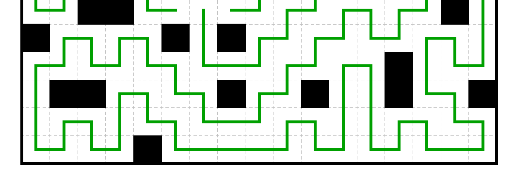

## Car Watching (0 Solves, 500 Pts)


ohey dats me :o

So I should probably give some context. About a few weeks ago I was approached by a fellow friend in DEADSEC to write challenges for deadsec ctf.


Around that same time, I had written a Reverse Engineering challenge in a local CTF competition that happened a week before, which got 0 solves. It was a puzzle-based Reverse Engineering challenge, and I decided to reuse the same puzzle but for Deadsec!

While the previous one was on an easier puzzle and only featured a stripped compiled c++ binary (and really funny Sleep() obfuscation calls), I figured I needed to make it harder for DEADSEC.

My original plan was to reuse the idea but on a harder grid and more cursed obfuscation. (the original plan was always for the difficulty to be 50% obfuscation/reversing, 50% solving the puzzle).

The problem was, while this was ongoing, I was also in the midst of writing challenges for another CTF on that same week...wwfctf. I had multiple challenge ideas for it that I was still working on, and so by the time I could get to doing the Rev for deadsec, I had about one to two days before the CTF begun.

So...I whipped together one in Python, was inspired from Codegate CTF Finals to compile it with [Nuitka](https://github.com/Nuitka/Nuitka), and then shipped it as a challenge! Truth be told, I should have spent more time on it and made other changes to it which would have made reversing the binary easier.

Reversing Nuitka is a real pain. The general idea is that from the onefile executable in the distribution, one may run it so that it may write the full Nuitka payload to a %TEMP% folder. You can then extract the dumped files, and dynamically analyse them. One of which would contain a compiled exe of the python script. Finding the `__main__()` function is as trivial as cross referencing from where the `__main__` string is referenced in the executable. However, the compiled python is kinda like looking at an immediate layer of python to python-c to c, and requires a heavy deal of dynamic and some bit of manual analysis to piece things together slowly.

I had intended to leave a hyperlink in the challenge description, which would lead one to an Archived Challenges of the monthly Imaginary CTF website. During that time, I'd written a Nuitka compiled executable and pushed it as a reverse engineering challenge. The idea was that if a player got stuck looking at Nuitka, they could dig up the IDB I had of my former imaginaryCTF challenge and use it for better referencing!

```md
## Description
a drunken man told me to watch the [inuit's...cars?](https://imaginaryctf.org/ArchivedChallenges/43)? (12/07 :3)
```

Except as I would later learn, the hyperlink colour blends so well with the regular description letters (see topmost image) that I think only one or two teams actually spotted it.

Regardless, there are many useful resources one may use to reverse Nuitka compiled binaries. I'd recommend [nuitka-helper](https://github.com/goatmilkkk/nuitka-helper), among other tools to help make the process less manual heavy. Having manually looked at and reversed the near entirety of [FLAREON CTF](https://flare-on.com/) 2023's Flake challenge myself, it is far better that one use such tools instead of slaving away for hours :>

Nevertheless, and amazingly, one of the teams managed to restore the entire Python code!
```py
class Node:
    def __init__(self, loc, next, prev):
        self.loc = loc
        self.next = next
        self.prev = prev
        
    def toBytes(self):
        return int.to_bytes(self.next, 2, 'little') + int.to_bytes(self.prev, 2, 'little')
      
    def __str__(self):
      return f"loc:{self.loc}, next:{self.next}, prev:{self.prev}"

BLACKLIST = [269, 278, 249, 30, 287, 103, 193, 88, 13, 43, 15, 167, 138, 116, 188, 202, 203, 3, 191, 72, 50, 172, 204]
dstr = "9700c700bd00d8008b007a002c005d003300ff0079002500ee002400cb0050006e009f00a200ac005300d40047009000130115010f017400180103011b01b000be00ad00e7004800a2005400b4009f0003011100ec009b00f5004800c6008c00e5008c00f500a9001901d3008d004000b3002b00fc00270027000f012b001301af001601d2000f000a009500b5004300770044003b007900180097006c00560076008a003100f1001700ae000e01e10050002100240022001500f9004500f900800013001f0112010801e900510030008c00eb004800fb009c00ce00ac00d0006200900053001e00a100da00650071000a014b001c001f0190006b00d40096002001d200f900480016000201cc0067009100cc0016006600d4009a003e006b0003000201d00016005e00db0002003f009900f2006d008d00df000f000e0049005b0058003800b70063005d008b00dc003b00fd00d10044000e008500f1000f00da00cf005f0001007900d5004400ff007c00cb000501ee0017019200e600dd00b6008f0019004a005800c00070001400ca00b400fb00a200f800020069005e00d6004f00160116011a0140001901c1000f015000ee0015018700d900ba00ac0039006100ed0028006b0038009a005b00a900fb008c00ca004d002a001d011200fb00c400eb00b400810069005c00f8000001e400ab0023001e01f6002500470035005a000d00f30059000c014300e3007100a1004f00ca009b00bc00110041001200f4002a002d00e1001700de001601d50078000b010101880000013f0005000b007e00fa001a00640013012700ec0075001c013000a3001e00960090006c00ff000101d5007d00d7003b0093007700740014011501a500630042003400a70036001600030091005600d800970019000b01e000b0007800cd00050088001c000900aa00bb0032008600ac006e009c001201510013000801fa00c800a0007e002800310061007600e00041009b006d004000e600d30017019e00280039006700af007700d7003d002900820001009300c500250033001e018900120180002c00b10080007f00890038007000c1005800f0001c00cd000a014f0029007100d60094004900df007b0084008900b1001d001401d90022008700bd00b7005b00c700a000ba00c800c1003d007900770033008300a400980007011f00390023009e001f01fe004b001300c200e30059002600dd00040092005500e900df00e20094006100a700f300310042008b001d006300b1000d0184000d018e00a000bf00fa00b5004e000600950082004a00b600d100b70014005800fc005c0012004d0069004600c2005200980069002d00120002000100b600cf0082001b01ec0064000301f1002e008a008500db0083004c00ab0048009d005700eb00e700f700be00600060001800f7005f00d2003d00af0020015d0075007a001d017d006a000101a80065007200a10074002b00ee007c000f01c0005500dd000501060137006600ea00c30047001e01530065005f006000da0014000501c0007c0071000100da0029000c001a000b003a00a400e50026000d000c017300b900c60030009400e9001c011c001f0005004b0015012200500014012f00a200ca006e00dc001d015d004d008f0064006f001b011100a5007400bc004b009e001f00fe0013000000fe0051000101990078006a0098002600c200a4002300ed00e4003900c90043000a00590005011b005500cb007e00c800b800740096005b006b00bd000400bb000900100173006800ea0057001d00840042002b009200090032000400d10018014a00fd006a008d0099001901950006014e00b900de00cd00e100f0007000dd001701c000ab0007018300e400d3003a000c00e600b400c40054000300f600a8007d003e005500100104001b00f000de000800740015001e01c500c30010005c0004018100e800c9000700520072006000e7006500d000ce0002018a00e2000e00ef00df003200aa003c000900ec007400130111007a00300008017500670076002800ef00eb009d00c400c100bc00bf00a5008e00ea003700680067009f0054001101cb004300b90095000c01fe0067009e00000008000a01f0007f00b900ea000601730031008600a7008a00ed00f3003500610078006d00e0009900e1008800ae00cd003c00b800aa00f9000e015e00f800ae000901fa008e000b000000ef006700e200570068009d00f900b0009b000301e000e60032003a0092002e00d0009c00030022002100d9000d01a6005300c30062001b001001b20074002c00080112017a00cb00b2001b0024001d01a30075002a008100100020000d010d00a900e5005a000500230000011f002d004600f4004c003400dc006300040104014d00dc005c005100e2000000e9006600cc003700ca001d002c0089008b0025007d00ff00f600d60093002900d700a7006e002f008600a6004500ad00a7006f002700b300640052005900c900c2004500c3001500a600d800b300c7006f006d0009014100f2003e001a01a8009a008d000c00f200d3005a00ca00a9002f000d017f000800b100fd00b00018010b0119006f00d8008f00bf00ba008700a0001a00b8007e003c007b00b50049000a009a00c1001a013800850003002e003600c700fc00b700b300ad006200a600be00fc007c0014002b002600f500e300e500c10017014000700044000b01fd00d500f2000b0009010c003f00ab00db0000017f001f010a018000200133003d00c5000e01200017001601c6005700730048003a003c001a003200ef00f10076000e002a00e800a300f4006c00bd009600970002004c002d00db0047003e00f600d4004c009800460083002400b2002100ca0007000a007b00c9001601d700d600af008a009c0086002e00a50087001401bf00a80019016a001a01cf0019005600b600e300c6000c01f500be001e006200f700f4005200e800460041008e00bc000901e70072001f01cc00f900c500200115000f00360085000600ac0011019f00ce001001bb00670074005f0056001800cf00490006000f00b5004e006600910006010600910036004e00040134001000ac00f3002f005a00a700a30007001c01e80007010d00a4003500e40035000701ed001c017b00940007004a001b018f0018019300d10082003b00ae003f005e008800f7006c001e0018002000f80081000e01"

def f(inp):
    return int.from_bytes(inp, 'little')

def dcode_dirs(dirstring):
    inpBytes = bytes.fromhex(dirstring)
    res = { }
    for i in range(0, len(inpBytes), 8):
        w0 = f(inpBytes[i     : i + 2])
        w1 = f(inpBytes[i + 2 : i + 4])
        w2 = f(inpBytes[i + 4 : i + 6])
        w3 = f(inpBytes[i + 6 : i + 8])
        k = i // 8
        res[k] = [w0, w1, w2, w3]
        
    return res

def isValid(node):
  if node.loc in BLACKLIST:
    return False

  if node.next not in dirs[node.loc]:
    return False
  
  if node.prev not in dirs[node.loc]:
    return False

  if node.next == node.prev:
    return False

  return True

assert(dcode_dirs(dstr) == dirs)
        
def checker(nodes, start_from):
  for node in nodes:
    if not isValid(node):
      return False
    
  current_idx = start_from
  prev_idx = nodes[start_from].prev
  while True:
    curr_node = nodes[current_idx]
    
    if curr_node == nodes[prev_idx]:
      return False
    
    if curr_node.next == start_from:
      break
    
    prev_idx = current_idx
    current_idx = curr_node.next
        
def testinput():
    payload = ""
    idx = 0
    for i in range(114):
        tn = Node(idx, 1, 1)
        payload += tn.toBytes().hex()
        idx += 1
        
    payload += Node(idx, 132, 177).toBytes().hex()
    idx += 1
        
    return payload

def test_sol(sol):
  for x in sol:
    if x in BLACKLIST:
      print(f"{x} in blacklist")
      return
  
  path = [37, *sol, 2]
  nodes = [ 0 ] * 289
  for idx in range(1, len(path) - 1, 1):
    n = Node(path[idx], path[idx + 1], path[idx - 1])
    nodes[path[idx]] = n
    
  for i in range(289):
    if nodes[i] != 0:
      if not isValid(nodes[i]):
        print("WRONG " + str(nodes[i]))
```

We have about 17*17 nodes, and the checker takes in an input, encodes it and writes data into the Node objects. It then traces through the objects from one node pointer to the next, tracing a "line", and at the end it checks that the line covers every single node in the grid that is not in a "BLACKLIST".

The adjacency data for the nodes are collected in a dictionary which is loaded dynamically.

The orginal intention I had was for the player to intuit that its a 2D grid, and the nodes form a puzzle of which the goal is to draw a single loop that hits everything.

From the derived dictionary, one could start mapping for instance and obtain the following: (after removing all BLACKLIST nodes from the dictionary)


Which gives a hint that the adjacency dictionary, before being padded with BLACKLIST data, stores the adjacent nodes in a `{UP, DOWN, RIGHT, LEFT}` format. (or UP, DOWN, LEFT, RIGHT), without loss of generality.

The intention is for the player to then piece together the grid, which should have been this:


After which one may solve the puzzle manually. The puzzle is in reality based off of [puzsq.logicpuzzle.app/puzzle/15245](https://puzsq.logicpuzzle.app/puzzle/15245), and I had a lot of fun figuring the solve manually.

The solve path is quite beautiful, actually.

From the beginning one may directly deduce the following:


And after some logic in the bottom, deduce:


and finally, using a really beautiful argument in the top left and how it tends to make a smaller loop, derive the upper left corner and from it, the entirety of the puzzle. I would recommend trying out the puzzle on your own, to be honest!!

From the solution, one may then encode it and feed it into the binary, netting the flag
```
> bd0097008b005d00ff007900000000009f00a2005300470015010f0103011b01be00ad00b4005400ec001100f500c600e500f50000000000fc00b30000000000d200af000a0095003b00440018006c007600f1001700e10021005000450015001201130008013000eb008c009c00ce0090006200a100650000000000d4006b002001d20002011600910066003e00d400d00002015e003f00f2008d00df00490038005b005d00dc00fd00d10000000000cf00da004400d5007c0005019200dd0019008f00c000700000000000f8005e00d6004f00190140000f01ee00d900ba00610028006b009a008c00fb004d001200fb00c4008100f800000123002500f6003500f300590043007100a10041009b0012002d00de00170078000b010500880000000000270013011c01a30096009000d500010193003b0014011501340063001600910097005600b000e000cd0005000900bb006e00860051000801c8007e00000000006d0041001701e60028009e007700d70001002900330025008900120180008900700038001c000a014f0071007b0094001d0084002200d90000000000ba00c80079007700830007011f0039001300fe00c2005900dd0055009400e90031006100630042008400b100fa00a000000000008200b600b700140069005c009800460002006900b600cf001b01640085002e00ab00db0057009d00e700f700f7006000af003d001d01750001016a0065007200ee007c005500c000ea00060147001e0160005f0000000000da0001001a003a002600a400b9000c0130001c014b001c0050002200a2002f00dc004d0064006f001100a5009e004b000000510099007800a40098003900ed004300c90005011b007e00b8005b009600100104007300ea0042001d00040092004a0018018d0099009500b900f000de0000000000e400ab00e600d300c400b400a8007d00000000000800f0001e01c50010008100e80052007200e700ce00d0000e00df00aa0009001301ec0075007a00ef0076009d00eb00a5008e00370068005400110100000000fe0000000a010800000000008600310000000000e0006d00e100cd003c00aa00ae000e010b00fa00e200ef00680057009b000301000000000000000000000000c30053001b00b2007a002c00b20024002a001d0120001000a900e50023001f002d004c00040134005c000401e900e200660037002c008b007d00ff00290093002f006e00a6004500b30027005200c2001500c300d800c7000901f2001a01a800d3000c005a00a900b1007f001801b0006f00d800a0008700b8001a00b5000a009a001a0136008500c700b700ad00a6001400fc00e3002600400017010b01fd000c000b003f0000017f0080003d00330000000000c60073003a003c00f1000e00f4002a006c00bd00db000200f6003e004c00830024002100c9000700d700d6002e009c00870014016a001901560019000c01e3006200be004600f4008e00090100000000c50020010600360011019f00bb0010015f0018004900b50006014e004e00060000000000f3005a00a300e80007013500ed00e40007007b008f004a00d10082008800ae00000000000e012000
Correct!
deadsec{l00py-doopy-Nu1tk4!_wh4t_a_D00zy}
```

The issue, however, was I made a big oopsie when translating the problem over. For reference, this was the code I'd used last minute to write the challenge a day before the CTF.

`gen.py`
```py
from dataclasses import dataclass
from random import shuffle, seed, choice
from hashlib import shake_256

### INIT STUFFS
BLACKLIST_ = (0, 7, 11, 67, 68, 136, 167, 169, 182, 189, 190, 202, 204, 209, 211, 234, 239, 240, 245, 248, 251, 254, 276)
lst = list(range(17*17))
seed(1337)
shuffle(lst)
BLACKLIST = [lst[i] for i in BLACKLIST_]
print(f"{BLACKLIST = }")

def render_dict(lst):
    d = {}
    for ptr in range(0, 17*17):
        up, down, left, right = ptr-17, ptr+17, ptr-1, ptr+1
        d[lst[ptr]] = [lst[i] for i in (up, down, left, right) if (i >= 0 and i < 17*17)]
        while len(d[lst[ptr]]) != 4:
            d[lst[ptr]].append(choice(BLACKLIST))
    return d
def encode_dir(dirs):
    dstr = b""
    for ptr in range(0, 17*17):
        dstr += b''.join([i.to_bytes(2, "little") for i in dirs[ptr]])
    return dstr
def fmtans(path):
    ans = [0] * (17*17)
    for ii in path:
        jj = path.index(ii)
        ans[lst[ii]] = [lst[path[(jj+1) % len(path)]], lst[path[jj-1]]]
    res = b""
    for i in ans:
        if type(i) == int:
            assert lst[i] in BLACKLIST
            res += b'\x00'*4
            continue
        res += i[0].to_bytes(2,"little")
        res += i[1].to_bytes(2,"little")
    return res

dirs = render_dict(lst)
dstr = encode_dir(dirs).hex()
path = [1,2,19,20,3,4,21,22,5,6,23,24,41,42,59,60,77,78,95,96,113,114,131,132,\
        149,150,133,134,117,100,99,116,115,98,97,80,79,62,61,44,43,26,25,8,9,10,\
        27,28,45,46,63,64,81,82,65,48,47,30,29,12,13,14,31,32,15,16,33,50,49,66,\
        83,84,101,118,135,152,151,168,185,186,203,220,237,236,219,218,235,252,\
        253,270,271,288,287,286,269,268,285,284,267,250,233,232,249,266,283,282,265,\
        264,281,280,279,278,277,260,259,242,241,258,275,274,257,256,273,272,255,\
        238,221,222,205,206,223,224,207,208,225,226,243,244,261,262,263,246,247,\
        230,231,214,215,198,199,216,217,200,201,184,183,166,165,148,147,130,129,\
        112,111,94,93,76,75,58,57,40,39,56,55,38,37,54,71,72,89,90,73,74,91,92,\
        109,110,127,128,145,146,163,164,181,180,197,196,213,212,229,228,227,210,\
        193,176,175,192,191,174,173,156,155,172,171,188,187,170,153,154,137,138,\
        121,122,139,140,157,158,141,142,159,160,177,194,195,178,179,162,161,144,\
        143,126,125,108,107,124,123,106,105,88,87,104,103,120,119,102,85,86,69,\
        70,53,36,35,52,51,34,17,18]
assert len(path) == len(set(path))
assert all(i not in path for i in BLACKLIST_)
assert len(path) + len(BLACKLIST) == 17*17
answer = fmtans(path).hex()
print(f"{answer = }")
print(f"{dstr = }")

### BEGIN ACTUAL CHALL CODE
@dataclass
class Node:
    loc: int
    nxt: int
    prev: int

def f(b):
    return int.from_bytes(b, "little")

def isValid(Node):
    if Node.loc in BLACKLIST:
        return Node.nxt == 0 and Node.prev == 0
    return Node.nxt in dirs[Node.loc] and Node.prev in dirs[Node.loc] and Node.nxt != Node.prev

def checker(nodes, start_from):
    for node in nodes:
        if not isValid(node):
            return 0
    ptr = 0
    curr = start_from
    prev = nodes[start_from].prev
    while True:
        ptr += 1
        curr_node = nodes[curr]
        if curr_node.prev != prev:
            return 0
        prev = nodes[curr].loc
        curr = nodes[curr].nxt
        if curr == start_from:
            break
    return ptr + len(BLACKLIST) == 17*17

def readStr(s):
    s = bytes.fromhex(s)
    nodes = []
    for i in range(0, len(s), 4):
        nxt = f(s[i:i+2])
        prev = f(s[i+2:i+4])
        nodes.append(Node(i//4, nxt, prev))
    return nodes

def dcode_dirs(dstr):
    dstr = bytes.fromhex(dstr)
    dirs = {}
    for i in range(0, len(dstr), 8):
        vals = [f(dstr[i:i+2]), f(dstr[i+2:i+4]), f(dstr[i+4:i+6]), f(dstr[i+6:i+8])]
        dirs[i//8] = vals
    return dirs

dirs = dcode_dirs(dstr)
nodes = readStr(answer) # readStr(input("> "))
if nodes[114].nxt != 132 or nodes[114].prev != 177:
    print("nah.")
    exit()
if not checker(nodes, 2):
    print("Wrong!")
    exit()
print("Correct!")
xkey = shake_256(answer.encode())
flag = bytes([i^j for i,j in zip(xkey.digest(64), b'=\x8a\xe6\xca\x01\xc3\x07l\x89\xec\x8a\xaa\xcf\x95\x90\x12d\x16\x99\x97*\xb0\xd8B;J\xabR\xcc$\x0e\xe6\xcbU\x00\xff\xec\xec\xe3\xcf?')])
print(flag)
```

The problem lies with `render_dict`
```py
def render_dict(lst):
    d = {}
    for ptr in range(0, 17*17):
        up, down, left, right = ptr-17, ptr+17, ptr-1, ptr+1
        d[lst[ptr]] = [lst[i] for i in (up, down, left, right) if (i >= 0 and i < 17*17)]
        while len(d[lst[ptr]]) != 4:
            d[lst[ptr]].append(choice(BLACKLIST))
    return d
```
where yours truly had allowed for the rightmost node of column i to be linked to the leftmost node of column i+1. Which probably made the puzzle exponentially harder and possibly contain too many solutions. I should have playtested this proper, spotted and patched it out.

But alas, it got through and players suffered from it. Sorry to all of you all who had to deal with it :<

In retrospect, I should have managed my time better and spent more time with the challenge. I would have spotted the issue as mentioned earlier and patched it, allowing for auto solving tools to generate the solution much faster and without crashes.