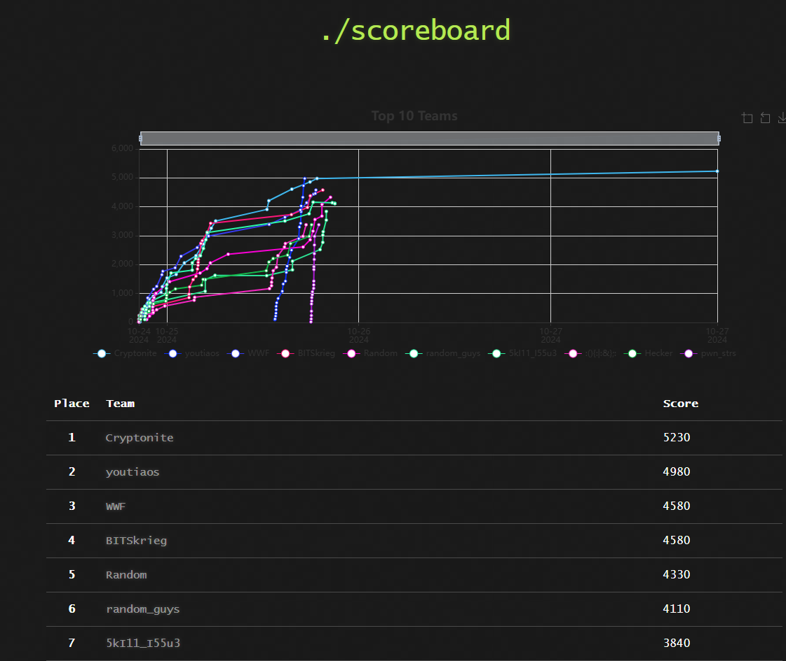
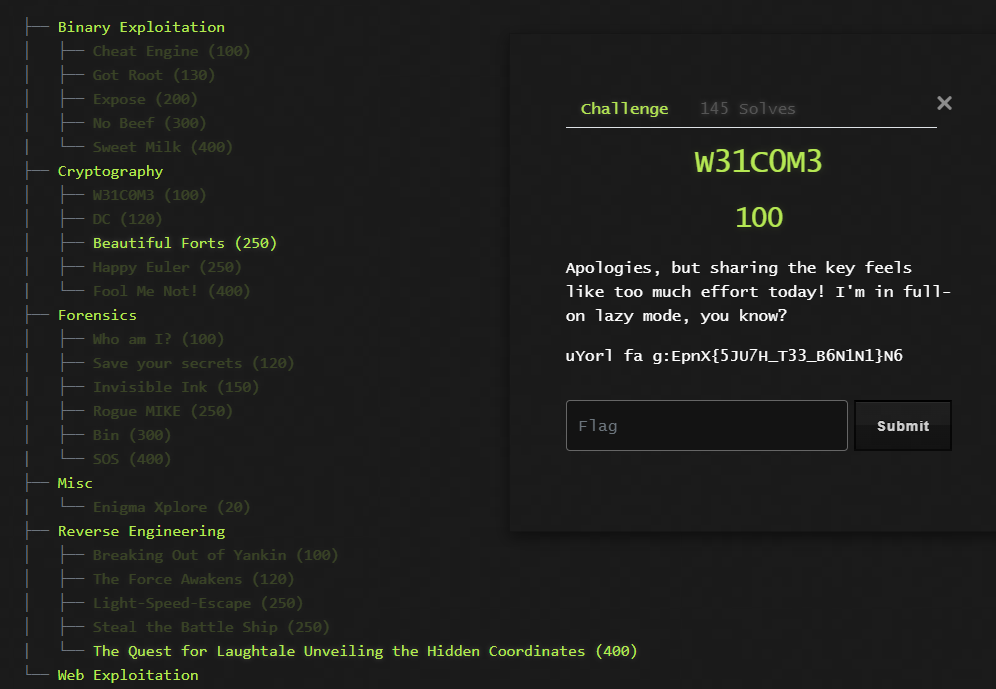
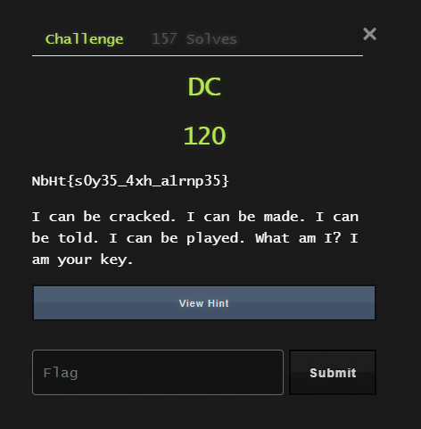
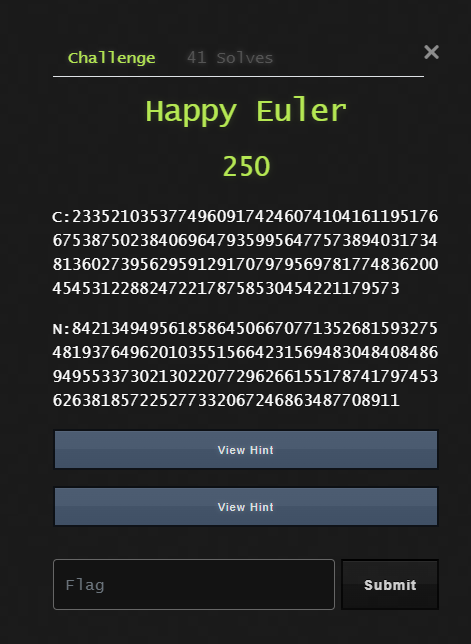
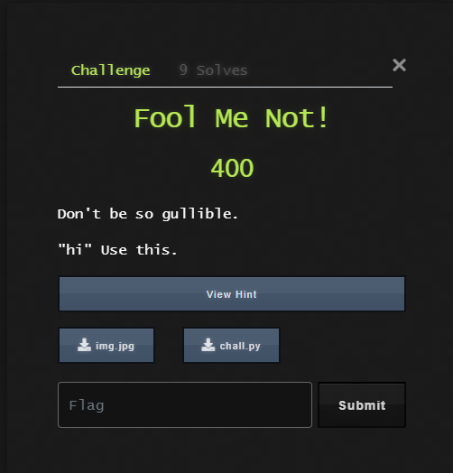
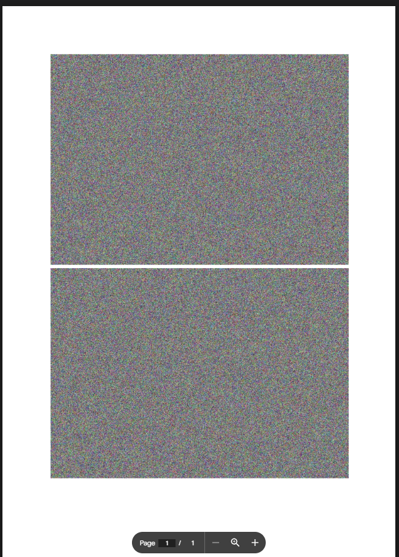
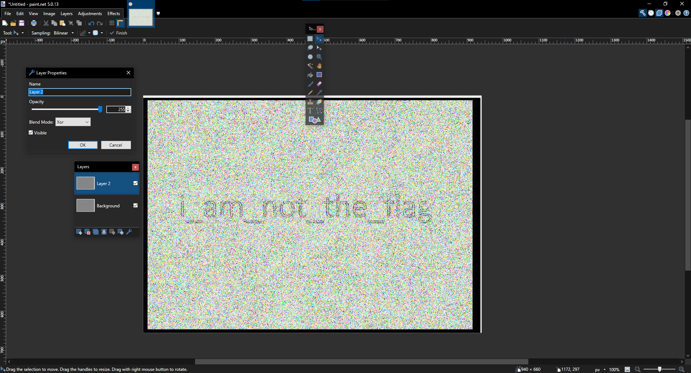

On late October I was invited to play in this CTF with my friends under `Youtiaos`. It happened on a weekday and we decided to play for fun, and we managed to get `2nd` place!



As the resident Cryptographer I've solved most of the Cryptography challenges, and would be providing my writeups for the following:
- W31C0M3
- DC
- Happy Euler
- Fool Me Not!

Admittedly the CTF was a slight let down for me, as I was hoping for Cryptography challenges that dealt with the intricacies of cryptographic principles and protocols, or those that features known attacks exploiting the inherent weaknesses or poor implementation of such protocols. Instead the challenges were more on the guessy end, with some (i believe to be?) unsolvable unless hints were used. Nonetheless, I was told that the Reverse Engineering and Pwn categories were interesting!

## W3LC0M3



Staring at the ciphertext `uYorl fa g:EpnX{5JU7H_T33_B6N1N1}N6` for a while it becomes apparent that `uYorl fa g:` is reminiscient of `Your flag: `. I noticed its just shuffling of 4 bytes, thus a quick adhoc script gets us the flag.

```py
flag = "uYorl fa g:EpnX{5JU7H_T33_B6N1N1}N6 "

for i in range(0, len(flag), 4):
    b0, b1, b2, b3 = flag[i:i+4]
    print(b1 + b2 +b0 + b3, end="")
```
`Your flag: EnXp{JU57_TH3_B361NN1N6}`

## DC



The description is a riddle whose answer is `joke`. Plugging it into a vigenere cipher decrypts the flag.

`EnXp{j0k35_4nd_r1ddl35}`

## Happy Euler



The `N` and `C` are reminds one of RSA encryption. Normally to decrypt this one must factor `N`, which in this case happens to be a 512-bit number. The only way which I know that could factor is via `cado-nfs`, but even then it takes days to factor a 512-bit number. I suspect the challenge creators themselves found that `cado-nfs` works on 512-bit numbers but failed to consider how long and the processing power it would take to do so.

The hint itself tells us the prime factor of `N`, `p = 90304616484829304849285891326049560996554606223208214041821547527005007771051`

Trivial RSA decryption yields the flag, but it is very, very odd that one is expected to factor such a large number without any known method. I've waited several days in the discord server for an author writeup, and despite numerous forum posts by many participants not a single solution has been provided aside from knowing the prime factorisaion via hint or via FactorDB, after someone posted the prime factorisation from the hint onto the database.

```py
C = 2335210353774960917424607410416119517667538750238406964793599564775738940317348136027395629591291707979569781774836200454531228824722178758530454221179573
N = 8421349495618586450667077135268159327548193764962010355156642315694830484084869495533730213022077296266155178741797453626381857225277332067246863487708911
p = 90304616484829304849285891326049560996554606223208214041821547527005007771051
d = pow(0x10001, -1, (p-1)*(N//p-1))
m = pow(C,d,N)
print(m.to_bytes(64, "big").lstrip(b"\x00"))
```
`EnXp{C4rm1ch43l_func710n_15_u53fu1}`

The flag implies that the Carmichael Lambda function is used. But in order to compute the Carmichael Lambda you need to first know the prime factorisation of `N`! And at this point you might as well perform standard RSA decryption. :P

## Fool Me Not



`chall.py`
```py
import os
from Crypto.Cipher import AES
from Crypto.Protocol.KDF import PBKDF2


def multiply_bytes(a, b):
    return bytes([x ^ y for x, y in zip(a, b)])


def aes_permutation(data, key):
    cipher = AES.new(key, AES.MODE_ECB)
    return cipher.encrypt(data)


def encrypt_keys(password, text, length=16):
    return PBKDF2(password, text, dkLen=length, count=1000000)


def encrypt(master_key, plaintext, num_rounds=3):

    important = os.urandom(16)
    k1 = encrypt_keys(plaintext, important, 16)
    k2 = encrypt_keys(plaintext, important[::-1], 16)
    termination_vector = os.urandom(16) # AES key
    intermediate = multiply_bytes(master_key, k1)

    for _ in range(num_rounds): # 5 rounds
        intermediate = aes_permutation(intermediate, termination_vector)
        intermediate = multiply_bytes(intermediate, k2) # xor with k2/k1
        intermediate = aes_permutation(intermediate, termination_vector)
        intermediate = multiply_bytes(intermediate, k1) # xor with k2/k1

    return termination_vector + important + intermediate

k1 = 'REDACTED'
plaintext = 'REDACTED'
ciphertext = encrypt(plaintext.encode(), k1, num_rounds=5)
print("Ciphertext:", ciphertext)
```

The challenge code provided features a custom encryption algorithm whereby from `k1` and `plaintext`, two keys `(k1, k2)` (different k1) is generated using the `PBKDF2` protocol on `k1` with a 16-byte unknown `important` string. Following which, a 16-byte `termination_vector` is generated which is used in AES encrypting the `plaintext` 5 times, with `(k1, k2)` used as xor keys between each AES encryption.

The ciphertext gives us `termination_vector` and `important`, but `k1` is unknown thus we can't derive `(k1, k2)` which we need to decrypt the encrypted flag.

This is where the forensics come in!

Attached in the distribution is an `img.jpg` file. Plugging it into `aperisolve` with `hi` as a password retrieves a string encoded in the file via [steghide](https://steghide.sourceforge.net/).

`"/d/1jMqBJaXw3qlOr5cF1lzdecS_p5zWujj8PB3h9WcNq5A/"`

This string itself turns out to be a google drive link. Visiting `https://drive.google.com/file/d/1jMqBJaXw3qlOr5cF1lzdecS_p5zWujj8PB3h9WcNq5A/edit` gives us a google docs of 2 images:



Taking the two images, overlaying them on one another and then xoring them gives us a string:



Taking this string, we plug it as `k1` from before and reverse the encryption algorithm to obtain the flag.

```py
def aes_dermutation(data, key):
    cipher = AES.new(key, AES.MODE_ECB)
    return cipher.decrypt(data)

ciphertext = b'\xf9e\x8bgO\xab\x8co\xd5l\x91\xc9G\xf0+\xaa?\xe7\xa6\xd2\xa1\xc9:)\xef\xd0\xdd\x9a\xd5\xe8y/\xf70\xb2IM\xf2\x1a\x80\x1b\xb1\xea\xca\x1a\xecw\xb0'
tv, impt, ct = ciphertext[:16], ciphertext[16:32], ciphertext[32:]

kk = "i_am_not_the_flag"
k1 = encrypt_keys(kk, impt, 16)
k2 = encrypt_keys(kk, impt[::-1], 16)


# if your k1, k2 are right, this print the flag!
for _ in range(5):
    ct = multiply_bytes(ct, k1)
    ct = aes_dermutation(ct, tv)
    ct = multiply_bytes(ct, k2)
    ct = aes_dermutation(ct, tv)

ct = multiply_bytes(ct, k1)
print(ct) # {H4CK3D27H32C7F}
```
`EnXp{H4CK3D27H32C7F}`
