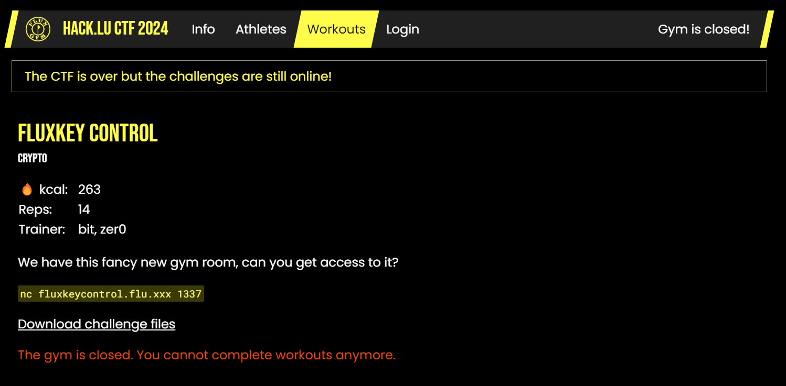
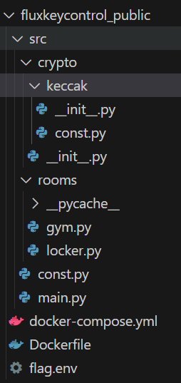
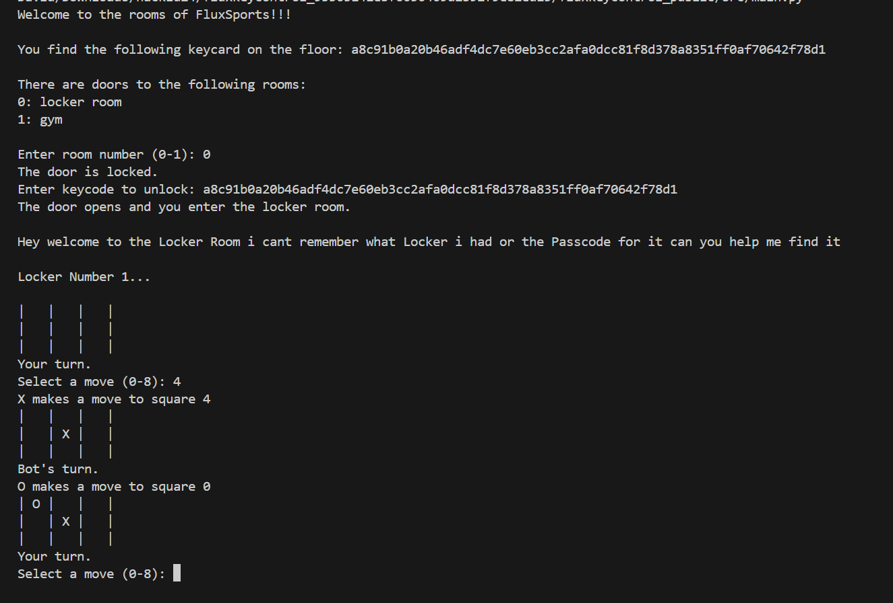
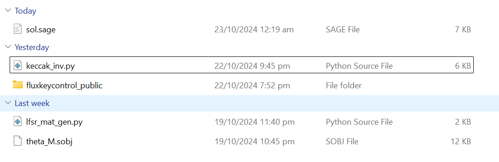

This challenge was rather code heavy and felt like a merging of various challenges, but overall I thought it was quite enjoyable! Saved a zip file containing the barebones of the challenge as well.

For the lack of a better word the challenge is rather...nightmarishly large.



## Gymroom Orientation - main, gym and locker_room

Let's do this step by step and first look into `main.py` and `const.py` in `src/`

`const.py`
```py
import os
import secrets

FLAG = os.environ.get("FLAG", "flag{local_solve_successful}")

MASTER_KEY_SIZE = 130
MASTER_KEY = secrets.randbits(MASTER_KEY_SIZE*8).to_bytes(MASTER_KEY_SIZE, "big")
```

`main.py`
```py
import rooms.locker
import rooms.gym
import crypto

from const import MASTER_KEY

hsh = crypto.Keccak()
hsh.absorb(MASTER_KEY + b"locker room") # 130 bytes + locker room
KEYCARD = hsh.squeeze()


ROOMS = {
    "locker room": rooms.locker.locker_zone,
    "gym": rooms.gym.gym_zone,
}

def main():
    print("Welcome to the rooms of FluxSports!!!")
    print()
    print(f"You find the following keycard on the floor:", KEYCARD.hex())
    print()
    while True:
        inpt = None
        while inpt is None:
            print("There are doors to the following rooms:")
            for i, name in enumerate(ROOMS.keys()):
                print(f"{i}: {name}")
            print()
            try:
                inpt = int(input(f"Enter room number (0-{len(ROOMS)-1}): "))
                if not (0 <= inpt < len(ROOMS)):
                    print(f"no room with number {inpt}" + "\n"*3)
                    continue
            except ValueError:
                print("invalid room number" + "\n"*3)
                continue

        room_name, enter_room = list(ROOMS.items())[inpt]
        hsh = crypto.Keccak()
        hsh.absorb(MASTER_KEY + room_name.encode())
        valid_key = hsh.squeeze()
        print("The door is locked.")

        passkey = input("Enter keycode to unlock: ")
        if passkey != valid_key.hex():
            print("The passkey was rejected!" + "\n" * 3)
        else:
            print(f"The door opens and you enter the {room_name}.")
            print()
            enter_room()

if __name__ == '__main__':
    main()
```

So there's two rooms. One leading to `gym()` and another `locker_room()`. We're given a `KEYCARD` which is required to enter a room, that comes from a hash result of a 130-byte `MASTER_KEY` and concatenated with the room name. This hash, which seems to be using the `keccak` algorithm, is required for us to enter a room. Fortunately we are given the `locker_room()` keycard and can access it. 

As `gym()` is unavailable, we quickly look into `rooms/`, notably `rooms/gym.py`

`gym.py`
```py
from const import FLAG

def gym_zone():
    print("Seems like someone played capture-the-flag here ...")
    print("                 ")
    print(f"  FLAG: {FLAG}  ")
    print("                 ")
    exit(0)
```

Ah, there's our flag and end goal.

So, solving the challenge seems to be:

1. Enter `locker_room()`
2. ???
3. Get `MASTER_KEY`, or somehow recover `keccak(MASTER_KEY + gym)`
4. Enter `gym()` and profit

Naturally the next step would be to see what `locker_room()` has to offer:

`locker.py`
```py
import crypto

from const import MASTER_KEY

LOCKER_COUNT = 321

def print_board(board):
    for row in [board[i * 3:(i + 1) * 3] for i in range(3)]:
        print('| ' + ' | '.join(row) + ' |')

def available_moves(board):
    return [i for i, spot in enumerate(board) if spot == ' ']

def make_move(board, square, letter):
    if board[square] == ' ':
        board[square] = letter
        return True
    return False

def check_winner(board, square, letter):
    row_ind = square // 3
    row = board[row_ind * 3:(row_ind + 1) * 3]
    if all([spot == letter for spot in row]):
        return True

    col_ind = square % 3
    column = [board[col_ind + i * 3] for i in range(3)]
    if all([spot == letter for spot in column]):
        return True

    if square % 2 == 0:
        diagonal1 = [board[i] for i in [0, 4, 8]]
        if all([spot == letter for spot in diagonal1]):
            return True
        diagonal2 = [board[i] for i in [2, 4, 6]]
        if all([spot == letter for spot in diagonal2]):
            return True

    return False

def bot_move(board, rng):
    available = available_moves(board)
    if len(available) > 0:
        bot_choice = rng.getbits(16) % len(available)
        return available[bot_choice]
    return None

def player_move(board):
    available = available_moves(board)
    move = None
    while move not in available:
        try:
            move = int(input(f"Select a move (0-8): "))
            if move not in available:
                print("Invalid move. Try again.")
        except ValueError:
            print("Please input a number between 0 and 8.")
    return move

def play_game(rng):
    board = [' ' for _ in range(9)]
    current_winner = None

    print_board(board)

    letter = 'X'
    while True:
        if letter == 'X':
            print("Your turn.")
            move = player_move(board)
        else:
            print("Bot's turn.")
            move = bot_move(board, rng)

        if make_move(board, move, letter):
            print(f"{letter} makes a move to square {move}")
            print_board(board)

            if check_winner(board, move, letter):
                return letter

            letter = 'O' if letter == 'X' else 'X'

        if not available_moves(board):
            return 'Tie'

def locker_zone():
    hsh = crypto.Keccak()
    hsh.absorb(MASTER_KEY + b"locker room")
    rng = hsh.get_rng()
    print("Hey welcome to the Locker Room i cant remember what Locker i had or the Passcode for it can you help me find it")
    for locker_number in range(1, LOCKER_COUNT + 1):
        print(f"\nLocker Number {locker_number}...\n")
        winner = play_game(rng)

        if locker_number == LOCKER_COUNT: 
            if winner == 'O':
                print("That doesnt seem like the correct Passcode!")
                exit(0)
            elif winner == 'X':  
                print(f"Hey great you guessed correct!")
                print(f"\nThat looks like you found the correct one!")
                print(f"\nThe Locker is empty")
            else:  
                print(f"The display froze")

        elif winner == 'O':
            print("That doesnt seem like the correct Passcode!")
            exit(0)
        elif winner == 'X':  
            print(f"Hey great you guessed correct! Seems like this Locker is empty.")
        else:  
            print(f"The display froze, let's continue with the next locker...")
```

There's a lot going on, but looking at each function we come to realise that `locker_room` is essentially a tictactoe game. Well, `LOCKER_COUNT` number of tictactoe games.



It appears that the file uses `keccak` from before to hash the same `MASTER_KEY + b"locker room"` string, then uses it to initialise some sort of `rng` object. This `rng` is used by the code to simulate an opponent who plays tictactoe with you, picking a random spot on the grid to place an `O`.

```py
def bot_move(board, rng):
    available = available_moves(board)
    if len(available) > 0:
        bot_choice = rng.getbits(16) % len(available)
        return available[bot_choice]
    return None
```

It also appears that we must succeed `LOCKER_COUNT` number of tictactoes, as losing one of them means getting kicked. We are permitted to drawing however, and fortunately as we always start first, with ideal play we can easily come out on top or succumb to a draw with each round.

But that seems to be all that `locker_room` does. How can we recover `MASTER_KEY`, let alone access `gym()` back in `main.py`? This is a cryptography challenge, after all. Let's take a look at the code behind `keccak` and this `rng` object!

## Backrooms Orientation - LFSRs and Keccaks

We lockpick open the door leading to the back of the gym and - oh it's unlocked to begin with - and take a gander at the source!

The first, `src/crypto/__init__.py`, appears to encode the logic behind `locker_room`'s tictactoe AI:

`__init__.py`
```py
POLY = 0xb797d18eb0f60066397496ea1d8ba42751c8b9a8e9fc1d3cacc6eb89c562bec5c18befe0ae511d311bb582077550b507035c1833746d6aa15391ab336ab2449f712a280c89c87a6a4c90a1865940813c23db3f6a421eef9d77acaf5a1bd06077d26149cabb59728e12fa84c087c5743180d8e3495eb0efb770c3b7b5cdedb0b18f70134c0a3c8a11a7ed7d2ec27a6f6f5f06610e172d7c45a9d214fe5081740f5c7af4688652135e2e2b9b57695d09a6624e69e287a8ef6a5d2eba6eda3ba270b163ce15330be6332203cc66e135f33111f16a6d492242ff73cc649738bbc5810dc2dcffd02b75d822dd06f611ea2bf91d309daf3a34f8773d4517bccb76760cabef4e3b2c399169d93211866966c45becd572f

class RandomNumberGenerator:

    def __init__(self, seed: int, poly = POLY):
        self._poly = poly
        self._seed = seed
        assert seed.bit_length() < poly.bit_length(), f"{seed.bit_length()} >= {poly.bit_length()}"
        self._state = seed
        for _ in range(8192):
            self.clock()

    def clock(self):
        self._state <<= 1
        if self._state.bit_length() == self._poly.bit_length():
            self._state ^= self._poly
            return 1
        return 0

    def getbits(self, bits: int = 1):
        assert isinstance(bits, int) and bits > 0
        result = 0
        for _ in range(bits):
            result <<= 1
            result ^= self.clock()
        return result

from .keccak import Keccak
```

This definitelty seems overwhelming, but truth is this simply describes a [LFSR](https://en.wikipedia.org/wiki/Linear-feedback_shift_register) where the (1600-bit) seed is treated as an integer, and is used to generate a bitstream. Each subsequent bit in the stream is obtained by xoring the state with the polynomial `POLY` and then shifting it to the left by 1, which works very similar to the traditional LFSR. This operation is exemplified by the `clock()` function.

`getbits()`, of which `locker_room` calls `getbits(16)`, clocks the bitstream 16 timesand returns the 16 new bits that have been added to the bitstream.

Now as we've sene in `locker_room`, this seed comes directly from the `crypto.keccak()` class. Time to deal with the main part of the challenge:

`(keccak) const.py`
```py
RoundConstants = [
  0x0000000000000001,   0x0000000000008082,   0x800000000000808A,   0x8000000080008000,
  0x000000000000808B,   0x0000000080000001,   0x8000000080008081,   0x8000000000008009,
  0x000000000000008A,   0x0000000000000088,   0x0000000080008009,   0x000000008000000A,
  0x000000008000808B,   0x800000000000008B,   0x8000000000008089,   0x8000000000008003,
  0x8000000000008002,   0x8000000000000080,   0x000000000000800A,   0x800000008000000A,
  0x8000000080008081,   0x8000000000008080,   0x0000000080000001,   0x8000000080008008
]

RotationConstants = [
  [  0,  1, 62, 28, 27, ],
  [ 36, 44,  6, 55, 20, ],
  [  3, 10, 43, 25, 39, ],
  [ 41, 45, 15, 21,  8, ],
  [ 18,  2, 61, 56, 14, ]
]

Masks = [(1 << i) - 1 for i in range(65)]
```

`(keccak) __init__.py`
```py
from .const import (
    Masks,
    RotationConstants,
    RoundConstants
)
from .. import RandomNumberGenerator

from functools import reduce
from operator import xor
from copy import deepcopy

def rol(value, left, bits):
    top = value >> (bits - left)
    bot = (value & Masks[bits - left]) << left
    return bot | top

def padding(used_bytes, align_bytes):
    padlen = - used_bytes % align_bytes
    if padlen == 0:
        padlen = align_bytes
    if padlen == 1:
        return [0x81]
    else:
        return [0x01] + ([0x00] * (padlen - 2)) + [0x80]


class Keccak:

    def __init__(self, bitrate = 1088, b = 1600): # 136
        self.bitrate = bitrate
        self.b = b
        
        # only byte-aligned
        assert self.bitrate % 8 == 0
        self.bitrate_bytes = self.bitrate // 8 # 136
        
        assert self.b % 25 == 0
        self.lanew = self.b // 25 # 64
        
        self.s = [[0] * 5 for _ in range(5)]
    
    def _theta(self):
        C = [reduce(xor, self.s[col]) for col in range(5)]
        for x in range(5):
            Dx = C[(x - 1) % 5] ^ rol(C[(x + 1) % 5], 1, self.lanew)
            for y in range(5):
                self.s[x][y] ^= Dx

    def _rho(self):
        for x in range(5):
            for y in range(5):
                self.s[x][y] = rol(self.s[x][y], RotationConstants[y][x], self.lanew)

    def _pi(self): # linear
        B = [[0] * 5 for _ in range(5)]
        for x in range(5):
            for y in range(5):
                B[y % 5][(2 * x + 3 * y) % 5] = self.s[x][y]
        self.s = B
                
    def _chi(self):
        A = [[0] * 5 for _ in range(5)]
        for x in range(5):
            for y in range(5):
                A[x][y] = self.s[x][y] ^ ((~self.s[(x + 1) % 5][y]) & self.s[(x + 2) % 5][y])
        self.s = A
        
    def _iota(self, rc):
        self.s[0][0] ^= rc

    def f(self):
        for rc in RoundConstants:
            self._theta()
            self._rho()
            self._pi()
            self._chi()
            self._iota(rc)

    def _absorb(self, bb):
        assert len(bb) == self.bitrate_bytes
        
        bb += [0] * ((self.b - self.bitrate + 7) // 8)
        i = 0
        
        for y in range(5):
            for x in range(5):
                self.s[x][y] ^= int.from_bytes(bb[i:i + 8], 'little')
                i += 8
        self.f()

    def absorb(self, data):
        data = list(data)
        data += padding(len(data), self.bitrate_bytes) # 136 bytes
        assert len(data) % self.bitrate_bytes == 0
        for i in range(len(data) // self.bitrate_bytes):
            self._absorb(data[self.bitrate_bytes * i: self.bitrate_bytes * (i+1)])
            # print("[KECCAK]", data[self.bitrate_bytes * i: self.bitrate_bytes * (i+1)])
    
    def squeeze(self):
        return self.get_bytes()[:(self.b - self.bitrate) // 16]
    
    def get_bytes(self):
        out = [0] * ((self.b + 7) // 8)
        i = 0
        for y in range(5):
            for x in range(5):
                v = self.s[x][y].to_bytes(self.lanew // 8, 'little')
                out[i:i+8] = v
                i += 8
        return bytes(out)

    def get_integer(self):
        return int.from_bytes(self.get_bytes(), "big")

    def get_rng(self):
        return RandomNumberGenerator(self.get_integer())
```

This appears very much to follow the standard implementation of the [keccak](https://en.wikipedia.org/wiki/SHA-3) algorithm, a cryptographic mechanism used in `keccak256` and `sha3` hashes, both of which are relatively secure and have seen heavy use in various aspects of modern day technology (eg. bitcoin!)

To summarise what `keccak` does, it takes an input bytestring and "absorbs" it. During the absorption process, it:

1. Takes a block of size 136 bytes from the input, padding it if necessary
2. Initialises a 5 by 5 grid of 64-bit integers from the bytes. We'll refer to this grid as its `state`. 136 bytes fills in the first 17 entries, whereas the rest are initialised as NULL bytes. Subsequent blocks applies direct xor to the current `state`
3. Performs a transformation `f` on the `state`. `f` uses various transformations, namely `theta`, `rho`, `pi`, `chi` and `iota`
4. Repeat 1-3 until all of the input bytestring is used

This produces a final `state`, of which when prompted to display a hashed result, the state is "squeezed" to show only the first 136 bytes of the `state` data, thus preventing one from being able to derive the `state` given the truncated hashed result. This makes the implementation good and secure for usages as a hash algorithm.

Looking through the code `keccak` is really used for two purposes.

The first is in generating the `keycards` for `gym()` and `locker_room()`, which "squeezes" the states, thus its secure in that we cannot recover the `MASTER_KEY` data from the `keycard` value alone

The second is in initialising the `seed` in the `LFSR` that `locker_room()` uses. In this case, no "squeeze" is used and *ALL* of the `state` is encoded in there.

This means that if we can reverse the `LFSR` and recover the seed, we can recover the `state` of the `keccak` algorithm!

This presents a possible solve path:

1. Play with tictactoe in `locker_room()` enough times
2. Use the outcomes to reverse the `LFSR` and recover the seed
3. Re-encode the seed as its `state` in `keccak`
4. Reverse the `f()` transformation and 136-byte block xors to recover the first input byte block (or the most initial `state`). As `locker_room` uses `MASTER_KEY + b"locker room"`, the initial `state` would thus be `MASTER_KEY` + first 6 bytes of `b"locker room"`.
5. Recover `MASTER_KEY` and use it to obtain the `gym()` keycard
6. Get into the gym room to obtain the flag!

We can deal with the inner workings of `keccak()` later. Let's focus on `locker_room()` and the `LFSR`.

## Locker to Backend Bit Gathering

As is implied in the name, `LFSR` is a `linear` transformation. In the case of its implementation in the challenge, we notice that:

The bits or base 2 representation of the seed integer value when the `LFSR` is initialised can be expressed as 1600 unique 0/1 values.

And each of these values would exert a unique influence over the bitstream and its relevant outputs.

Thus, if we can express the influences as linear equations, we can solve these linear equations given enough bitstream outputs to obtain the original seed value.

Let's see how the output bitstream is used in `locker_room()`

```py
def locker_zone():
    hsh = crypto.Keccak()
    hsh.absorb(MASTER_KEY + b"locker room")
    rng = hsh.get_rng()
    ...

def bot_move(board, rng):
    available = available_moves(board)
    if len(available) > 0:
        bot_choice = rng.getbits(16) % len(available)
        return available[bot_choice]
    return None
```

We see that `rng.getbits(16)`, which directly takes 16 bits from the LFSR output bitstream is called. This is then modulo-ed by the number of available positions in the tictactoe board, to then deduce where the bot AI would put an `O` in during the tictactoe rounds.

Now we just need to find a way to given a board state, the position the bot has decided to pick, correlate it to a bit value from the output stream.

Evidently given the board state and position we can deduce the exact outcome of `% len(available)`. So we just need to link this to the bitstream.

Notice how on the first and subsequent turns in a tictactoe round, the bot will perform `rng.getbits(16) % 8`, then `% 6`, `% 4`, and even `% 2`.

Modulo 8, 4, 2 is the same as taking the last 3, 2, and 1 bits from the 16 bit output, which is equivalent to the outpit bitstream.

Modulo 6 functions differently, but one thing that's constant is the even/odd parity. If the `% 6` is an even value, because `6` is even, we know that the outcome of `rng.getbits(16)` must be even, and vice versa.

All in all, this means in a round, we can acquire the following number of bits of information about the LFSR bitstream:

| Number of Rounds by Bot | Number of bits info acquired |
|---|---|
|1|3|
|2|4 (3 + 1)|
|3|6 (3 + 1 + 2)|
|4|7 (3 + 1 + 2 + 1)|

Observe that a tictactoe game can never have more than 5 bot moves. Anyways, from here we can start implementing a way to extract information from the `LFSR` bitstream.

At the same time, we can simulate the LFSR bitstream (as its mechanisms are constant) to extract the influence each bit in the seed has over the resultant `LFSR` bitstream. We can express this as a linearly independant matrix. (Proof on why this matrix is linearly independant will be left as an exercise to the reader)

From the extracted information, we can then use the matrix to compute its inverse, or use `.solve_left/right()` algorithms to recover the initial seed!

## How To Never Lose At TicTacToe

To start with, let's design a rudimentary player AI to automate playing the game. Evidently we want the game to last as long as possible to maximise the amount of information acquired (as the initial seed is 1600-bits, we'll need at least 1600 bits of LFSR output bitstream info to recover the seed).

Remember that the program exits the instant we lose to the bot, so we need to prevent the bot from winning. Fortunately [tictactoe is a solved game](https://www.quora.com/Is-there-a-way-to-never-lose-at-Tic-Tac-Toe) and we perform the following to always ensure draw or win.

1. Because `locker.py` always lets us start first, put an `X` in the centre
2. Block any potential wins (8 possible win strategies here from the AI)
3. Take corners if possible (this blocks more win strategies and ensures the AI can never luck into a guaranteed win scenario)

```
O |   | O
X | X | 
X |   | O
Example of a bot (O) lucking into a guaranteed win scenario. We can't put an (X) to block the two possibilities
```

4. Otherwise, choose random location

In Python we get something like this:
```py
def best_move(board, pos):
    # block any 3 matches
    if board[0] == 'O' and board[1] == 'O' and not board[2]:
        return 2
    if board[1] == 'O' and board[2] == 'O' and not board[0]:
        return 0
    if board[0] == 'O' and board[2] == 'O' and not board[1]:
        return 1
    if board[0] == 'O' and board[3] == 'O' and not board[6]:
        return 6
    if board[3] == 'O' and board[6] == 'O' and not board[0]:
        return 0
    if board[0] == 'O' and board[6] == 'O' and not board[3]:
        return 3
    if board[6] == 'O' and board[7] == 'O' and not board[8]:
        return 8
    if board[7] == 'O' and board[8] == 'O' and not board[6]:
        return 6
    if board[6] == 'O' and board[8] == 'O' and not board[7]:
        return 7
    if board[2] == 'O' and board[5] == 'O' and not board[8]:
        return 8
    if board[5] == 'O' and board[8] == 'O' and not board[2]:
        return 2
    if board[2] == 'O' and board[8] == 'O' and not board[5]:
        return 5
    
    # get corners if possible
    corners = [board[i] for i in [0,2,6,8]]
    for ptr, val in enumerate(corners):
        if not val:
            return [0,2,6,8][ptr]
    
    # else, random
    return choice([i for i in range(9) if not board[i]])
```

We add on to our script to connect to the server and account for detecting when we draw or win.

```py
r = remote("fluxkeycontrol.flu.xxx", int(1337)) #, level='debug')
r.recvuntil(b"You find the following keycard on the floor: ")
locker_keycard = r.recvline().rstrip()
r.recvuntil(b"Enter room number (0-1): ")
r.sendline(b"0")
r.recvuntil(b"Enter keycode to unlock: ")
r.sendline(locker_keycard)

# spam get stuff to ensure full rank matrix
NROUNDS = 321

out_vec = ""
mods = []
for nround in trange(NROUNDS):

    r.recvuntil(b"Select a move (0-8): ")
    r.sendline(b"4") # middle
    moves = [0,1,2,3,5,6,7,8]
    pieces = ['','','','','X','','','','']

    while True:
        r.recvuntil(b"O makes a move to square ")
        pos = int(r.recvline().rstrip().decode())
        pieces[pos] = 'O'
        nxt = best_move(pieces, pos)
        pieces[nxt] = 'X'
        lfsr_out = moves.index(pos)
        if len(moves) == 8:
            out_vec += format(lfsr_out, '03b')
        elif len(moves) == 4:
            out_vec += format(lfsr_out, '02b')
        else:
            out_vec += str(lfsr_out % 2)
        mods.append(len(moves))

        r.recvuntil(b"Select a move (0-8): ")
        r.sendline(str(nxt).encode())
        moves.remove(nxt)
        moves.remove(pos)
        r.recvline() # misc
        r.recvline() # grid
        r.recvline() # grid
        r.recvline() # grid
        mov_result = r.recvline()
        if b"Hey great you guessed correct" in mov_result:
            break
        if b"The display froze" in mov_result:
            break
```

At the same time, we save every `% mod` that the bot is making in the backend in an array called `mods`, and also the corresponding known values of the LFSR backend bitstream via the results of the `% mod` in an array called `out_vec`.

## Cracking the LINEAR Randomness

With an `out_vec` sorted, now we need to set up our linear matrix from the LFSR. We simply take each bit in the 1600-bit state, set it to `1` and the rest to `0`, then observe what the output bitstream looks like with respect to what we'd normally observe in our `out_vec`. Because our random tictactoe AI does not guarantee all games lasting 4 turns, the exact bits in which we need to look at in the LFSR bitstream will differ with each iteration. Thus, we'll generate our own matrix on the fly:

`lfsr_mat_gen.py`
```py
from . import RandomNumberGenerator
from tqdm import trange
from sage.all import Matrix, GF

def init_lfsr_mat(mods):
    lfsr_M = []
    for i in trange(1600):
        x = int("".join(["1" if j==i else "0" for j in range(1600)]), 2)
        rng = RandomNumberGenerator(x)
        _M = []
        for mod in mods:
            ff = rng.getbits(16) % mod
            if mod == 8:
                _M += [int(k) for k in format(ff, '03b')]
            elif mod == 4:
                _M += [int(k) for k in format(ff, '02b')]
            else:
                _M += [ff % 2]
        lfsr_M.append(_M)
    lfsr_M = Matrix(GF(2), lfsr_M)
    return lfsr_M
```

The result, `lfsr_M`, would be a matrix that represents how each bit in the `RandomNumberGenerator` seed influences the outcome that we now see in `out_vec`.

Now, we chain this with our `sol.py` solve file to recover the LFSR seed. This whole thing works solely because the randomness used is linear!

```py
from lfsr_mat_gen import init_lfsr_mat

lfsr_M = init_lfsr_mat(mods)
print(lfsr_M.dimensions()) 
# 1600 by 1800 on average. We've more than enough info to recover the 1600-bit seed!

out_vec = vector(GF(2), [int(i) for i in out_vec])
lfsr_seed = int("".join([str(i) for i in lfsr_M.solve_left(out_vec)]), 2)
print(lfsr_seed, lfsr_seed.bit_length())
```

Using `.solve_left()`, we recover the seed and thus crack the LFSR.

## Reversing The F In Keccak

Recall that the seed passed into the LFSR came from the full keccak `state` values after "absorbing" `MASTER_KEY + b"locker room"`. We do a bit of reversing in `keccak.__init__.py` and obtain the following:

```py

# from code

def get_bytes(s):
    out = [0] * ((1600 + 7) // 8)
    i = 0
    for y in range(5):
        for x in range(5):
            v = s[x][y].to_bytes(64 // 8, 'little')
            out[i:i+8] = v
            i += 8
    return bytes(out)

def get_integer(s):
    return int.from_bytes(get_bytes(s), "big")

# our written code

def get_state(seed):
    sbytes = bytes.fromhex(hex(seed)[2:])
    s = [[0] * 5 for _ in range(5)]
    i = 0
    for y in range(5):
        for x in range(5):
            s[x][y] = int.from_bytes(sbytes[i:i+8], "little")
            i += 8
    return s
```

This takes the LFSR seed value and reproduces the 5 by 5 `state` array.

Let's refocus on the current task. We want to reverse the `state` back to when `MASTER_KEY + b"locker room"` was about to be added, as this lets us glean `MASTER_KEY`.

Because `keccak` operates on 136-byte blocks, as `MASTER_KEY` is 130 bytes, `b"locker"` is added in the first cycle, then `b" room"` is added onto the next.

```
# BLK 1 -> MASTERKEY + "locker" + \x00 * 64
# BLK 2 -> " room\x01\x00\x00....\x80" + \x00 * 64
```

Let state originally be at zero. What we have right now is:

`KECCAK_F( XOR( KECCAK_F( XOR(NULL, BLK_1_DATA) ), BLK_2_DATA) )`

and we want

`XOR(NULL, BLK_1_DATA) == BLK_1_DATA`.

Order of operations tells us that we need to first inverse the `KECCAK_F`.

```py
class Keccak_F:
    
    def _theta(self):
        C = [reduce(xor, self.s[col]) for col in range(5)]
        for x in range(5):
            Dx = C[(x - 1) % 5] ^ rol(C[(x + 1) % 5], 1, self.lanew)
            for y in range(5):
                self.s[x][y] ^= Dx

    def _rho(self):
        for x in range(5):
            for y in range(5):
                self.s[x][y] = rol(self.s[x][y], RotationConstants[y][x], self.lanew)

    def _pi(self):
        B = [[0] * 5 for _ in range(5)]
        for x in range(5):
            for y in range(5):
                B[y % 5][(2 * x + 3 * y) % 5] = self.s[x][y]
        self.s = B
                
    def _chi(self):
        A = [[0] * 5 for _ in range(5)]
        for x in range(5):
            for y in range(5):
                A[x][y] = self.s[x][y] ^ ((~self.s[(x + 1) % 5][y]) & self.s[(x + 2) % 5][y])
        self.s = A
        
    def _iota(self, rc):
        self.s[0][0] ^= rc

    def f(self):
        for rc in RoundConstants:
            self._theta()
            self._rho()
            self._pi()
            self._chi()
            self._iota(rc)
```

As `RoundConstants` is known, we just need to implement inverses of `theta`, `rho`, `pi`, `chi`, `iota` and invert them in a specific order as to when they were called in `f()`.

```py
def ror(value, left, bits):
    top = (value << (bits - left)) & Masks[bits]
    bot = value >> left
    return top | bot

def rho_inv(s):
    for x in range(5):
        for y in range(5):
            s[x][y] = ror(s[x][y], RotationConstants[y][x], 64)
    return s

def pi_inv(s):
    B = [[0] * 5 for _ in range(5)]
    for x in range(5):
        for y in range(5):
            B[x][y] = s[y % 5][(2*x + 3*y) % 5]
    return B

def iota_inv(s, rc):
    s[0][0] ^= rc
    return s
```

Inversing `rho`, `pi` and `iota` are relatively trivial. Our first roadblock comes in the form of `theta`. `theta` xors each column of the state together, then uses them to generate `Dx` which is xored with each value in the state. Without knowledge of the state before `theta`, we can't directly deduce the `Dx` values to xor the current state back with.

Observe that much like `LFSR`, `theta` relies solely on bitwise xor and bitshift operations, which makes each bit in the `state` uniquely and linearly independent.

We manipulate this to directly invert any `theta()` output in the exact same way that we did to the `LFSR`.

```py
from sage.all import GF, load, vector

def theta_inv(s): # inverts the theta function
    M = load("theta_M.sobj")
    V = s[0] + s[1] + s[2] + s[3] + s[4]
    V = "".join([format(j, "064b") for j in V])
    V = vector(GF(2), [int(j) for j in V])
    V = M.solve_left(V)
    V = "".join([str(i) for i in V])
    V = [int(V[j:j+64],2) for j in range(0, 1600, 64)]
    V = [V[:5], V[5:10], V[10:15], V[15:20], V[20:]]
    return V

    # for i in range(1600):
    #     start = "".join(["1" if j==i else "0" for j in range(1600)])
    #     ss = []
    #     for j in range(0, 1600, 64):
    #         ss.append(int(start[j:j+64], 2))
    #     ss = [ss[:5], ss[5:10], ss[10:15], ss[15:20], ss[20:]]
    #     theta(ss)
    #     ss = ss[0] + ss[1] + ss[2] + ss[3] + ss[4]
    #     ss = "".join([format(j, "064b") for j in ss])
    #     _M = [int(j) for j in ss]
    #     M.append(_M)
    # M = Matrix(GF(2), M)
    # save(M, "theta_M.sobj")
```

The second problem lies with `chi`

```py
    def _chi(self):
        A = [[0] * 5 for _ in range(5)]
        for x in range(5):
            for y in range(5):
                A[x][y] = self.s[x][y] ^ ((~self.s[(x + 1) % 5][y]) & self.s[(x + 2) % 5][y])
        self.s = A
```

One might see, bitwise xor and bitwise and and go, "okay, this is linear like theta". But that is very far from the truth! Consider say, bit `X` in `(~self.s[(x + 1) % 5][y])` and bit `Y` in `self.s[(x + 2) % 5][y])`.

If `X` were a `1`, then it would exert an influence on `self.s[x][y]`. However, this only happens iff `Y` is a `1` too! Should `Y` be a `0`, `X` would have no influence! Because a separate bit has the ability to affect the influence another bit can have or impose, the bits are not linearly independent. Thus, the magic we pulled off with the LFSR and `theta` does not apply here! In fact, there is a term to describe such transformations like `chi` - `non linear`.

Fortunately, just because something is non-linear doesn't mean it is irreversible. Take the `AES` `sub_bytes()` operation. It's non-linear (unless you mess up your `S-box` table), yet it is trivial to see how you can inverse the operation with a separate inverse S-box.

We do a bit of googling and manage to find an inverse. There is a slight problem in that it is written in `cpp`, but we can easily convert it back into `py`

```py
def chi_inv(s): 
    # https://github.com/KeccakTeam/KeccakTools/blob/master/Sources/Keccak-f.h#L519
    for y in range(5):
        l = 5
        C = [0] * l
        for x in range(5):
            C[x] = s[x][y]
        for x in range(3*(l-1)//2):
            X = ((l-2)*x) % 5
            s[X][y] = C[X] ^ (s[(X+2) % 5][y] & (~C[(X+1) % 5]))
    return s
    
"""
template<class Lane>
void KeccakF::inverseChi(vector<Lane>& A) const
{
    for(unsigned int y=0; y<5; y++) {
        unsigned int length = 5;
        vector<Lane> C(length);
        for(unsigned int x=0; x<length; x++) C[index(x)] = A[index(x,y)];
        for(unsigned int x=0; x<(3*(length-1)/2); x++) {
            unsigned int X = (length-2)*x;
            A[index(X,y)] = C[index(X)] ^ (A[index(X+2,y)] & (~C[index(X+1)]));
        }
    }
}
"""
```

Putting this together, we have our own `f_inv()` function!

```py
def f_inv(s):
    for rc in RoundConstants[::-1]:
        s=iota_inv(s, rc)
        s=chi_inv(s)
        s=pi_inv(s)
        s=rho_inv(s)
        s=theta_inv(s)
    return s
```

Storing all of this in `keccak_inv.py`, we do a quick test check:
```py
if __name__ == "__main__":
    import os
    from copy import deepcopy
    s = [[int.from_bytes(os.urandom(8),"big") for _ in range(5)] for __ in range(5)]
    ss = deepcopy(s)

    # check we have f and f_inv done correctly
    s = f(s)
    s = f_inv(s)

    print([i==j for i,j in zip(s, ss)])

    # check that we have state -> integer and vice versa done correctly
    print(ss)
    s = get_integer(s)
    s = get_state(s)
    print(s)
```

and it works! Great! Now we need to put it all together.

## Flag Time

Let's recap on what we've done. We have:

1. Made a tictactoe AI to extract as much info as possible of the RNG used in `locker.py`
2. Reversed the LFSR by abusing its linear property to recover the keccak state as a 1600-bit integer
3. Expressed the integer as the 5 by 5 keccak state
4. Reversed the `f` transformation in keccak

Recall that we have

`KECCAK_F( XOR( KECCAK_F( XOR(NULL, BLK_1_DATA) ), BLK_2_DATA) )`

and we want

`XOR(NULL, BLK_1_DATA) == BLK_1_DATA`.

Looking through the padding used in the `keccak` code we can reconstruct `BLK_2_DATA` knowing the input being `MASTER_KEY + b"locker room"`, and by applying our xors and `f_inv`s accordingly, we arrive at `BLK_1_DATA`.

```py
from keccak_inv import f_inv, get_state, get_bytes

keccak_state = get_state(lfsr_seed)
blk_2 = bytes([32, 114, 111, 111, 109, 1, 0, 0, 0, 0, 0, 0, 0, 0, 0, 0, 0, 0, 0, 0, 0, 0, 0, 0, 0, 0, 0, 0, 0, 0, 0, 0, 0, 0, 0, 0, 0, 0, 0, 0, 0, 0, 0, 0, 0, 0, 0, 0, 0, 0, 0, 0, 0, 0, 0, 0, 0, 0, 0, 0, 0, 0, 0, 0, 0, 0, 0, 0, 0, 0, 0, 0, 0, 0, 0, 0, 0, 0, 0, 0, 0, 0, 0, 0, 0, 0, 0, 0, 0, 0, 0, 0, 0, 0, 0, 0, 0, 0, 0, 0, 0, 0, 0, 0, 0, 0, 0, 0, 0, 0, 0, 0, 0, 0, 0, 0, 0, 0, 0, 0, 0, 0, 0, 0, 0, 0, 0, 0, 0, 0, 0, 0, 0, 0, 0, 128])
keccak_state = f_inv(keccak_state)
i = 0
for y in range(5):
    for x in range(5):
        keccak_state[x][y] ^= int.from_bytes(blk_2[i:i + 8], 'little')
        i += 8
keccak_state = f_inv(keccak_state)
print(keccak_state)
print(get_bytes(keccak_state))

r.interactive()
```

We run `sol.py` and obtain:
```
b'| X |   | O |\n| O | X | X |\n| X | O | O |\nYour turn.\nSelect a move (0-8): '
b'X makes a move to square 1\n'
b'| X | X | O |\n'
b'| O | X | X |\n'
b'| X | O | O |\n'
100%|██████████████████████████████████████████████████████████████████████████████████████████| 321/321 [04:18<00:00,  1.24it/s]
100%|███████████████████████████████████████████████████████████████████████████████████████| 1600/1600 [00:10<00:00, 147.83it/s]
(1600, 1834)
20373423828029083188111339744554878402953762118935040204982830162308732771521884130875322968869721180492835212534175175095374473736642230162889863837578253018596170589371811914065941176929626460769878971798060724235828719712862442566581280468292467717072744053386740888850314226450758999273402267972048786307347882781184165549904599488453379683070738704737153900556775941171089541237013955787154213575532189702278758450508937787219109358322356188218615974248853293681025661419068275 1599
[[8780430370940145161, 14739651220015997775, 2539571178810120501, 5818072354104062884, 0], [12492692131967060057, 1354296090833818317, 17439927396950343527, 8243112767786903005, 0], [7461266543774619262, 2165228784763015261, 3277636640362461069, 0, 0], [6028559725525137781, 6695590703737710853, 17590270913544600960, 0, 0], [14823653924278771971, 8516981009819143590, 3241488515654642008, 0, 0]]
b'\tN\xf0\xd2\xe6Z\xdayY\xc86\x0eN\xf5^\xad~V1\xdcc\xbe\x8bgu\xf9&3!\xbf\xa9S\x03!\xf6}\xb42\xb8\xcdO\xe34\xca\xb0\xc2\x8d\xcc\xcd\x92\xd9\x86\x1em\xcb\x12]\x10@\x9d\x1bp\x0c\x1e\x05\xa9\xb11E\x84\xeb\\\xa6\x8d\x04\x81\x1ae2v5\x19\xcc*\x88^>#g\xff\xd3\x1b\x91\x11\x07\xf2\x8d\xf7\x9b\xa3(\x81|-\x80=\xb6\xd822\x1d\xf4Xi\x1a\x7f\xa1\x14\xfc,\xa4\xb3\xe4\x07\xfb\xf1\xbdP\xdd\xe5locker\x00\x00\x00\x00\x00\x00\x00\x00\x00\x00\x00\x00\x00\x00\x00\x00\x00\x00\x00\x00\x00\x00\x00\x00\x00\x00\x00\x00\x00\x00\x00\x00\x00\x00\x00\x00\x00\x00\x00\x00\x00\x00\x00\x00\x00\x00\x00\x00\x00\x00\x00\x00\x00\x00\x00\x00\x00\x00\x00\x00\x00\x00\x00\x00'
```

Look at the last line. `locker` followed by exactly 64 null bytes! We've in fact recovered the `MASTER_KEY + locker` initial state!

Without a hesitation I took the output and with some adhoc scripting produced the keycard for `gym()`

```py
import crypto

ss = b'\tN\xf0\xd2\xe6Z\xdayY\xc86\x0eN\xf5^\xad~V1\xdcc\xbe\x8bgu\xf9&3!\xbf\xa9S\x03!\xf6}\xb42\xb8\xcdO\xe34\xca\xb0\xc2\x8d\xcc\xcd\x92\xd9\x86\x1em\xcb\x12]\x10@\x9d\x1bp\x0c\x1e\x05\xa9\xb11E\x84\xeb\\\xa6\x8d\x04\x81\x1ae2v5\x19\xcc*\x88^>#g\xff\xd3\x1b\x91\x11\x07\xf2\x8d\xf7\x9b\xa3(\x81|-\x80=\xb6\xd822\x1d\xf4Xi\x1a\x7f\xa1\x14\xfc,\xa4\xb3\xe4\x07\xfb\xf1\xbdP\xdd\xe5gym'
hsh = crypto.Keccak()
hsh.absorb(ss)
KEYCARD = hsh.squeeze()
print(KEYCARD.hex())
```

Interacting with the server instance, I reinserted the gym keycard in and, voila!

```
[*] Switching to interactive mode
There are doors to the following rooms:
0: locker room
1: gym

Enter room number (0-1): 1
The door is locked.
Enter keycode to unlock: 7162e9b53e30567d0b423435272a894809ab503d54200dd04401742126fe772d
The door opens and you enter the gym.

Seems like someone played capture-the-flag here ...

  FLAG: flag{m4k3_5ur3_y0u_4lw4y5_u53_h45h_func710n5_c0rr3c7ly}

[*] Got EOF while reading in interactive

^C[*] Interrupted
```

So much blood sweat and tears, all in under 3 hours! :,)

