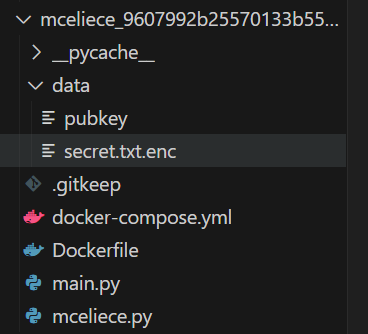

The distribution itself is pretty large!



We are given a very, very large `pubkey` and `secret.txt.enc`. `pubkey` features a large 2D array of `0/1`s and `secret.txt.enc` an array of `0/1`s.

```py
import json, os
from pathlib import Path
from sage.all import vector, matrix, GF
import mceliece
import json

pk = json.loads(Path("data/pubkey").read_text())

H, w = pk["P"], pk["w"]
n = len(H[0])
k = n-len(H)

syndrome = json.loads(Path("data/secret.txt.enc").read_text())
MCELIECE_PARAMS = (3488, 64, 12)

flag = os.getenv("FLAG", "flag{testflag}")

def ask_weights():
    print("Enter the error:")
    try:
        datafile = json.loads(input())
    except EOFError:
        return

    # check length 
    if len(datafile) != MCELIECE_PARAMS[0]: # 3488 0/1s
        print("wrong len")
        return
        # check if binary
    if not all([0 <= d <= 1 for d in datafile]):
        print("not binary")
        return

    # check weight:
    weight = sum(datafile)
    if weight < w:
        print("wrong weight %d" % weight)
        return

    # compute syndrome
    check_syndrome = None
    try:
        data = vector(GF(2), datafile)
        check_syndrome = mceliece.encrypt([matrix(GF(2), pk["P"]), pk["w"]], data)
    except Exception as e:
        print(e)
        return
    
    # check syndrome
    for i in range(n-k):
        if syndrome[i] != check_syndrome[i]:
            print("wrong syndrome")
            return
    print(flag)
    exit(0)
    

def main():
    print("Welcome to McEliece Weight Lifting!")
    print("Robert, our lord and savior of the gym, reveals his flag only after you lift some weights.")
    while True:
        ask_weights()

if __name__ == '__main__':
    try:
        main()
    except EOFError:
        pass
    except KeyboardInterrupt:
        pass
```
`main.py` requires us to enter an array of `0/1`s, performs some checks, then encrypts our data using the public key. It then checks that the encrypted output is equal to `syndrome` which is derived from `secret.enc.txt`, and if so, gives us the flag.

The library provided, `mceliece.py`, is a lot more bigger but seems to code the logic for the [McEliece Cryptosystem](https://en.wikipedia.org/wiki/McEliece_cryptosystem). Unironically I've done a challenge that involved it before, feel free to check it out [here!](https://github.com/Warriii/CTF-Writeups/blob/main/nus_greyhats/greyquals_24/crypto_coding.md) The attached writeup does go in depth into the intricacies of the cryptosystem itself, feel free to take a look!

`mceliece.py`
```py
#!/usr/bin/env sage
import binascii
from typing import List
from sage.all_cmdline import *
from sage.all_cmdline import binomial


def shuffle(x: List):
    """
    :param x
    """
    y = []
    while len(x) > 0:
        xi = choice(x)
        x.remove(xi)
        y.append(xi)
    x.extend(y)

def random_permutation_matrix(n: int):
    """
    :param n: size of the permutation matrix
    :return P: a n x n matrix whcih only permutes columns 
        (in each column and row a single entry is != 0)
    """
    v = list(range(1, n+1))
    shuffle(v)
    p = Permutation(v)
    P = p.to_matrix()
    return P

def encode(message: bytes, n: int, w: int) -> List[List[int]]:
    m = int(binascii.hexlify(message), 16)
    max_val = binomial(n, w)
    E = []
    while m != 0:
        e = encode_error(m % max_val, n, w)
        E.append(e)
        m //= max_val

    if len(E) == 0:
        E = [encode_error(0, n, w)]
    
    assert all([sum(e) == w for e in E])
    return E

def decode(errors: List[List[int]], n: int, w: int) -> bytes:
    m = 0
    max_val = binomial(n, w)
    for e in errors[::-1]:
        m *= max_val
        m += decode_error(e, n, w)
    M = hex(m)[2:]
    return binascii.unhexlify(("" if len(M) % 2 == 0 else "0") + M)

def encode_error(m: int, n: int, w: int) -> List[int]:
    assert 0 <= m < binomial(n, w)
    assert 0 <= w <= n
    e = []
    w_ = w
    m_ = m
    for n_ in range(n, 0, -1):
        bn = binomial(n_ - 1, w_ - 1)
        b = int(m_ < bn)
        e += [b]
        if b:
            w_ -= 1
        else:
            m_ -= bn
    return e

def decode_error(e: List[int], n: int, w: int) -> int:
    assert len(e) == n
    assert sum(e) == w
    e_ = e
    w_ = w
    m = 0
    for i in range(n):
        if e[i] == 1:
            w_ -= 1
        else:
            m += binomial(n - 1 - i, w_ - 1)
    return m

def randc(P):
    n = P.ncols()
    k = n-P.nrows()

    (I, A) = P[:,:n-k], P[:,n-k:]
    assert I == matrix.identity(GF(2), n-k)
    G = A.T.augment(matrix.identity(GF(2), k))

    v = random_vector(GF(2), k)

    c = v * G
    return c

def randm(pk):
    P, w = pk
    n = P.ncols()
    ei = list(range(n))
    shuffle(ei)
    supp = ei[:w]
    e = zero_vector(GF(2), n)
    for i in supp:
        e[i] = 1 
    return e

def encrypt(pk, m):
    """
    :param pk: public key = parity check matrix
    :param m: the error to 
    """
    P, w = pk
    s = P * m
    return s

def decrypt(keypair, s):
    sk, pk = keypair
    g, L = sk
    P, w = pk
    t = w

    n = P.ncols()
    k = n-P.nrows()
    y = vector(list(s) + [0]*k)

    # prepare the integer ring(s)
    Fm = g.base_ring()
    G = Fm["x"]
    K = G.quotient_by_principal_ideal(g*g, names=('x',)); (x,) = K._first_ngens(1)

    # calculate s_y(x)
    syx = sum((x - Li).inverse() for yi, Li in zip(y, map(K, L)) if yi)

    # calculate all s_y(x) * x**i values for the matrix
    S = [syx]
    for i in range(t):
        S.append(S[i] * x)

    # construct matrix M from the lecture
    SX = list(map(list, S[:-1]))
    M1 = matrix(SX).T
    M2 = matrix([list(x**i) for i in range(t-1)]).T
    M = M1.augment(M2)

    # make matrix symmetric to invert
    N = M[:-1,:].inverse()

    # use the inverse matrix to calculate f_e
    fe_dfe = list(N * vector(x.base_ring(), list(S[-1])[:-1]))

    # validate matrix solution
    assert list(M * vector(Fm, fe_dfe)) == list(S[-1])

    # extract f_e
    fe = G(fe_dfe[:t] + [1])

    # factor/find roots of f_e to extract e
    e = vector(GF(2), [(fe(a) == 0) for a in L])

    # validate error
    assert e.hamming_weight() == w
    return e

def check(pk, s, e):
    """
    :param pk 
    :param s
    :param e
    :return true/false
    """

    e_prime = pk * e 
    return true

def gen_priv_key(n: int, t: int, m: int):
    """
    :param n: length of code
    :param t: degree of polynomial
    :param m: extension field degree
    :return irreducible goppa polynomial, support
    """
    GF2m = GF(2**m)
    # G.<x> = GF2m[]
    G = GF2m['x']

    print(" - generate irreducible polynomial g")
    while not (g := G.random_element(t)).is_irreducible():
        pass

    print(" - create support L (part 1)")
    L = [a for a in GF2m.list() if g(a) != 0]
    assert len(L) > n, f"{n} goppa points required, but only {len(L)} points exist"

    print(" - create support L (part 2)")
    shuffle(L)
    return g, vector(L[:n])


def gen_pub_key(g, L: List, m: int):
    """
    :param g: irreducible goppa polynomial of degree t
    :param L: support
    :param m: degree of the extension field
    """
    Lginv = vector([g(a).inverse() for a in L])

    t = len(list(g))-1
    n = len(L)

    M = []
    print(" - create M")
    for i in range(n):
        a = L[i]
        aj = Lginv[i]
        V = list(aj)
        for j in range(1, t):
            aj *= a
            V.extend(list(aj))
        M.append(V)

    print(" - finishing P")
    P = matrix(GF(2), M).T
    while not P[:,:t*m].is_invertible():
        H = random_permutation_matrix(n)
        P *= H
        L *= H
    return P.echelon_form(), L

def gen_key(n: int, t: int, m: int):
    print("SKgen")
    g, L = gen_priv_key(n, t, m)

    print("PKgen")
    P, L = gen_pub_key(g, L, m)

    return (g, L), (P, t)
```

Knowing that we simply need to find a valid plaintext that encrypts to our desired ciphertext, we skip past the hundreds of lines of code and take a look at how its implemented and used.

`mceliece.py`
```py
def encrypt(pk, m):
    """
    :param pk: public key = parity check matrix
    :param m: the error to 
    """
    P, w = pk
    s = P * m
    return s
```

`main.py`
```py
    check_syndrome = None
    try:
        data = vector(GF(2), datafile)
        check_syndrome = mceliece.encrypt([matrix(GF(2), pk["P"]), pk["w"]], data)
    except Exception as e:
        print(e)
        return
```

It's just matrix multiplication! We simply load the public key and call `.solve_right()` to recover a valid result.

Saving this into a `json` file and then running it through the `ncat` gives us the flag.

`sol.py`
```py
import json
from pathlib import Path
from sage.all import *
import mceliece, json

pk = json.loads(Path("data/pubkey").read_text())
syndrome = json.loads(Path("data/secret.txt.enc").read_text())

H, w = pk["P"], pk["w"]
M = matrix(GF(2), H)
S = vector(GF(2), syndrome)
datafile = [int(i) for i in M.solve_right(S)]

with open("soln.json", "w") as final:
	json.dump(datafile, final)
	

"""
cat soln.json - | nc mceliece.flu.xxx 5555
Welcome to McEliece Weight Lifting!
Robert, our lord and savior of the gym, reveals his flag only after you lift some weights.
Enter the error:

flag{H4v3_y0U_3v3N_l0Ck3d_1n_th3_c0rr3CT_w31Ght}
"""
```