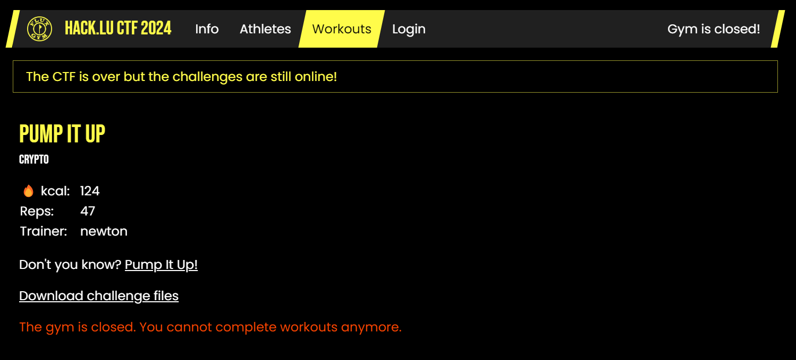

Credits for the solve and solution code goes to `elijah5399`!

We're given two files in particular.

`audio_engine.py`
```py
def extract_sound_data(voc_filename):
    with open(voc_filename, 'rb') as voc_file:
        voc_file.read(26)
        return voc_file.read()[:-1]        

def create_voc_file(output_filename, sound_data_blocks):
    with open(output_filename, 'wb') as output_file:
        output_file.write(b'Creative Voice File\x1A\x1A\x00\x14\x01\x1f\x11')
        output_file.write(sound_data_blocks+b"\x00")
```

and a main

`pump.py`
```py
import secrets
from Crypto.Cipher import AES # pip install pycryptodome
import os
import string
import audio_engine

# flag = flag{y0u_
with open("../SECRET/flag.txt", "r") as fp:
    flag = fp.read().strip()
flag = flag.encode().hex()

if not os.path.isdir("snippets"):
    os.mkdir("snippets")

    for cnt,s in enumerate(string.digits + "abcdef"):
        os.system(f"ffmpeg -ss {cnt} -t 1 -i pump.opus snippets/{ord(s)}.voc")
sound_bites = []
for s in flag: # hex char
    out = audio_engine.extract_sound_data(f"snippets/{ord(s)}.voc") # 26 bytes
    sound_bites.append(out)
audio_engine.create_voc_file("flag.voc", b"".join(sound_bites)) 


def encrypt_it():
    key = secrets.token_bytes(16)
    cipher = AES.new(key, AES.MODE_ECB)
    with open("flag.voc", "rb") as f:
        val = f.read()
    val += b"\x00" * (16 - len(val) % 16)
    with open("flag.enc", "wb") as f:
        f.write(cipher.encrypt(val))
encrypt_it()
```

Among other files we also have a `pump.opus` file and `flag.enc` that is `27 MB` large.

Running `ffmpeg -ss {cnt} -t 1 -i pump.opus snippets/{ord(s)}.voc` gives us multiple files each corresponding to a hexdigit from `0-9a-f`, each of which being about `192 kB`.

We see that the flag is expressed in hex form, then each digit results in the entirety of one of the corresponding `.voc` files appended to `flag.voc` except for the first 26 bytes which is implied to be a header. The entire `.voc` is then AES encrypted with an unknown key using `ECB`.

The trick here to recovering the flag is to use a design property of AES ECB. AES ECB is simply put a block cipher that takes every 16 bytes, throws it into a function and then outputs 16 bytes.

Because of this, if I have the same 16-byte blocks, their ciphertext outputs would also be the same. (See this [blog post](https://words.filippo.io/the-ecb-penguin/) I'd found about it!)Thus, if I keep track of certain 16-byte blocks in each of the `{ord(s)}.voc` files, I can compare the same 16-byte blocks in the ciphertext, and then see if they match!

The problem with this lies in that every hexdigit has `192216` bytes written, which is `8 mod 16`, 16 being the block size of regular AES. Thus, even if we read from the same `.voc` file during encryption, the blocks themselves might contain separate data.

For example, if I have a flag thats hexdigit is `66`, and `6.voc` is `AAAAAAAABBBBBBBBCCCCCCCC`,

The plaintext is

`AAAAAAAABBBBBBBBCCCCCCCC | AAAAAAAABBBBBBBBCCCCCCCC`

But upon ordering it with every 16 bytes we have:

`AAAAAAAABBBBBBBB | CCCCCCCCAAAAAAAA | BBBBBBBBCCCCCCCC`

Thus if we, say, take the first 16 bytes of `6.voc`'s corresponding data and check for the AES ECB output, it would either be the encrypted output of the `AAAAAAAABBBBBBBB` block, or the latter 8 bytes of the encrypted `CCCCCCCCAAAAAAAA` block concatenated with the former 8 bytes of the next `BBBBBBBBCCCCCCCC` block.

Nonetheless, as we know the blocks before and after are the exact same, we only need to account for two possibilities for each `hex.voc` file, so long as the offsets we're looking for are 16 bytes away from the start or 16 bytes before the end of the file (as otherwise the adjacent blocks might be different before encryption)

To be safe, we take it from an offset such as `100000`, or `1337` etc. for the matter. From our known plaintext we're then able to get partial information of the flag. Making some guesses we finally obtain the flag!

`sol.py` (thanks eli! Did make some modifications to it)
```py
import string
from collections import defaultdict

hex_recovered = []
rev_mp = defaultdict(lambda: "?")
xs = "flag{y0u_"
# xs = "flag{y0u_g0tta_pumP_1t_uP_l1k3_to_th3_m00"
x = xs.encode().hex()
cs = set()

for c in (string.digits + "abcdef"):
    cs.add(c)

for c in x:
    if c in cs:
        cs.remove(c)

ct = open("flag.enc", "rb").read()
SZ = 1337 # as long as it ensures the data chunk is not too close to the start or end of the file

for i in range(len(x)):
    curr_hex_ltr = x[i]
    curr_ct = ct[192216 * i + SZ : 192216 * i + SZ + 16]
    rev_mp[curr_ct] = curr_hex_ltr 

ct_blocks = set()

with open("flag.enc", "rb") as f:
    while True:
        b1 = f.read(SZ)
        if not b1:
            break
        b2 = f.read(16)
        f.read(192216 - 16 - SZ)
        hex_recovered.append(rev_mp[b2])
        ct_blocks.add(b2)

hex_recovered = ''.join(hex_recovered)
flag = []
for i in range(0, len(hex_recovered), 2):
    curr_char = hex_recovered[i:i + 2]
    if curr_char[0] == '?' or curr_char[1] == '?':
        flag.append('?')
    else:
        flag.append(chr(int(curr_char, 16)))
print(''.join(flag)) 
# flag{y0u_g0tta_pumP_1t_uP_l1k3_to_th3_m00n_and_bey0nd_v3ry_1cky_buT__g00d}
```