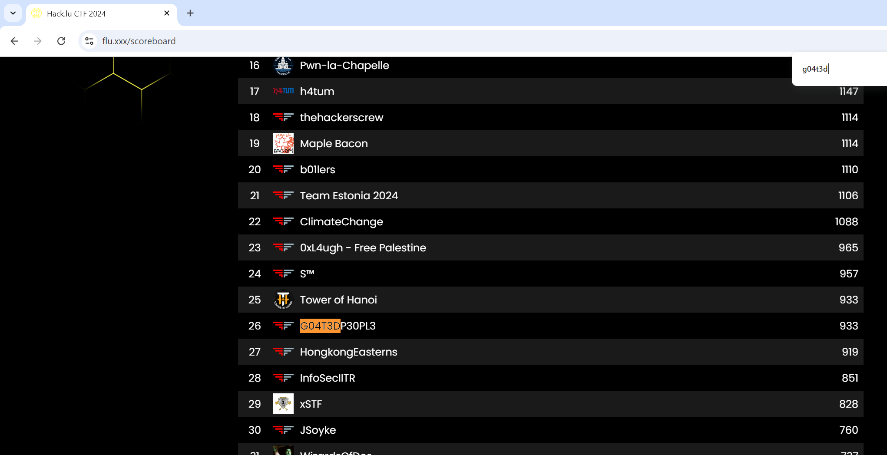
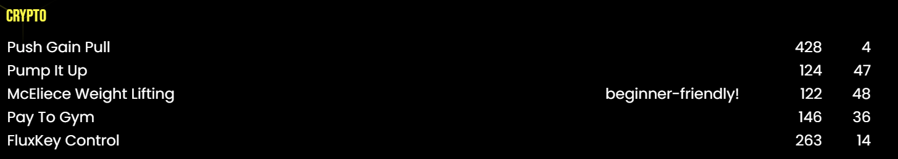

Very recently near the middle of October I had the opportunity to participate in `hack.lu` ctf! I was invited by `elijah5399` and played under `G04T3DP30PL3`. We secured a nice `26th` place with `933` points!

The challenges were pretty fun, and coming off of `ASCIS Finals` on the same day I decided to look into the crypto challenges which felt like a breath of fresh air from an A/D finals ctf that was more or less solely about web as well as stolen challenges :P

I was able to take a look into the rev and pwn challenges as well, and they were pretty challenging! Didn't managed to solve a single one but still, the experience was super fun.

This series of writeups will cover the Crypto challenges that I was able to look at and managed to solve! One of them was insanely enjoyable to do too, being `FluxKey Control` :D

Unfortunately I wasn't able to solve `Push Gain Pull`, that's a bummer. QaQ

