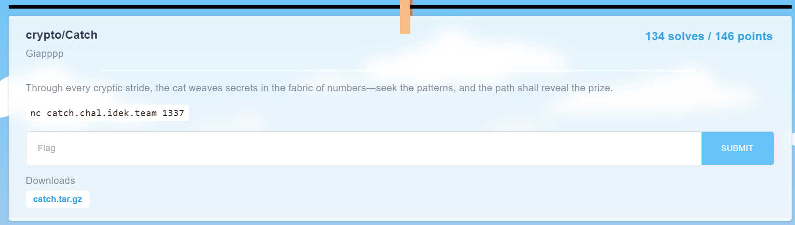

`chall.py`
```py
from Crypto.Random.random import randint, choice
import os

# In a realm where curiosity roams free, our fearless cat sets out on an epic journey.
# Even the cleverest feline must respect the boundaries of its world—this magical limit holds all wonders within.
limit = 0xe5db6a6d765b1ba6e727aa7a87a792c49bb9ddeb2bad999f5ea04f047255d5a72e193a7d58aa8ef619b0262de6d25651085842fd9c385fa4f1032c305f44b8a4f92b16c8115d0595cebfccc1c655ca20db597ff1f01e0db70b9073fbaa1ae5e489484c7a45c215ea02db3c77f1865e1e8597cb0b0af3241cd8214bd5b5c1491f

# Through cryptic patterns, our cat deciphers its next move.
def walking(x, y, part):
    # Each step is guided by a fragment of the cat's own secret mind.
    epart = [int.from_bytes(part[i:i+2], "big") for i in range(0, len(part), 2)]
    xx = epart[0] * x + epart[1] * y
    yy = epart[2] * x + epart[3] * y
    return xx, yy

# Enter the Cat: curious wanderer and keeper of hidden paths.
class Cat:
    def __init__(self):
        # The cat's starting position is born of pure randomness.
        self.x = randint(0, 2**256)
        self.y = randint(0, 2**256)
        # Deep within, its mind holds a thousand mysterious fragments.
        while True:
            self.mind = os.urandom(1000)
            self.step = [self.mind[i:i+8] for i in range(0, 1000, 8)]
            if len(set(self.step)) == len(self.step):
                break

    # The epic chase begins: the cat ponders and strides toward the horizon.
    def moving(self):
        for _ in range(30):
            # A moment of reflection: choose a thought from the cat's endless mind.
            part = choice(self.step)
            self.step.remove(part)
            # With each heartbeat, the cat takes a cryptic step.
            xx, yy = walking(self.x, self.y, part)
            self.x, self.y = xx, yy
            # When the wild spirit reaches the edge, it respects the boundary and pauses.
            if self.x > limit or self.y > limit:
                self.x %= limit
                self.y %= limit
                break

    # When the cosmos beckons, the cat reveals its secret coordinates.
    def position(self):
        return (self.x, self.y)

# Adventurer, your quest: find and connect with 20 elusive cats.
for round in range(20):
    try:
        print(f"👉 Hunt {round+1}/20 begins!")
        cat = Cat()

        # At the start, you and the cat share the same starlit square.
        human_pos = cat.position()
        print(f"🐱✨ Co-location: {human_pos}")
        print(f"🔮 Cat's hidden mind: {cat.mind.hex()}")

        # But the cat, ever playful, dashes into the unknown...
        cat.moving()
        print("😸 The chase is on!")

        print(f"🗺️ Cat now at: {cat.position()}")

        # Your turn: recall the cat's secret path fragments to catch up.
        mind = bytes.fromhex(input("🤔 Path to recall (hex): "))

        # Step by step, follow the trail the cat has laid.
        for i in range(0, len(mind), 8):
            part = mind[i:i+8]
            if part not in cat.mind:
                print("❌ Lost in the labyrinth of thoughts.")
                exit()
            human_pos = walking(human_pos[0], human_pos[1], part)

        # At last, if destiny aligns...
        if human_pos == cat.position():
            print("🎉 Reunion! You have found your feline friend! 🐾")
        else:
            print("😿 The path eludes you... Your heart aches.")
            exit()
    except Exception:
        print("🙀 A puzzle too tangled for tonight. Rest well.")
        exit()

# Triumph at last: the final cat yields the secret prize.
print(f"🏆 Victory! The treasure lies within: {open('flag.txt').read()}")
```

Lots of comments, but we can simplify the challenge to the following;

Every round, a cat spawns at some known location. Let $X$ denote the vector representing its locale.

As the cat spawns, it generates 125 different possible "moves" it can make, encoded under 8-length bytestrings. Each "move" operation is essentially a matrix multiplication operation over $\text{GF(limit)}$ where $\text{limit}$ is a given prime value.

The cat samples 30 distinct moves from the 125 possible moves, moves accordingly, and outputs its final position, $X'$, to us. We must show that we can determine a path from $X$ to $X'$ using the 125 moves the cat has made.

We do this 20 times in a row to retrieve the flag.

Put simply, given a list of matrices $M = \lbrace M_0, M_1, ..., M_{124} \rbrace$, and vectors $X, X'$, find a subset of 30 matrices in $M$ that gets one from $X$ to $X'$.

Computationally this should be hard, but we use a neat little trick, in that because the coefficients of the matrices in $M$ are all less than $2^{16}$, the cat's position vector coordinates will never ever exceed $\text{limit}$ due to how big it is.

Thus, instead of solving the problem over $\text{GF(limit)}$, we can just solve it over the integers $\mathbb{Z}$ instead! 

We will exploit the fact that in our scenario, before a matrix multiplication, the vector parsed into it has values that are integers; i.e., $Y * M_j = X'$, where $M_j$ is the last matrix move and $Y$ the position vector before it, has $Y$ contain integer values.

We will, for time being, assume that at every round, all 125 matrices have an inverse. This is usually the case as the probability for one of them to not have an inverse is about $\frac{1}{2^{32}}$, kinda but not really. (for it to not have an inverse, its determinant must be 0).

Because finding the inverse of a matrix $M$ requires dividing the coefficients by $\text{det}(M)$, when we "guess" a wrong move step and try to reverse $X'$ into a $Y$ value, there is a high chance that the backtracked vector will contain non-integer values due to the division by the matrix determinant. On the other hand, if we have the correct matrix, the backtracked vector will have all integer values.

With very high probability, we recover the exact chain of matrices and in the order that they come in. We then send it back into the server and repeat the process 20 times to obtain the flag.

`solve.py`
```py
import os
os.environ["TERM"] = "xterm-256color"
os.environ["TERMINFO"] = "/usr/share/terminfo"

from pwn import remote
from sage.all import Matrix, vector, QQ, ZZ

R = remote('catch.chal.idek.team', 1337)
for round in range(20):
    print(f"👉 Hunt {round+1}/20 begins!")
    # cat = Cat()
    # human_pos = cat.position()
    R.recvuntil(b'Co-location: ')
    human_pos = eval(R.recvline().rstrip().decode())
    H = vector(QQ, human_pos)
    # print(f"🐱✨ Co-location: {human_pos}")

    R.recvuntil(b'Cat\'s hidden mind: ')
    catmind = bytes.fromhex(R.recvline().rstrip().decode())
    # print(f"🔮 Cat's hidden mind: {cat.mind.hex()}")
    # catmind = bytes.fromhex(cat.mind.hex())

    moves = [catmind[i:i+8] for i in range(0, 1000, 8)]
    M = []
    for m in moves:
        epart = [int.from_bytes(m[i:i+2], "big") for i in range(0, len(m), 2)]
        M.append(Matrix(QQ, [[epart[0], epart[1]],\
                             [epart[2], epart[3]]]))

    # cat.moving() # 30 steps
    print("😸 The chase is on!")

    R.recvuntil(b'Cat now at: ')
    cat_pos = eval(R.recvline().rstrip().decode())
    
    # print(f"🗺️ Cat now at: {cat.position()}")
    # cat_pos = cat.position()
    C = vector(QQ, cat_pos)
    mset = b''
    for mptr in range(30):
        valids = []
        for mat in M:
            C_ = mat**-1 * C
            if all(i in ZZ for i in C_):
                valids.append(mat)
        assert len(valids) == 1, "uh oh"
        ptr = M.index(valids[0])*8
        mset = catmind[ptr:ptr+8] + mset
        C = valids[0]**-1 * C

    R.recvuntil(b'Path to recall (hex): ')
    R.sendline(mset.hex().encode())
    print(R.recvline().rstrip().decode('utf-8'))
    # mind = bytes.fromhex(mset.hex())
    # for i in range(0, len(mind), 8):
    #     part = mind[i:i+8]
    #     if part not in cat.mind: # this is not as secure.
    #         print("❌ Lost in the labyrinth of thoughts.")
    #         exit()
    #     human_pos = walking(human_pos[0], human_pos[1], part)

    # if human_pos == cat.position():
    #     print("🎉 Reunion! You have found your feline friend! 🐾")
    # else:
    #     print("😿 The path eludes you... Your heart aches.")
    #     exit()
print(R.recvline().rstrip().decode('utf-8')) # flag
R.close()
```

```
[+] Opening connection to catch.chal.idek.team on port 1337: Done
👉 Hunt 1/20 begins!
😸 The chase is on!
🎉 Reunion! You have found your feline friend! 🐾
👉 Hunt 2/20 begins!
😸 The chase is on!
🎉 Reunion! You have found your feline friend! 🐾
👉 Hunt 3/20 begins!
😸 The chase is on!
🎉 Reunion! You have found your feline friend! 🐾
...
👉 Hunt 19/20 begins!
😸 The chase is on!
🎉 Reunion! You have found your feline friend! 🐾
👉 Hunt 20/20 begins!
😸 The chase is on!
🎉 Reunion! You have found your feline friend! 🐾
🏆 Victory! The treasure lies within: idek{Catch_and_cat_sound_really_similar_haha}
[*] Closed connection to catch.chal.idek.team port 1337

```
