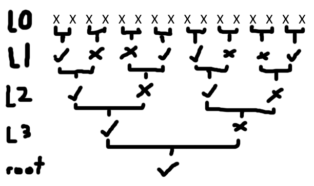

### Crypto - Mersenne Twister (1 Solve, 1000 pts)
```
Did you know that Python's Random module uses the Mersenne Twister as its generator, with period of 2^19937 - 1? Let's see if you can solve this challenge which uses Python's Random module!

Author: warri
```

`chall.py`
```py
from hashlib import sha256
from Crypto.Cipher import AES
import random


MAGIC_NUMBERS = [(0,6,10,12,14,15), 
                 (0,3,4,7),
                 (0,2),
                 (0,)]


class MT: # omg mersenne twister
    def __init__(self, key:bytes):
        assert len(key) == 16
        self.l0 = [sha256(str(i).encode()).hexdigest() for i in key]
        self.l1 = [sha256(''.join(self.l0[i:i+2]).encode()).hexdigest() for i in range(0, len(self.l0), 2)]
        self.l2 = [sha256(''.join(self.l1[i:i+2]).encode()).hexdigest() for i in range(0, len(self.l1), 2)]
        self.l3 = [sha256(''.join(self.l2[i:i+2]).encode()).hexdigest() for i in range(0, len(self.l2), 2)]
        self.root = sha256(''.join(self.l3).encode()).hexdigest()

    def __repr__(self):
        out = ""
        ptr = 0
        ls = [self.l0, self.l1, self.l2, self.l3]
        for row in MAGIC_NUMBERS:
            for j in row:
                out += ls[ptr][j] + '\n'
            ptr += 1
        out += self.root
        return out
    
    def purge(self):
        self.l0 = [random.randbytes(32).hex() for _ in range(16)]


flag = b"ISC2CTF{???????????????????????????????????????}"
key = random.randbytes(16)
nonce = random.randbytes(8)
cipher = AES.new(key, mode=AES.MODE_CTR, nonce=nonce)
ciphertext = cipher.encrypt(flag).hex()
nonce = nonce.hex()
print(f'{nonce = }')
print(f'{ciphertext = }')

mt = MT(key)
mt.purge()
print("====================")
print("MT PUBLIC DATA BEGIN")
print("====================")
print(mt)
print("====================")
print("MT PUBLIC DATA END  ")
print("====================")
```

`out.txt`
```
nonce = 'f45c3fde6e06b322'
ciphertext = 'fa26beda69e14c04e1114cf5d4ca3e4d69708fc94bc53b8265bb0ffcf27473897b82512ba2ec3cd083cde5fd2a1569ba'
====================
MT PUBLIC DATA BEGIN
====================
9ae328531bfddaf4823ea545faa93d56c5df6484aed3bb21d3f55916fcdb662a
18d4f4968b94f43d088ffa380d94e6e6f01c62c3a64da4c5972a5dacb42876da
1ed946fa9394ab889ccef00ba79c10ea71ca7521022debf68f221ce2fe55dc10
94763d91d9f061c05e64d3a8a54b5d91685bb56b7d6433307e9d574afd28797d
ff2bb1dfca0a3573a4f0ca5caab391feb70f26fb066f78e28f93a0a72d09a3cd
fc1bd31982ebeec1d5618379d2edb3503331883afe6180c7df6d17fe1f85edc8
1b9ffbbcda745f4d93cc64f4bb671e83f8f211b48bf152adb6ed0f35cf0bf950
bdf0e5acc21012e048c1daccd831b0fd6b2255b1ca872bcc93c11b7b04ca95d4
f9a0d3e5d930c6df319102433969ecc03a75f63512d86fe6d3711482ed967c16
a515ff1776290ccc574c52d7147ddbc58c4c4747e0994a73ddb2aa827fd30d3e
fe058709789d822251c4c3737078103e8a976a7dd20048c71a3b96c420ce1943
0e7bb79d8b9ac3f69114298d48ec7a3f24384840532580ee9c873c835225eb36
4f6ad7acaf8e9ba041d98bd4e83e19b14a9e5d18c49be3fed956cdbbdfbab992
fa288dd310b9f26e6ad4b41125f9dd205df7618cf88fbff262c4d35159347f01
====================
MT PUBLIC DATA END
====================
```

The idea behind `Mersenne Twister` was to make a fake-out challenge that sounds super hard but is actually pretty simple when you think about it. The premise was that Python's `random` module is insecure, in that with enough data you can reverse the `Mersenne Twister` generator that Python uses to predict subsequent `random` outputs. This is a lot, lot harder to exploit, thus I thought setting that as the name and making the challenge sound as intimidating as possible would be funny :)

The truth is what we have here is not a `Mersenne Twister` challenge nor is it based off of the `random` module, but rather a challenge based off of [Merkle Trees](https://en.wikipedia.org/wiki/Merkle_tree), a tree whereby every leaf node is a hash output and parent nodes are hashes of the concatenated data of the leaf nodes.

```py
class MT: # omg mersenne twister
    def __init__(self, key:bytes):
        assert len(key) == 16
        self.l0 = [sha256(str(i).encode()).hexdigest() for i in key]
        self.l1 = [sha256(''.join(self.l0[i:i+2]).encode()).hexdigest() for i in range(0, len(self.l0), 2)]
        self.l2 = [sha256(''.join(self.l1[i:i+2]).encode()).hexdigest() for i in range(0, len(self.l1), 2)]
        self.l3 = [sha256(''.join(self.l2[i:i+2]).encode()).hexdigest() for i in range(0, len(self.l2), 2)]
        self.root = sha256(''.join(self.l3).encode()).hexdigest()

    def __repr__(self):
        out = ""
        ptr = 0
        ls = [self.l0, self.l1, self.l2, self.l3]
        for row in MAGIC_NUMBERS:
            for j in row:
                out += ls[ptr][j] + '\n'
            ptr += 1
        out += self.root
        return out
    
    def purge(self):
        self.l0 = [random.randbytes(32).hex() for _ in range(16)]
```

We can see the Merkle Tree logic being implemented here in `MT.__init__()`, and when we call `print()` on it (i.e. `__repr__`) we are given specifc values of the full tree based on the `MAGIC_NUMBERS` global variable as well as the root of the tree. `purge()` simply randomises the nodes in `l0`, which functionally prevents one from being able to compute parent nodes given just the `l0` nodes.

We also see how a 16-byte `key` value is encoded in the tree. We take each byte and store its `sha256` hash in a leaf node. We then slowly compute the tree and reach `self.root`.

```py
flag = b"ISC2CTF{???????????????????????????????????????}"
key = random.randbytes(16)
nonce = random.randbytes(8)
cipher = AES.new(key, mode=AES.MODE_CTR, nonce=nonce)
ciphertext = cipher.encrypt(flag).hex()
nonce = nonce.hex()
print(f'{nonce = }')
print(f'{ciphertext = }')

mt = MT(key)
mt.purge()
```

And as it turns out, this 16 byte key is being used in an AES encrypted flag. If we can, from what we're given of the merkle tree, recover the 16 byte key, we can then decrypt the flag.

You might wonder how we can derive a key byte given its sha256 hash. After all, sha256 hashes are designed to not be reversible. However, because we know a single byte is being hashed, we can just brute through all 256 possible key bytes, compute their corresponding sha256 hash and see if it matches. This allows us to compute for possible values that the `mt.l0` array could contain.

Now, with the `MAGIC_NUMBERS` data we know we can construct the following partial merkle tree:



From `L1[0]`, we apply similar logic to brute 256^2 possibilities to derive `L0[0], L0[1]`
From `L2[0]` and `L1[0]`, we brute `L0[2], L0[3]` and see if our derived `L1[1]` merges with `L1[0]` nicely to give the exact `L2[0]` data.

We apply this logic for the rest and recover our full merkle tree. Then we can decrypt the flag knowing the AES key.

`solve.py`
```py
from hashlib import sha256
from Crypto.Cipher import AES
from tqdm import trange

# We'll use this as reference
MAGIC_NUMBERS = [(0,7,10,12,14,15), 
                 (0,3,4),
                 (0,2),
                 (0,)]

# Enumerate all l0 possibilities
l0_possibilities = [sha256(str(i).encode()).hexdigest() for i in range(0, 256)]

# Skip the first 6, they're all random data
# 9ae328531bfddaf4823ea545faa93d56c5df6484aed3bb21d3f55916fcdb662a
# 18d4f4968b94f43d088ffa380d94e6e6f01c62c3a64da4c5972a5dacb42876da
# 1ed946fa9394ab889ccef00ba79c10ea71ca7521022debf68f221ce2fe55dc10
# 94763d91d9f061c05e64d3a8a54b5d91685bb56b7d6433307e9d574afd28797d
# ff2bb1dfca0a3573a4f0ca5caab391feb70f26fb066f78e28f93a0a72d09a3cd
# fc1bd31982ebeec1d5618379d2edb3503331883afe6180c7df6d17fe1f85edc8

# Lets construct our partial merkle tree
l1_0 = "1b9ffbbcda745f4d93cc64f4bb671e83f8f211b48bf152adb6ed0f35cf0bf950"
l1_3 = "bdf0e5acc21012e048c1daccd831b0fd6b2255b1ca872bcc93c11b7b04ca95d4"
l1_4 = "f9a0d3e5d930c6df319102433969ecc03a75f63512d86fe6d3711482ed967c16"
l1_7 = "a515ff1776290ccc574c52d7147ddbc58c4c4747e0994a73ddb2aa827fd30d3e"
l2_0 = "fe058709789d822251c4c3737078103e8a976a7dd20048c71a3b96c420ce1943"
l2_2 = "0e7bb79d8b9ac3f69114298d48ec7a3f24384840532580ee9c873c835225eb36"
l3_0 = "4f6ad7acaf8e9ba041d98bd4e83e19b14a9e5d18c49be3fed956cdbbdfbab992"
root = "fa288dd310b9f26e6ad4b41125f9dd205df7618cf88fbff262c4d35159347f01"

key = [-1 for _ in range(16)] # 16 unknown values

def merge(v0, v1):
    return sha256((v0 + v1).encode()).hexdigest()

for ptr in trange(256**2):
    # Enumerate each pair and use what we know of the merkle tree to solve
    i, j = ptr // 256, ptr % 256
    vi = l0_possibilities[i]
    vj = l0_possibilities[j]
    if merge(vi, vj) == l1_0:
        key[0], key[1] = i, j
    if merge(vi, vj) == l1_3:
        key[6], key[7] = i, j
    if merge(vi, vj) == l1_4:
        key[8], key[9] = i, j
    if merge(vi, vj) == l1_7:
        key[14], key[15] = i, j
    if merge(l1_0, merge(vi, vj)) == l2_0:
        key[2], key[3] = i, j
    if merge(l1_4, merge(vi, vj)) == l2_2:
        key[10], key[11] = i, j
    if merge(l2_0, merge(merge(vi, vj), l1_3)) == l3_0:
        key[4], key[5] = i, j
    if merge(l3_0, merge(l2_2, merge(merge(vi, vj), l1_7))) == root:
        key[12], key[13] = i, j

print(f"Found key {key}")
nonce = bytes.fromhex('f45c3fde6e06b322')
ciphertext = bytes.fromhex('fa26beda69e14c04e1114cf5d4ca3e4d69708fc94bc53b8265bb0ffcf27473897b82512ba2ec3cd083cde5fd2a1569ba')
key = bytes(key)
cipher = AES.new(key, mode=AES.MODE_CTR, nonce=nonce)
pt = cipher.decrypt(ciphertext)
print(pt) # ISC2CTF{dOnt_u5e_t0o_sm4l1_chUnks_wHen_h4sH1nG!}
```