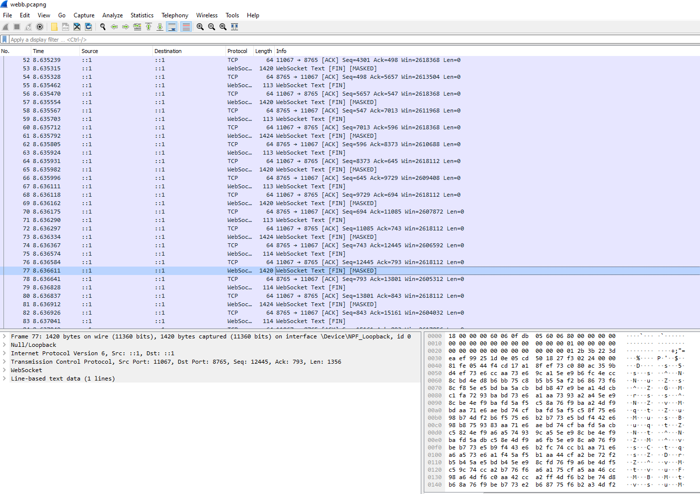

### Forensics - Webb (9 Solves, 981 pts)
```
webb webb webb webb webb webb webb webb

Author: warri
```

We have a really, really large wireshark pcap file thats just a bunch of transmissions using the Websocket protocol.


The challenge seems to be to implement a scripting tool that can automate decoding payloads in the websocket protocol and to then see if we can find the flag. We use the `pyshark` library to iterate through packets in pcap files. 

Since with the websocket protocol, payloads are either in plaintext or masked using a 4-byte mask, we automate the process of deriving whether or not a mask is present, and if so undo the xor to recover the original payload. The first few payloads imply that its all json-encoded, so we json-decode them and find the flag in one of the many packets.

Fun fact, if you decode the data its just [the wikipedia page of the James Webb Telescope](https://en.wikipedia.org/wiki/James_Webb_Space_Telescope) with the flag placed somewhere in the middle lol.

`sol.py`
```py
from base64 import b64decode
import pyshark
import json

def xor(a, b):
    return bytes([a[i] ^ b[i % len(b)] for i in range(len(a))])

def extract(pkt):
    if not "WEBSOCKET" in str(pkt.layers):
        return
    if not "TCP" in str(pkt.layers):
        return
    
    pload = bytes.fromhex(''.join(pkt.tcp.payload.split(':')))
    if "Masking-Key:" in str(pkt.websocket):
        masked_key = bytes.fromhex(''.join(pkt.websocket.masking_key.split(':')))
        pload = xor(pload, masked_key)
    start_index = pload.find(b"{\"")

    try:
        pload = json.loads(pload[start_index:])
        return pload
    except:
        return


cap = pyshark.FileCapture("webb.pcapng")
while True:
    try: 
        p = cap.next()
    except StopIteration:
        break

    web_data = extract(p)
    if not web_data:
        continue
    if 'data' not in web_data:
        continue

    data = b64decode(web_data["data"])
    if b"ISC2CTF{" in data:
        flag = data[data.find(b"ISC2CTF{"):].split(b' ')[0]
        print(flag) # b'ISC2CTF{webb_webb_webb_webb_webb_weeb_webb_webb_webb_websockets!}'
```