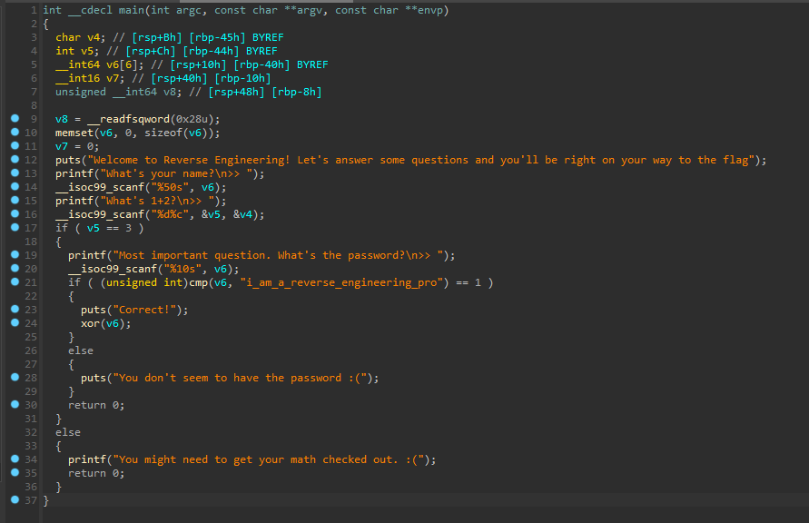

### Rev - faultyfactory (8 Solves, 986 pts)
```
Oh no! Someone swapped two vital lines of code in my program and my binary's now faulty :( Can you recover the flag from it still? I heard you just need to use this technique called static analysis, but what's that?

Author: warri
```

This was designed with intention of it being a beginner friendly reverse engineering challenge.

Using tools such as `ida` we open our binary and arrive at the following pseudocode.



The binary first reads 50 characters into a `v6` buffer, then asks for `1+2` which it reads as an integer in `v5`. It first checks `v5 == 3`, and then asks for a password which it reads into `v6`. Should `cmp(v6, "i_am_a_reverse_engineering_pro")` return `1`, it calls `xor()` with `v6` as an input parameter. We can assume `xor()` prints the flag. We look at the two functions and find their pseudocode to be the following:

```c
__int64 __fastcall cmp(__int64 a1, __int64 a2)
{
  int i; // [rsp+1Ch] [rbp-4h]

  for ( i = 0; *(_BYTE *)(i + a2); ++i )
  {
    if ( *(_BYTE *)(i + a1) != *(_BYTE *)(i + a2) )
      return 0LL;
  }
  return 1LL;
}

unsigned __int64 __fastcall xor(__int64 a1)
{
  int i; // [rsp+1Ch] [rbp-34h]
  __int64 v3[3]; // [rsp+20h] [rbp-30h]
  int v4; // [rsp+38h] [rbp-18h]
  char v5[8]; // [rsp+3Ch] [rbp-14h] BYREF
  unsigned __int64 v6; // [rsp+48h] [rbp-8h]

  v6 = __readfsqword(0x28u);
  v3[0] = 0x919351C5F220C20LL;
  v3[1] = 0x400061A06040216LL;
  v3[2] = 0x36010C1617050600LL;
  v4 = 220534017;
  strcpy(v5, "ro");
  for ( i = 0; i <= 29; ++i )
    putchar((char)(*((_BYTE *)v3 + i) ^ *(_BYTE *)(i + a1)));
  putchar(10);
  return __readfsqword(0x28u) ^ v6;
}
```

`cmp()` is just comparing two strings, and `xor()` is just using the input to xor with a character array `v3`, then prints the output using `putchar()`.

Recall the description.
```
Oh no! Someone swapped two vital lines of code in my program and my binary's now faulty :(
```

We notice that `__isoc99_scanf()` only scans 10 characters for the password and 50 for our name. With only 10 characters, it would not be possible for `v6` to be equal to `"i_am_a_reverse_engineering_pro"`, thus we would never get the flag no matter how we run it.

Fortunately, we have the `xor()` code. And we also know what `v6` is supposed to be. Thus, we reverse the `xor()` function and use what we know to derive the flag, without ever running the binary! (this form of analysis, using decompilers to deduce what a program does without running it is known as static analysis)

`sol.py`
```py
from pwn import xor

s2 = b"\x20\x0c\x22_\x1c\x35\x19\t\x16\x02\x04\x06\x1a\x06\x00\x04\x00\x06\x05\x17\x16\x0c\x01\x36\x01\x15\x25\x0dro"
s1 = b"i_am_a_reverse_engineering_pro"
print(xor(s1, s2)) # b'ISC2CTF{static_analysis_orz}\x00\x00'
```