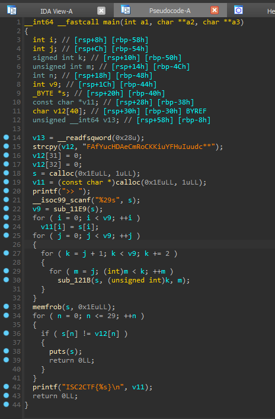

### Rev - swapfactory (0 Solves, 1000 pts)
```
So much swappings @_@

Author: warri
```

I find it pretty sad that this didn't get solved at all. I'd designed it to be a medium difficulty reverse engineering challenge, and I suppose in the end it might have gotten too complicated, or the smurfs didn't bother trying due to it having no solves lol.

We open the binary in IDA and find the following.



This might look like a lot of information, but lets go through and see what the binary is doing.

After initialising some variables and a `v12` string, it reads 29 characters into a buffer `s`.

It computes `v9 = sub_11E9(s)`, which on closer inspection:
```cpp
__int64 __fastcall sub_11E9(__int64 a1)
{
  unsigned int i; // [rsp+14h] [rbp-4h]

  for ( i = 0; *(_BYTE *)((int)i + a1); ++i )
    ;
  return i;
}
```
returns the length of our string.

The first for loop copies the values in `s` over to a `v11` array, and then the really messy part happens.

In a bunch of nested for loops, `sub_121B()` is called on `s` with two integers `k` and `m`.

```cpp
__int64 __fastcall sub_121B(__int64 a1, int a2, int a3)
{
  __int64 result; // rax
  unsigned __int8 v4; // [rsp+1Fh] [rbp-1h]

  v4 = *(_BYTE *)(a2 + a1);
  *(_BYTE *)(a2 + a1) = *(_BYTE *)(a3 + a1);
  result = v4;
  *(_BYTE *)(a1 + a3) = v4;
  return result;
}
```

We see that `sub_121B` is just a swap function that takes a buffer, two indices and swaps the contents, i.e. `sub_121B([1,2,3], 2, 1)` leads to `[1,2,3]` becoming `[1,3,2]`.

So we do a lot of swaps, hence the challenge name, `swapfactory`. A `memfrob()` is called on our buffer `s`. A quick google search tells us that [memfrob](https://man7.org/linux/man-pages/man3/memfrob.3.html) obfuscates an input string or buffer by xoring it with the number 42.

Last but not least, the final for loop checks if `s == v12` from before. If not, the program outputs `s` and returns. Otherwise, if we satisfy all the checks, the program prints the flag using `v11`, our initial input `s` before all the swappings and the memfrob, as the flag.

Thus, to recover the flag it seems that we need to, from v12:
1. Reverse memfrob (we can just xor)
2. Reverse the swaps (uhh...)

`2.` is definitely possible given time and resources, but it also seems like a pain. Let's do `1.` first and see what we have:

```py
v12 = b"FAfYucHDAeCmRoCKKiuYFHuIuudc**"
ct = bytes([i ^ 42 for i in v12])
print(ct)
# b'lkLs_IbnkOiGxEiaaC_slb_c__NI\x00\x00'
```

Looking at the null bytes and considering how the for loops used in the swappings iterate up till the length of our input, we can derive that the flag is exactly `28` characters long.

In reverse engineering, there is a concept known as blackboxing, where instead of examining the inner details of say a function, we treat it as a box, pipe inputs into it, observe the outputs and use it to obtain a general idea of what the function is doing.

Since we know what the swapped flag looks like having done `1.`, in order to "unswap" everything, what we could do is say, pipe an input such as `abcdefghijklmnopqrstuvwxyzAB` into the binary as our input. Naturally this won't be a valid flag, but the program would dump the shuffled memfrob-ed result for us! 

Since the swaps are only dependent on the length of the input, the mapping of each character to its new location after the swaps would always stay the same. Thus, by generating a lookup table, we can see where the `ith` element of our initial string goes once we pipe it through the nested for loops, which we are treating as a blackbox! Using this, we can thus unshuffle our shuffled flag without ever having to touch the nested loops :D

`sol.py`
```py
# echo "abcdefghijklmnopqrstuvwxyzAB" | ./chall
p0 = b"abcdefghijklmnopqrstuvwxyzAB"
c0 = b"hSkE]PMAOB^FC\@I[NGRHKX_ZLYD**".rstrip(b"*")

def de_memfrob(s):
    out = []
    for i in s:
        out.append(i ^ 42)
    return bytes(out)

c0_memfrob = de_memfrob(c0)

# generate lookup table to reverse the swapping
lookup = {}
for ptr in range(len(c0_memfrob)):
    lookup[ptr] = c0_memfrob.index(p0[ptr])

flag_enc = de_memfrob(b"FAfYucHDAeCmRoCKKiuYFHuIuudc")
flag = "IS2CTF{"
for i in range(len(flag_enc)):
    flag += chr(flag_enc[lookup[i]])
flag += "}"
print(flag) # IS2CTF{blaCk_bOxinG_Is_a_NicE_skILl}
```