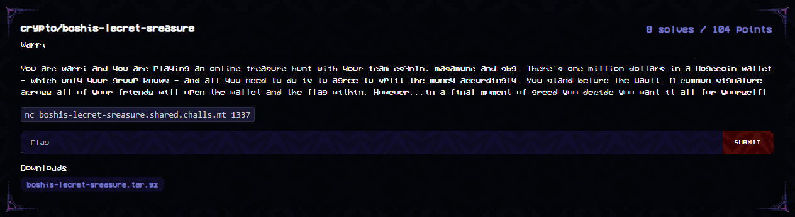

Fun fact, this challenge was originally planned to be used in a local CTF at the end of the year! The challenge idea was originally proposed by a friend and then implemented by myself, but ultimately we thought it might be too hard and so I used it here instead.

Second fun fact, this challenge was more or less inspired by a [Zellic blog about the scheme its based on](https://www.zellic.io/blog/bls-signature-versatility/). The writeup and solution for this challenge pretty much follows the article!

`chall.py`
```py
from sage.all import GF, EllipticCurve, randint, PolynomialRing
from hashlib import sha256
from secret import FLAG

p = 0x1a0111ea397fe69a4b1ba7b6434bacd764774b84f38512bf6730d2a0f6b0f6241eabfffeb153ffffb9feffffffffaaab
r = 0x73eda753299d7d483339d80809a1d80553bda402fffe5bfeffffffff00000001

# https://ask.sagemath.org/question/74403/points-must-be-on-same-curve-ate_pairing-bls12-381/
Fp = GF(p)
F12 = GF(p**12, name='a'); a = F12.gens()[0]
RF = PolynomialRing(F12, name='T'); T = RF.gens()[0]
j = (T**2 + 1).roots(ring=RF, multiplicities=0)[0]

E0 = EllipticCurve(Fp, [0, 4])
E1 = EllipticCurve(F12, [0, 4])
E2 = EllipticCurve(F12, [0, 4*(j+1)])
phi = E2.isomorphism_to(E1)             # onoes this is an isogeny

x1 = 0x17f1d3a73197d7942695638c4fa9ac0fc3688c4f9774b905a14e3a3f171bac586c55e83ff97a1aeffb3af00adb22c6bb
y1 = 0x08b3f481e3aaa0f1a09e30ed741d8ae4fcf5e095d5d00af600db18cb2c04b3edd03cc744a2888ae40caa232946c5e7e1
G1 = E1(x1, y1)

x2 = ( 0x024AA2B2F08F0A91260805272DC51051C6E47AD4FA403B02B4510B647AE3D1770BAC0326A805BBEFD48056C8C121BDB8
       + 0x13E02B6052719F607DACD3A088274F65596BD0D09920B61AB5DA61BBDC7F5049334CF11213945D57E5AC7D055D042B7E * j )
y2 = ( 0x0CE5D527727D6E118CC9CDC6DA2E351AADFD9BAA8CBDD3A76D429A695160D12C923AC9CC3BACA289E193548608B82801
       + 0x0606C4A02EA734CC32ACD2B02BC28B99CB3E287E85A763AF267492AB572E99AB3F370D275CEC1DA1AAA9075FF05F79BE * j )
G2 = E2(x2, y2)

def KeyGen():
    sk = randint(1, r-1)
    pk = sk * G2
    return sk, pk

def H(m):
    h = int(sha256(m).hexdigest(), 16) % r
    return h * G1

def Sign(sk, m):
    σ = sk * H(m)
    return σ

def Verify(pk, m, σ):
    e0, e1 = σ.weil_pairing(phi(G2), r), H(m).weil_pairing(phi(pk), r)
    return e0 == e1

def VerifyAggregate(PK, m, Σ):
    e0, e1 = sum(Σ).weil_pairing(phi(G2), r), H(m).weil_pairing(phi(sum(PK)), r)
    return e0 == e1

assert len(FLAG) == 40

sk_A, pk_A = KeyGen()
sk_B, pk_B = KeyGen()
sk_C, pk_C = KeyGen()
sk_D, pk_D = KeyGen()
PK = [pk_A, pk_B, pk_C, pk_D]
SK = [sk_A, sk_B, sk_C, sk_D]
SIGS = []

##################
# Challenge Code #
##################

print(f'[es3n1n] Hi everyone! My public key is {pk_A.x().list() + pk_A.y().list()[:1]}')
print(f'[masamune] oo ok, mine\'s {pk_B.x().list() + pk_B.y().list()[:1]}')
print(f'[you] {pk_C.x().list() + pk_C.y().list()[:1]}')
print(f'[sbg] Hope I\'m not too late! Mine\'s {pk_D.x().list() + pk_D.y().list()[:1]}')

while True:
    print("1. Sign message (Indiv)\n2. Sign message (Group)\n3. Change Keys (Indiv)\n4. Open The Vault (Group)")
    inp = int(input("> "))

    if inp == 1:
        msg = str(input("Enter message > ")).encode()
        σ = Sign(sk_C, msg)
        SIGS.append((msg, σ))
        print(f'[VAULT] Your signature: {σ.x()}')

    elif inp == 2:
        print("[es3n1n] Okay everyone, lets do this together! We will all sign 'We'll share the flag equally among ourselves', kay?")
        print("[masamune] lgtm!")
        print("[you] sure...")

        group_M = str(input("Enter message > ")).encode()
        if group_M == b'We\'ll give the flag entirely to warri':
            print("[sbg] bruh bro's trying to swindle us lmao")
            print("[es3n1n] Lets form a new team without him. Then I'll interact with the vault and get the flag.")
            break

        σA = Sign(sk_A, group_M)
        σB = Sign(sk_B, group_M)
        σC = Sign(sk_C, group_M)
        σD = Sign(sk_D, group_M)
        SIGS.append((group_M, σA, σB, σC, σD))
        print(f'[VAULT] es3n1n signature: {σA.x()}')
        print(f'[VAULT] masamune signature: {σB.x()}')
        print(f'[VAULT] your signature: {σC.x()}')
        print(f'[VAULT] sbg signature: {σD.x()}')

    elif inp == 3:
        try:
            msg = str(input("Enter public key x value separated by commas\n> ")).split(", ")
            coeffs = [Fp(int(i)) for i in msg]
            new_x = sum([j*a**i for i,j in enumerate(coeffs)])
            msg = str(input("Enter public key y value separated by commas\n> ")).split(", ")
            coeffs = [Fp(int(i)) for i in msg]
            new_y = sum([j*a**i for i,j in enumerate(coeffs)])
            π_x = Fp(int(input("Enter proof of possession new_sk * H(new_pk) x value \n> ")))
            π_y = Fp(int(input("Enter proof of possession new_sk * H(new_pk) y value \n> ")))
            
            π = E1(π_x, π_y)
            pk = E2(new_x, new_y)
            if π.weil_pairing(phi(G2), r) != H(str(pk).encode()).weil_pairing(phi(pk), r):
                raise Exception
            print("Proof verified.")
            PK[2] = pk
        except Exception:
            print("Error, try again.")

    elif inp == 4:
        print("[es3n1n] Alright, its all up to you now. Give it the pointer of our shared signatures!")
        ptr = int(input("[VAULT] Enter sig id\n> "))
        msg, sigs = SIGS[ptr][0], SIGS[ptr][1:]
        if not VerifyAggregate(PK, msg, sigs):
            print("[VAULT] UNAUTHORISED SIGNATURE.")
            print("[sbg] NOOO! YOU THREW!!! L")
            break
        if msg == b'We\'ll share the flag equally among ourselves':
            print("[es3n1n] Yay! Good job guys!!!")
            print("[masamune] You did it!!! poggers")
            ur_flag = FLAG[:len(FLAG)//4]
            sbg_flag = FLAG[len(FLAG)//4:2*len(FLAG)//4]
            es3n1n_flag = FLAG[2*len(FLAG)//4:3*len(FLAG)//4:]
            masamune_flag = FLAG[3*len(FLAG)//4:]
            print("[VAULT] ur_flag =", ur_flag)
            break
        elif msg == b'We\'ll give the flag entirely to warri':
            print("[VAULT] ur_flag =", FLAG)
            print("[es3n1n] wait, i got nothing?!?!")
            print("[sbg] this seems hella sus, warri definitely pwned the system somehow")
            print("[you] nah, its not possible. I got nothing too. Should we make a ticket to the admins?")
            print("[masamune] Yea...shame tbh :<")
            break
        else:
            print("[VAULT] Message unidentified")
            print("[es3n1n] ???")
            break
    else:
        break
```

The challenge itself implements the [BLS](https://en.wikipedia.org/wiki/BLS_digital_signature) digital signature scheme, which itself involves a bilinear pairing between two elliptic curve groups. The challenge uses the pairing friendly BLS12-381 curve that the scheme commonly employs.

The idea behind the scheme involves two different subgroups of order $r$ on the two curves. Let $G_1, G_2$ represent the generators of these two subgroups. In this custom implementation, we let $\phi$ represent an isogeny that bijectively maps values in the group generated by $G_2$ to that generated by $G_1$. (i.e. an isomorphism)

Every user has a secret scalar $sk$, and public key value $pk = sk * G_2$. To make a signature of a message $m$, they compute $\sigma = sk * H(m) * G_1$.

In order to verify a signature, compute and determine whether

$e(\phi(G_2), \sigma) == e(\phi(pk), H(m)*G_1)$

Anyone can use the public key values and signature to compute the above. The equality for a valid singature holds as

$\begin{aligned}e(\phi(G_2), \sigma) &= e(\phi(G_2), sk*H(m)*G_1)
\\ &=e(sk *\phi(G_2),H(m)*G_1)
\\ &=e(\phi(sk * G_2), H(m)*G_1) 
\\ &=e(\phi(pk), H(m)*G_1)\end{aligned}$

The equality holds due to the bilinear property of the pairing (in this case we use the Weil Pairing), and we can do $sk*\phi(G_2) = \phi(sk*G_2)$ due to $\phi$ being a group homomorphism.

The scheme also supports group signatures. Given two users with different keys $(sk_1, pk_1), (sk_2, pk_2)$, we can add up the signatures $\sigma_{1,2} = \sigma_1 + \sigma_2$ and that becomes a group signature by both users on the same message. Then we check that $e(\phi(G_2), \sigma_{1,2}) == e(\phi(pk_1+pk_2), H(m)*G_1)$. I will leave proving the equality and validity of the signature as an exercise to the reader. (use distributive properties of elliptic curve point addition and scalar multiplication!)

This explains how the scheme functions. But how about the challenge? We are one of 4 users. We can sign our own messages, but to open the vault and retrieve the flag, all 4 users must collectively sign a message stating that the flag will be distributed evenly. While we can do this, this leaves us with only the flag prefix; In order to retrieve the whole flag, we need to find a way to spoof a valid group signature stating that the entire flag will be given to us.

We observe a peculiar functionality that we have access to. The ability to change our own public key. With some Chekhov's Gun intuition we derive the following idea:

Using our original public key value $pk_0, sk_0$, sign the group message individually. We obtain a signature $\sigma_0$. As of now, this is invalid as a group signature. We then query the other public key values $pk_1, pk_2, pk_3$ and change our public key to $pk'_0 = pk_0 - pk_1 - pk_2 - pk_3$.

Now, when we parse in the signature $\sigma_0$ as a group signature, the server side computes $e(\phi(G_2), \sigma) == e(\phi(pk'_0 + pk_1 + pk_2 + pk_3), H(m)*G_1)$. The RHS simplifies to $e(\phi(pk_0), H(m)*G_1)$, thus the server incorrectly thinks it is a valid group signature!

While we can derive $pk'_0$ from interacting with the server, we must first prove that we can change our public key value to $pk'_0$. That is, we know some $sk'_0$ such that $sk'_0 * G_2 = pk'_0$. We are required to submit the value $\pi = sk'_0 * H(pk'_0)$, effectively showing that we can sign our own public key. But solving for $sk'_0$ given $pk'_0$ is hard due to the subgroup order $r$ rendering the discrete log non-trivial.

The vulnerability here lies in that the hashing function used in submitting our proof, $H()$, is the exact same as that used in signing. Since $pk'_0 = pk_0 - pk_1 - pk_2 - pk_3$, therefore $sk'_0 = sk_0 - sk_1 - sk_2 - sk_3$ by distributivity of elliptic curve point scalar multiplication. By getting the group to collectively sign the value $pk'_0$, we thus have $sk_0 * H(pk'_0), sk_1 * H(pk'_0), ..., sk_3 * H(pk'_0)$. We can then reuse the distributive nature to derive $\pi$, hence bypassing the proof checker and forging a dangerous public key. We can then use this to spoof our initial individual signature as a group signature to recover the flag! We do note that when interacting with the server, the group signature only gives us the x coordinates of $sk_i * H(pk'_0)$, so we have to do some brute forcing and checking for the correct computed $\pi$.

`solve.py`
```py
# copy everything from server.py up till G2 is initialised

def H(m):
    h = int(sha256(m).hexdigest(), 16) % r
    return h * G1

rem = remote('127.0.0.1', 20001) #, level='debug')

rem.recvuntil(b'My public key is ')
line = eval(rem.recvline().rstrip().decode())
x_A, y_A = sum([j*a**i for i,j in enumerate(line[:-1])]), Fp(line[-1])
rem.recvuntil(b'oo ok, mine\'s ')
line = eval(rem.recvline().rstrip().decode())
x_B, y_B = sum([j*a**i for i,j in enumerate(line[:-1])]), Fp(line[-1])
rem.recvuntil(b'[you] ')
line = eval(rem.recvline().rstrip().decode())
x_C, y_C = sum([j*a**i for i,j in enumerate(line[:-1])]), Fp(line[-1])
rem.recvuntil(b'late! Mine\'s ')
line = eval(rem.recvline().rstrip().decode())
x_D, y_D = sum([j*a**i for i,j in enumerate(line[:-1])]), Fp(line[-1])
p_A, p_B, p_C, p_D = [E2.lift_x(i) for i in [x_A, x_B, x_C, x_D]]
if p_A.y()[0] != y_A:
    p_A *= -1
if p_B.y()[0] != y_B:
    p_B *= -1
if p_C.y()[0] != y_C:
    p_C *= -1
if p_D.y()[0] != y_D:
    p_D *= -1

rem.sendline(b'1')
rem.sendline(b'We\'ll give the flag entirely to warri')

p_C_ = p_C - p_A - p_B - p_D
msg = str(p_C_).encode()
rem.sendline(b'2')
rem.sendline(msg)
rem.recvuntil(b'[VAULT] es3n1n signature: ')
x_σA = Fp(rem.recvline().rstrip().decode())
rem.recvuntil(b'[VAULT] masamune signature: ')
x_σB = Fp(rem.recvline().rstrip().decode())
rem.recvuntil(b'[VAULT] your signature: ')
x_σC = Fp(rem.recvline().rstrip().decode())
rem.recvuntil(b'[VAULT] sbg signature: ')
x_σD = Fp(rem.recvline().rstrip().decode())
s_A, s_B, s_C, s_D = [E1.lift_x(i) for i in [x_σA, x_σB, x_σC, x_σD]]

for iA, iB, iC, iD in itertools.product((0,1), repeat=4):
    π = s_C * (-1)**iC - (s_A * (-1)**iA + s_B * (-1)**iB + s_D * (-1)**iD)
    if π.weil_pairing(phi(G2), r) == H(str(p_C_).encode()).weil_pairing(phi(p_C_), r):
        print("Found π")
        break

rem.sendline(b'3')
rem.sendline(str(p_C_.x().list())[1:-1].encode())
rem.sendline(str(p_C_.y().list())[1:-1].encode())
rem.sendline(str(π.x()).encode())
rem.sendline(str(π.y()).encode())

rem.sendline(b'4')
rem.sendline(b'0')
rem.interactive()
"""
[+] Opening connection to 127.0.0.1 on port 20001: Done
Found π
[*] Switching to interactive mode
1. Sign message (Indiv)
2. Sign message (Group)
3. Change Keys (Indiv)
4. Open The Vault (Group)
> Enter public key x value separated by commas
> Enter public key y value separated by commas
> Enter proof of possession new_sk * H(new_pk) x value
> Enter proof of possession new_sk * H(new_pk) y value
> Proof verified.
1. Sign message (Indiv)
2. Sign message (Group)
3. Change Keys (Indiv)
4. Open The Vault (Group)
> [es3n1n] Alright, its all up to you now. Give it the pointer of our shared signatures!
[VAULT] Enter sig id
> [VAULT] ur_flag = maltactf{d1stribUt1v3=mult1_sIg_pr0bl3M}
[es3n1n] wait, i got nothing?!?!
[sbg] this seems hella sus, warri definitely pwned the system somehow   
[you] nah, its not possible. I got nothing too. Should we make a ticket to the admins?
[masamune] Yea...shame tbh :<
"""
```