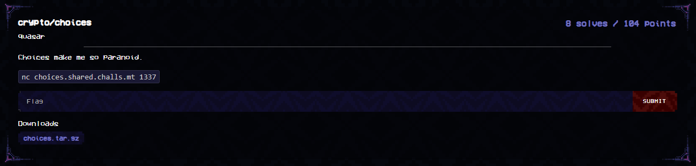

`chall.py`
```py
#!/usr/local/bin/python

from Crypto.Util.number import getPrime
import random
random = random.SystemRandom()
p = getPrime(256)
values = [[random.getrandbits(256), random.getrandbits(256)] for _ in range(64)]
weights = [random.getrandbits(1) for _ in range(64)]
c = sum(v[w] for v, w in zip(values, weights)) % p

print(p)
print(values)
print(c)

if [*map(int,input("weights: "))] == weights:
    print(open("flag.txt").read())
else:
    print("nope")
```

Short challenge file conveys a simple idea. We are working in the integers modulo $p$, and given 128 values which are all randomly generated. For every 2 values, we select one and add them together to form $c$. Given $c, p, \text{values} = \lbrace v_0, v_1, ..., v_{127} \rbrace$, the goal is to determine which values were used in generating $c$. Doing so gives us the flag.

Now this takes the form of a classic knapsack-cryptography merkle-hellman lattice challenge. The idea is to form linear equations involving the values, p, c and then solving with LLL. Understandably LLL is not a easy to grasp topic, and this writeup does assume knowledge of using LLL against the standard merkle-hellman knapsack cryptosystem. I'd recommend checking out a workshop I did on Lattice Reduction [here](https://docs.google.com/presentation/d/1yGJPA2coVFMmSCfWak7pa_-bfeWxXlmK-U3DrCeGCPQ/edit?usp=sharing), which contains slides detailing the technique, as well as the workshop challenges [here](https://github.com/Warriii/Workshop-Challenges) for one to get familiar with LLL!

Nevertheless, presumably one could try and use the matrix
```
# v0        0   1                   1       ...     
# v1        0       1               1       ...     
# v2        0           1               1   ...     
# v3        0               1           1   ...     
# ...       0   ...                 ...     ...     
# v126      0   ...                 ...     ...     1
# v127      0   ...                 ...     ...     1
# p         
# c         1   0   ...    ...  0   1   1   ...     1
```

With intention of looking for the vector
```
0           -1  1/0 1/0 ....        0   0   0 
```
where the `1/0` tells us which weights are being used. However, this method does not work due to the high dimension involved and that it does not fully encode the constraint that either $v_i, v_{i+1}$ is used for every even $i$.

Notice how we only need to find whether or not, for every $v_i, v_{i+1}$ pairing, which is used. Thus, we can simplify this to only having 64 unknowns to derive.

We first shift the problem of choosing between $v_i, v_{i+1}$ to choosing between $0, v_{i+1} - v_i$. We can do this by just subtracting all $v_i$ values from $c$, then modulo $p$.

Then our lattice becomes
```
# v1-v0         0   1   0   ...     0
# v3-v2         0   0   1   ...     0
#   ...         0   0   0   ...     0
# v127-v126     0   0   0   ...     1               
# p             0   0   0   ...     0
# c             1   0   0   ...     0
```
involving 66 dimensions, much less than the 128 + 64 + 2 monstrosity. This also encodes the constraints much better, increasing the odds of LLL giving us the desired vector
```
0   -1  <weights_array>
```

To increase the odds, we scale the lattice by multiplying the first column with some value, and the second with the square root of that value. In doing so, we "kinda" get the lattice reduction to prioritise reducing the first column to 0, and the second to either 1 or -1. Local testing shows that using 64 works and gets us the correct weights array in majority of cases.

Now it remains to implement the lattice.

`solve.py`
```py
from pwn import remote
r = remote("localhost", 1337)
r.recvline()
p = int(r.recvline().strip())
values = eval(r.recvline().strip())
c = int(r.recvline().strip())


vv = [values[i][1] - values[i][0] for i in range(64)]
c = (c - sum([i[0] for i in values])) % p
W, M = 8, []
for i in range(64):
    M.append([vv[i], 0] + [i==j for j in range(64)])
M.append([p, 0] + [0]*64)
M.append([c, 1] + [0]*64)
M = Matrix(M)
M[:,0] *= W**2
M[:,1] *= W
for nrow in M.LLL():
    if nrow[0] == 0 and abs(nrow[1]) == W:
        print(nrow)
        rec_weights = [0 if i == 0 else 1 for i in nrow[2:]]
        break


sol = "".join([str(i) for i in rec_weights])
r.sendlineafter(b"weights: ", sol.encode())
r.interactive()
# (0, 8, -1, 0, 0, 0, -1, 0, -1, 0, 0, 0, 0, -1, -1, 0, 0, 0, 0, -1, 0, -1, 0, -1, 0, -1, -1, 0, -1, 0, -1, 0, 0, -1, -1, 0, -1, 0, -1, 0, 0, 0, 0, 0, -1, -1, -1, -1, 0, -1, -1, 0, -1, -1, 0, -1, 0, 0, 0, -1, -1, -1, 0, 0, 0, -1
# maltactf{so_i_was_afking_hitcon_ctf_but_saw_this_cool_zk_chall_i_think_it_was_like_paranoid_and_i_was_like_why_use_wagners_when_u_can_fix_the_value_generate_two_proofs_for_every_challenge_then_lattice_to_pick_the_sum._anyways_this_challenge_is_that_lattice}
```