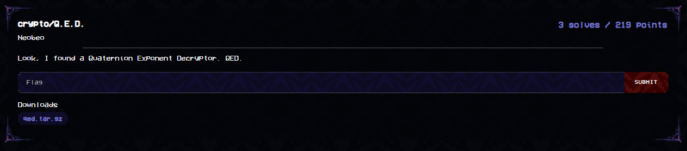

`chall.py`
```py
from Crypto.Cipher import AES
from os import urandom
FLAG = b'maltactf{????????????????????????????????????????????????????}'

key = urandom(16)
nonce = urandom(8)
aes = AES.new(key, AES.MODE_CTR, nonce=nonce)
ct = aes.encrypt(FLAG)
print(f'{ct.hex() = }')

p = 2^61 - 1
e = ZZ.from_bytes(key)
Q.<i,j,k> = QuaternionAlgebra(GF(p), -1, -1)
qs = Q(list(nonce[:4])), Q(list(nonce[4:]))
hint = qs[0]^e * qs[1]^e
print(f'{hint = }')

'''
ct.hex() = '99a1ad9306588f3417980832b9a2766d8d858f83544dc99958ee15a7bc41c699c1e527f2719390cb920bab33735bde2ee69892c49eb903ebfeb6b119c53e'
hint = 813834609555589913 + 1251327713484051298*i + 1983148790654210769*j + 721576762758673034*k
'''
```

This challenge is simple to understand, but rather difficult to execute. We have two quarternions $q_0, q_1$, whose coefficients are 1 byte each. An unknown 128-bit key is generated as $e$, and we are given $hint =q_0^e * q_1^e$. We must recover all of $q_0, q_1, e$ in order to decrypt an AES encrypted flag.

Okay, lets start with some quarternion basics. Quarternions are elements of the form $a + b i + c j + dk$ where $\lbrace i,j,k\rbrace$ can be thought of as dimensions to a 3-dimensional imaginary space. In our case, our quarternions have properties $i*i=-1, j*j=-1, k*k=-1, i*j=k$. We note that quarternion multiplication is associative, but not commutative; $i*j=k$, but $j*i=-k$. In fact, its multiplication is more resemblant of matrix multiplication, which is associative but not commutative. This will come into play later.

While we are on the topic of a 3 dimensional imaginary space, this actually gives us a unique way of representing quarternions. Given $Q = a + bi + cj + dk$, we may rewrite it as $a + \begin{pmatrix}b\\c\\d\end{pmatrix}$, where $a$ is a scalar, and is added to a 3-dimensional vector.

There are some properties of quarternion multiplication that we will utilise here. Reuse our $Q = a + bi + cj + dk$ from earlier.

Firstly, $\begin{align}Q^k = Y + X \begin{pmatrix}b\\c\\d\end{pmatrix}\end{align}$

whereby exponentiating a quarternion retains its $i:j:k$ coefficient ratio. $X, Y$ are scalars that can be derived in terms of $a,b,c,d$ and some $\theta$. Don't worry about the $\theta$.

Secondly, let $Q_n = a_n + \mathbf{v_n}$ where we use $\mathbf{v_n}$ to denote our vector. Then
$\begin{align}Q_r * Q_s = (a_r a_s - \mathbf{v_0} \cdot \mathbf{v_1})+ a_r \mathbf{v_s} +a_s\mathbf{v_r}+(\mathbf{v_r}\times\mathbf{v_s})\end{align}$ where $\times$ is the cross product and $\cdot$ the dot product. Note the dot product term forms when considering how the bases in Quarternion Algebra function when multiplied together. Our scalar is now $a_r a_s - \mathbf{v_0}\cdot\mathbf{v_1}$, and our vector $a_r \mathbf{v_s} +a_s\mathbf{v_r}+(\mathbf{v_r}\times\mathbf{v_s})$.

Consider the vector of the product $Q_0^2 Q_1$. That is, $(a_0^2​−\vert\mathbf{v_0}​\vert^2)\mathbf{v_1}​+2a_0​a_1\mathbf{​v_0}​+2a_0​(\mathbf{v_0}\times\mathbf{v_1}​)$ 

Consider also the vector from $Q_0Q_1$, $a_1\mathbf{v_0} + a_0 \mathbf{v_1} + \mathbf{v_0}\times\mathbf{v_1}$. 

I cannot fathom the next step from here geometrically, but when we remove the component of $Q_0^2 Q_1$ in the $i$ direction of $Q_0Q_1$, and then take the ratio, we get something that's linear in terms of $Q_1$'s vector's entries.

We can see this using Sympy.
```py
import sympy as sp

a0, a1 = sp.symbols('a0 a1')
b0, c0, d0 = sp.symbols('b0 c0 d0')
b1, c1, d1 = sp.symbols('b1 c1 d1')

# Scalar and vector parts of q0*q1
v0 = a0*a1 - (b0*b1 + c0*c1 + d0*d1)
v1 = a0*b1 + a1*b0 + c0*d1 - c1*d0
v2 = a0*c1 + a1*c0 - b0*d1 + b1*d0
v3 = a0*d1 + a1*d0 + b0*c1 - b1*c0

# Vector part of q0*(q0*q1)
w1 = b0*v0 + c0*v3 - d0*v2
w2 = c0*v0 + d0*v1 - b0*v3
w3 = d0*v0 + b0*v2 - c0*v1

# -= w[0] * vr
w2 -= v2 * (w1 / v1)
w3 -= v3 * (w1 / v1)
w1 -= v1 * (w1 / v1)

# derive w3 / w2
ww = (w3 / w2).simplify()
print(sp.factor(ww))
```

We obtain 
```
(a1*b0*d1 - a1*b1*d0 - b0*b1*c1 + b1**2*c0 + c0*d1**2 - c1*d0*d1)
-----------------------------------------------------------------
(a1*b0*c1 - a1*b1*c0 + b0*b1*d1 - b1**2*d0 + c0*c1*d1 - c1**2*d0)
```
From the denominator we can simplify this into
```
c1 * (a1 b0 + a0 b1 + c0 d1 - c1 d0) - b1 (a0 c1 + a1 c0 - b0 d1 + b1 d0)
= c1 * v1 - b1 * v2
```
Similarly we derive the numerator to be
```
d1 v1 - b1 v3
```
Cross multiplying we have
```
(c1 * v1 - b1 * v2) * w3 == (d1 * v1 - b1 * v3) * w2
```
And after some manipulation we arrive at
```
b1 * (v3 * w2 - v2 * w3) + c1 * (v1 * w3) + d1 * (-v1 * w2) == 0 
```

The idea now is to extend the logic. Our $Q_0^2 Q_1$ is now $Q_0 * (Q_0^e Q_1^e) = Q_0^{e+1} Q_1^e$ and our $Q_0Q_1$ is $Q_0^{e} Q_1^{e}$. Here the ratio step makes a tad bit more sense, as due to $(1)$ the $Q_1$ vector components are multiplied by some scalar. Ratio-ing the values is likely to cancel out said scalar thus preserving the identity. Probably.

Regardless, this is where the first step of the solution comes in. We brute all possible `b0, c0, d0` triplets. Then we use the above relation, and because the unknowns (`b1, c1, d1`) are relatively small, we may employ LLL to get them. If we have the right `b0, c0, d0` triplet, we should derive a small `b1, c1, d1` triplet from LLL. (well, not exactly. More like the reduced ratio of `b1 : c1 : d1` where common factors among the trio are removed). This brute takes `2^24`, but at the end we do arrive at a unique solution:

```
b1, c1, d1 = (143, 223, 173)
b0, c0, d0 = (72, 203, 116)
```

We can now, following our notation in $(1)$, represent $Q_0^e, Q_1^e$ as $A_0 + X_0 \begin{pmatrix} b_0\\c_0\\d_0\end{pmatrix}$ and $A_1 + X_1 \begin{pmatrix} b_1\\c_1\\d_1\end{pmatrix}$ respectively for some unknowns (that are probably big) $A_i, X_i$.

Using $(2)$ and looking at the vector output of $Q_0^e Q_1^e$, we have the vector component of the product to be $A_0 X_1 \begin{pmatrix} b_1\\c_1\\d_1\end{pmatrix} + A_1 X_0 \begin{pmatrix} b_0\\c_0\\d_0\end{pmatrix} + X_0 X_1 \left(\begin{pmatrix} b_0\\c_0\\d_0\end{pmatrix}\times\begin{pmatrix} b_1\\c_1\\d_1\end{pmatrix}\right)$.

From the vector component of $hint$, we therefore solve the system of 3 linear equations across $i$, $j$, $k$ axes to obtain our scalars $A_1 X_0, A_0 X_1, X_0 X_1$.

While we cannot yet construct our $Q_0^e, Q_1^e$ just yet, notice that when we divide $Q_0^e$ by $X_0$, we have $\frac{A_0}{X_0} + b_0 i + c_0 j + d_0 k$, and likewise for $Q_1^e$ by $X_1$. We can in fact derive this from the 3 scalar products above! (I'll leave this as an exercise to the reader)

So we now have $\frac{1}{X_0}Q_0^e$, $\frac{1}{X_1}Q_1^e$. Recall when I said that quarternion multiplication is more resemblant of matrix multiplication, which is associative but not commutative. As it turns out, this is very much the case! We can rewrite any quarternion in our quarternion algebra to be some $4\times4$ matrix, and doing $Q_0 * Q_1$ is equivalent to $M_0 * M_1$ where $M_i$ is the matrix representation of quarternion $Q_i$. In sage, we can do this using `<Quarternion>.matrix()` which given quarternion $a+bi+cj+dk$ returns the matrix $M =\begin{pmatrix}a&b&c&d\\-b&a&-d&c\\-c&d&a&-b\\-d&-c&b&a\end{pmatrix}$. Note that $M$ has a multplicative order over the group of matrices with elements as integers modulo p, in that there exists some $n$ where $M^n = I$, $I$ being the 4 by 4 identity matrix. This also means that $Q^n = 1$ where $Q$ is the quarternion corresponding to $M$. We can derive them in sage accordingly with `.multiplicative_order()`.

On that note, we do a quick test on the multiplicative orders of our $\frac{1}{X_0}Q_0^e$, $\frac{1}{X_1}Q_1^e$. We get $7923862866079975390467276039782400$ and $768614336404564650$ respectively. Both of which are factorisable into small primes.

Solving the characteristic polynomial of $\det(M-\lambda I)$ gives us the polynomial $(\lambda^2-2a\lambda+(a^2+b^2+c^2+d^2))^2$, thus the eigenvalues of $M$ are $a \pm \sqrt{-b^2-c^2-d^2}$. (Note that there is only 2 of them.) As our quarternions are done over $F_p$, we can more or less recover our eigenvalues once we compute the modular square root residue of $-b^2-c^2-d^2$ modulo $p$, of which there exists a trivial algorithm to do so given $p \equiv 3\bmod 4$. (Left as another exercise to the reader)

Two properties of eigenvalues are relevant here. 

Firstly, $M \rightarrow cM$ for some scalar $c$ causes the eigenvalues to be multiplied by $c$.

Secondly, $M \rightarrow M^e$ for some exponent $e$ causes the eigenvalues to be exponentiated by $e$.

Consider the quarternion $c Q^d$ for some irritable scalar $c$ that we wish to avoid and exponent $d$. Let the eigenvalues of the matrix representation of $Q$ be $e_1, e_2$. Then we have the eigenvalues of the matrix representation of $c Q^d$ to be $c e_1^d, c e_2^d$. Observe that the ratio of the two eigenvalues is equal to $(\frac{e_1}{e_2})^d$. The eigenvalues are values modulo $p$, thus if we have the right $a_1$, we can guess some $\frac{e_1}{e_2}$ in $Q_1$, and then from $\frac{1}{X_1}Q_1^e$ derive $(\frac{e_1}{e_2})^e$, modulo $p$. 

We can then solve the discrete log to obtain $e \bmod n$, where $n$ is the order of the subgroup generated by $\frac{e_1}{e_2}$ over the positive integers modulo $p$. Group theory tells us $n$ is a factor of $p-1$, and because $p-1$ splits into so many factors, chances are this value is not $p-1$ therefore we'll have many possible values of $e \bmod p$ to enumerate. This large number of enumeration is compounded by the fact that for all possible $a_1$ values, from 0 to 256, (about half of them if im not wrong) will get corresponding valid $e \bmod n$. About 39 thousand of them, in fact.

Clearly we'll need something to eliminate as many other cases as possible, so that we may obtain the correct $a_1$ and $e\bmod p$. (As a reminder, $e$, which is 128-bits, is used as the AES key and $a_1, a_0$ are crucial to recover the AES nonce)

This is where quarternion norms come in. The norm of a quarternion $Q$, defined as $\vert\vert Q\vert\vert$, is equal to $\sqrt{a^2+b^2+c^2+d^2}$ where $Q = a+bi+cj+dk$. Because we have defined the quarternion algebra to be modulo $p$, the norm is also modulo $p$.

The norm has a special case where it is multiplicative, meaning for quarternions $Q_0, Q_1$, $\vert\vert Q_0Q_1\vert\vert = \vert\vert Q_0\vert\vert\cdot\vert\vert Q_1\vert\vert$. Thus by guessing all possible $(a_0, a_1)$ values, we may guess norms $\vert\vert Q_0\vert\vert, \vert\vert Q_1\vert\vert$. For each $(a_0, a_1)$ case, we use eigenvalues as above to obtain possible valid $e \bmod n$, and for every positive integer $k$ where $kn+(e\bmod n)\le (p-1)$, we compute that value, say $v$ and check that $(\vert\vert Q_0\vert\vert\cdot\vert\vert Q_1\vert\vert)^v = \vert\vert hint\vert\vert$. 

If the values align, then we have found a valid $(a_0, a_1, e \bmod (p-1))$ set! (We assume that the lowest common multiple of the orders of subgroups generated by $\vert\vert Q_0\vert\vert\cdot\vert\vert Q_1\vert\vert$ and $\frac{e_1}{e_2}$ in the multiplicative group of positive integers modulo $p$ is $p-1$, and in our case it is) 

Interestingly enough, we have a unique solution. So we now have, from just $hint$, recovered $Q_0 = a_0 + b_0 i + c_0 j + d_0 k$, $Q_1 = a_1 + b_1 i + c_1 j + d_1 k$, and $e \bmod (p-1)$.

The one thing that is stopping us however is that $e$ is 128 bits, and $p$ is only 61 bits. We still have a lot of missing information on our exponent.

Computing the multiplicative orders of $Q_0, Q_1$ gives us $354460798875977565800236148179599360$ and $2305843009213693950$ respectively. Note that the latter is in fact $p-1$, and the former is 119 bits.

Since $Q_1^e = Q_1^{e \bmod (p-1)}$ anyway, we can isolate out $Q_0^e$ from $hint$ by dividing $hint$ by $Q_1^{e \bmod (p-1)}$. The multiplicative order of $Q_0$ can be factored into many small primes thus we can solve for the discrete log trivially (using pohlig hellman for example) to obtain $e \bmod 354460798875977565800236148179599360$. Between a 128 bit value to chase for and a 119-bit modulus to increment with, we do a quick 9-bit brute to eventually arrive at the right $e$ value. After which we then plug our values into AES to decrypt the flag. And now we're done!

`solve.sage`
```py
from Crypto.Cipher import AES
from tqdm import trange

p = 2^61-1
F = GF(p)
Q.<i,j,k> = QuaternionAlgebra(F, -1, -1)

ct = bytes.fromhex('99a1ad9306588f3417980832b9a2766d8d858f83544dc99958ee15a7bc41c699c1e527f2719390cb920bab33735bde2ee69892c49eb903ebfeb6b119c53e')
hint = 813834609555589913 + 1251327713484051298*i + 1983148790654210769*j + 721576762758673034*k

vr = vector(hint)[1:]
v1, v2, v3 = vr

# This triple loop took me about 20 to 30-ish minutes to run
nrs = set()
q0s = set()
for b0 in trange(256):
    for c0 in range(256):
        for d0 in range(256):
            if gcd([b0, c0, d0]) != 1:
                continue
            q0_est = 0 + b0 * i + c0 * j + d0 * k 
            #  the coefficient in 1 doesnt matter, interestingly
            
            w = vector(q0_est * hint)[1:]
            w -= (w[0] / vr[0]) * vr  
            # remove i coefficient
            
            M = Matrix(ZZ, [[1,0,0, v3 * w[1] - v2 * w[2]],
                            [0,1,0, v1 * w[2]],
                            [0,0,1, -v1 * w[1]],
                            [0,0,0, p]]) 
            # Linear equation derived after taking ratios as seen earlier
            
            nr = [abs(_) for _ in M.LLL()[0]] 
            if nr[-1] == 0 and gcd(nr) == 1 and all(_ < 256 for _ in nr):
                nrs.add(tuple(nr))
                q0s.add((b0, c0, d0))
print(f'{nrs = }')
print(f'{q0s = }')

nrs = [(143, 223, 173, 0)]
b0, c0, d0 = 72, 203, 116
b1, c1, d1 = nrs[0][:-1]

v0 = vector(F, [b0, c0, d0])
v1 = vector(F, [b1, c1, d1])

M = Matrix([v0,v1,vector(v0.cross_product(v1))])
A1x0, A0x1, x1x0 = M.solve_left(vector(hint)[1:]) # A1 X0, A0 X1, X0 X1

A1_x1, A0_x0 = A1x0 / x1x0, A0x1 / x1x0
q0e_x0 = A0_x0 + b0 * i + c0 * j + d0 * k
q1e_x1 = A1_x1 + b1 * i + c1 * j + d1 * k

q0e_x1_order = q0e_x0.matrix().multiplicative_order()
q1e_x1_order = q1e_x1.matrix().multiplicative_order() 

tmp = pow(-b1**2-c1**2-d1**2, (p+1)//4, p)
q1e_eigens = [F(A1_x1 + tmp), F(A1_x1 - tmp)]
q1e_ratio = q1e_eigens[0] * pow(q1e_eigens[1], -1, p)

hnorm = hint.reduced_norm()

# about 10 seconds, unique solution
def solve_nonce():

    for a0 in trange(256):
        
        q0 = a0 + b0 * i + c0 * j + d0 * k
        q0norm = q0.reduced_norm()

        for a1 in range(256):

            q1 = a1 + b1 * i + c1 * j + d1 * k
            q1norm = q1.reduced_norm()

            q1_eigens = [F(a1 + tmp), F(a1 - tmp)]
            q1_ratio = q1_eigens[0] * pow(q1_eigens[1], -1, p)
            
            try:
                e_r = F(q1e_ratio.log(q1_ratio))
            except ValueError:
                continue

            q1_ratio_ord = q1_ratio.multiplicative_order()
            for e_val in range(e_r, p-1, q1_ratio_ord):
                if hnorm == (q0norm * q1norm)**e_val:
                    nonce = bytes([a0,b0,c0,d0,a1,b1,c1,d1])
                    return nonce, q1_ratio_ord, e_val


nonce, q1_ratio_ord, e_mod_p_1 = solve_nonce()
print("Recovered nonce", nonce.hex())

a0, a1 = nonce[0], nonce[4]
q0 = Q([a0, b0, c0, d0])
q1 = Q([a1, b1, c1, d1])
q0_ord = q0.matrix().multiplicative_order()
q1_ord = q1.matrix().multiplicative_order()
assert q1_ord == p-1

q0_e = hint / (q1**e_mod_p_1)
e = discrete_log(q0_e, q0, q0_ord)
for key in range(e, 2**128, q0_ord):
    pt = AES.new(key.to_bytes(16, "big"), AES.MODE_CTR, nonce=nonce).decrypt(ct)
    if all(_ < 128 for _ in pt):
        print(pt)
"""
100%|█████████████████████████████████████████████████████████████████████████████████████████████████████████████████████████████████████████████████████| ...
nrs = {(143, 223, 173, 0)}
q0s = {(72, 203, 116)}
 10%|██████████████▊                                                                                                                                   | 26/256 [00:00<00:07, 31.88it/s]
Recovered nonce 1a48cb74f48fdfad
b'maltactf{yoU_c4n_run_t0_maL7a_but_y0u_c4nT_h1de_fR0m_laTTic3s}'
"""
```


