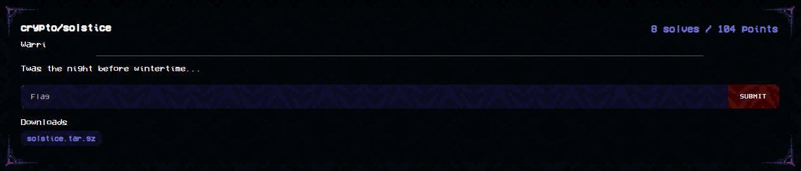

`chall.py`
```py
from Crypto.Util.number import isPrime
from hashlib import shake_256
from secret import FLAG
from sage.all import *

enc = lambda q:bytes([i^j for i,j in zip(FLAG, shake_256(str(q).encode()).digest(len(FLAG)))])

A,B = 7**128, 3**128
p = 368 * A * B - 1

FF = GF(p)['x']; x = FF.gens()[0]
F = GF(p**2 , modulus=x**2 +1 , names=('i',)); i = F.gens()[0]
E0 = EllipticCurve(F, [1, 0])
P0, Q0 = E0.torsion_basis(A)
R0, S0 = E0.torsion_basis(B)

def keygen():
    q = randint(1, A)
    deg = q**3 * B; assert deg > p
    upper_bound = round(sqrt(4*deg//p))
    QF = gp.Qfb(1, 0, 1)
    for _ in range(100000):
        zz = randint(0, upper_bound)
        tt = randint(0, upper_bound)
        sq = deg - p * (zz**2 + tt**2)
        if sq <= 0 or not isPrime(sq) or sq % 4 != 1:
            continue
        try:
            xx, yy = QF.qfbsolve(sq)
            break
        except ValueError:
            continue
    else:
        raise ValueError
    i_end = lambda P: E0(-P[0], i*P[1])
    pi_end = lambda P: E0(P[0]**p, P[1]**p)
    θ = lambda P: xx*P + yy*i_end(P) + zz*pi_end(P) + tt*i_end(pi_end(P))
    R1, S1 = θ(R0), θ(S0)
    phi = E0.isogeny(R1, algorithm="factored")
    P1, Q1 = phi(θ(P0)), phi(θ(Q0))
    return q, P1, Q1

q, P1, Q1 = keygen()
ct = enc(q).hex()
"""
P0 = (233337180839983170468251295969506952388681209645326781059320568452489305359796543550008877100056067616315942972466746686498988124058966207221603350666427072034614031961125*i + 6076724607371655375089880686409591826313261744700879748300155926446093135361904986319220315902455302069625470977859109775289338380799094278639120304562961706508965578889678 : 5340478618053131755817703822165791150388771396561317084907854757785430816776824117223125135541761550815664604032216341513708852851340784406686376106876094079530239431216343*i + 6203311333126154797635960859992450477908601636388718657494027401915464773962927632311279672968041448098304944958437923773101457741810393833929996973757548419715827737736041 : 1)
Q0 = (395608636111993407568031369124888144203266519829162487790264523741193087730652932584017816945908350211493806106890182672563488839947941956101943873744299110693729447628389*i + 2020620330952579068876293438725114162534648811062939882937980830064996686158750799393648065701161392005361642522341214471150589046312775167428193668497531752378381494265684 : 3762657597030054693609672151458462990930240906923829974209912813922198701113121615205067454962551960812801276540589487062762972130098670894734018849748771660005314925006650*i + 4285765084133691137771032157976357548088376880088875816927709594137633940733278442336346672210854855302975181849629775407290609572545365928291274295134063902563059020768258 : 1)
R0 = (2999679116310727348871090860480591949600914770657326262398320712713327980190324192888686727265536002358592788717192469843226986304628402881453581000488302677343362755852910*i + 2600559539664608150493835304702166693620488996390043731686189633363805216445814441837148600349679612154849758769612852250874291948207814789018184312048567360775389988620799 : 3474419761184934391085799940364383850182001916518936931909859501466403728240814306016645331079366192883635901582874382091688361201849694716025939920368875759835681939731091*i + 1548718264202842199163454471661911161699028317129044788534349172139658644056872560563625485900329983161718796865608638609321773354846563860179156510048554186158851593453225 : 1)
S0 = (1283195456011936586735421957685095370919767332221764253196706010401477656410994549724269829267935588475406712680857884661380781956023580251660282009451023212963628626223031*i + 4793128520998231618777597284107218854114223974079211838144520671274724356890388968312004332151233689469412242305541676325808228537696831455469202732383527254105265887662007 : 1526509784351641268278158766998921620931154523170914910361775975802526673732547702608613191257696937655477803289003492248095383582718856364724515320783570331872012482732263*i + 5295506969607686302100800265728523698184478184574430721936120627732938789034157787988162120147787212051195161645979087468977900513553296435375096262491377033715519859009140 : 1)
P1 = (5558409950454507603980359131605607799869851555002490954495602159971977273991154423344830636648754695160288259822723740235529340163949451361690611055843286269830486354333615*i + 2310938307995994810180869296182043807304802396902589174506477562656463041135348843353362455365697012012137898137249027276753375900488667985500606483713503291124248319728238 : 1837645037449914772611491993258931262693534280474728766203537460212802264472413317565709661557779480960017359980830321197694641868967167220668917433427341978808488296518150*i + 929992544055660763569823163634883799647173905824269608302519976257438923272413188559025352158770582187397487192974593760977338872965266061844802879201889188001569256081476 : 1)
Q1 = (1376351767688097319584248975705832344987683803317044508397117463386736588893582142040810464151065251049715737516626837791667485192856521300807406986508894075964762607275062*i + 690732296564111733706470165137569921191188705389912079669123502602796322752436247342229830056815292849226801291959221943371310463025477303463234920613317062892750586383905 : 5138736150502180974109616463162203104700988760080499677862766405233192112676749951525776359923234671493925124349840932404704778071451484802217556637302482055584182659942784*i + 4354720860637998221456012000501568178680511309132263901503186677726682982814029533962456808689306606191692729446691692770244157553519815420725949059545607907862760226308369 : 1)
ct = "ec6e0231dd167e922193c024344b8489f37b8f5be86ba03caa8efd92fcda331f51c66d80d5a2c60b123da009f2"
"""
```

I'd learnt a good much when writing Wintertime, so here is a mini-challenge that I made on the side!

But lets analyse the challenge. We have `keygen()` implementing some unknown / weird-looking algorithm, which given a torsion basis $P_0, Q_0$ computes $P_1 = \phi(\theta(P_0)), Q_1 = \phi(\theta(Q_0))$ for some isogenies $\phi$, $\theta$. One of the function's outputs, $q$, which is randomly generated, is used to encrypt the flag. While we have $P_1, Q_1$, we do not have $q$.

We start by analysing `keygen()`. We see the complex multiplication endomorphism in the form of `i_end = lambda P: E0(-P[0], i*P[1])`, and the frobenius endomorphism in the form of `pi_end = lambda P: E0(P[0]**p, P[1]**p)`. These endomorphisms essentially map a point on a curve to another point on the same curve.

It then computes an isogeny $\theta$ which given a point, computes $x * P + y * i(P) + z * \pi(P) + t * i(\pi(P))$.

The first $P \rightarrow x*P$ is a multiplication-by-x map. The endomorphism has degree $x^2$, as the polynomials mapping $(x, y) \rightarrow n*(x,y)$ has $x, y$ turned into polynomials of degree $n^2$! This is shown using the [division polynomials](https://en.wikipedia.org/wiki/Division_polynomials)

The complex multiplication endomorphism itself has the polynomial map $(x,y) \rightarrow (-x, i*y)$. Both of them are linear and of degree 1, hence the endomorphism's degree being 1. Therefore $\text{deg}(y * i(P)) = \text{deg}(P\rightarrow y*P) * \text{deg}(P\rightarrow i*P)$ has degree $y^2 * 1$.

As for the frobenius endomorphism, as the defining polynomial is $(x,y) \rightarrow (x^p, y^p)$ thus it is of degree $p$. We derive the isogeny $P \rightarrow z * \pi(P)$ to be degree $pz^2$, and lastly $P \rightarrow t * i(\pi(P))$ to have isogeny degree $t^2 * 1 * p = t^2 p$. Combining them together, the degree of $\theta$ which is the adding up of all the points would be $x^2 + y^2 + pz^2 + pt^2 = q^3 B$

Since $\phi$ is an isogeny with kernel generated by $R_1$, as $R_1 = \theta(R_0)$, from how $\theta$ is constructed, there is a very overwhelming likelihood that $\theta(R_0)$ does not involve a multiplication-by-B, where $B$ is the order of $R_0$. Thus, $R_1$ will still have order $B$, thus $\phi$ will have degree $B$ as the size of the kernel generated by $R_1$ is $B$. (the isogeny here is separable due to how `.isogeny()` is used, which implies that its degree is equal to the size of its kernel)

Hence, from $P_1, Q_1 = \phi(\theta(P_0)), \phi(\theta(Q_0))$, we conclude the degree of the $\phi \circ \theta$ isogeny/endomorphism to be $(q^3 * B) * B = q^3 B^2$

The above information is key to solving the puzzle! An interesting property about the weil pairing between points on the same curve (see [Arithmetic of Elliptic Curves, Proposition 8.2](https://www.pdmi.ras.ru/~lowdimma/BSD/Silverman-Arithmetic_of_EC.pdf)) is that:

$e(\phi(P), Q) = e(P, \hat\phi(Q))$ where $\hat\phi$ is the dual isogeny of $\phi$.

From this we arrive at

$\begin{aligned} e(\phi(P), \phi(Q)) = e(P, \phi(\hat\phi(Q))) &= e(P, [\text{deg}\:\phi]Q)\\ &= e(P, Q)^{\text{deg}\:\phi}\end{aligned}$

The first equality holds due to the definition of the dual isogeny. The last equality holds by bilinearity property of the weil pairing. (see [Arithmetic of Elliptic Curves, Corollary 8.1.1](https://www.pdmi.ras.ru/~lowdimma/BSD/Silverman-Arithmetic_of_EC.pdf))

Since we have $P_1, Q_1$, as well as the degree of the isogeny $P_0 \rightarrow P_1$ to be of degree $q^3 B^2$, we compute the weil pairings of $e(P_1, Q_1), e(P_0, Q_0)$, and then solve the discrete log to recover $q^3 B^2$. We note that we do the pairings over the A-torsion subgroup, thus the discrete log is trivial on order A and can be done with pohlig hellman or similar algorithms.

Once we have $q^3 B^2 \bmod A:=7^{128}$, we now solve for $q$ by solving for $q \bmod 7$, then $q \bmod 7^2$ and onwards. Because $q < A$  per `keygen()`, we eventually arrive at the right value of $q$, and can then decrypt the flag.

Attached below is the solve script. It should be noted that before we can derive the weil pairing we first need to derive the curve parameters of $P_1, Q_1$. This is not an issue as we have sufficient points on the curve to derive its parameters, as shown below. (the methods used to derive the curve parameters can be done with arithmetic and will be left as an exercise to the reader)

`solve.py`
```py
from Crypto.Util.number import isPrime
from hashlib import shake_256
from sage.all import *

A,B = 7**128, 3**128
p = 368 * A * B - 1
FF = GF(p)['x']; x = FF.gens()[0]
F = GF(p**2 , modulus=x**2 +1 , names=('i',)); i = F.gens()[0]
E0 = EllipticCurve(F, [1, 0])

P0x, P0y = (233337180839983170468251295969506952388681209645326781059320568452489305359796543550008877100056067616315942972466746686498988124058966207221603350666427072034614031961125*i + 6076724607371655375089880686409591826313261744700879748300155926446093135361904986319220315902455302069625470977859109775289338380799094278639120304562961706508965578889678 , 5340478618053131755817703822165791150388771396561317084907854757785430816776824117223125135541761550815664604032216341513708852851340784406686376106876094079530239431216343*i + 6203311333126154797635960859992450477908601636388718657494027401915464773962927632311279672968041448098304944958437923773101457741810393833929996973757548419715827737736041)
Q0x, Q0y = (395608636111993407568031369124888144203266519829162487790264523741193087730652932584017816945908350211493806106890182672563488839947941956101943873744299110693729447628389*i + 2020620330952579068876293438725114162534648811062939882937980830064996686158750799393648065701161392005361642522341214471150589046312775167428193668497531752378381494265684 , 3762657597030054693609672151458462990930240906923829974209912813922198701113121615205067454962551960812801276540589487062762972130098670894734018849748771660005314925006650*i + 4285765084133691137771032157976357548088376880088875816927709594137633940733278442336346672210854855302975181849629775407290609572545365928291274295134063902563059020768258)
P1x, P1y = (5558409950454507603980359131605607799869851555002490954495602159971977273991154423344830636648754695160288259822723740235529340163949451361690611055843286269830486354333615*i + 2310938307995994810180869296182043807304802396902589174506477562656463041135348843353362455365697012012137898137249027276753375900488667985500606483713503291124248319728238 , 1837645037449914772611491993258931262693534280474728766203537460212802264472413317565709661557779480960017359980830321197694641868967167220668917433427341978808488296518150*i + 929992544055660763569823163634883799647173905824269608302519976257438923272413188559025352158770582187397487192974593760977338872965266061844802879201889188001569256081476)
Q1x, Q1y = (1376351767688097319584248975705832344987683803317044508397117463386736588893582142040810464151065251049715737516626837791667485192856521300807406986508894075964762607275062*i + 690732296564111733706470165137569921191188705389912079669123502602796322752436247342229830056815292849226801291959221943371310463025477303463234920613317062892750586383905 , 5138736150502180974109616463162203104700988760080499677862766405233192112676749951525776359923234671493925124349840932404704778071451484802217556637302482055584182659942784*i + 4354720860637998221456012000501568178680511309132263901503186677726682982814029533962456808689306606191692729446691692770244157553519815420725949059545607907862760226308369)
ct = "ec6e0231dd167e922193c024344b8489f37b8f5be86ba03caa8efd92fcda331f51c66d80d5a2c60b123da009f2"

E1_a = ((P1y**2 - P1x**3) - (Q1y**2 - Q1x**3)) / (P1x-Q1x)
E1_b = P1y**2 - P1x**3 - E1_a * P1x
E1 = EllipticCurve(F, [E1_a, E1_b])
P0, Q0, P1, Q1 = E0(P0x, P0y), E0(Q0x, Q0y), E1(P1x, P1y), E1(Q1x, Q1y)

dec = lambda ct,q:bytes([i^j for i,j in zip(bytes.fromhex(ct), shake_256(str(q).encode()).digest(len(ct)//2))])

w1 = P1.weil_pairing(Q1, A)
w0 = P0.weil_pairing(Q0, A)
q3 = discrete_log(w1, w0, ord=A, operation='*')
rs = [0]
for i in range(128):
    mod = 7**i
    rs_new = []
    for k in rs:
        for j in range(7):
            if ((k + mod * j)**3 * B**2) % (7*mod) == q3 % (7*mod):
                rs_new.append(k + mod*j)
    rs = rs_new
for r in rs:
    flag = dec(ct, r)
    if flag.startswith(b'maltactf'):
        print(f'{flag = }')
print(len(rs))
```