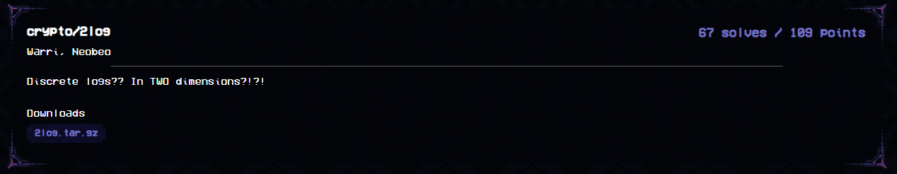

`chall.py`
```py
from sage.all import matrix, GF, ZZ, randint
                  
FLAG = b"maltactf{???????????????????????????????????}"
k0, k1 = int.from_bytes(FLAG[:len(FLAG)//2+4], "big"), int.from_bytes(FLAG[len(FLAG)//2:], "big")

G = matrix(ZZ, [[1401, 2],[-2048, 1273]])
h1 = ((G**k0)[0][0]).bit_length() - randint(-2**32, 2**32)

G = matrix(GF(2**255-19), G)
h2 = (G**k1)[0][0]
h3 = (G**k1)[0][1]
print(f'{h1 = }')
print(f'{h2 = }')
print(f'{h3 = }')
"""
h1 = 1825310437373651425737133387514704339138752170433274546111276309
h2 = 6525529513224929513242286153522039835677193513612437958976590021494532059727
h3 = 42423271339336624024407863370989392004524790041279794366407913985192411875865
"""
```

The gist of the challenge is fairly simple. We have a 2 by 2 matrix $G$. Our flag is split into values $k_0, k_1$, and we are given select parts of $G^{k_0}$ (over $\mathbb{Z}$) and $G^{k_1}$ (over $\mathbb{F_p,  p=2^{255}-19}$). It is implied that we can recover the values $k_0, k_1$ from them.

Pivotal to solving the challenge would be the idea of a [jordan normal form (JNF)](https://en.wikipedia.org/wiki/Jordan_normal_form). If a square matrix $M$ has a jordan normal form, that is, an upper triangular matrix whose diagonal consists of the matrix's eigenvalues with 1s directly above the main diagonal where eigenvalues are the same, then we may rewrite $M$ as $P * J * P^{-1}$ for some invertible matrix $P$. This helps us a lot as for a 2-dimensional matrix $M$, its $J$ is either of the form

$\begin{bmatrix} e_1 & 1 \\ 0 & e_1\end{bmatrix}$

for some value $e$ or

$\begin{bmatrix} e_1 & 0 \\ 0 & e_2\end{bmatrix}$

for some values $e_1, $e_2$. Then the exponentiation $M^k$ is essentially $P * J^k * P^{-1}$, and with some manipulation we change the problem of solving the discrete log over $M^k$ to $J^k$ which, is much easier due to the 0s and 1s in the jordan normal form.

In the first case, we have $J^k = \begin{bmatrix} e_1^k & k e_1^{k-1} \\ 0 & e_1^k\end{bmatrix}$. From this we can solve for $k$ given $e_1^k, ke_1^{k-1}$ using regular arithmetic.

For the second, we reduce the problem of solving the discrete log of a two dimensional matrix into two independent discrete logs of values in the field that the matrix was defined in.

With some math, we derive the jordan normal form of $G$ to be $\begin{bmatrix} 1337 & 1 \\ 0 & 1337\end{bmatrix}$ and one possible transformation matrix is $P = \begin{bmatrix} 64 & 1 \\ -2048 & 0\end{bmatrix}$

To solve the first part involving $h_1$, we note that we can do:

$h_1 = \log_2(F(1337^{k_0}))$ where $F()$ is a function simulating the effects of the transformation matrix $P$. Regardless, it will not affect the log output by a lot.

So we have $h_1 \approx k_0 * \log_2(1337)$. We solve for an approximation of $k_0$ which is rather close to the flag value.

The second set involving $h_2, h_3$ is more challenging. We do not have the full matrix $G^{k_1}$. Suppose we let $M = \begin{bmatrix} a & b \\ c & d\end{bmatrix}$, $G^{k_1} = \begin{bmatrix} w & x \\ y & z\end{bmatrix}$ where $M * G_J^{k_1} * M^{-1} = G^{k_1}$.

Then $G_J^{k_1} = M^{-1} * G^{k_1} * M = \frac{1}{ad-bc} * \begin{bmatrix}adw-aby+cdx-cbz & bdw-b2y+ddx-dbz \\ -acw+a2y-c2x+acz & -bcw+aby-cdx+adz\end{bmatrix}$

Ideally, we want the upper two values which are our $1337^{k_1}$ and $k_1 * 1337^{k_1-1}$ values. But we only have $w, x$ (and knowledge of $a,b,c,d$). In order to nullify the effect that our unknown $y, z$ will have in the jordan normal form computation, we could find a transformation matrix where $b = 0$

Since we are looking for some $M$ whereby $M * G_J * M^{-1} == G$, we  rewrite this as solving $M * G_J = G * M$. By forcing $b = 0$, we arrive at equations

$\begin{align} 
1337a = 1401a + 2c \\ 
1337c = -2048a + 1273c \\
c + 1337d = 1273d \end{align}$

(1) and (2) are multiples of each other, so we arrive at some general solution. We set $d=1$ and solve to get
$a = 2, c = -64$ as a valid pairing.

We thus have our new transformation matrix $M = \begin{bmatrix}2 & 0 \\ -64 & 1\end{bmatrix}$. Plugging this in we may then recover the upper two values of $G_J^{k_1}$, and we can finally solve for $k_1$. Putting both values together gives us the flag.

`solve.py`
```py
from sage.all import matrix, GF, RealField, log

h1 = 1825310437373651425737133387514704339138752170433274546111276309
h2 = 6525529513224929513242286153522039835677193513612437958976590021494532059727
h3 = 42423271339336624024407863370989392004524790041279794366407913985192411875865

# G = matrix(RR, [[1401, 2],[-2048, 1273]])
# print(G.eigenvalues()) # 1337, 1337.

RR = RealField(3000)
m = log(RR(1337), RR(2))
k0_est = int(RR(h1) / m)
print(f'{k0_est = }')

F = GF(2**255-19)
G = matrix(F, [[1401, 2],[-2048, 1273]])
GJ, M = G.jordan_form(transformation=True)
# note that M here does not help us in any way. We have to ownself derive a suitable M

# Let G = M * GJ * M**-1 for some M.
# Then GK = M * GJK * M**-1. ---> GJK = M**-1 * GK * M
# Let M = [a b, c d], GK = [w x, y z], we have
# Minv = 1/det * d -b -c a
# GJK = 1/det * [adw-aby+cdx-cbz,​bdw-b2y+ddx-dbz,-acw+a2y-c2x+acz,-bcw+aby-cdx+adz]
# to solve the dlog easily, we need either {adw-aby+cdx-cbz, -acw+a2y-c2x+acz} and ​bdw-b2y+ddx-dbz. We only know w,x
# this means we must find M such that: 
# -ab-cb == 0 OR a2+ac == 0
# -b2-db == 0
# one such way is to find an M such that b = 0. 

# since
# M * GJ = G * M, b == 0,
# 1337a == 1401a + 2c
# 1337c == -2048a + 1273c
# c + 1337d == 1273d
# ==> a = 2, c = -64, d = 1

a, b, c, d = 2, 0, -64, 1
M = matrix(F, [[2, 0],[-64, 1]])
assert G == M * GJ * M**-1

det = pow(a*d-b*c, -1, 2**255-19)
GJK_0_0 = F(det * (a*d*h2+c*d*h3))
GJK_0_1 = F(det * (d*d*h3))
k1 = GJK_0_1 * 1337 * pow(GJK_0_0, -1, 2**255-19)

int2bytes = lambda x:x.to_bytes((x.bit_length() + 7) // 8, "big")
flag = int2bytes(int(k0_est))[:-4] + int2bytes(int(k1))
print(flag)
# maltactf{tw0-d10g5?_m0r3_l1kE_d0ubl3-l1nAlg!}
```