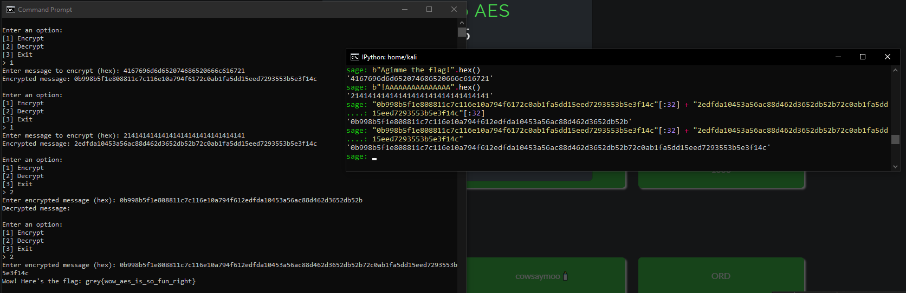

### Intro to AES 🩸 | 30 Solves 925 Points
```
Time to learn AES!

Author: hadnot

nc challs.nusgreyhats.org 32000
```

`aes-school-1.py`
```py
from Crypto.Cipher import AES
from Crypto.Util.Padding import pad, unpad
import os

with open("flag.txt", "r") as f:
    flag = f.read()

key = os.urandom(16)

def encrypt(message): # ECB encrypt of padded msg
    cipher = AES.new(key, AES.MODE_ECB)
    padded_message = pad(message, 16)
    ciphertext = cipher.encrypt(padded_message)
    return ciphertext

def decrypt(ciphertext): # ECB decryption
    cipher = AES.new(key, AES.MODE_ECB)
    try:
        padded_message = cipher.decrypt(ciphertext)
        message = unpad(padded_message, 16)
        return message
    except:
        return b""

menu = """
Enter an option:
[1] Encrypt
[2] Decrypt
[3] Exit
> """

def main():

    while True:
        option = input(menu).strip()

        if option == "1":

            msg = bytes.fromhex(input("Enter message to encrypt (hex): "))
            
            if b"gimme the flag!!" in msg:
                print("No.")
            else:
                print(f"Encrypted message: {encrypt(msg).hex()}")
                        
        elif option == "2":

            msg = bytes.fromhex(input("Enter encrypted message (hex): "))
            
            decrypted_msg = decrypt(msg)

            if b"gimme the flag!!" in decrypted_msg:
                print(f"Wow! Here's the flag: {flag}")
                exit(0)
                
            else:
                print(f"Decrypted message: {decrypted_msg.hex()}")
                
        else:
            exit(0)

if __name__ == "__main__":
    main()
```

We find that we have access to a server oracle that allows us to encrypt any message with AES using its own randomly generated key. To get the flag, we need to get it to decrypt a message containing the phrase `gimme the flag!!`.

Normally we could just send `gimme the flag!!` into the encryption oracle, but we notice a simple check to prevent us from doing so;
```py
if b"gimme the flag!!" in msg:
    print("No.")
```

So, how do we bypass this filter?

A key concept behind AES lies in that it is a block cipher. If we have a super long message, what AES does is that it splits the block into 16 byte smaller blocks, encrypts each block individually with the key and outputs the encrypted 16-byte output blocks together. This is also what is known as the `ECB (Electronic CookBook)` mode that the server implements.

This alone is enough to solve the challenge. For those looking to know what exactly AES is, I'd recommend [my writeup on an AES challenge in grey qualifiers 2024](../greyquals_24/crypto_aes.md#aes-internally) which has a section explaining it in detail!

Anyway, we exploit this as follows;

We send the 16-byte block `Agimme the flag!` to the encryption oracle. We would get a 32-byte encrypted output, and this is because `pad(message, 16)` in `encrypt()` will add 16 `b'\x10` bytes as padding to pad our already multiple of 16 length block by 16 characters. We can just ignore the second 16-byte block which would be the result of encrypting the 16 `b'\x10` bytes in their own block, and just take our first 16-byte block.

Similarly, we now send `!AAAAAAAAAAAAAAA` to the encryption oracle. Concatenating the two encrypted blocks together as well as the encrypted `b'\x10'` padding block, the decryption oracle will decrypt it into;

`Agimme the flag!!AAAAAAAAAAAAAAA\x10\x10\x10\x10\x10\x10\x10\x10\x10\x10\x10\x10\x10\x10\x10\x10`, which is unpadded `Agimme the flag!!AAAAAAAAAAAAAAA`.

This fits the criteria and thus tricks the oracle into printing the flag!

As we see in our solve;


`grey{wow_aes_is_so_fun_right}`

### Same Method Different Chall

For those who may be interested, this usage of block manipulation was used by myself in another ctf whose writeup you can find in this repo! Check it out [here](../../byuctf24/writeups.md/#cookie-cutter-40-solves-447-pts)
