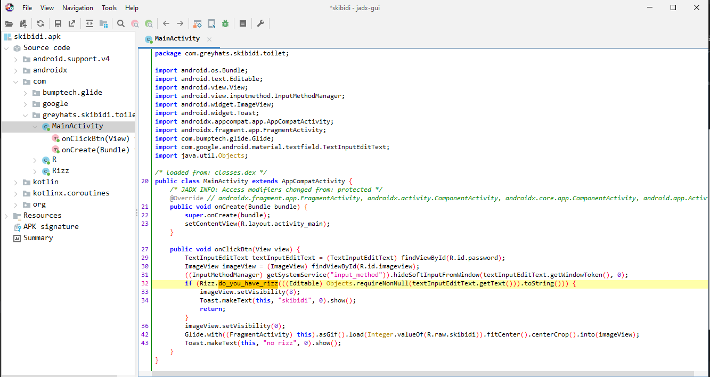
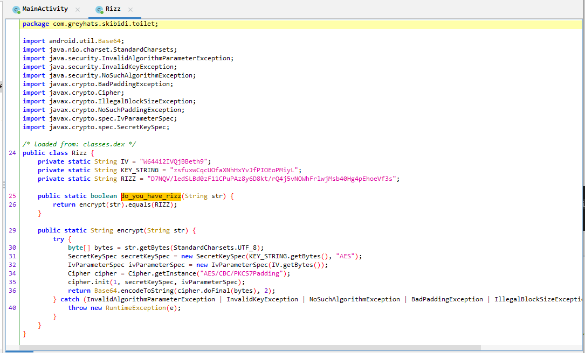

### Weird Brainrotted APK | 30 Solves 925 Points
```
My friend wrote this annoying program filled with brainrot.

Can you find the passcode to stop the skibidi sigma brainrot T_T

Author: rizz app
```

We are given a `skibidi.apk` file - what's an APK file?

Put simply apk is the file format used by the Android Operating System (OS), primarily used for distribution and installation of mobile apps, mobile games and middleware. A file using this format can be built from source code written in either Java or Kotlin.

In order to properly analyse `.apk` files however, tools like IDA or Ghidra might not be as helpful. Instead, we can use tools such as `JADX`.

We download, install and run `jadx-gui` to open `skibidi.apk`, giving us the following:


Messing around we find `greyhats.skibidi.toilet`, and in `MainActivity` we notice `Rizz.do_you_have_rizz()` called on user input. `skibidi` is outputted if it returns True, else it says `no rizz`. 



Naturally, we look into `Rizz` and see the following. `do_you_have_rizz()` simply calls `encrypt()` on the user input string and checks if it is equal to a `RIZZ` string.



Reversing the `encrypt()` code we find that it simply loads an AES key, iv and then runs AES-CBC encryption on the string, then returns the base64 encoded string.

We replicate this in Python to find what string would encrypted into `RIZZ`, and we get our flag!

`solve.py`
```py
from base64 import b64decode
from Crypto.Cipher import AES
IV = b"W644i2IVQjBBeth9"
KEY_STRING = b"zsfuxwCqcUOfaXNhHxYvJfPIOEoPMiyL"
RIZZ = b64decode(b"D7NQV/ledSLBd0zF11CPuPAz8y6D8kt/rQ4j5vNOWhFrlwjMsb40Hg4pEhoeVf3s")

cipher = AES.new(key=KEY_STRING, iv=IV, mode=AES.MODE_CBC)
print(cipher.decrypt(RIZZ)) # b'grey{skibidi_toilet_W_level_500_gyatt_rizz}\x05\x05\x05\x05\x05'
```

Even though this binary switched operating systems from Windows/Linux to Android, this doesn't stop us from applying the same reverse engineering methodology to solve it!