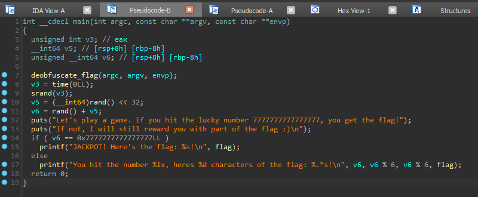
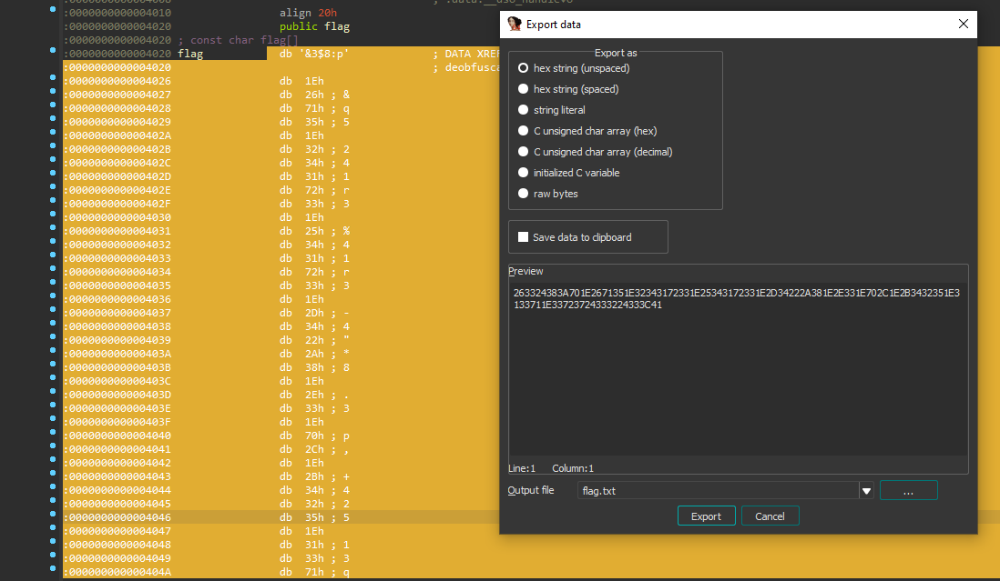

### Flag Roulette | 45 Solves 826 Points
```
You have 1 in 18446744073709551615 chance of getting the flag.

That is, of course, unless you know how to reverse engineer :)

Author: Jin Kai
```

Opening up the program in IDA we observe the following:



Interestingly the function names are preserved, and we find `deobfuscate_flag()` being called. Following which, `srand()` which seeds a random instance is called based on the current time(), and then two `rand()` calls are made. This is then used in `v6` to produce a 64-bit integer, and if `v6 == 0x7777777777777777`, the program prints the flag. Else, we're given up to the first 6 characters of the flag, which doesn't exactly help us here.

### Dynamic Analysis!

Intuition tells me that `deobufscate_flag()` likely deobfuscates some string and probably leads to the `flag` variable containing the flag.

Thus, in theory, if we stop the program right after `deobfuscate_flag()` is called, and look into the `flag` variable, we should be able to see the flag!

In IDA, we can hover over the `v3 = time(0LL);` line and press `F2`, which sets a breakpoint. Now, we click run to run the executable and it should stop at that very instant!

Once we reach our breakpoint, we click into `flag` and find our flag,

`grey{1_g0t_sup3r_dup3r_lucky_or_1m_just_pr0_r3verser}`

### Alternatively...static analysis?

Another method would be to stick with static analysis and look into the `deobfuscate_flag()` function. It is suprisingly easy to reverse, as IDA gives the following pseudocode;

```cpp
__int64 deobfuscate_flag()
{
  __int64 result; // rax
  unsigned int i; // [rsp+0h] [rbp-4h]

  for ( i = 0; ; ++i )
  {
    result = i;
    if ( i > '5' )
      break;
    flag[i] ^= 'A';
  }
  return result;
}
```

Looking into `flag` without running the program at all we see that it is some string of random words. We highlight the entire section, then use the keybind `Shift + E` to extract the byte data from IDA. We obtain the unspaced hex output. Now we just need to replicate the `deobfuscate_flag()` function, such as in Python to get the flag!



```py
flag = bytes.fromhex("263324383A701E2671351E32343172331E25343172331E2D34222A381E2E331E702C1E2B3432351E3133711E33723724333224333C41")

for i in flag:
    print(chr(i ^ 0x41), end='')
print()
```
`grey{1_g0t_sup3r_dup3r_lucky_or_1m_just_pr0_r3verser}`