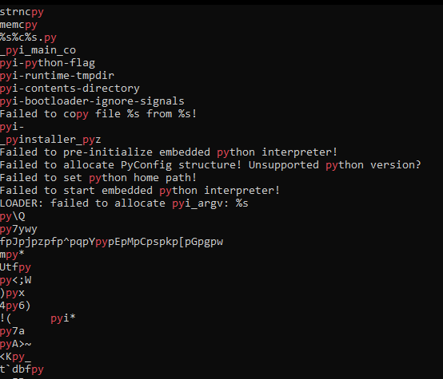

### Is This Really Python? 🩸 | 14 Solves 985 Points
```
Since python is an interpreted language, there shouldn't be a need to decompile this, right??

Anyways, once you see the source code, cOmPrEhEnDiNg this should be easy!

Author: Jin Kai
```

### pyInstallers and pyCompilers

We are given a `dist-python-but-not-really` distribution. Running strings by it reveals the following -



We have a decent amount of strings involving python and an interpreter. More importantly we note the appearance of a string, `pyinstaller`. PyInstaller is known as a tool to bundle a Python application and all its dependencies into a single package, such as a binary.

Fortunately for such python-to-exe tools we have tools that perform the reverse. A simple search leads us to [pyinstxtractor](https://github.com/extremecoders-re/pyinstxtractor). We clone the repo and run the script on our binary to somewhat reverse the operation.

Running `pyinstxtractor` on our binary leads to the formation of a `python_but_not_really_extracted` folder containing the python application. Most pertinent of which is the `challenge.pyc` file which by intuition contains most of the challenge source.

`.pyc` is a compiled output file generated from source code written in Python programming language. We can use tools such as [uncompyle6](https://pypi.org/project/uncompyle6/) to recover the original `.py` source.

Running
```
uncompyle6 challenge.pyc > ../decompiled.py
```

nets us a `decompiled.py` script;
```py
# uncompyle6 version 3.9.0
# Python bytecode version base 3.8.0 (3413)
# Decompiled from: Python 3.8.10 (default, Mar 13 2023, 10:26:41) 
# [GCC 9.4.0]
# Embedded file name: challenge.py
z = input('flag? ')
j = 0
print('correct' if ''.join([str(i - j) + ''.join([str(x ^ y) for x, y in enumerate(map(ord, z))])[j] if i == sum([1 for i in ''.join([str(x ^ y) for x, y in enumerate(map(ord, z))])]) else (str(i - j) + ''.join([str(x ^ y) for x, y in enumerate(map(ord, z))])[j], (j := i))[0] if ''.join([str(x ^ y) for x, y in enumerate(map(ord, z))])[i] != ''.join([str(x ^ y) for x, y in enumerate(map(ord, z))])[j] else '' for i in range(sum([1 for i in ''.join([str(x ^ y) for x, y in enumerate(map(ord, z))])]) + 1)]) == '11101321151110131122111217111028192112112211101211121621101813111221101211101229171821151110131715131621191122172112102116111217161721261521191615182721121417141714111211171817161716171521161911161917294128111019181916151710261110141911181618151810181918191617' else 'wrong')
# global j ## Warning: Unused global
# okay decompiling challenge.pyc
```

which looks pretty obfuscated. It takes a flag as input, and then pipes it through a bunch of list comprehensions.

### Reversing the Obfuscated Python

Using our knowledge of python list comprehensions, we do a decent bit of reverse engineering and arrive at the following:

```py
z = input('flag? ')
j = 0

xor_by_index = ''.join([str(x ^ y) for x, y in enumerate(map(ord, z))])
z_len = sum([1 for i in xor_by_index])
target = '11101321151110131122111217111028192112112211101211121621101813111221101211101229171821151110131715131621191122172112102116111217161721261521191615182721121417141714111211171817161716171521161911161917294128111019181916151710261110141911181618151810181918191617'

ss = ''
for i in range(z_len + 1):
    if i == z_len:
        ss += str(i - j) + xor_by_index[j]
    elif xor_by_index[i] != xor_by_index[j]:
        ss += str(i - j) + xor_by_index[j]
        j = i
    else:
        ss += ''

if ss == target:
    print('correct')
else:
    print('wrong')
```

Evidently `xor_by_index` is just a concatenation of the string representation of all of the bytes of `z` in decimal xored with index.

Thus, a string such as `grey{` will first be represented in a decimal array `{103, 114, 101, 121, 123}`, and then xored by index to attain `{103, 115, 103, 122, 127}`, then turned into strings and concatenated to acquire `"103115103122127"`.

The algorithm in which `ss` is created can be reversed into the following logic;
```
Given a string z
Partition z into a sequence of characters where same consecutive characters are merged together. So "AABCDD" -> "AA", "B", "C", "DD"
For each element in the sequence, return the length of the sequence and the first character. So "AA", "B", "C", "DD" -> "2A1B1C2D"
```

We can naively assume that the length of any element in the flag sequence will not be of two digits, and implement a simple algorithm to get our `xor_by_index` string;

```py
xor_str = ""
target = "11101321151110131122111217111028192112112211101211121621101813111221101211101229171821151110131715131621191122172112102116111217161721261521191615182721121417141714111211171817161716171521161911161917294128111019181916151710261110141911181618151810181918191617"
for i in range(0, len(target), 2):
    block = target[i:i+2]
    diff_index, xor_with_index_j = block[0], block[1]
    xor_str += int(diff_index) * str(xor_with_index_j)
# xorstr = "10311510312212710889112122102126110831211021029978115103753611912271120116127671166511965877112474741217876767511691697991111881098965706610491868580898967"
```

We then convert this into bytes, and redo the xor that xor_by_index does to recover the flag.

```py
xor_list = []
num = ""
for i in xor_str:
    num += i
    if 0x20 < int(num) < 0x80:
        xor_list.append(int(num))
        num = ""

flag = "".join([chr(x ^ y) for x, y in enumerate(xor_list)])
print(flag) # grey{i_wrote_this_at_1am_and_i_have_no_idea_what_i_just_cooked}
```