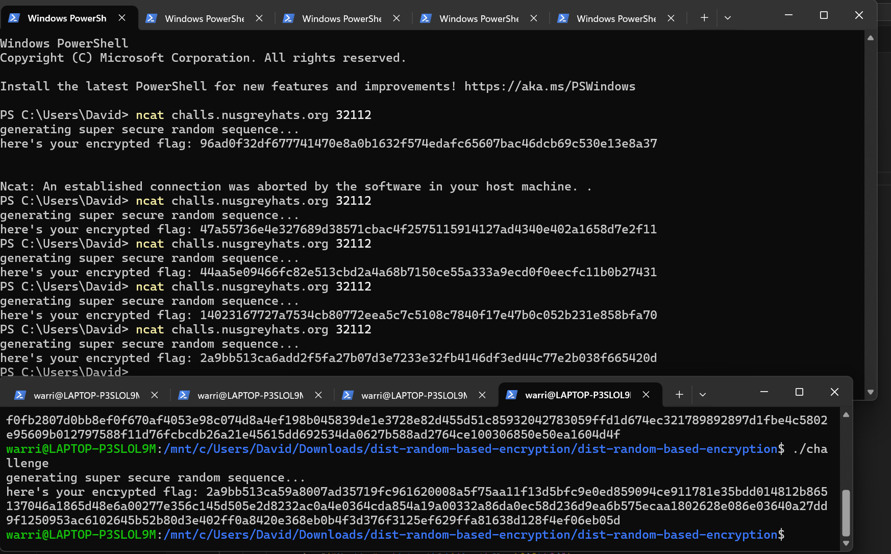

### Random Secure or Secure Random 🩸 | 9 Solves 995 Points
```
I wrote this program for fun to share my super secure password.

It encrypted with a super secure randomly generated stream of bytes :)

You can't get it right? I'm so confident that I even give the source.

Unless rand isn't truly random?

Author: Jin Kai
```

`challenge.c`
```c
#include <time.h>
#include <stdlib.h>
#include <unistd.h>
#include <stdio.h>

int main() {
	setbuf(stdout, 0);
	srand(time(NULL));

	FILE *f = fopen("flag.txt", "r");
	fseek(f, 0, SEEK_END);
	size_t sz = ftell(f);
	char* flag = calloc(sz+4, sizeof(char));
	rewind(f);
	fread(flag, sz, sizeof(char), f);
	fclose(f);

	printf("generating super secure random sequence");
	sleep(1);
	printf(".");
	sleep(1);
	printf(".");
	sleep(1);
	printf(".\n");

	size_t blocks = sz / 4;
	if (sz % 4) {
		blocks += 1;
	}
	printf("here's your encrypted flag: ");
	for (int i = 0; i < blocks; i++) {
		((int*)flag)[i] ^= rand();
		for (int j = 0; j < 4; j++) {
			printf("%02hhx", ((char*)&(((int*)flag)[i]))[j]);
		}
	}
	putchar(0xa);
	free(flag);
}
```

The challenge directly provides us with the source code and a link to connect to a server running the binary.

Looking through the C code we can easily deduce what the program is doing. It uses `srand()` which seeds its random instance using the current time from `time(NULL)`. It then sleeps for 3 seconds, and uses `rand()` calls to generate random bytes to xor with the flag.

We are then given the encrypted flag.

Because `srand()` is done based on the current time, all we need to do is to run the binary on our end with a super long flag, such as `grey{AAAAAAAAAAAAAAAAAAAAAAAAAAAAAAA}`. We then connect to the server and hopefully have our `srand()`s collide with each other. In doing so, the `rand()` calls done by the server will align with the `rand()` calls made by our local instance, thus enabling the encrypted flag output to be encrypted with the same xor key on our local end.

However, because often times the server time may be offset from ours by a few seconds due to time taken to connect to the server, I resorted to the cursed strategy of opening 4-5 tabs of `wsl` to run my binary at 1 second intervals, and 4-5 tabs of windows terminal to connect to the server at 1 second intervals. (i'd normally use 1 tab of `wsl` to run the binary once per second but the 3 second sleep prevents this).

This strategy works in the end, and I manage to find my collision.



Notice that the first few hexadecimal values of the server's encrypted flag match mine.

Now we just need to use my local instance result to derive the xorkey, and then use it to decrypt the server's encrypted flag!

(you might be wondering why my local side encrypted flag string is long. This is because I wrote a super long flag into my `flag.txt`)

```py
s = bytes.fromhex("2a9bb513ca59a8007ad35719fc961620008a5f75aa11f13d5bfc9e0ed859094ce911781e35bdd014812b865137046a1865d48e6a00277e356c145d505e2d8232ac0a4e0364cda854a19a00332a86da0ec58d236d9ea6b575ecaa1802628e086e03640a27dd9f1250953ac6102645b52b80d3e402ff0a8420e368eb0b4f3d376f3125ef629ffa81638d128f4ef06eb05d")
from pwn import xor
xkey = xor(s, b"grey{AAAAAAAAAAAAAAAAAAAAAAAAAAAAAAAAAAAAAAAAAAAAAAAAAAAAAAAAAAAAAAAAAAAAAAAAAAAAAAAAAAAAAAAAAAAAAAAAAAAAAAAAAAAAAAAAAAAAAAAAAAAAAAAAAAAAAAAAA}")
print(xor(xkey, bytes.fromhex("2a9bb513ca6add2f5fa27b07d3e7233e32fb4146df3ed44c77e2b038f665420d")))
# b'grey{r4nd0m_n0t_s0_r4nd0m_owo}'
```