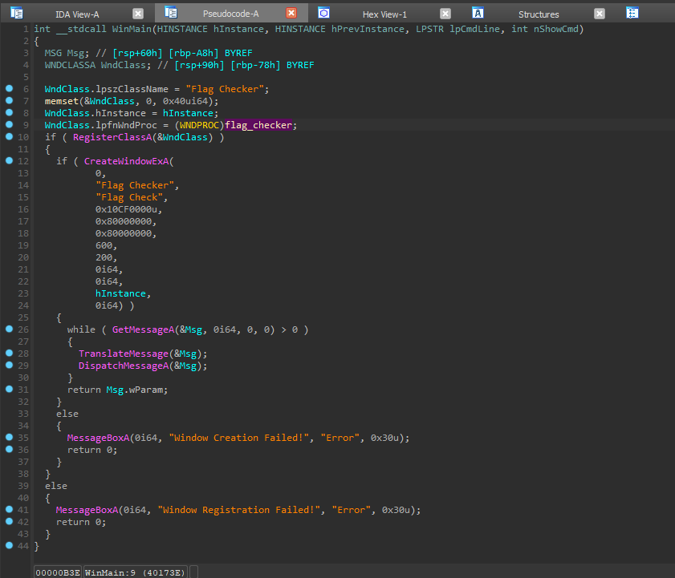
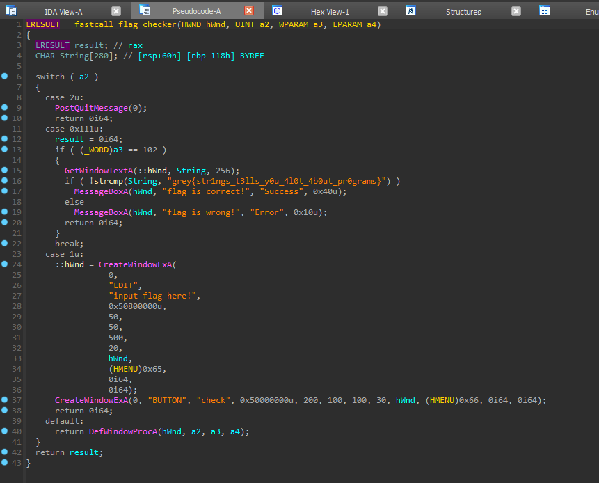

### Simple Windows Flag Checker 🍼 | 84 Solves 380 Points
```
This program is so simple, you could even solve it with a notepad.

Author: Jin Kai
```

We are given a windows binary `program.exe`. Now there are a few ways for solving the challenge.

### Intended - Strings!

The first method would be normally the first step any reverse engineer does when given a binary.

`strings` is a very versatile command line tool that opens a file, reads for interpretable strings of phrases and enumerates them for the user.

Often times when we have a binary the first step one would do would be to run strings, as this often provides us with messages that might give context as to what the binary does. For example, if the binary were to be a flag checker we might receive strings such as `"enter flag:"`, `wrong!` etc. which could help us better understand what the program is likely doing.

We enter into the directory where the program is stored in and run;

`strings program.exe`

And among the output we find:
```
L$hH
D$(
t$(
00@
 .@
input flag here!
EDIT
check
BUTTON
grey{str1ngs_t3lls_y0u_4l0t_4b0ut_pr0grams}
Success
flag is correct!
Error
flag is wrong!
Flag Checker
Window Registration Failed!
Flag Check
Window Creation Failed!
Argument domain error (DOMAIN)
Argument singularity (SIGN)
Overflow range error (OVERFLOW)
Partial loss of significance (PLOSS)
Total loss of significance (TLOSS)
The result is too small to be represented (UNDERFLOW)
Unknown error
_matherr(): %s in %s(%g, %g)  (retval=%g)
Mingw-w64 runtime failure:
Address %p has no image-section
```

Thus getting us the flag, `grey{str1ngs_t3lls_y0u_4l0t_4b0ut_pr0grams}`

### Alternative Method - Static Analysis!

Another way we could do which usually occurs after running strings would be to open up a program and see what it does. Programs like this can be interpreted with tools such as IDA or Ghidra into a disassembly, which can then be decompiled into pseudocode, where IDA/Ghidra/other tools tries to make sense of the code and give a possible C/Cpp source code representation of the disassembled bytecode.

Static analysis is a process where after opening up the program, we look around it to try and understand what it is doing, without running the program at all. There is a method known as Dynamic Analysis which is when we run the program but pause it at specific instances to see certain variables, which might come in handy in [another challenge](re_flag_roulette.md)



Opening it up with IDA we find ourselves at `WinMain()` which is typically where majority of the relevant program takes place in. We see that it calls `CreateWindowExA` which pops a window and this involves some function in `WndClass.lpfnWndProc`. We double click into it and find that it is a `flag_checker()` function.



And in here we find it to be very straightforward. It takes in a string of up to 256 bytes using `GetWindowTextA()`, then compares it using `strcmp()` with the flag, `grey{str1ngs_t3lls_y0u_4l0t_4b0ut_pr0grams}`