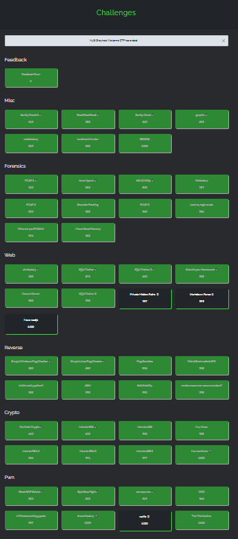

## Introduction

hi hi am CTF hobbyist Warri

Recently I participated in NUS Greyhats Welcome CTF 2024. A friend `elijah5399` asked if I could play in his team `G04T3DP30PL3`, so I did. We managed to get `1st` with a total score of `35493` points, myself having acquired `16130`.

Throughout the 48 hours we managed to solve 46 out of the 50 challenges.

Overall the CTF was quite engaging and fun. In addition, as compared to last year I was able to solve all of the crypto challenges! ^_^

This set of writeups will include the challenges I'd solved, as well as my upsolves of challenges that were solved by my teammates or from author's writeups.

Writeups will be provided for the following challenges:

## Crypto
In a similar vein to last year, I will try and expound in my crypto writeups and dump what I know of the encryption algorithms featured in the ctf, such as `RSA`, `AES` and some bit of `Linear Algebra`.

### [No Math Crypto 🍼 | 89 Solves 50 Points](crypto_no_math_crypto.md)
Modern cryptography uses so much math anyway, right?
### [Intro to RSA 🍼 | 66 Solves 620 Points](crypto_intro_to_rsa.md)
Basic RSA time!
### [Intro to RSA 2 | 21 Solves 964 Points](crypto_intro_to_rsa_2.md)
RSA but harder
### [Intro to RSA 3 | 19 Solves 961 Points](crypto_intro_to_rsa_3.md)
RSA but harder^2
### [Intro to AES 🩸 | 30 Solves 925 Points](crypto_intro_to_aes.md)
A quick introduction to AES and block ciphers! (and sizes)
### [Intro to AES 2 🩸 | 17 Solves 977 Points](crypto_intro_to_aes_2.md)
CBC Padding Oracle
### [I Luv Linear 🩸 | 28 Solves 939 Points](crypto_i_luv_linear.md)
Xoring must be so confusing...
### [I Luv NonLinear 💀 | 4 Solves 1000 Points](crypto_i_luv_nonlinear.md)
Solving for polynomial roots modulo composites!

## Rev

For the reverse engineering challenges involving binaries, you can find my idbs/.i64 files in the `re_idbs` folder! You can open them up in IDA to see my progress on the executables for referencing.

### [Simple Windows Flag Checker 🍼 | 84 Solves 380 Points](re_simple_windows_flag_checker.md)
How does one reverse engineer?
### [Flag Roulette | 45 Solves 826 Points](re_flag_roulette.md)
Do we need to get lucky or get cheeky?
### [Weird Brainrotted APK | 30 Solves 925 Points](re_brainrotted_apk.md)
Different OS, same methodology
### [Is This Really Python? 🩸 | 14 Solves 985 Points](re_is_this_really_python.md)
Python Compiled executables aren't that hard...are they?
### [ASM | 12 Solves 990 Points](re_asm.md)
Assembly enjoyers will enjoy this
### [Random Secure or Secure Random 🩸 | 9 Solves 995 Points](re_random_secure_or_secure_random.md)
Cheesing srand() with rng and staggering
### [Satisfiability 🩸 | 10 Solves 993 Points](re_satisfiability.md)
Using z3 to solve seemingly complex systems! Blooded by elijah5399

## Pwn

Pwn was one of the more enjoyable categories for me. It was super fun revising concepts about stack pwn that I had started learning at the start of this year as well as trying out the heap pwn challenges!

### [r/WholesomeCopypasta 🩸 | 7 Solves 997 Points](pwn_wholesome_copypasta.md)
A cheekily hidden buffer overflow
### [DreamFactory 💀 🩸 | 2 Solves 1000 Points](pwn_dream_factory.md)
Solving my first heap challenge in a live ctf!
### [The Trial Author 🩸 | 1 Solves 1000 Points](pwn_the_trial_author.md)
A creative use of strcpy to overflow! Blooded by elijah5399
### Re:Life 💀 | 0 Solves 1000 Points
WIP

## Web

I really enjoyed the quality of challenges in here. The SQLi Trainer challenges in particular featured backend code and query features allowing for one to directly see what their SQLi payloads would look like, which helped a lot in debugging and teaching them how to perform such techniques!

### [aimfactory 🍼 | 92 Solves 255 Points](web_aimfactory.md)
Sending HTTP requests with curl
### [SQLi Trainer 🍼 | 70 Solves 572 Points](web_sqli_trainer.md)
SQLi Injection, made easier!
### [SQLi Trainer 2 🍼 | 66 Solves 620 Points](web_sqli_trainer_2.md)
A really huge unintended
### SQLi Trainer 3 | 9 Solves 995 Points
Upsolve from teammate `k-hian`, WIP
### [Cecure Cerver | 13 Solves 988 Points](web_cecure_cerver.md)
Upsolve from teammate `elijah5399`