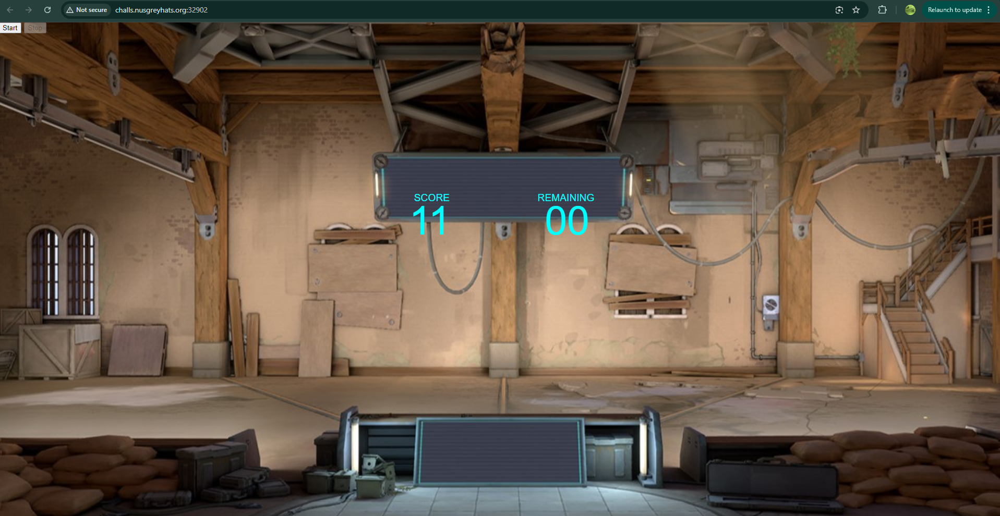
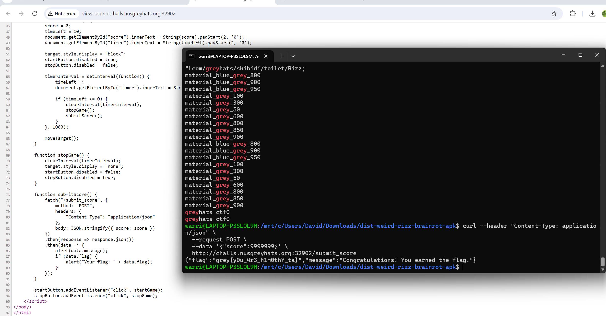

### aimfactory 🍼 | 92 Solves 255 Points
```
Hard difficulty in the range seems to be too easy for TenZ, so I made this insane difficulty!

1000 targets in 10 seconds, flick until your wrist unexist. Only for radiant players to win :)

Author: Jin Kai
```

We are given a web service showing a typical valorant range screen, with a score and time.


Clicking on `start` on the top left has various bullseye icons pop up and we are given 10 seconds to hit as many of them as possible. When the time runs out, a pop-up tells us that we need 1000 to get the flag, which seems impossible.

Using `ctrl+U` on chrome we can analyse the source script behind the website;
```html

<!DOCTYPE html>
<html lang="en">
<head>
    <meta charset="UTF-8">
	<meta meta name="viewport" content="width=device-width, initial-scale=1, maximum-scale=1, user-scalable=no">
    <title>Aimlab Game</title>
    <link rel="stylesheet" href="/static/styles.css">
</head>
<body>
    <div id="game">
		<div id="htimer">REMAINING</div>
        <div id="timer">10</div>
		<div id="hscore">SCORE</div>
        <div id="score">00</div>
		<button id="startButton">Start</button>
        <button id="stopButton" disabled>Stop</button>
        
    </div>
	    <script>
        let score = 0;
        let timeLeft = 10;
        let timerInterval;
        let target = document.getElementById("target");
        let startButton = document.getElementById("startButton");
        let stopButton = document.getElementById("stopButton");

        function moveTarget() {
            let game = document.getElementById("game");
            let maxX = game.clientWidth - target.width;
            let maxY = game.clientHeight - target.height;

            let randomX = Math.floor(Math.random() * maxX);
            let randomY = Math.floor(Math.random() * maxY);

            target.style.left = randomX + "px";
            target.style.top = randomY + "px";
        }

        target.addEventListener("click", function() {
            score += 1;
            document.getElementById("score").innerText = String(score).padStart(2, '0');
            moveTarget();
        });

        function startGame() {
            score = 0;
            timeLeft = 10;
            document.getElementById("score").innerText = String(score).padStart(2, '0');
            document.getElementById("timer").innerText = String(timeLeft).padStart(2, '0');

            target.style.display = "block";
            startButton.disabled = true;
            stopButton.disabled = false;

            timerInterval = setInterval(function() {
                timeLeft--;
				document.getElementById("timer").innerText = String(timeLeft).padStart(2, '0');

                if (timeLeft <= 0) {
                    clearInterval(timerInterval);
                    stopGame();
                    submitScore();
                }
            }, 1000);

            moveTarget();
        }

        function stopGame() {
            clearInterval(timerInterval);
            target.style.display = "none";
            startButton.disabled = false;
            stopButton.disabled = true;
        }

        function submitScore() {
            fetch("/submit_score", {
                method: "POST",
                headers: {
                    "Content-Type": "application/json"
                },
                body: JSON.stringify({ score: score })
            })
            .then(response => response.json())
            .then(data => {
                alert(data.message);
                if (data.flag) {
                    alert("Your flag: " + data.flag);
                }
            });
        }

        startButton.addEventListener("click", startGame);
        stopButton.addEventListener("click", stopGame);
    </script>
</body>
</html>
```

We can see everything behind how the webpage operates, as well as an interesting `submitScore()` option;

It appears that if we make a `POST` request with the body `{score: 99999999}` for example, we pass the check and can obtain the flag!

A simple way to make HTTP requests to a server would be to use the command line utiliy `curl`. `curl` allows us to make a request to a url and customise our packet's headers and contents!

To solve the challenge, we simply generate a curl request to the `/submit_score` link using the following command:
```
curl --header "Content-Type: application/json" --request POST --data '{"score":9999999}' http://challs.nusgreyhats.org:32902/submit_score
```



which nets us the flag, `grey{y0u_4r3_h1n0thY_ta}`