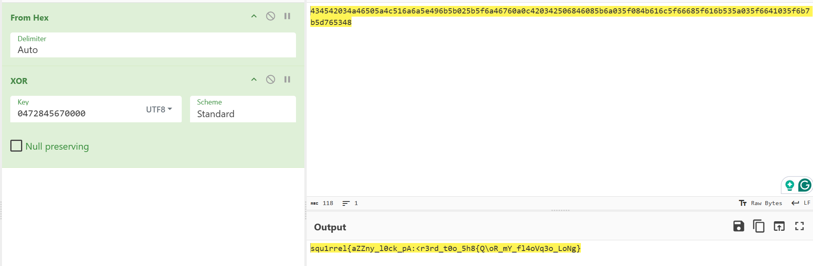
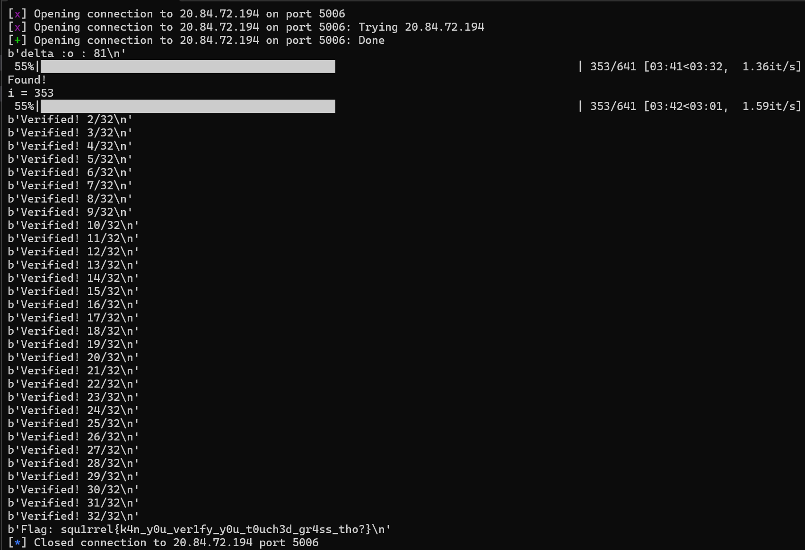

##  squ1rrelctf
squ1rrel CTF is a jeopardy-style CTF hosted by the squ1rrel CTF team at Vanderbilt University. This year I had the pleasure to play in it under the team `NUS Greyhats`, of which we clinched `1st` for a whopping `11500` pts and full cleared all of the challenges!


This writeup will cover all of the challenges in the Cryptography category. By the time I was online the first 3 challenges had already been solved by my teammates. Nevertheless, I managed to re-solve them on my own during the CTF and will be presenting all of my solutions in here!

### Easy RSA (333 Solves, 121 Pts)
```
Author: asbestos
“The security of RSA relies on the practical difficulty of factoring the product of two large prime numbers, the ‘factoring problem’” -Wikipedia
```

We are given two files:
#### easyrsa.txt
```
n: 26518484190072684543796636642573643429663718007657844401363773206659586306986264997767920520901884078894807042866105584826044096909054367742753454178100533852686155634326578229244464083405472076784252798532101323300927917033985149599262487556178538148122012479094592746981412717431260240328326665253193374956717147239124238669998383943846418315819353858592278242580832695035016713351286816376107787722262574185450560176240134182669922757134881941918668067864082251416681188295948127121973857376227427652243249227143249036846400440184395983449367274506961173876131312502878352761335998067274325965774900643209446005663 
e: 65537 
c: 14348338827461086677721392146480940700779126717642704712390609979555667316222300910938184262325989361356621355740821450291276190410903072539047611486439984853997473162360371156442125577815817328959277482760973390721183548251315381656163549044110292209833480901571843401260931970647928971053471126873192145825248657671112394111129236255144807222107062898136588067644203143226369746529685617078054235998762912294188770379463390263607054883907325356551707971088954430361996309098504380934167675525860405086306135899933171103093138346158349497350586212612442120636759620471953311221396375007425956203746772190351265066237
```

#### rsa_easy.py
```py
import random
from sympy import nextprime, mod_inverse


def gen_primes(bit_length, diff=2**32):
    p = nextprime(random.getrandbits(bit_length))
    q = nextprime(p + random.randint(diff//2, diff))
    return p, q


def gen_keys(bit_length=1024):
    p, q = gen_primes(bit_length)
    n = p * q
    phi = (p - 1) * (q - 1)

    e = 65537
    d = mod_inverse(e, phi)

    return (n, e)


def encrypt(message, public_key):
    n, e = public_key
    message_int = int.from_bytes(message.encode(), 'big')
    ciphertext = pow(message_int, e, n)
    return ciphertext


if __name__ == "__main__":
    public_key = gen_keys()

    message = "FLAG"
    ciphertext = encrypt(message, public_key)

    f = open("easy_rsa.txt", "a")
    f.write(f"n: {public_key[0]} \n")
    f.write(f"e: {public_key[1]} \n")
    f.write(f"c: {ciphertext}")
    f.close()
```

The difficulty of RSA primarily revolves around the fact that the modulus $n$ is hard to factor. Should we be able to factor out $n$ into its prime factorisation, we can use this and a little bit of group theory to reverse any $m^e\mod n$ back into $m$ as we can compute the modular multiplicative inverse of $e$ relative to the group order, which for $n = pq$ is $(p-1)*(q-1)$ (refer to [Euler's Totient Function](https://en.wikipedia.org/wiki/Euler%27s_totient_function), or my super duper cool Group Theory workshop that explains RSA in detail among other cryptosystems [here!](https://docs.google.com/presentation/d/1FKFo3BMrPr8ij0Avz7o_8JARnh4OiPCUNsN0VAIFnsk/edit?usp=sharing))

The vulnerability here lies in `gen_primes()`, whereupon $q - p <= 2^{32}$. We can therefore rewrite $q = p + r$ for some super small value $r$, giving us $n = p^2 + pr$

Except...that's not the case. The truth is, $q-p$ is a 525 bit integer. From the server code provided, this would not have happened. Rather, the challenge was ran with $diff = 2^{520}$ or some equally as big number. Which meant standard practices of bruting for small values of $\sqrt{n} - p$ through methods such as brute force or coppersmith to be not possible.

Regardless of this inconvenience, there is a way to factorise $n$. Implied in the code, we take it that $p$ and $q$ are close enough together such that $\frac{p+q}{2}$ is close to $\sqrt{n}$. This allows us to utilise a technique called [Fermat Factorisation](https://en.wikipedia.org/wiki/Fermat%27s_factorization_method).

The idea stems from the idea that $n = pq$ implies $n = \frac{p+q}{2}^{2} - \frac{p-q}{2}^{2}$. By finding the two squares, we can then derive $p$ and $q$. When $p$ and $q$ are close enough, $\frac{p-q}{2}$ is small enough for us to consider the algorithm!

The algorithm we use here is based off the implementation in [RSACtfTool](https://github.com/RsaCtfTool/RsaCtfTool/tree/master). We start with $n = \left \lceil{\sqrt{n}}\ \right \rceil^2 - {r}$ for some remainder value $r$. We start from $r$ and slowly reduce the larger square. Letting the larger square number be $a^2$, we reduce this to $(a-1)^2$ and add the lost $2*a+1$ to our $r$. We repeat this iteratively until $r$ becomes a square number. This gives us our $\frac{p+q}{2}^{2}$ and $\frac{p-q}{2}^{2}$. We then derive the primes from one of these values.

It should be noted that if the `rsa_easy.py` code were to be followed, we only need to repeat the iterative step 1 once. However, as it turns out we needed to do this $8612522$ times! On further investigation we find that this is due to how large the difference between the primes are.

Nevertheless, we speed up the code immensely using the `gmpy2` python library. Once we derive the prime factors, we can then apply standard RSA decryption to recover the flag.

#### solve.py
```py
n = ...
e = ...
c = ...

from gmpy2 import iroot, is_square
from time import time

def fermat(n):
    a = int(iroot(n, 2)[0])
    rem = n - a*a
    b2 = -rem
    c0 = (a << 1) + 1 # 2*a + 1
    c = c0
    cnt = 0
    while not is_square(b2):
        cnt += 1
        b2 += c
        c += 2
    print(cnt) 
    # typically according to the challenge code this cnt should be 1, heck less than 100
    # yet the truth is the server code was ran with diff = 2**525, causing cnt to be 8612522!
    a = (c - 1) >> 1
    b = int(iroot(b2, 2)[0])
    return a - b, a + b

start = time()
p, q = fermat(n)
print(f"Time taken: {time() - start} seconds")
# Time taken: 2.3779971599578857 seconds
# print((q - p).bit_length()) # 525 bits!! Scam smh

phi = (p - 1) * (q - 1)
d = pow(e, -1, phi)
m = pow(c, d, n)
print(m.to_bytes(2048//8, "big").lstrip(b"\x00"))
# b"squ1rrel{who's_your_favorite_mathemetician?}"
```

---
### XOR101 (214 Solves, 210 Pts)
```
Author: aj
My bike lock has 13 digits, you might have to dig around! 434542034a46505a4c516a6a5e496b5b025b5f6a46760a0c420342506846085b6a035f084b616c5f66685f616b535a035f6641035f6b7b5d765348

The flag format is squ1rrel{inner_flag_contents}. hint: the inner flag contents only include letters, digits, or underscores.
```

Evidently we can glean the following:

1. The flag is encrypted with a xor key of 13 digits, each from 0 to 9.
2. The flag starts with `squ1rrel{` and ends with `}`

From these 2, we can actually derive the first 9 key bytes to be `047284567`



Using Cyberchef, we get 

`squ1rrel{aZZny_l0ck_pA:<r3rd_t0o_5h8{Q\oR_mY_fl4oVq3o_LoNg}`

We guess the bytes in `pA:<r3rd` to be `pA:<w0rd` (we can't quite confirm the `:<` just yet), which gets us `047284567??53` as our xor key. Substituting the `?`s for `0`s gives us

`squ1rrel{aZ_my_l0ck_pA:<w0rd_t0o_5h8{T_oR_mY_fl4oVt0o_LoNg}`

We then guess that `aZ` at the start of the flag is `iS`, giving us the xor key of `0472845678953`. This turns out to be correct, as we obtain the flag:

`squ1rrel{iS_my_l0ck_pA25w0rd_t0o_5h0rT_oR_mY_fl4g_t0o_LoNg}`

---
### Secure Vigenere (162 Solves, 282 Pts)
```
Author: asbestos
Connect to: nc 20.84.72.194 5007 Wrap the flag with squ1rrel{}
```

Connecting to the server we obtain the following:
```
>> ncat 20.84.72.194 5007
Welcome! Here's the flag! It's just encrypted with a vigenere cipher with a random key! The key is a random length, and I randomly picked letters from "squirrelctf" to encrypt the flag! With so much randomness there's no way you can decrypt the flag, right?
Flag: mnjqnzlntcgwsgkbtmmipytlwyewkx
```

It appears we get a vigenere encrypted message with a random key. All we know is that the key is taken from the alphabet `squirrelctf`.

Given that vigenere ciphers essentially take the corresponding byte in the key and then caesar shift the flag letter that many times, knowing that the key letter is either `s,q,u,i,r,e,l,c,t,f`, for every plaintext letter, there can only be 10 possible ciphertext letters!

We use this and Python `sets` to narrow down the possible plaintexts, allowing us to derive the plaintext within 7-15 or so ciphertexts!

#### solve.py
```py
from pwn import remote, context
context.log_level = 'error'

def oracle():
    r = remote("20.84.72.194", 5007)
    r.recvuntil(b"Flag: ")
    return r.recvline().rstrip().decode()

FLAG_LEN = 30
ALPHABET = "abcdefghijklmnopqrstuvwxyz"
KEYS = "squirelctf"
flag = [[i for i in ALPHABET] for _ in range(FLAG_LEN)]
posbytes = [set() for _ in range(FLAG_LEN)]

csets = {}
for i in ALPHABET:
    cis = [ALPHABET[(ALPHABET.index(i) + ALPHABET.index(j)) % len(ALPHABET)] for j in KEYS]
    csets[i] = set(cis)

cnt = 0
while not all(len(i) == 1 for i in flag):
    res = oracle()
    for ptr, val in enumerate(res):
        posbytes[ptr].add(val)
        flag[ptr] = [i for i in flag[ptr] if csets[i] >= posbytes[ptr]]
    cnt += 1
    # print(flag)

print("squ1rrel{" + "".join(i[0] for i in flag) + "}")
print(f"Took {cnt} ciphertexts")
"""
squ1rrel{ithoughtrandomizationwassecure}
Took 10 ciphertexts
"""
```

---
### Flat Earth (18 Solves, 484 Pts)
```
Author: ZeroDayTea
How can you prove something that's not true?

nc 20.84.72.194 5006
```

#### server.py
```py
#!/usr/bin/sage
from sage.all import GF, EllipticCurve, PolynomialRing
import hashlib
import json
import sys
import re

# curve and fields
p = 7691
field_size = 641
Fp = GF(field_size)
Fq = GF(p)
Eq = EllipticCurve(Fq, [0, 1])
Fqr = Fq['r']
r = Fqr.gen()
Fq_2 = GF(p**2, modulus=r**2 + 1, name='v')
v = Fq_2.gen()
ExtEq = EllipticCurve(Fq_2, [0, 1])

# set generators
G1 = ExtEq([2693, 4312])
G2 = ExtEq(633*v + 6145, 7372*v + 109)
assert G1.order() == field_size
assert G2.order() == field_size

# generate toxic values
tau = Fp.random_element(Fp)
alpha = Fp.random_element(Fp)
beta = Fp.random_element(Fp)
gamma = Fp.random_element(Fp)
delta = Fp.random_element(Fp)

# crs
CRS1 = [tau**i * G1 for i in range(7)]
CRS2 = [tau**i * G2 for i in range(4)]
CRSTrap1 = [alpha * G1, beta * G1, delta * G1]
CRSTrap2 = [beta * G2, gamma * G2, delta * G2]

def commit(poly, CRS):
    coeffs = poly.list()
    degree = poly.degree()
    com = ExtEq([0, 1, 0])  # point at infinity
    for i in range(min(degree + 1, len(CRS))):
        com += coeffs[i] * CRS[i]
    return com

def point_to_str(point):
    if point.is_zero():
        return "O"
    return f"({point[0]}, {point[1]})"

# convert string to point with field checks
def str_to_point(point_str):
    if point_str == "O":
        return ExtEq([0, 1, 0])

    coords = point_str.strip("()").split(",")
    if len(coords) != 2:
        raise ValueError("Invalid point format")

    # parse extension field point first (contains 'v')
    x_str = coords[0].strip()
    y_str = coords[1].strip()

    if 'v' in x_str or 'v' in y_str:
        try:
            x_coord = None
            y_coord = None

            if '*v +' in x_str:
                if not re.match(r'^-?\d+\*v \+ -?\d+$', x_str):
                    raise ValueError(f"Invalid extension field format: {x_str}")

                x_parts = x_str.split('*v +')
                try:
                    x_coeff1 = int(x_parts[0].strip())
                    x_coeff2 = int(x_parts[1].strip())
                    if not (0 <= x_coeff1 < p and 0 <= x_coeff2 < p):
                        raise ValueError("Coefficient out of field range")
                    x_coord = x_coeff1*v + x_coeff2
                except ValueError:
                    raise ValueError(f"Invalid integer in extension field: {x_str}")

            elif '*v' in x_str:
                if not re.match(r'^-?\d+\*v$', x_str):
                    raise ValueError(f"Invalid extension field format: {x_str}")

                x_parts = x_str.split('*v')
                try:
                    x_coeff = int(x_parts[0].strip())
                    if not (0 <= x_coeff < p):
                        raise ValueError("Coefficient out of field range")
                    x_coord = x_coeff*v
                except ValueError:
                    raise ValueError(f"Invalid integer in extension field: {x_str}")

            elif re.match(r'^-?\d+$', x_str):
                try:
                    x_int = int(x_str)
                    if not (0 <= x_int < p):
                        raise ValueError("Value out of field range")
                    x_coord = Fq_2(x_int)
                except ValueError:
                    raise ValueError(f"Invalid integer: {x_str}")
            else:
                raise ValueError(f"Unrecognized format for x-coordinate: {x_str}")

            if '*v +' in y_str:
                if not re.match(r'^-?\d+\*v \+ -?\d+$', y_str):
                    raise ValueError(f"Invalid extension field format: {y_str}")

                y_parts = y_str.split('*v +')
                try:
                    y_coeff1 = int(y_parts[0].strip())
                    y_coeff2 = int(y_parts[1].strip())
                    if not (0 <= y_coeff1 < p and 0 <= y_coeff2 < p):
                        raise ValueError("Coefficient out of field range")
                    y_coord = y_coeff1*v + y_coeff2
                except ValueError:
                    raise ValueError(f"Invalid integer in extension field: {y_str}")

            elif '*v' in y_str:
                if not re.match(r'^-?\d+\*v$', y_str):
                    raise ValueError(f"Invalid extension field format: {y_str}")

                y_parts = y_str.split('*v')
                try:
                    y_coeff = int(y_parts[0].strip())
                    if not (0 <= y_coeff < p):
                        raise ValueError("Coefficient out of field range")
                    y_coord = y_coeff*v
                except ValueError:
                    raise ValueError(f"Invalid integer in extension field: {y_str}")

            elif re.match(r'^-?\d+$', y_str):
                try:
                    y_int = int(y_str)
                    if not (0 <= y_int < p):
                        raise ValueError("Value out of field range")
                    y_coord = Fq_2(y_int)
                except ValueError:
                    raise ValueError(f"Invalid integer: {y_str}")
            else:
                raise ValueError(f"Unrecognized format for y-coordinate: {y_str}")

            point = ExtEq([x_coord, y_coord])
            return point

        except Exception as e:
            raise ValueError(f"Invalid extension field point: {point_str}. Error: {str(e)}")
    else:
        if not (re.match(r'^-?\d+$', x_str) and re.match(r'^-?\d+$', y_str)):
            raise ValueError(f"Invalid coordinate format: ({x_str}, {y_str})")

        try:
            x_int = int(x_str)
            y_int = int(y_str)

            if not (0 <= x_int < p and 0 <= y_int < p):
                raise ValueError("Coordinate out of field range")

            x_coord = Fq(x_int)
            y_coord = Fq(y_int)

            point = ExtEq([x_coord, y_coord])
            return point
        except Exception as e:
            raise ValueError(f"Invalid field point: {point_str}. Error: {str(e)}")

def verify_proof(L_point, R_point, Q_point, A_point, B_point, C_point):
    left_pairing = A_point.weil_pairing(B_point, field_size)
    right_pairing = (CRSTrap1[0].weil_pairing(CRSTrap2[0], field_size) * 
                      C_point.weil_pairing(CRSTrap2[2], field_size))
    return left_pairing == right_pairing

# generate challenge with L, R s.t. L*R != Q
def generate_challenge():
    Rng = PolynomialRing(Fp, 'x')
    
    # create L/R polynomials
    L_poly = Rng.random_element(degree=3)
    R_poly = Rng.random_element(degree=3)
    
    # ensure L*R != Q
    true_Q_poly = L_poly * R_poly
    fake_Q_poly = true_Q_poly + Rng.random_element(degree=1)
    while fake_Q_poly == true_Q_poly:
        fake_Q_poly = true_Q_poly + Rng.random_element(degree=1)
    
    # commitments
    L_commit = commit(L_poly, CRS1)
    R_commit = commit(R_poly, CRS2)
    Q_commit = commit(fake_Q_poly, CRS1)
    
    return {
        "L": point_to_str(L_commit),
        "R": point_to_str(R_commit), 
        "Q": point_to_str(Q_commit)
    }

print(f"delta :o : {int(delta)}")
rounds_passed = 0
total_rounds = 32

while rounds_passed < total_rounds:
    challenge = generate_challenge()
    print(f"\nRound {rounds_passed + 1}/{total_rounds}")
    print(json.dumps(challenge))
    
    try:
        response = json.loads(input())
        
        # parse proof
        A_point = str_to_point(response["proof"]["A"])
        B_point = str_to_point(response["proof"]["B"])
        C_point = str_to_point(response["proof"]["C"])

        # get chall commitments
        L_point = str_to_point(challenge["L"])
        R_point = str_to_point(challenge["R"])
        Q_point = str_to_point(challenge["Q"])
        
        if verify_proof(L_point, R_point, Q_point, A_point, B_point, C_point):
            rounds_passed += 1
            print(f"Verified! {rounds_passed}/{total_rounds}")
        else:
            print("Stupid :)")
    except Exception as e:
        print(f"Error: {e}")
    break

if rounds_passed >= total_rounds:
    with open("flag.txt", "r") as f:
        flag = f.read().strip()
    print(f"Flag: {flag}")
```

This challenge may look like a doozy with its size, but the truth is it's very, very simple.

What we have here is an attempt to implement a zero knowledge proof scheme where a challenge is given to the user and the user must send a response that is verifiable.

```py
def verify_proof(L_point, R_point, Q_point, A_point, B_point, C_point):
    left_pairing = A_point.weil_pairing(B_point, field_size)
    right_pairing = (CRSTrap1[0].weil_pairing(CRSTrap2[0], field_size) * 
                      C_point.weil_pairing(CRSTrap2[2], field_size))
    return left_pairing == right_pairing

# generate challenge with L, R s.t. L*R != Q
def generate_challenge():
    Rng = PolynomialRing(Fp, 'x')
    
    # create L/R polynomials
    L_poly = Rng.random_element(degree=3)
    R_poly = Rng.random_element(degree=3)
    
    # ensure L*R != Q
    true_Q_poly = L_poly * R_poly
    fake_Q_poly = true_Q_poly + Rng.random_element(degree=1)
    while fake_Q_poly == true_Q_poly:
        fake_Q_poly = true_Q_poly + Rng.random_element(degree=1)
    
    # commitments
    L_commit = commit(L_poly, CRS1)
    R_commit = commit(R_poly, CRS2)
    Q_commit = commit(fake_Q_poly, CRS1)
    
    return {
        "L": point_to_str(L_commit),
        "R": point_to_str(R_commit), 
        "Q": point_to_str(Q_commit)
    }
```

The challenge response code looks super tough, with polynomials and elliptic curves in `commit()` and `weil_pairings()` used in verifying the proof.

But the thing is, the challenges are all useless! Every challenge gives us `L, R, Q`, and the server expects some `A, B, C` which are curve points in `EllipticCurve(GF(p**2), [0, 1])`. But `L, R, Q` are never used or referenced at all in the proof!

Meaning, what we have here is just:

```py
left_pairing = A_point.weil_pairing(B_point, field_size)
right_pairing = (CRSTrap1[0].weil_pairing(CRSTrap2[0], field_size) * C_point.weil_pairing(CRSTrap2[2], field_size))
```

The instant we find a valid `(A, B, C)` triplet that works, we can just spam it 32 times to pass the challenge-response scheme to get the flag.

The weil pairings themselves are computed on the curve `EllipticCurve(GF(p**2), [0, 1])` with generators 

```py
G1 = [2693, 4312]
G2 = (633*v + 6145, 7372*v + 109)

# Additionally,
CRSTrap[0] = alpha * G1
CRSTrap2[0] = beta * G2
CRSTrap2[2] = delta * G2

# We know delta. alpha and beta however, are random numbers taken from 0 to 640.
```

The trick here, is that weil pairings simply exploit the fact that given two generators `G1, G2` and the subgroups generated by them, for any random numbers `a, b`, provided the subgroup orders of `G1` and `G2` are the same,

`weil(a * G1, b * G2) == weil(ab * G1, G2)`

In fact, if I have some other distinct integer pair `c,d` such that `cd == ab`, `weil(d * G1, c * G2)` would be equivalent also!

Thus, because the subgroup orders for `G1` and `G2` is 641, there are only 641 possible weil pairing values. In fact, we just need to guess what `(alpha * beta) % 641` is, then send 
```py
A = (alpha * beta) * G1
B = G2
C = 0*G1 or 0*G2
```
of which the proof would be verified! We set `C = 0*G1` so as to completely ignore the effect imposed by the `delta` parameter.

We simply brute `(alpha * beta) % 641` till we get the right value, then repeat that 32 times total to get the flag and bypass the system.

#### solve.py
```py
# nc 20.84.72.194 5006
from pwn import remote
from json import dumps
from tqdm import trange
from sage.all import GF, EllipticCurve

p = 7691
field_size = 641
Fp = GF(field_size)
Fq = GF(p)
Eq = EllipticCurve(Fq, [0, 1])
Fqr = Fq['r']
r = Fqr.gen()
Fq_2 = GF(p**2, modulus=r**2 + 1, name='v')
v = Fq_2.gen()
ExtEq = EllipticCurve(Fq_2, [0, 1])
G1 = ExtEq([2693, 4312])
G2 = ExtEq(633*v + 6145, 7372*v + 109)

def point_to_str(point):
    if point.is_zero():
        return "O"
    return f"({point[0]}, {point[1]})"

def oracle(r, alpha):
    r.recvline()
    r.recvline()
    r.recvline()
    r.sendline(dumps({"proof":{"A":point_to_str(alpha * G1), "B":point_to_str(G2), "C":"O"}}).encode())
    res = r.recvline()
    return res


r = remote('20.84.72.194', 5006)
print(r.recvline()) # delta message. But we don't have to care about it

for i in trange(641):
    res = oracle(r, i)
    if b"Stupid" in res:
        continue
    print("Found!")
    print(f"{i = }")
    break

for _ in range(31):
    oracle(r, i)
print(r.recvline())
r.close()
```


