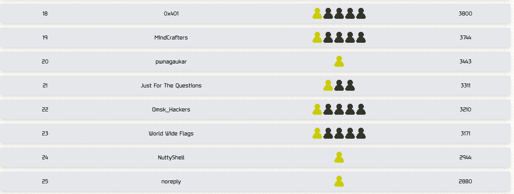

TFCCTF is an annual capture-the-flag competition hosted by TheFewChosen. Sponsored by Google, Offensive Security, HackTheBox and Binary Ninja, the organisers claimed that the event is universally accessible - from cybersecurity novices eager to learn the ropes, to seasoned experts looking to flex their skills in a challenging environment. 

I participated with team `World Wide Flags` and we managed to achieve a decent `23rd` with `3171` points.



I was a bit busy especially with having to pack for my trip to Vegas for DEFCON Finals with `Friendly Maltese Citizens` at the time, but I was able to help out by solving the following:
```
Crypto - Padgrounds         (33 solves, 400 pts)
Crypto - Biased Elections   (21 solves, 460 pts)
Crypto - Genetics           (366 solves, 50 pts)
Misc   - Secret Message     (67 solves, 88 pts)
```

I will be providing writeups for these challenges.