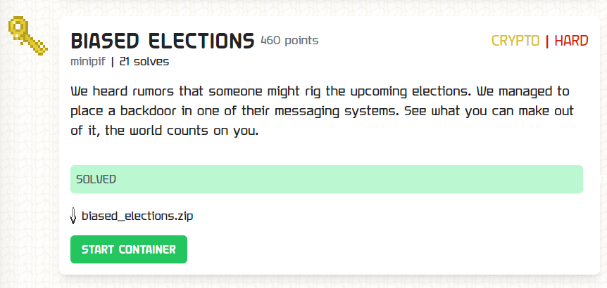

### Biased Elections


`server.py`
```py
from ecdsa import ellipticcurve
from ecdsa.ecdsa import curve_256, generator_256, Public_key, Private_key
import random
import hashlib
from Crypto.Cipher import AES
from Crypto.Util.Padding import pad
from Crypto.Util.number import long_to_bytes,bytes_to_long

FLAG = b'TFCCTF{REDACTED}'
G = generator_256
order = G.order()
rand = random.randint(1,order-1)
pubkey = Public_key(G, rand*G)
privkey = Private_key(pubkey, rand)


messages = [
    "Ensure the ballots are ready for the biased count.",
    "The first batch of votes is in. Proceed as planned.",
    "Secure the communications. We can't risk exposure.",
    "Start the rigging process at midnight tonight.",
    "All systems are go. Confirm the final preparations.",
    "Intercepted some chatter. Maintain radio silence.",
    "Verification complete. Everything is on track.",
    "Monitor the vote counts closely. Report any issues.",
    "We've gained access. Execute the next step."
]

def the_random():
    def very_random(length):
        return ''.join(chr((l(a, b, m) % 94) + 33) for _ in range(length))
    
    def l(a, b, m):
        nonlocal x
        result = (a * x + b) % m
        x = result
        return result
    
    a = 6364136223846793005
    b = 1
    m = 2 ** 64
    x = random.getrandbits(64)
    
    r = very_random(128)
    s = hashlib.sha256(r.encode()).hexdigest()
    t = hashlib.md5(s.encode()).hexdigest()
    u = hashlib.sha1(t.encode()).hexdigest()
    f = lambda q: int(q, 16)
    c = lambda q: q & ((1 << random.randint(170,200)) - 1)
    
    g = very_random(256)
    h = very_random(256)
    j = ''.join(chr((ord(k) ^ ord(l)) % 256) for k, l in zip(g, h))
    k = hashlib.sha256(r.encode() + j.encode()).hexdigest()
    n = ''.join(chr((ord(o) ^ ord(p)) % 256) for o, p in zip(j, k))
    o = hashlib.md5(n.encode() + k.encode()).hexdigest()
    p = hashlib.sha1(o.encode() + k.encode()).hexdigest()
    q = f(p[:40])
    
    aes_key = very_random(16).encode('utf-8')
    aes_iv = very_random(16).encode('utf-8')
    aes_cipher = AES.new(aes_key, AES.MODE_CBC, aes_iv)
    aes_data = pad((p[:32] + o[:32]).encode('utf-8'), AES.block_size)
    aes_encrypted = aes_cipher.encrypt(aes_data)
    z = f(hashlib.sha256(aes_encrypted).hexdigest()[:40])
    
    obfuscated_final = lambda a, b: a ^ (b >> 5)
    result = obfuscated_final(q, z)
    return c(result)

def sign_message(message):
    hsh = hashlib.sha256(message.encode()).digest()
    nonce = the_random()
    sig = privkey.sign(bytes_to_long(hsh), nonce)
    return {"hash": bytes_to_long(hsh), "r": hex(sig.r), "s": hex(sig.s)}


max_used = 10
used = 0
print('What do you want to do?')
print('1. Listen in on conversation')
print('2. Submit the info you found')
print('3. Get pubkey')
while True:
    data = input()

    if data == '1':
        if used > max_used:
            print('Intruder spotted, deleting secrets.')
            exit()

        message = messages[random.randint(0,len(messages)-1)]
        print(sign_message(message))
        used+=1

    if data == '2':
        key = int(input('Key? '))

        if key == rand:
            print('Thanks bro here is a flag for your effort')
            print(FLAG)

    if data == '3':
        print(f'Public key: {int(pubkey.point.x())} {int(pubkey.point.y())}')
```

We got a doozy of a challenge!

Evidently we're given a server oracle implementing the `ECDSA (Elliptic Curve Digital Signature Algorithm)`. It uses the `P256` elliptic curve and generates a private key `rand`, which it uses to compute a public key, `rand*G`.

We are able to interact with the server to get 10 digital signatures from the `ECDSA` algorithm, the public key `rand*G`, and we are expected to recover `rand`, after which we would get the flag.

As for how the ECDSA algorithm is implemented, well we don't get to see it here. Instead, the server relies on python's `ecdsa` library to do the rest.

```py
def sign_message(message):
    hsh = hashlib.sha256(message.encode()).digest()
    nonce = the_random()
    sig = privkey.sign(bytes_to_long(hsh), nonce)
    return {"hash": bytes_to_long(hsh), "r": hex(sig.r), "s": hex(sig.s)}
```

We are given the usual outputs of the algorithm, that being the hash of the message, as well as values `r` and `s`.

Let's delve into the inner workings of the `ECDSA` algorithm.

#### The ECDSA Algorithm
---

Suppose a user, say Alice, wishes to sign a message `m` using `ECDSA`.

She first uses a key pair on a curve, so some `d` and `G`, a generator point on an elliptic curve with the public key being `d*G`. This parallels our `G` and `rand*G`, with our curve being the `p-256` curve. Note that only Alice knows `d`.

Alice then computes a hash of m, `h`, and gets a nonce `k`. She computes `k*G` using standard point multiplication on the curve, thereby deriving a curve point `(x1, y1)`.

Given `n`, the order of the curve point `G` (i.e. smallest positive integer s.t. n*G == point of infinity (which is the identity element of the group generated by `G` with point addition as our group operator)), Alice computes `r = x1 mod n` and `s = k_inv * (h + r*d) mod n`. This is her signature. `k_inv` refers to the modular multiplicative inverse of `k`, i.e. some number s.t. `k_inv * k == 1 mod n`. 

`(d*G, h, r, s)` are made known to all as Alice's public signature for any message.

To verify the signature, any person who would have known the message to begin with, computes `h`, then derives

```py
  h * s_inv * G + r * s_inv * (dG)
= (h*k*G + r*k*d*G) / (h + r*d)
= k*G
```

and this calculated curve point should be `k*G`, thus its x-coordinate would equal `r`.

Now, should the person receive a message `m` that's modified, `h` would be different and thus the derived value would not be `k*G`, allowing the user to determine the message was altered by some 3rd party. This is one of the reasons why signatures are used in cryptography, being to ensure integrity in that the message was not maliciously modified by an attacker.

The security of this algorithm lies in that the nonce `k` is secure. If the nonce `k` were reused twice for example, one can actually derive the private key `d` from just two signatures. I'll leave this as an exercise to the reader.

More importantly, if at any point this nonce `k` is biased (as in certain bits of it are the same), then the private key `d` would be recoverable.

#### Biased Nonce Sense and The Hidden Number Problem
---

A simplified version of the aforementioned attack is very well illustrated in the paper, [Biased Nonce Sense: Lattice Attacks against
Weak ECDSA Signatures in Cryptocurrencies
](https://eprint.iacr.org/2019/023.pdf).

The attack in question is based off of the `Hidden Number Problem`, which at the base case seeks a solution to the following system of linear equations:

```
x1 - t1 y + a1 == 0 mod p
x2 - t2 y + a2 == 0 mod p
...
```
whereby `t1, t2, ...`, `a1, a2, ...` are known, as is `p`, and we also know that `x1, x2, ... < B` for some upper bound `B`. To solve the system, we'll need to find any solution `y, x1, x2, ...` that satisfies the aforementioned constraints.

Provided that the vector `{x1, x2, ...}` is small enough, we can recover this by expressing our system in the form of a lattice. Without loss of generality we'll narrow our case to just 3 unknowns.

We start by rewriting the equations as;
```
x1 - t1 y + a1 + k1 p == 0
x2 - t2 y + a2 + k2 p == 0
x3 - t3 y + a3 + k3 p == 0
```
Then the lattice:
```
p  0  0  0   0
0  p  0  0   0
0  0  p  0   0
t1 t2 t3 B/p 0
a1 a2 a3 0   B
```
with each row as its vectors can generate a vector `vb = {x1, x2, x3, By/p, B}` (consider what happens when you multiply the row vector `{k1, k2, k3, y, 1}` with the lattice). If this vector is short enough, which could occur for a small enough upper bound `B`, then we might be able to observe `vb` in the reduced basis of the lattice, which we attain by applying the `LLL (Lenstra–Lenstra–Lovász)` lattice reduction algorithm. The paper goes further in depth to substantiate why this vector would be particularly short. Anyway, from here we can therefore recover `y` (as we know `B` and `p`). Since we would know each `t` and `a`, we can then recover the `x` unknowns from each of the linear equations we've described earlier.

Recall the equations used in ECDSA.

`s = k_inv * (h + r*d) mod n`

We can rephrase this as:
```
s * k - r*d - h == 0 mod n
k - s_inv*r * d - s_inv*h == 0 mod n
```

Notice how this nicely fits our hnp system? Now if we have our individual nonces `k` less than some upper bound `B` that's "small" enough, we can apply the lattice reduction attack to recover `d`!

#### Breaking Biased Elections

Now let us return to the challenge. 
```py
def sign_message(message):
    hsh = hashlib.sha256(message.encode()).digest()
    nonce = the_random()
    sig = privkey.sign(bytes_to_long(hsh), nonce)
    return {"hash": bytes_to_long(hsh), "r": hex(sig.r), "s": hex(sig.s)}
```

We observe that the nonce, `k`, which would be pipped into the `ECDSA` scheme, comes from `the_random()`.

Now `the_random()` looks super complicated using a variety of algorithms like `sha1, sha256, aes`, and even an `lcg`...

```py
def the_random():
    def very_random(length):
        return ''.join(chr((l(a, b, m) % 94) + 33) for _ in range(length))
    
    def l(a, b, m):
        nonlocal x
        result = (a * x + b) % m
        x = result
        return result
    
    a = 6364136223846793005
    b = 1
    m = 2 ** 64
    x = random.getrandbits(64)
    
    r = very_random(128)
    s = hashlib.sha256(r.encode()).hexdigest()
    t = hashlib.md5(s.encode()).hexdigest()
    u = hashlib.sha1(t.encode()).hexdigest()
    f = lambda q: int(q, 16)
    c = lambda q: q & ((1 << random.randint(170,200)) - 1)
    
    g = very_random(256)
    h = very_random(256)
    j = ''.join(chr((ord(k) ^ ord(l)) % 256) for k, l in zip(g, h))
    k = hashlib.sha256(r.encode() + j.encode()).hexdigest()
    n = ''.join(chr((ord(o) ^ ord(p)) % 256) for o, p in zip(j, k))
    o = hashlib.md5(n.encode() + k.encode()).hexdigest()
    p = hashlib.sha1(o.encode() + k.encode()).hexdigest()
    q = f(p[:40])
    
    aes_key = very_random(16).encode('utf-8')
    aes_iv = very_random(16).encode('utf-8')
    aes_cipher = AES.new(aes_key, AES.MODE_CBC, aes_iv)
    aes_data = pad((p[:32] + o[:32]).encode('utf-8'), AES.block_size)
    aes_encrypted = aes_cipher.encrypt(aes_data)
    z = f(hashlib.sha256(aes_encrypted).hexdigest()[:40])
    
    obfuscated_final = lambda a, b: a ^ (b >> 5)
    result = obfuscated_final(q, z)
    return c(result)
```

But the return value is `q ^ (z >> 5)` (you'll notice that `c(result)` changes nothing here), which is 20 bytes of some `hashlib.sha1()` hash xored with 20 bytes of a `hashlib.sha256()` hash, left rotated by 5 bits. When the dust settles, `q ^ (z >> 5)` is going to be at most 20 bytes and thus less than 160 bits!

Now, the p-256 curve has a 256-bit order. The upper bound for the nonces is much less than the order, and this perfectly fits with the biased nonce attack we were describing earlier! We simply need to implement the algorithm to derive the flag.

```py
from ecdsa import ellipticcurve
from ecdsa.ecdsa import generator_256
from Crypto.Util.number import inverse
from sage.all import matrix, QQ,  mod

G = generator_256
order = G.order()

from pwn import remote

r = remote('challs.tfcctf.com', 30314)

# Get pubkey
r.sendline(b'3')
r.recvuntil(b'Public key: ')
pubx = int(r.recvline().split(b' ')[0])
print(f"{pubx = }")

# Get signatures
Hs, rs, ss = [], [], []
for i in range(10):
    r.sendline(b'1')
    sign = eval(r.recvline().rstrip())
    print(sign)
    Hs.append(sign["hash"])
    rs.append(int(sign["r"],16))
    ss.append(int(sign["s"],16))

# Implement lattice attack as described in the paper
M = matrix(QQ, 12, 12)
for i in range(10):
    M[i,i] = order        
for i in range(10):
    M[10, i] = mod(rs[i] * inverse(ss[i], order), order) 
    M[11, i] = -mod(Hs[i] * inverse(ss[i], order), order)
B = 2**160
M[10, 10] = QQ(B)/QQ(order)          
M[11, 11] = QQ(B)
rows = M.LLL()

# Test for private key
for row in rows:    
    d = int(((QQ(-(row[-2])) * order) / B) % order)
    print(f"Testing {d}")
    dG = d*G
    if not dG.x():
        continue
    if int(dG.x()) == pubx:
        print(f"Found d = {d}")
        r.sendline(b'2')
        r.sendline(str(d).encode())
        r.interactive()
r.close()
```

Thus getting the flag:

`TFCCTF{c0Ngr47s_y0u_s4v3d_th3_3lect1Ons}`