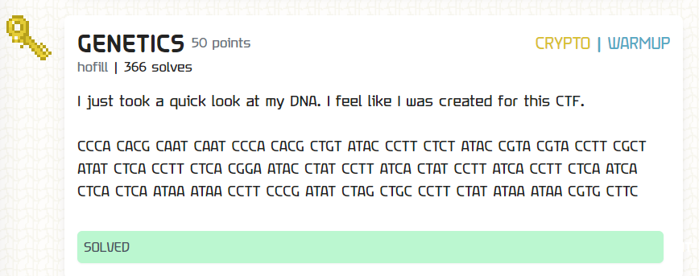
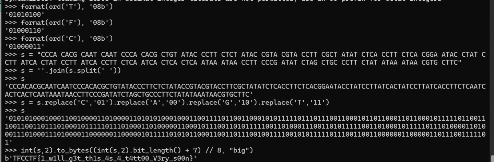

### Genetics

Oh no, guessy crypto...

An interesting thing I'd spotted was that DNAs are encoded using four unique codes or bases - adenine (A), cytosine (C), guanine (G), and thymine (T)

In addition, there's spaces between every group of 4. Thus every 4-length group would have 256 possible outputs - binary, perhaps?

I made the guess that `CCCA CACG CAAT` represents the first few bytes of the flag header, `TFC`. This seems to match up pretty nicely, allowing me to map each letter to a binary substring `00`, `01`, `10`, `11`. Recovering the flag was trivial.

`TFCCTF{1_w1ll_g3t_th1s_4s_4_t4tt00_V3ry_s00n}`