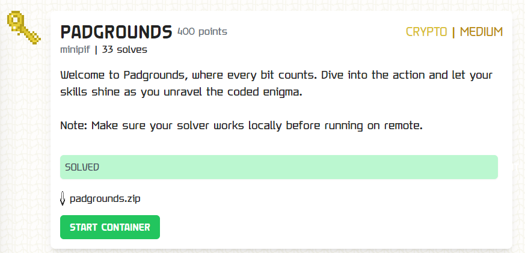

### Padgrounds


`server.py`
```py
#!/usr/bin/env python3

from Crypto.Cipher import AES
from Crypto.Util.Padding import unpad
import os
import base64
import random

#FLAG regex is TFCCTF{[bdefgmnprsu012345_]+}
FLAG = b'TFCCTF{????????????????????????????}'

def custom_unpad(ct):
    ct = base64.b64decode(ct)
    iv, ct = ct[:16], ct[16:]
    cipher = AES.new(key, AES.MODE_CBC, iv)
    pt = cipher.decrypt(ct)
    padding = True
    try:
        unpad(pt, 16)
    except:
        padding = False
    padding = (padding | (random.randint(1,10) > 7) ) & (random.randint(1,10) <= 7)
    return padding

current = 0
limit = 10000
key = os.urandom(16)
iv = os.urandom(16)
cipher = AES.new(key, AES.MODE_CBC, iv)
ct = cipher.encrypt(FLAG)
give = base64.b64encode(iv + ct)
print(f"Lets see you decode this: {give.decode()}")
print("I made my unpad truly random, there is nothing you can do, just give up already")

while True:
    if current > limit:
        exit()
    to_unpad = input()
    out = custom_unpad(to_unpad)
    print(out)
    current+=1
```

We're given an `AES-CBC` oracle to a server, and we have 10000 tries. Its pretty evident that this is a standard padding oracle attack. There is a trove of materials online on the attack, with one [based on a Cryptopals challenge here](https://research.nccgroup.com/2021/02/17/cryptopals-exploiting-cbc-padding-oracles/), but there is a catch - the padding oracle can lie.

Fortunately however we find that should `padding = true`, its more likely to return `true` than it is to lie and return `false`. Vice versa for when the server finds the decrypted message to be unpaddable. I've tested and learnt that after 32 attempts the correct character stands out much more from the rest.

Since we can connect to the server as many times as we want, we only need to use the 10000 attempts to recover a single full 16-byte block of the flag with each instance. Since every flag character inside the `TFCCTF{}` only has `bdefgmnprsu012345_` as its unique characters, to recover each block we only need `16*18*32=9216` tries. We can optimise this even further to use less as well, as we see in my solve script;

```py
from Crypto.Util.strxor import strxor
import base64
from pwn import remote
from tqdm import trange, tqdm

def get_params(give):
    ct = base64.b64decode(give)
    iv, ct = ct[:16], ct[16:]
    ct = [ct[i:i+16] for i in range(0, len(ct), 16)]
    return iv, ct

r = remote('challs.tfcctf.com', 30598)

r.recvuntil(b'Lets see you decode this: ')
give = r.recvline().rstrip()
iv, ct = get_params(give)

# FLAG = b"TFCCTF{g00d_p4dd
#          1ngs_m4_fr1end5_
#          rememb3r_2_fun1}

alphabet = b'}bdefgmnprsu012345_'
def guess_block(blk, prev):
    known = b''
    for ptr in range(1, 17):
        guess_char = '?'
        cntmax = 0
        ptchars = []
        for ptchar in tqdm(alphabet):
            padding = b'\x00' * (16 - ptr) + bytes([ptr] * ptr)
            xx = b'\x00' * (16 - ptr) + bytes([ptchar]) + known
            yy = strxor(xx, padding)
            niv = strxor(prev, yy)
            pload = base64.b64encode(niv + blk)
            cnt = 0
            for _ in range(32):
                r.sendline(pload)
                line = r.recvline().rstrip()
                res = line == b"True"
                if res:
                    cnt += 1
            ptchars.append((chr(ptchar), cnt))
            if cntmax < cnt:
                cntmax = cnt
                guess_char = chr(ptchar)
            if cntmax >= 20: # optimisation
                break
        known = guess_char.encode() + known
        print(known)

guess_block(ct[2], ct[1])
```

I ran this a couple of times with different input parameters to `guess_block()`, thus piecing together the flag,

`TFCCTF{g00d_p4dd1ngs_m4_fr1end5_rememb3r_2_fun1}`
