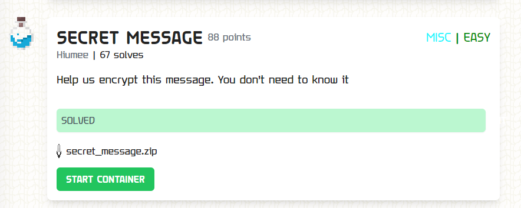
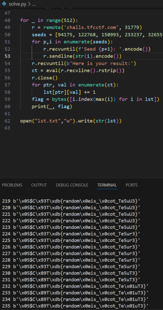

### Secret Message


`main.py`
```py
import random
import secrets

def hide(string, seed, shuffle):
    random.seed(seed)
    byts = []
    for _ in range(len(string)):
        byts.append(random.randint(0, 255))

    random.seed(shuffle)
    for i in range(100):
        random.shuffle(byts)

    return bytes([a^b for a, b in zip(string, byts)])

actual_random_number = secrets.randbelow(1_000_000_000_000_000_000)

flag = open("flag", "rb").read()

print("Give me 6 different seeds:")

seed_1 = int(input("Seed 1: "))
seed_2 = int(input("Seed 2: "))
seed_3 = int(input("Seed 3: "))
seed_4 = int(input("Seed 4: "))
seed_5 = int(input("Seed 5: "))
seed_6 = int(input("Seed 6: "))

seeds_set = set([seed_1, seed_2, seed_3, seed_4, seed_5, seed_6])

if len(seeds_set) < 6:
    print("The seeds must be different!")
    exit()

hidden_flag_1 = hide(flag, seed_1, actual_random_number)
hidden_flag_2 = hide(hidden_flag_1, seed_2, actual_random_number)
hidden_flag_3 = hide(hidden_flag_2, seed_3, actual_random_number)
hidden_flag_4 = hide(hidden_flag_3, seed_4, actual_random_number)
hidden_flag_5 = hide(hidden_flag_4, seed_5, actual_random_number)
hidden_flag_6 = hide(hidden_flag_5, seed_6, actual_random_number)

print(f"Here is your result:", hidden_flag_6)
```

Really enjoyed this sorta disguised-crypto esque challenge. The premise is that you send 6 distinct numbers to the server and the server then calls `hide()` with these numbers as parameters. It then gives you the encrypted flag.

The `hide()` function takes in your input as a seed, generates a random byte array and then shuffles the array with some constant seed that had been randomly generated previously. This shuffle is constant with each `hide()`.

I noticed that we can just find 6 seeds whereby the first and second values of the random byte array are `0s`. Then, since the shuffle is random with each connection to the remote, about `2 in len(flag)` of the time the original flag character is unmodified at the end of the `hides()`, thus that character would appear more often than the modified flag characters.

```py
# import random
# FLAG LENGTH: 28
# cnt = 0
# for i in range(9999999):
#     random.seed(i)
#     byts = []
#     for _ in range(28):
#         val = random.randint(0, 255) # so random byts
#         byts.append(val)
#     if byts[0] == 0 and byts[1] == 0:
#         print(i, byts)
#         cnt += 1
#     if cnt == 6:
#         break

from pwn import remote, context
from tqdm import trange

context.log_level = 'error'

lst = []
for i in range(28):
    aa = []
    for j in range(256):
        aa.append(0)
    lst.append(aa)

for _ in range(512):
    r = remote('challs.tfcctf.com', 31779)
    seeds = [94175, 122768, 150993, 233237, 326557, 650563]
    for p,i in enumerate(seeds):
        r.recvuntil(f'Seed {p+1}: '.encode())
        r.sendline(str(i).encode())
    r.recvuntil(b'Here is your result:')
    ct = eval(r.recvline().rstrip())
    r.close()
    for ptr, val in enumerate(ct):
        lst[ptr][val] += 1
    flag = bytes([i.index(max(i)) for i in lst])
    print(_, flag)
```



And from here I was able to guess the flag,
`TFCCTF{random_is_not_secur3}`