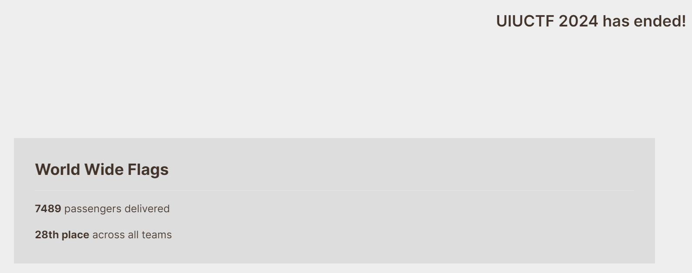
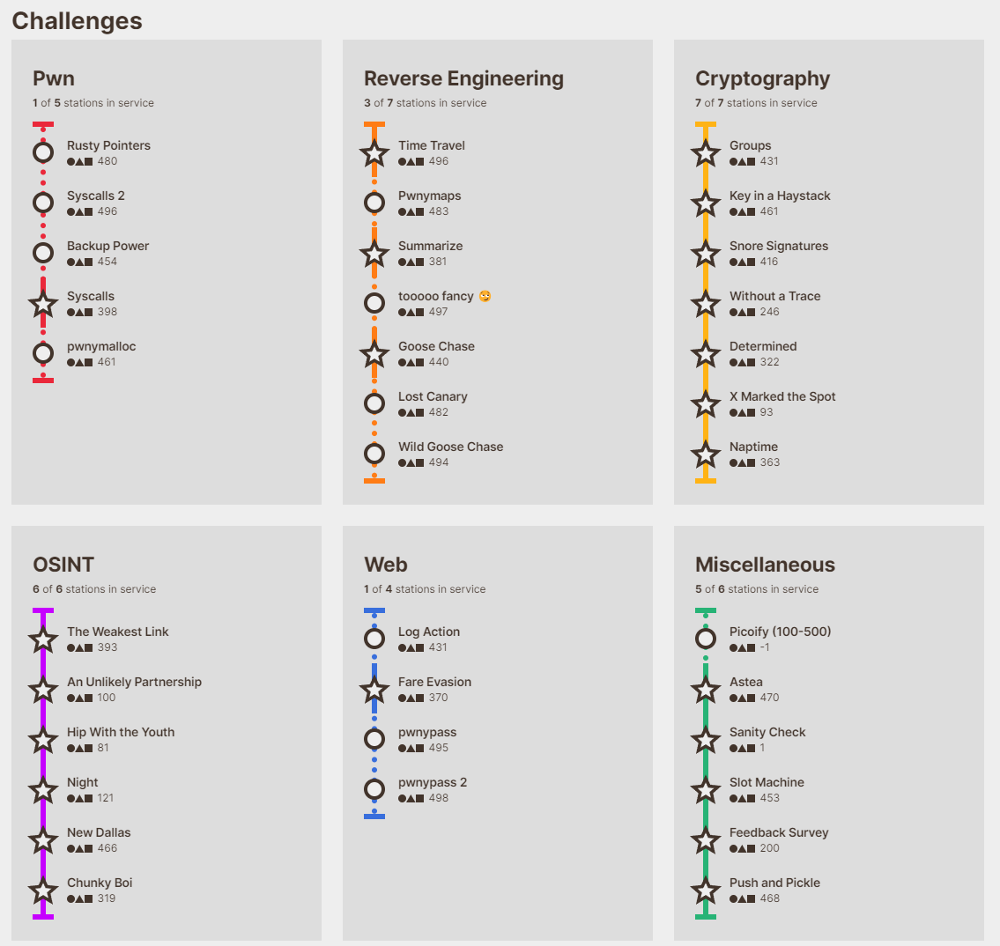

UIUCTF is an annual capture-the-flag competition hosted by SIGPwny, the cybersecurity club at the University of Illinois Urbana-Champaign (UIUC). This year I had the opportunity to participate in it under team `World Wide Flags`. It was a decent break from grinding through and enjoying the recently released Elden Ring DLC, and we managed to score `28th` on the global leaderboard. *(we scored higher than strong teams like idek, emu exploit and maple bacon! Totally not because we happened to have insane OSINT peeps to full clear that category)*



Challenges solved and unsolved at the end:



Of which I've managed to solve the following:
```
Crypto - Groups             (431 pts)
Crypto - Snore Signatures   (416 pts)
Rev    - Summarize          (381 pts)
```
Only 3 challenges, to be fair, but I'll be providing writeups for these, as well as almost all of the challenges in the crypto category! The writeups of challenges not solved by me will feature my upsolves that had already been solved from my teammates, notably [Yun](https://github.com/octo-kumo) and [Maelhos](https://github.com/maelhos/). Both of them will be credited in the relevant writeups.