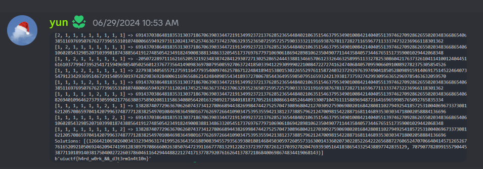

## Determined (222 Solves, 322 Pts)
```
Author: Anakin

"It is my experience that proofs involving matrices can be shortened by 50% if one throws the matrices out."

Emil Artin
ncat --ssl determined.chal.uiuc.tf 1337
```

Similar to [Without a Trace](crypto_without_a_trace.md), this was solved by my teammate Yun during the ctf. This writeup consists of my own analysis and solve for the challenge after the ctf, after having referenced Yun's solve.

First things first, we are given THREE distributed files.

`gen.py`
```py
from SECRET import FLAG, p, q, r
from Crypto.Util.number import bytes_to_long
n = p * q
e = 65535
m = bytes_to_long(FLAG)
c = pow(m, e, n)
# printed to gen.txt
print(f"{n = }")
print(f"{e = }")
print(f"{c = }")
```
`gen.txt`
```
n = 158794636700752922781275926476194117856757725604680390949164778150869764326023702391967976086363365534718230514141547968577753309521188288428236024251993839560087229636799779157903650823700424848036276986652311165197569877428810358366358203174595667453056843209344115949077094799081260298678936223331932826351
e = 65535
c = 72186625991702159773441286864850566837138114624570350089877959520356759693054091827950124758916323653021925443200239303328819702117245200182521971965172749321771266746783797202515535351816124885833031875091162736190721470393029924557370228547165074694258453101355875242872797209141366404264775972151904835111
```

`gen.py` seems to be standard RSA giving us `gen.txt` and the encrypted flag `c`.

`server.py`
```py
from Crypto.Util.number import bytes_to_long, long_to_bytes
from itertools import permutations
from SECRET import FLAG, p, q, r

def inputs():
    print("[DET] First things first, gimme some numbers:")
    M = [
        [0, 0, 0, 0, 0],
        [0, 0, 0, 0, 0],
        [0, 0, 0, 0, 0],
        [0, 0, 0, 0, 0],
        [0, 0, 0, 0, 0],
    ]
    try:
        M[0][0] = p
        M[0][2] = int(input("[DET] M[0][2] = "))
        M[0][4] = int(input("[DET] M[0][4] = "))

        M[1][1] = int(input("[DET] M[1][1] = "))
        M[1][3] = int(input("[DET] M[1][3] = "))

        M[2][0] = int(input("[DET] M[2][0] = "))
        M[2][2] = int(input("[DET] M[2][2] = "))
        M[2][4] = int(input("[DET] M[2][4] = "))

        M[3][1] = q
        M[3][3] = r

        M[4][0] = int(input("[DET] M[4][0] = "))
        M[4][2] = int(input("[DET] M[4][2] = "))
    except:
        return None
    return M

def handler(signum, frame):
    raise Exception("[DET] You're trying too hard, try something simpler")

def fun(M):
    def sign(sigma):
        l = 0
        for i in range(5):
            for j in range(i + 1, 5):
                if sigma[i] > sigma[j]:
                    l += 1
        return (-1)**l

    res = 0
    for sigma in permutations([0,1,2,3,4]):
        curr = 1
        for i in range(5):
            curr *= M[sigma[i]][i]
        res += sign(sigma) * curr
    return res

def main():
    print("[DET] Welcome")
    M = inputs()
    if M is None:
        print("[DET] You tried something weird...")
        return

    res = fun(M)
    print(f"[DET] Have fun: {res}")

if __name__ == "__main__":
    main()
```

We notice that while the `n` in `gen.txt` is derived from `p*q`, the same `p, q` as well as a third `r` value occur in `server.py`.

`server.py` allows us to write unknowns into a matrix, then writes `p`, `q`, `r` as elements in there too. `fun()` computes the matrix determinant, which is then provided to us.

Thus, if we can style our inputs in a certain manner, we might be able to recover `p` or `q`, allowing us to factor `n` in `gen.txt` so as to perform RSA decryption on the encrypted flag `c`.

Let `a1, a2, a3, a4, a5, a6, a7, a8, a9` denote our 9 inputs that we can control in `M`. The resultant `M` that is piped into `fun()` would be
```py
    M = [
        [ p,  0, a1,  0, a2],
        [ 0, a3,  0, a4,  0],
        [a5,  0, a6,  0, a7],
        [ 0,  q,  0,  r,  0],
        [a8,  0, a9,  0,  0],
    ]
```

Yun solved this through connecting to the server multiple times with different `a1, a2, a3, a4, a5, a6, a7, a8, a9` params, then plugged the results into `sympy` to solve for `p`, `q`, `r`.



I've managed to improve on this and solve the challenge from just a single connection and determinant result!

Let's try and analyse the formula for computing the determinant of the matrix. 

For an `n-by-n` matrix, one would normally use [Leibniz's Formula](https://en.wikipedia.org/wiki/Leibniz_formula_for_determinant) to compute, which unfortunately is a sum of `n!` signed products of the matrix elements. In this case, we would have to make at most `5! = 120` signed products. Our matrix `M` is relatively sparse and has many 0 elements, so most of these signed products should evaluate to 0.

We can use sagemath to do the simplifying;
```py
from itertools import permutations
from sage.all import var

def fun(M):
    def sign(sigma):
        l = 0
        for i in range(5):
            for j in range(i + 1, 5):
                if sigma[i] > sigma[j]:
                    l += 1
        return (-1)**l

    res = 0
    for sigma in permutations([0,1,2,3,4]):
        curr = 1
        for i in range(5):
            curr *= M[sigma[i]][i]
        res += sign(sigma) * curr
    return res

a1,a2,a3,a4,a5,a6,a7,a8,a9 = [var(f'a{i}') for i in range(1,10)] 
p,q,r = var('p'), var('q'), var('r')
M = [
    [ p,  0, a1,  0, a2],
    [ 0, a3,  0, a4,  0],
    [a5,  0, a6,  0, a7],
    [ 0,  q,  0,  r,  0],
    [a8,  0, a9,  0,  0],
]

res = fun(M)
print(res)
"""
a2*a4*a6*a8*q - a1*a4*a7*a8*q - a2*a4*a5*a9*q + a4*a7*a9*p*q - a2*a3*a6*a8*r + a1*a3*a7*a8*r + a2*a3*a5*a9*r - a3*a7*a9*p*r
"""
```

Since we control all of the `ai` variables, we can factor out the `p`, `q`, and `r` terms, getting:
```
   (a4*a7*a9) * p*q
 + (a2*a4*a6*a8 - a1*a4*a7*a8 - a2*a4*a5*a9) * q
 + (a2*a3*a6*a8 + a1*a3*a7*a8 + a2*a3*a5*a9) * r
 - (a3*a7*a9) * p*r
```
Observe that if `a1 == a2 == 0`, the middle two terms in `q` and `r` would be `0`, leaving us with `(a4*a7*a9) * p*q - (a3*a7*a9) * p*r`. Notice that `p` divides this, thus we can compute the gcd (greatest common divisor) of the determinant result and `n` to obtain `p`.

Following which, with one factor of `n` known, we can just perform RSA decryption to get the flag.

```
ncat --ssl determined.chal.uiuc.tf 1337
[DET] Welcome
[DET] First things first, gimme some numbers:
[DET] M[0][2] = 0
[DET] M[0][4] = 0
[DET] M[1][1] = 1
[DET] M[1][3] = 1
[DET] M[2][0] = 1
[DET] M[2][2] = 1
[DET] M[2][4] = 1
[DET] M[4][0] = 1
[DET] M[4][2] = 1
[DET] Have fun: 69143703864818353130371867063903344721913499237213762852365448402106351546379534901008421404055139746270928626550203483668654060066917995961156948563756763620082694010964627379305998217766380375890208111586340805642016329892173840181871705216180866148524640933007104761115889694872164169659985765092765835334
```

`solve.py`
```py
n = 158794636700752922781275926476194117856757725604680390949164778150869764326023702391967976086363365534718230514141547968577753309521188288428236024251993839560087229636799779157903650823700424848036276986652311165197569877428810358366358203174595667453056843209344115949077094799081260298678936223331932826351
e = 65535
c = 72186625991702159773441286864850566837138114624570350089877959520356759693054091827950124758916323653021925443200239303328819702117245200182521971965172749321771266746783797202515535351816124885833031875091162736190721470393029924557370228547165074694258453101355875242872797209141366404264775972151904835111
det = 69143703864818353130371867063903344721913499237213762852365448402106351546379534901008421404055139746270928626550203483668654060066917995961156948563756763620082694010964627379305998217766380375890208111586340805642016329892173840181871705216180866148524640933007104761115889694872164169659985765092765835334

from math import gcd

# derive p and q
p = gcd(det, n)
q = n // p

# perform standard RSA decryption
phi = (p-1)*(q-1)
m = pow(c, pow(e,-1,phi), n)
flag = m.to_bytes((m.bit_length() + 7) // 8, "big")
print(flag) # b'uiuctf{h4rd_w0rk_&&_d3t3rm1n4t10n}'
```
