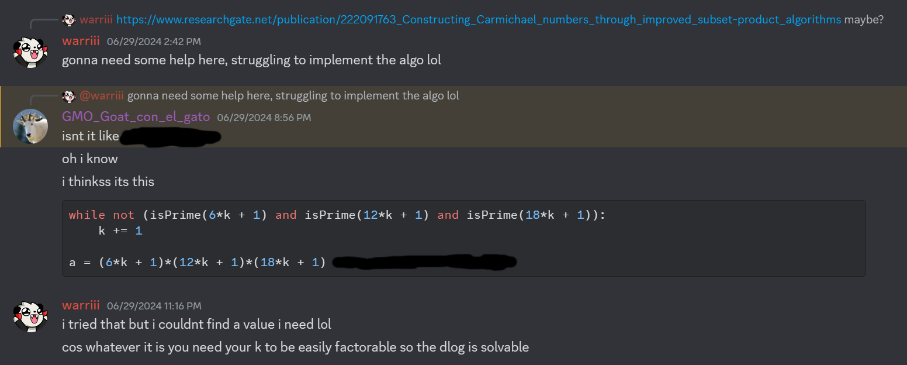

## Groups (105 Solves, 431 Pts)
```
Author: Nikhil

My friend told me that cryptography is unbreakable if moduli are Carmichael numbers instead of primes. I decided to use this CTF to test out this theory.

ncat --ssl groups.chal.uiuc.tf 1337
```

challenge.py
```py
from random import randint
from math import gcd, log
import time
from Crypto.Util.number import *


def check(n, iterations=50):
    if isPrime(n):
        return False

    i = 0
    while i < iterations:
        a = randint(2, n - 1)
        if gcd(a, n) == 1:
            i += 1
            if pow(a, n - 1, n) != 1:
                return False
    return True


def generate_challenge(c):
    a = randint(2, c - 1)
    while gcd(a, c) != 1:
        a = randint(2, c - 1)
    k = randint(2, c - 1)
    return (a, pow(a, k, c))


def get_flag():
    with open('flag.txt', 'r') as f:
        return f.read()

if __name__ == '__main__':
    c = int(input('c = '))

    if log(c, 2) < 512:
        print(f'c must be least 512 bits large.')
    elif not check(c):
        print(f'No cheating!')
    else:
        a, b = generate_challenge(c)
        print(f'a = {a}')
        print(f'a^k = {b} (mod c)')
        
        k = int(input('k = '))

        if pow(a, k, c) == b:
            print(get_flag())
        else:
            print('Wrong k')
```

A quick analysis of the python code gives us a possible solve path - Input some modulus `c > 2**512`, have `check(c)` return `True` and then solve the discrete log on the group `Zmod(c)` with a random generator `a` and exponent `k`.

### CnC - Carmichael and Chernick

Let's start with `check(c)`. It takes 50 random values `a0, a1, ..., a49`, and tests that all `ai**(c-1) % c == 1`. Fermat's Little Theorem is a relatively well-known theorem in number theory that states for any prime `p`, given any `a` coprime to `p`, `pow(a, p-1, p) == 1`. Thus, if we input any prime modulus `check(c)` would be...

```py
def check(n, iterations=50):
    if isPrime(n):
        return False
    ...
```
No primes! A simple run of using other numbers reveal that Fermat's Little Theorem, evidently, does not necessarily hold over composite numbers. It almost seems as if this could be a way to check if a number `p` is prime; Just test a bunch of coprime `{a0, a1, ...}` and see whether `pow(a, p-1, p) == 1` holds for all `a`! However, there do exist certain composites, or non-primes, where the result of Fermat's Little Theorem applies, somehow. These numbers are called `Carmichael numbers`. `561`, for instance, is a Carmichael number, and the definition of it is essentially equivalent to "Composite but Fermat's Little Theorem still holds."

Thus, to fulfill `check(c)` we simply need to generate a large enough Carmichael number. Algorithms such as `Erdos' Method` exist for this, but I realised that it might take too long since it relies on finding many, many primes whose product would (in our case) `> 2**512`, which would likely take way too much time. I wound up finding a paper about optimising this method [here](https://www.researchgate.net/publication/222091763_Constructing_Carmichael_numbers_through_improved_subset-product_algorithms), but I realised the improved algorithm doesn't quite fit our use case.

Another method to obtain carmichael numbers stems from this conjecture that given a positive integer `k`, if `6k+1`, `12k+1` and `18k+1` are all prime, then their products would form a Carmichael number. As it turns out, this is not a conjecture; Rather, it is a theorem after having been proved by some Mathematician Jack Chernick in 1939, (all of this is in the [wikipedia page for carmichael numbers](https://en.wikipedia.org/wiki/Carmichael_number) btw). I thought for super high numbers brute forcing `k` by increments of 1 would be infeasible, but as it turns out, it doesn't take quite long for us to arrive at various carmichaels greater than `2**512`. This helps us to overcome `check(c)`. Credit goes to my teammate Maelhos for somewhat getting me to commit towards this method, which turned out to work without much issues as I'd otherwise anticipated.



(for the record, I was wrong. As it would have turned out, this did in fact give me the value I needed to solve the challenge lmao)

### DnP - Discrete Logarithms and Pohlig Hellman

With `check()` dealt with, we now have to focus on solving the discrete logarithm;
```py
        a, b = generate_challenge(c)
        print(f'a = {a}')
        print(f'a^k = {b} (mod c)')
        
        k = int(input('k = '))

        if pow(a, k, c) == b:
            print(get_flag())
        else:
            print('Wrong k')
```
`generate_challenge(c)` generates a random `a`, random `k`, computes `b = a**k % c`, and we're expected to solve for a hidden exponent `k` given `a` and `b`. This is in essence the discrete logarithm problem.

Evidently, we need to select some `c` such that the discrete log is feasibly solvable and carmichael; Or some other number that would satisfy `check()`.

One of the more commonly known algorithms to solve the discrete log is the [Pohlig-Hellman algorithm](https://en.wikipedia.org/wiki/Pohlig%E2%80%93Hellman_algorithm), which given the modulus `c` and base `a`, first computes the order of the multiplicative subgroup under `Zmod(c)` of generator `a`, then runs in `O(p)` time, where `p` is the highest prime factor of the order.

Anyone familiar with group theory and Lagrange's Theorem might notice that for a composite `c`, no matter what base `a` is, so long as `a` is coprime to `c`, the order would divide the euler totient of `c`. Since in our case, our carmichael `c = (6k+1)*(12k+1)*(18k+1)`, with each of these brackets prime, this order must divide `1296*k`. We can therefore derive that in our case, the time complexity for pohlig must be `<= O(pk)` time, `pk` being the largest prime factor of `k`.

So I started looking. Suffice to say, luck played a huge role in this. While I was running my code at midnight with very low brain cells and being tied, I wound up setting my `k` to start at a strange value, which as odd as it was originated due to my poor attempt to derive the smallest `k` such that `(6*k + 1)*(12*k + 1)*(18*k + 1) > 2**512` (for reference, this was very, very far from the smallest possible k value).

```py
from gmpy2 import iroot
from Crypto.Util.number import isPrime
from sage.all import factor

isCarmichael = lambda k : isPrime(6*k + 1) and isPrime(12*k + 1) and isPrime(18*k + 1)

k = int(iroot((2**512)//6,3)[0]) // 5
while True:
    while not isCarmichael(k):
        k += 1
    a = (6*k + 1)*(12*k + 1)*(18*k + 1)
    print(f'k = {k}')
    print(f'a = {a}')
    fl = list(factor(k))
    fll = int(fl[-1][0]).bit_length()
    print(fl, fll)
    k += 1
```
Running it eventually gave me:
```
...
261476204452329860198550276341831436116033346100000
k = 261476204452329860198550276341831436116033346106686
a = 23168692102940807788063915196899702108284344372226579741739167115672554998594188160355594728152227779316320682381996856668832090269871316080646429275754089
[(2, 1), (3, 1), (7, 1), (461, 1), (1373, 1), (1831, 1), (415896241, 1), (525125687, 1), (32002179353, 1), (768590942531, 1)] 40
```

With a 40-bit prime, pohlig hellman on any discrete log problem would now take `O(2**40)`, which is still quite a lot of time. Luckily however I remembered that pohlig-hellman involves solving a bunch of smaller discrete logs, which also explains the `O(2**40)`. I realised that this can be further optimised using the [baby step giant step](https://en.wikipedia.org/wiki/Baby-step_giant-step) algorithm which reduces any discrete log from `O(p)` where `p` is the order to `O(sqrt(p))`, through taking up `O(sqrt(p))` of memory. In this case, we would only need `2**20` worth of memory to let this run in `O(2**20)` time which is super feasible.

As it turns out, sagemath's `discrete_log()` does in fact implement `bsgs` for such smaller order, thus we can code our pohlig hellman implementation as follow:

```py
from random import randint
from math import gcd
from Crypto.Util.number import *
from sage.all import *

k = 261476204452329860198550276341831436116033346106686
p,q,r = (6*k + 1), (12*k + 1), (18*k + 1)
c = p*q*r
phi = (p-1)*(q-1)*(r-1)

def generate_challenge(c):
    a = randint(2, c - 1)
    while gcd(a, c) != 1:
        a = randint(2, c - 1)
    k = randint(2, c - 1)
    return (a, pow(a, k, c), k)

a, b, k = generate_challenge(c)

def solve_dlog(a,b,c,phi):
    mods, rems = [], []
    for p,e in list(factor(phi)):
        pe = p**e
        aa = pow(a, phi//pe, c)
        bb = pow(b, phi//pe, c)
        assert pow(aa, pe, c) == 1
        rem = discrete_log(Zmod(c)(bb), Zmod(c)(aa), ord=pe)
        mods.append(pe)
        rems.append(rem)
        print(f'{rem} % {pe}')
    return crt(rems, mods)

res = solve_dlog(a,b,c,phi)
```

We observe that the discrete logarithm is solved pretty quickly from this. Thus, we connect to the remote, input our carmichael number `c`, and then redirect our values for `a` and `a^k` into `solve_dlog()` to get our flag.

```
ncat --ssl groups.chal.uiuc.tf 1337
c = 23168692102940807788063915196899702108284344372226579741739167115672554998594188160355594728152227779316320682381996856668832090269871316080646429275754089
a = 854159185718275519426759218975113882961867612000549267975690473105919789792350972687142986814474193570329812968166016881728138235860588283294756541864345
a^k = 8032841635632343687379536041852432014788180349231165646184413814733806807722824844797212637956345978376035438098395117589626350000021196614771079115696141 (mod c)
k = 10371473703590457743890755153361963886113267631981757106657648251109944509171727991853554407185933299275464313330317068992882050125517874624164939115700739
uiuctf{c4rm1ch43l_7adb8e2f019bb4e0e8cd54e92bb6e3893}
```

### Addendum
From testing it appears that with our method, regardless of our starting value `k` when generating carmichaels, we can generally find carmichael numbers whose euler totient results have largest primes < 54 bits. Baby-step giant-step would take a decent chunk of time requiring a 2^27 array, but this can be precomputed and used to solve the discrete log relatively quickly.